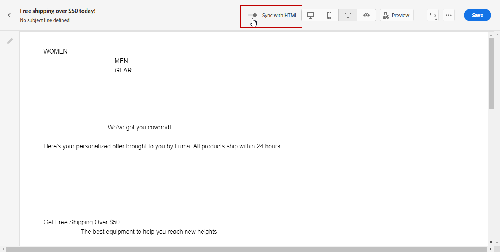

# 创建电子邮件的文本版本 {#text-version-email}

建议创建电子邮件正文的文本版本，当HTML内容无法显示时，会使用该文本版本。

默认情况下，Email Designer会创建 **[!UICONTROL Plain text]** 电子邮件的版本，包括个性化字段。 此版本将自动生成并与内容的HTML版本同步。

如果您希望对纯文本版本使用其他内容，请执行以下步骤：

1. 从您的电子邮件中，选择 **[!UICONTROL Plain text]** 选项卡。

   

1. 使用 **[!UICONTROL Sync with HTML]** 切换为禁用同步。

   

1. 单击复选标记以确认您的选择。

   

1. 然后，您可以根据需要编辑纯文本版本。

>[!CAUTION]
>
>* 中所做的更改 **[!UICONTROL Plain text]** 视图未反映在HTML视图中。
>
>* 如果重新启用 **[!UICONTROL Sync with HTML]** 选项，您所做的更改将会丢失，并替换为从HTML版本生成的文本内容。

