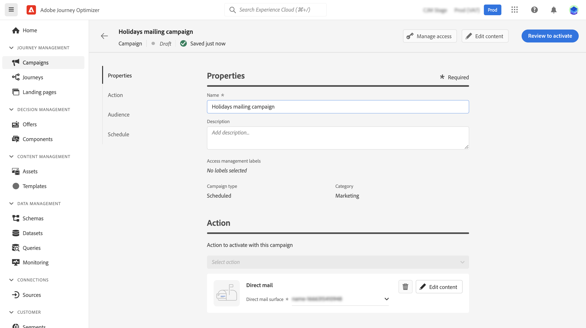

# 创建直邮 {#create-direct}

>[!CONTEXTUALHELP]
>id="ajo_direct_mail"
>title="直邮创建"
>abstract="在计划的营销活动中创建直邮邮件，并设计直邮提供商向客户发送邮件所需的提取文件。"

直邮是一种离线渠道，允许您个性化并生成直邮提供商发送邮件至客户所需的提取文件。

创建直邮时，Journey Optimizer会生成一个文件，其中包含所有定向的用户档案和所选数据（邮政地址、用户档案属性等）。 然后，您的直邮提供商将能够检索该文件，并处理实际发送。

只能在计划促销活动的上下文中创建直邮消息。 无法在API触发的营销活动或历程中使用它们。

>[!IMPORTANT]
>
>在发送直邮之前，请确保已配置：
>
>1. A [文件路由配置](../direct-mail/direct-mail-configuration.md#file-routing-configuration) 指定应将提取文件上传和存储到的服务器，
>1. A [直邮报文表](../direct-mail/direct-mail-configuration.md#direct-mail-surface) 将引用文件路由配置。

## 创建直邮 {#create}

创建和发送直邮的步骤如下：

1. 创建新的计划营销活动，选择 **[!UICONTROL 直邮]** 作为操作，并选择要使用的渠道曲面。 [了解如何创建直邮界面](../direct-mail/direct-mail-configuration.md#direct-mail-surface)

   

1. 单击 **[!UICONTROL 创建]** 然后，定义营销活动的基本信息（名称、描述）。 [了解如何配置营销活动](../campaigns/create-campaign.md)

   

1. 单击 **[!UICONTROL 编辑内容]** 按钮以配置要发送到直邮提供商的提取文件。

1. 在 **[!UICONTROL 文件名]** 字段。

   有时您可能需要在提取文件的开头或结尾添加信息。为此，请使用 **[!UICONTROL 注释]** 字段，然后指定是否要将注释包含为页眉或页脚。

   <!--Click on the button to the right of the Output file field and enter the desired label. You can use personalization fields, content blocks and dynamic text (see Defining content). For example, you can complete the label with the delivery ID or the extraction date.-->

   

1. 使用左侧区域定义要在提取文件中显示为列的信息：

   1. 单击 **[!UICONTROL 添加]** 按钮以添加新列，然后从列表中选择该列。

   1. 在 **[!UICONTROL 格式]** 部分，为列指定标签，然后使用 [表达式编辑器](../personalization/personalization-build-expressions.md).

      

   1. 要使用选定列对提取文件进行排序，请切换 **[!UICONTROL 排序依据]** 选项。 的 **[!UICONTROL 排序依据]** 图标，此时将在文件结构中列标签旁边显示。

1. 重复这些步骤以根据需要添加任意数量的列，以构建提取文件。 请注意，最多可添加50列。

   

   您可以随时删除列，方法是选择该列并单击 **[!UICONTROL 删除]** 按钮 **[!UICONTROL 格式]** 中。

1. 定义直邮内容后，完成营销活动的配置。

   当营销活动开始时，提取文件将自动生成并导出到 [文件路由配置](../direct-mail/direct-mail-configuration.md).
