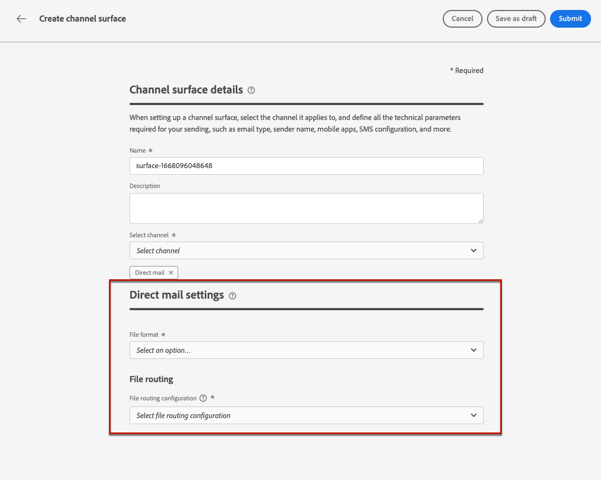
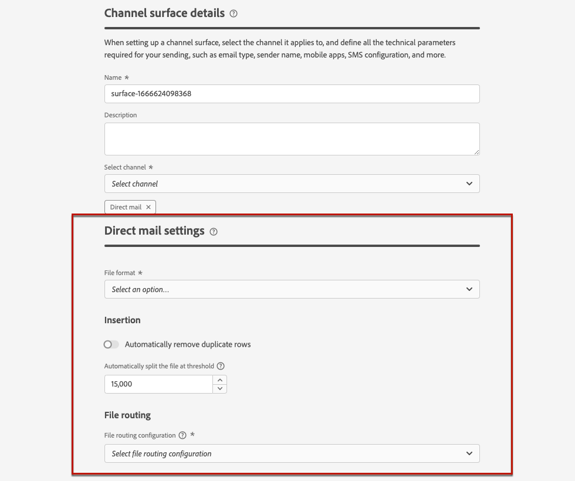

# 直邮配置 {#direct-mail-configuration}

>[!BEGINSHADEBOX]

本文档包括以下内容：

* [创建直邮](create-direct-mail.md)
* **[配置直邮](direct-mail-configuration.md)**

>[!ENDSHADEBOX]

[!DNL Journey Optimizer] 允许您个性化并生成直邮提供商向客户发送邮件所需的文件。

时间 [创建直邮消息](../direct-mail/create-direct-mail.md)，您可以定义目标受众数据，包括选定的联系信息（例如邮政地址）。 然后，包含此数据的文件将自动生成并导出到服务器，您的直邮提供商将能够检索它并处理实际发送。

在生成此文件之前，您需要创建：

1. A [文件路由配置](#file-routing-configuration) 以指定要导出文件的服务器。

1. A [直邮表面](#direct-mail-surface) 将引用文件路由配置。

>[!CAUTION]
>
>如果尚未配置任何文件路由选项，您将无法创建直邮表面。

## 配置文件路由 {#file-routing-configuration}

>[!CONTEXTUALHELP]
>id="ajo_dm_file_routing_details"
>title="定义文件路由配置"
>abstract="创建直邮之后，将生成包含目标受众数据的文件并将其导出到服务器。您需要指定服务器详细信息，以便直邮提供商访问并使用该文件来投递直邮。"

<!--
>additional-url="https://experienceleague.adobe.com/docs/journey-optimizer/using/direct-mail/create-direct-mail.html" text="Create a direct mail message"-->

>[!CONTEXTUALHELP]
>id="ajo_dm_file_routing_details_header"
>title="定义文件路由配置"
>abstract="您需要定义将文件导出到何处以供直邮提供商使用。"

>[!CONTEXTUALHELP]
>id="ajo_dm_select_file_routing"
>title="文件路由配置"
>abstract="选择您要使用的文件路由配置，这会定义将文件导出到何处以供您的直邮提供商使用。"

>[!CONTEXTUALHELP]
>id="ajo_dm_file_routing_type"
>title="为文件选择服务器类型"
>abstract="选择您在导出直邮文件时要使用的服务器类型。Journey Optimizer 目前仅支持 Amazon S3 和 SFTP。"

>[!CONTEXTUALHELP]
>id="ajo_dm_file_routing_aws_region"
>title="选择 AWS 区域"
>abstract="选择要将直邮文件导出到的 AWS 服务器的地理区域。作为常规做法，最好选择离您的直邮提供商位置最近的区域。"

要发送直邮消息， [!DNL Journey Optimizer] 生成包含目标受众数据的文件并将其导出到服务器。

您需要指定服务器详细信息，以便直邮提供商能够访问并使用该文件来传递邮件。

要配置文件路由，请执行以下步骤。

1. 访问 **[!UICONTROL 管理]** > **[!UICONTROL 渠道]** > **[!UICONTROL 文件路由配置]** > **[!UICONTROL 文件路由]** 菜单，然后单击 **[!UICONTROL 创建路由配置]**.

   

1. 为配置设置名称。

1. 选择 **[!UICONTROL 服务器类型]** 要用于导出直邮文件的文件。

   

   >[!NOTE]
   >
   >当前仅支持Amazon S3和SFTP [!DNL Journey Optimizer].

1. 填写服务器的详细信息和凭据，如服务器地址、访问密钥等。

   

1. 如果您已选择 **[!UICONTROL Amazon S3]**，选择 **[!UICONTROL AWS地区]** 服务器基础架构所在的位置。

   

   >[!NOTE]
   >
   >AWS区域是AWS用来托管其云基础架构的地理区域。 一般情况下，最好选择距离直邮提供商所在位置最近的区域。

1. 选择&#x200B;**[!UICONTROL 提交]**。文件路由配置是使用 **[!UICONTROL 活动]** 状态。 它现在已准备好用于 [直邮表面](#direct-mail-surface).

   >[!NOTE]
   >
   >您还可以选择 **[!UICONTROL 另存为草稿]** 创建文件布线配置，但在曲面中选取该文件布线配置之前，不能选取它 **[!UICONTROL 活动]**.

## 创建直邮表面 {#direct-mail-surface}

>[!CONTEXTUALHELP]
>id="ajo_dm_surface_settings"
>title="定义直邮设置"
>abstract="直邮表面包含文件的格式设置，文件中包含目标受众数据，将由邮件提供商使用。您还必须选择文件路由配置来定义文件的导出位置。"
>additional-url="https://experienceleague.adobe.com/docs/journey-optimizer/using/direct-mail/direct-mail-configuration.html?lang=zh-Hans#file-routing-configuration" text="配置文件路由"

<!--
>[!CONTEXTUALHELP]
>id="ajo_dm_surface_sort"
>title="Define the sort order"
>abstract="If you select this option, the sort will be by profile ID, ascending or descending. If you unselect it, the sorting configuration defined when creating the direct mail message within a journey or a campaign."-->

>[!CONTEXTUALHELP]
>id="ajo_dm_surface_split"
>title="定义文件拆分阈值"
>abstract="您必须为包含受众数据的每个文件设置最大记录数。您可以选择 1 到 200,000 之间的任意记录数。达到指定阈值后，将创建另一个文件用于其余的记录。"

能够发送直邮 [!DNL Journey Optimizer]，您需要创建一个渠道界面来定义邮件提供商将使用的文件格式设置。

直邮表面还必须包含文件路由配置，该配置定义了将导出直邮文件的服务器。

1. 创建渠道表面。 [了解详情](../configuration/channel-surfaces.md)

1. 选择 **[!UICONTROL 直邮]** 渠道。

   

1. 在渠道平面配置的专用部分中定义直邮设置。

   

   <!---->

1. 选择文件格式： **[!UICONTROL CSV]** 或 **[!UICONTROL 文本分隔]**.

1. 选择 **[!UICONTROL 文件路由配置]** 包含于您创建的内容中。 这定义文件将导出到何处以供直邮提供商使用。

   >[!CAUTION]
   >
   >如果尚未配置任何文件路由选项，您将无法创建直邮表面。 [了解详情](#file-routing-configuration)

   

   <!---->

1. 提交直邮表面。

您现在可以 [创建直邮消息](../direct-mail/create-direct-mail.md) 在营销策划中。 营销活动启动后，包含目标受众数据的文件将自动导出到您定义的服务器。 然后，直邮提供商将能够检索该文件并继续直邮投放。

>[!NOTE]
>
>将自动删除重复行。
>
>如果包含配置文件数据的每个文件的最大记录数（即行数）过高，则会自动为其余记录创建另一个文件。

<!--
    In the **[!UICONTROL Insertion]** section, you can choose to automatically remove duplicate rows.

    Define the maximum number of records (i.e. rows) for each file containing profile data. After the specified threshold is reached, another file will be created for the remaining records.

    

    For example, if there are 100,000 records in the file and the threshold limit is set to 60,000, the records will be split into two files. The first file will contain 60,000 rows, and the second file will contain the remaining 40,000 rows.

    >[!NOTE]
    >
    >NOTE You can set any number between 1 and 200,000 records, meaning each file must contain at least 1 row and no more than 200,000 rows.

-->