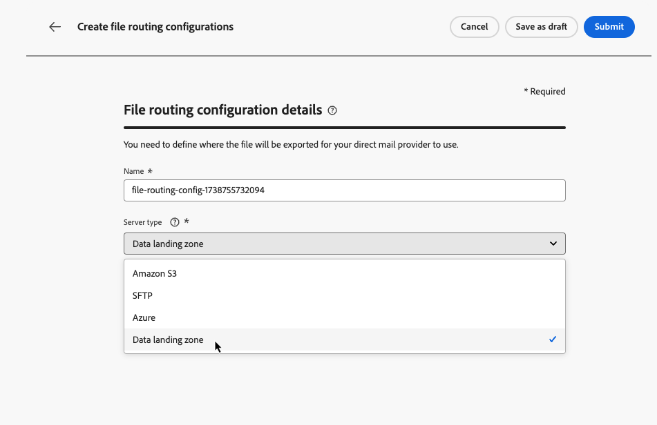

# 直邮配置 {#direct-mail-configuration}

[!DNL Journey Optimizer]允许您个性化并生成直邮提供商向客户发送邮件所需的文件。

在[创建直邮消息](../direct-mail/create-direct-mail.md)时，您可以定义目标受众数据，包括选定的联系信息（例如邮政地址）。 然后，包含此数据的文件将自动生成并导出到服务器，您的直邮提供商将能够检索它并处理实际发送。

在生成此文件之前，您需要创建：

1. [文件路由配置](#file-routing-configuration)，用于指定导出文件的服务器并在必要时加密文件。

   >[!CAUTION]
   >
   >要创建文件路由配置，您需要具有&#x200B;**[!DNL Manage file routing]**&#x200B;内置权限。 [了解详情](../administration/ootb-product-profiles.md#content-library-manager)。

1. 将引用文件路由配置的[直邮配置](#direct-mail-configuration)。 如果尚未配置任何文件路由选项，您将无法创建直邮配置。

## 轮廓路由 {#file-routing-configuration}

>[!CONTEXTUALHELP]
>id="ajo_dm_file_routing_details"
>title="定义文件路由配置"
>abstract="创建直邮之后，将生成包含目标受众数据的文件并将其导出到服务器。您需要指定服务器详细信息，以便直邮提供商访问并使用该文件来投递直邮。"
>additional-url="https://experienceleague.adobe.com/zh-hans/docs/journey-optimizer/using/channels/direct-mail/create-direct-mail" text="创建直邮消息"

>[!CONTEXTUALHELP]
>id="ajo_dm_file_routing_details_header"
>title="定义文件路由配置"
>abstract="您需要定义将文件导出到何处以供直邮提供商使用。"

>[!CONTEXTUALHELP]
>id="ajo_dm_select_file_routing"
>title="文件路由配置"
>abstract="选择您要使用的文件路由配置，这会定义将文件导出到何处以供您的直邮提供商使用。"

>[!CONTEXTUALHELP]
>id="ajo_dm_file_routing_type"
>title="为文件选择服务器类型"
>abstract="选择您在导出以下直邮文件时要使用的服务器类型：Amazon S3、SFTP 或 Azure。"

>[!CONTEXTUALHELP]
>id="ajo_dm_file_routing_aws_region"
>title="选择 AWS 区域"
>abstract="选择要将直邮文件导出到的 AWS 服务器的地理区域。作为常规做法，最好选择离您的直邮提供商位置最近的区域。"

>[!NOTE]
>
>当前，[!DNL Journey Optimizer]支持Amazon S3、SFTP、Azure和数据登录区域。

为了投放直邮消息，[!DNL Journey Optimizer]生成包含目标受众数据的文件并将其导出到服务器。

您需要指定服务器详细信息，以便直邮提供商能够访问并使用该文件传递邮件。

要配置文件路由，请执行以下步骤。

>[!BEGINTABS]

>[!TAB Amazon S3]

1. 访问&#x200B;**[!UICONTROL 管理]** > **[!UICONTROL 渠道]** > **[!UICONTROL 直邮设置]** > **[!UICONTROL 文件路由]**&#x200B;菜单，然后单击&#x200B;**[!UICONTROL 创建路由配置]**。

   {width="800" align="center"}

1. 为您的配置设置一个名称。

1. 选择&#x200B;**Amazon S3**&#x200B;作为&#x200B;**[!UICONTROL 服务器类型]**&#x200B;用于导出直邮文件。

   {width="800" align="center"}

1. 填写服务器的详细信息和凭据

   * **AWS bucket名称**：若要了解在何处查找您的AWS bucket名称，请参阅[此页面](https://docs.aws.amazon.com/AmazonS3/latest/userguide/UsingBucket.html)。

   * **AWS访问密钥**：若要了解在何处查找您的AWS访问密钥ID，请参阅[此页面](https://docs.aws.amazon.com/IAM/latest/UserGuide/security-creds.html#access-keys-and-secret-access-keys)。

   * **AWS密钥**：若要了解在何处查找您的AWS密钥，请参阅[此页面](https://aws.amazon.com/fr/blogs/security/wheres-my-secret-access-key/)。

   * **AWS区域**：选择服务器基础结构将位于的&#x200B;**[!UICONTROL AWS区域]**。 AWS区域是AWS用来托管其云基础架构的地理区域。 通常，最好选择距离直邮提供商所在位置最近的区域。

   {width="800" align="center"}

1. 若要加密文件，请在&#x200B;**[!UICONTROL PGP/GPG加密密钥]**&#x200B;字段中复制并粘贴您的加密密钥。

1. 选择&#x200B;**[!UICONTROL 提交]**。 已创建状态为&#x200B;**[!UICONTROL 活动]**&#x200B;的文件路由配置。 现在可以在[直邮配置](#direct-mail-surface)中使用它。

   您还可以选择&#x200B;**[!UICONTROL 另存为草稿]**&#x200B;来创建文件路由配置，但只有在配置为&#x200B;**[!UICONTROL 活动]**&#x200B;后，您才能在配置中选择它。

>[!TAB SFTP]

1. 访问&#x200B;**[!UICONTROL 管理]** > **[!UICONTROL 渠道]** > **[!UICONTROL 直邮设置]** > **[!UICONTROL 文件路由]**&#x200B;菜单，然后单击&#x200B;**[!UICONTROL 创建路由配置]**。

   {width="800" align="center"}

1. 为您的配置设置一个名称。

1. 选择SFTP作为&#x200B;**[!UICONTROL 服务器类型]**&#x200B;用于导出直邮文件。

   {width="800" align="center"}

1. 填写服务器的详细信息和凭据：

   * **帐户**：用于连接到SFTP服务器的帐户名称。

   * **服务器地址**： &#x200B;SFTP服务器的URL。

   * **端口**： FTP连接端口号。

   * **密码**：&#x200B;用于连接到SFTP服务器的密码。

   

   >[!NOTE]
   >
   >要指定服务器上保存文件的路径，请更新直邮营销活动的&#x200B;**[!UICONTROL 文件名]**&#x200B;字段以包含所需路径。 [了解详情](create-direct-mail.md#extraction-file)

1. 若要加密文件，请在&#x200B;**[!UICONTROL PGP/GPG加密密钥]**&#x200B;字段中复制并粘贴您的加密密钥。

1. 选择&#x200B;**[!UICONTROL 提交]**。 已创建状态为&#x200B;**[!UICONTROL 活动]**&#x200B;的文件路由配置。 现在可以在[直邮配置](#direct-mail-surface)中使用它。

   您还可以选择&#x200B;**[!UICONTROL 另存为草稿]**&#x200B;来创建文件路由配置，但只有在配置为&#x200B;**[!UICONTROL 活动]**&#x200B;后，您才能在配置中选择它。

>[!TAB Azure]

1. 访问&#x200B;**[!UICONTROL 管理]** > **[!UICONTROL 渠道]** > **[!UICONTROL 直邮设置]** > **[!UICONTROL 文件路由]**&#x200B;菜单，然后单击&#x200B;**[!UICONTROL 创建路由配置]**。

   {width="800" align="center"}

1. 为您的配置设置一个名称。

1. 选择Azure作为用于导出直邮文件的&#x200B;**[!UICONTROL 服务器类型]**。

   {width="800" align="center"}

1. 填写服务器的详细信息和凭据：

   * **Azure连接字符串**：若要查找您的&#x200B;**Azure连接字符串**，请参阅[此页面](https://learn.microsoft.com/en-us/azure/storage/common/storage-configure-connection-string#configure-a-connection-string-for-an-azure-storage-account)。

     **Azure连接字符串**&#x200B;应遵循以下格式：

     `DefaultEndpointsProtocol=[http|https];AccountName=myAccountName;AccountKey=myAccountKey`

   * **容器名称**：若要查找您的&#x200B;**容器名称**，请参阅[此页面](https://learn.microsoft.com/en-us/azure/storage/blobs/blob-containers-portal)。

     **容器名称**&#x200B;应只包含容器名称，而不包含任何斜杠。 要在容器中指定保存文件的路径，请更新直邮营销活动的&#x200B;**[!UICONTROL 文件名]**&#x200B;字段以包含所需路径。 [了解详情](create-direct-mail.md#extraction-file)

1. 若要加密文件，请在&#x200B;**[!UICONTROL PGP/GPG加密密钥]**&#x200B;字段中复制并粘贴您的加密密钥。

1. 选择&#x200B;**[!UICONTROL 提交]**。 已创建状态为&#x200B;**[!UICONTROL 活动]**&#x200B;的文件路由配置。 现在可以在[直邮配置](#direct-mail-surface)中使用它。

   您还可以选择&#x200B;**[!UICONTROL 另存为草稿]**&#x200B;来创建文件路由配置，但只有在配置为&#x200B;**[!UICONTROL 活动]**&#x200B;后，您才能在配置中选择它。

>[!TAB 数据登陆区]

1. 访问&#x200B;**[!UICONTROL 管理]** > **[!UICONTROL 渠道]** > **[!UICONTROL 直邮设置]** > **[!UICONTROL 文件路由]**&#x200B;菜单，然后单击&#x200B;**[!UICONTROL 创建路由配置]**。

   {width="800" align="center"}

1. 为您的配置设置一个名称。

1. 选择数据登录区域作为&#x200B;**[!UICONTROL 服务器类型]**&#x200B;用于导出直邮文件。

   {width="800" align="center"}

1. 若要加密文件，请在&#x200B;**[!UICONTROL PGP/GPG加密密钥]**&#x200B;字段中复制并粘贴您的加密密钥。<!--To find it, ...-->

   

1. 选择&#x200B;**[!UICONTROL 提交]**。 已创建状态为&#x200B;**[!UICONTROL 活动]**&#x200B;的文件路由配置。 现在可以在[直邮配置](#direct-mail-surface)中使用它。

   您还可以选择&#x200B;**[!UICONTROL 另存为草稿]**&#x200B;来创建文件路由配置，但只有在配置为&#x200B;**[!UICONTROL 活动]**&#x200B;后，您才能在配置中选择它。

在[Adobe Experience Platform文档](https://experienceleague.adobe.com/en/docs/experience-platform/sources/connectors/cloud-storage/data-landing-zone){target="_blank"}中了解有关数据登录区的更多信息。

>[!ENDTABS]

## 创建直邮配置 {#direct-mail-surface}

>[!CONTEXTUALHELP]
>id="ajo_dm_surface_settings"
>title="定义直邮设置"
>abstract="直邮配置包含文件的格式设置，文件中包含目标受众数据，将由邮件提供商使用。您还必须选择文件路由配置来定义文件的导出位置。"
>additional-url="https://experienceleague.adobe.com/zh-hans/docs/journey-optimizer/using/channels/direct-mail/direct-mail-configuration#file-routing-configuration" text="轮廓路由"

<!--
>[!CONTEXTUALHELP]
>id="ajo_dm_surface_sort"
>title="Define the sort order"
>abstract="If you select this option, the sort will be by profile ID, ascending or descending. If you unselect it, the sorting configuration defined when creating the direct mail message within a journey or a campaign."-->

>[!CONTEXTUALHELP]
>id="ajo_dm_surface_split"
>title="定义文件拆分阈值"
>abstract="您必须为包含受众数据的每个文件设置最大记录数。您可以选择 1 到 200,000 之间的任意记录数。达到指定阈值后，将创建另一个文件用于其余的记录。"

为了能够通过[!DNL Journey Optimizer]传递直邮，您需要创建通道配置以定义将由邮件提供商使用的文件格式设置。

直邮配置还必须包括文件路由配置，该配置定义将导出直邮文件的服务器。

1. 在左边栏中，浏览到&#x200B;**[!UICONTROL 管理]** > **[!UICONTROL 渠道]**&#x200B;并选择&#x200B;**[!UICONTROL 常规设置]** > **[!UICONTROL 渠道配置]**。 单击&#x200B;**[!UICONTROL 创建渠道配置]**&#x200B;按钮。 [了解详情](../configuration/channel-surfaces.md)

   

1. 输入配置的名称和说明（可选），然后选择要配置的渠道。

   >[!NOTE]
   >
   > 名称必须以字母(A-Z)开头。 它只能包含字母数字字符。 您还可以使用下划线 `_`、点 `.` 和连字符 `-` 符号。

1. 要为配置分配自定义或核心数据使用标签，您可以选择&#x200B;**[!UICONTROL 管理访问权限]**。 [了解有关对象级访问控制(OLAC)的更多信息](../administration/object-based-access.md)。

1. 选择&#x200B;**[!UICONTROL 直邮]**&#x200B;渠道。

   

1. 选择&#x200B;**[!UICONTROL 营销操作]**&#x200B;以使用此配置将同意策略关联到消息。 所有与营销活动相关的同意政策均可利用，以尊重客户的偏好。 [了解详情](../action/consent.md#surface-marketing-actions)

1. 在渠道配置的专用部分中定义直邮设置。

   {width="800" align="center"}

   <!---->

1. 选择文件格式： **[!UICONTROL CSV]**&#x200B;或&#x200B;**[!UICONTROL 文本分隔]**。

1. 如果选择&#x200B;**[!UICONTROL 文本分隔]**，请定义所选的列分隔符：制表、分号、竖线或&amp;符号。

   

1. 从您创建的路由中选择&#x200B;**[!UICONTROL 文件路由配置]**。 这会定义文件的导出位置，以供直邮提供商使用。

   >[!CAUTION]
   >
   >如果尚未配置任何文件路由选项，您将无法创建直邮配置。 [了解详情](#file-routing-configuration)

   {width="800" align="center"}

   <!---->

1. 提交直邮配置。

您现在可以在营销活动中[创建直邮消息](../direct-mail/create-direct-mail.md)。 营销活动开始后，包含目标受众数据的文件将自动导出到您定义的服务器。 然后，直邮提供商将能够检索该文件并继续直邮投放。

>[!NOTE]
>
>自动从文件中删除行中所有值都相同的重复行。

<!--
    In the **[!UICONTROL Insertion]** section, you can choose to automatically remove duplicate rows.

    Define the maximum number of records (i.e. rows) for each file containing profile data. After the specified threshold is reached, another file will be created for the remaining records.

    

    For example, if there are 100,000 records in the file and the threshold limit is set to 60,000, the records will be split into two files. The first file will contain 60,000 rows, and the second file will contain the remaining 40,000 rows.

    >[!NOTE]
    >
    >NOTE You can set any number between 1 and 200,000 records, meaning each file must contain at least 1 row and no more than 200,000 rows.

-->