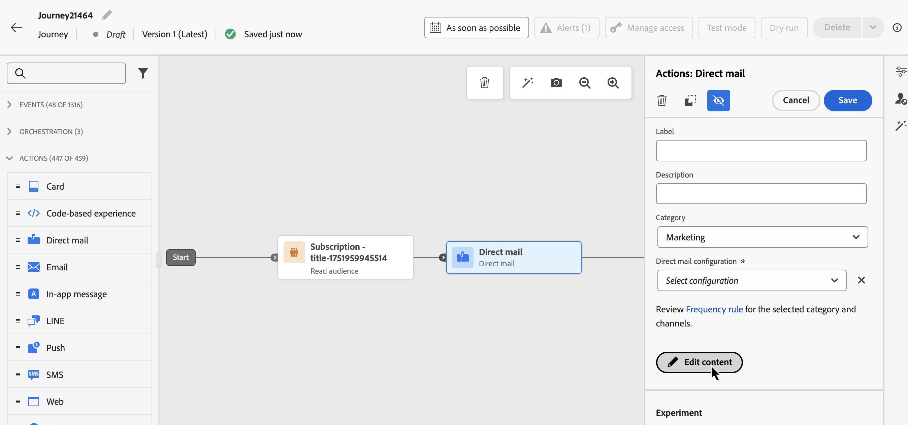

# 发送历程直邮消息 {#direct-mail-journeys}

>[!CONTEXTUALHELP]
>id="ajo_journey_direct_mail"
>title="结束活动"
>abstract="直邮是一种离线渠道，允许您生成第三方直邮服务提供商向客户发送邮件所需的提取文件并进行个性化设置。"

>[!AVAILABILITY]
>
>此功能仅适用于一组组织（限量发布）。

直邮是一种离线渠道，允许您生成第三方直邮服务提供商向客户发送邮件所需的提取文件并进行个性化设置。

创建直邮消息时，[!DNL Journey Optimizer]会自动生成一个文件，其中包含所有定向的用户档案和选定的数据，如邮政地址和用户档案属性。 此文件将会被发送到您选择的服务器，以便您选择的第三方直邮服务提供商可以访问该文件，该提供商将为您处理实际的邮寄过程。

您需要与所选的第三方直邮提供商合作，从客户处获得任何必要的同意（如果适用），以便客户可以从您那里接收邮件。 您对邮寄服务的使用受适用的第三方直邮提供商提供的附加条款与条件的约束。 Adobe 无法控制您使用第三方产品，因此无需承担责任。有关直邮消息邮寄的任何问题或协助请求，请与您选择的第三方直邮提供商联系。

>[!NOTE]
>
>此页面详细介绍了创建和发送包含历程的直邮消息的过程。 有关直邮渠道以及如何创建直邮营销活动的详细信息，请参阅此部分：[直邮入门](../direct-mail/get-started-direct-mail.md)。

## 创建文件路由配置

>[!CONTEXTUALHELP]
>id="ajo_dm_file_routing_frequency"
>title="选择 AWS 区域"
>abstract="如果要使用历程发送文件路由配置，则可以指定向服务器发送文件的频率。"

在创建直邮邮件之前，请确保已配置文件路由配置，该配置指定了应将提取文件上传和存储的服务器。 为此，请执行以下步骤：

1. 访问&#x200B;**[!UICONTROL 管理]** > **[!UICONTROL 渠道]** > **[!UICONTROL 直邮设置]** > **[!UICONTROL 文件路由]**&#x200B;菜单，然后单击&#x200B;**[!UICONTROL 创建文件路由配置]**。

1. 定义文件路由配置属性，如其名称和要使用的服务器类型。 有关如何设置文件路由配置的详细信息，请参阅[直邮配置](../direct-mail/direct-mail-configuration.md#file-routing-configuration)部分。

   如果要使用历程发送文件路由配置，则可以指定向服务器发送文件的频率。

   

1. 单击&#x200B;**[!UICONTROL 提交]**&#x200B;以确认创建文件路由配置。 该配置是以&#x200B;**[!UICONTROL 活动]**&#x200B;状态创建的。 现在可以在直邮配置中引用它。

## 创建直邮配置 {#direct-mail-surface}

直邮配置包含文件的格式设置，文件中包含目标受众数据，将由邮件提供商使用。还必须通过选择文件路由配置来定义文件的导出位置。 有关如何创建直邮配置的详细信息，请参阅[直邮配置](../direct-mail/direct-mail-configuration.md#file-routing-configuration)部分。

直邮配置就绪后，您可以在历程中添加直邮操作。

## 向历程添加直邮操作

要在历程中添加直邮操作，请执行以下步骤：

1. 打开您的历程，然后从调色板的&#x200B;**[!UICONTROL 操作]**&#x200B;部分拖放&#x200B;**直邮**&#x200B;活动。

1. 提供有关消息的基本信息（标签、说明、类别），然后选择要使用的消息配置。 默认情况下，**[!UICONTROL 配置]**&#x200B;字段已预填充用户用于该渠道的最后一个配置。 有关如何配置历程的详细信息，请参阅[此页面](../building-journeys/journey-gs.md)。

1. 配置要发送给直邮提供商的提取文件。 为此，请单击&#x200B;**[!UICONTROL 编辑内容]**&#x200B;按钮。

   

1. 调整提取文件属性，如文件名或要显示的列。 有关如何配置提取文件属性的详细信息，请参阅以下部分：[创建直邮邮件](../direct-mail/create-direct-mail.md#extraction-file)。

   

1. 定义提取文件的内容后，您可以使用测试用户档案进行预览。 如果插入个性化内容，则可以使用测试用户档案数据检查此内容在消息中的显示方式。

   为此，请单击&#x200B;**[!UICONTROL 模拟内容]**，然后添加测试配置文件以检查如何使用测试配置文件数据呈现提取文件。 有关如何选择测试用户档案和预览内容的详细信息，请参阅[内容管理](../content-management/preview-test.md)部分。

   {width="800" align="center"}

提取文件准备就绪后，完成[历程](../building-journeys/journey-gs.md)的配置以发送该文件。
