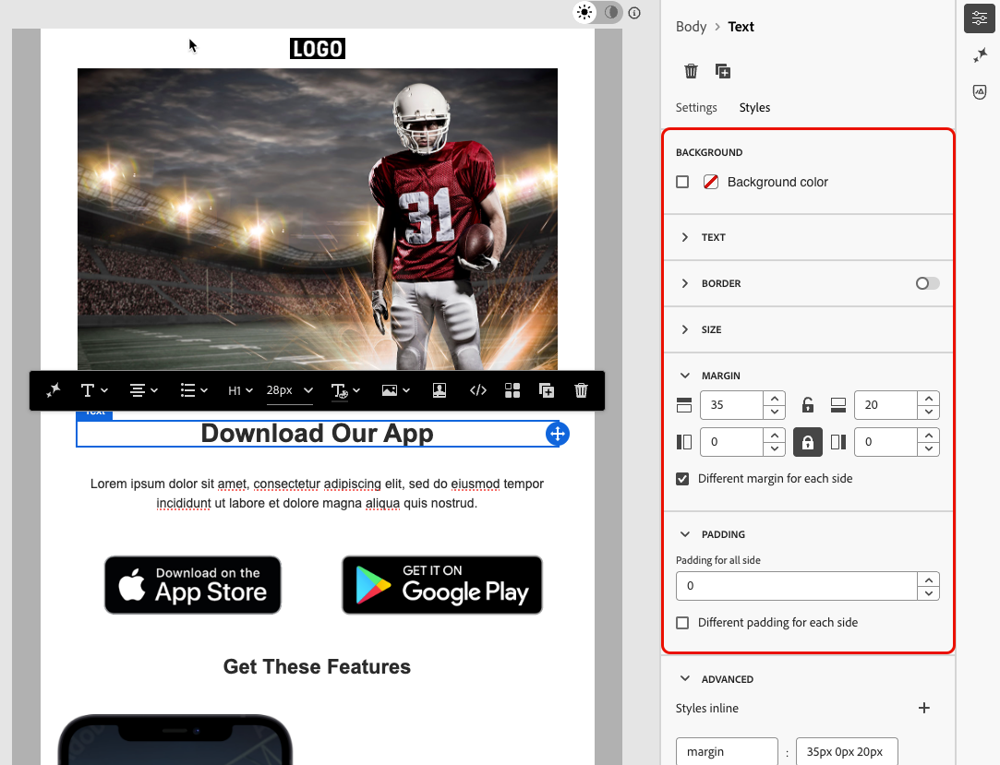
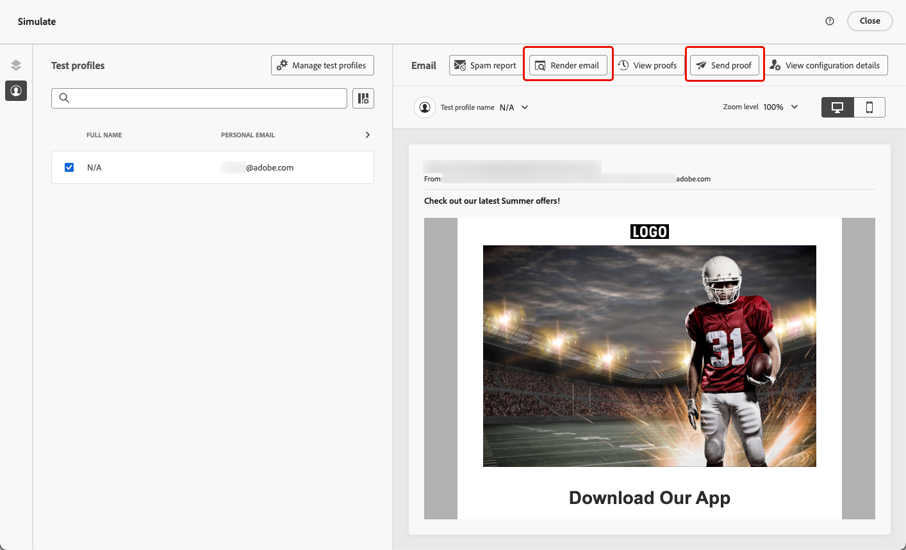

# 设计无障碍内容 {#accessible-content}

[欧洲无障碍法](https://eur-lex.europa.eu/legal-content/EN/TXT/?uri=CELEX%3A32019L0882){target="_blank"}是一项指令，旨在通过消除因成员国之间国家规则不同而造成的障碍，增强无障碍产品和服务的内部市场。

此法规规定，所有数字通信（包括电子邮件、新闻稿、PDF和可下载内容）都应可供访问。 因此，在为收件人创建内容时，您需要遵循特定准则，例如使用无障碍字体、可读格式并为图像提供替换文本。

[!DNL Journey Optimizer] [电子邮件Designer](content-from-scratch.md)允许营销人员为&#x200B;**电子邮件**&#x200B;和&#x200B;**登陆页面**&#x200B;生成内容，并允许您根据Web内容无障碍准则(WCAG) 2.1和AA级轻松遵守此指令。

因此，下面列出了使用[!DNL Journey Optimizer]设计无障碍内容的最佳实践。

>[!NOTE]
>
>此页面旨在使所有收件人都能够访问您的内容，以确保残障人士能够阅读、理解您使用[!DNL Journey Optimizer]设计的电子邮件和登陆页面并与之交互。
>
>另一方面，[!DNL Journey Optimizer]接口本身的辅助功能在[此部分](../start/accessibility.md)中有详细说明。

## 确保文本可读性 {#text-readability}

利用&#x200B;**[!UICONTROL 文本]**&#x200B;组件的&#x200B;**[!UICONTROL 样式]**&#x200B;选项卡确保文本可读，例如使用适当的颜色对比度和简单字体。 [了解详情](content-components.md#text)

{width="80%"}

对于字体和文本，请确保遵循以下准则：

**字体选择**

* 使用Arial、Verdana、Tahoma、Helvetica或Open Sans等无衬线字体。
* 避免在正文内容中使用衬线、草稿或装饰性字体。
* 为了一致性和回退，请粘贴到有限的字体集（例如： `font-family: Arial, Helvetica, sans-serif;`）。

**字体大小**

* 确保正文的最小字体大小为16px。
* 为标题使用正确的层次结构。

**颜色对比度**

* 保持文本与背景之间的对比度至少为4.5:1。
* 对于大文本(≥24px或粗体18px)，请确保对比度至少为3:1。
* 避免在白色背景上使用浅灰色或淡色文本。
* 不要只依靠颜色来传达含义，而是要使用下划线、图标等。

**文本辅助功能**

* 避免在图像中使用文本。
* 请勿在正文中使用所有大写字母。
* 确保文本可以缩放到200%而不破坏布局。

## 确保可视辅助功能 {#visual-accessibility}

要确保您的内容能够以可视方式访问，请遵循以下最佳实践：

* 避免使用仅用于颜色指示器的重要信息。
* 请使用文本标签或图标以确保清晰明了。
* 针对移动和响应式布局优化您的设计，确保按钮较大且间距适当。
* 定期跨设备和屏幕大小测试以保持可访问性。

在[!DNL Journey Optimizer]中，可以使用Email Designer **[!UICONTROL 样式]**&#x200B;窗格中的样式参数和属性进一步细化内容中不同元素的大小和间距。 [了解详情](get-started-email-style.md)

例如，您可以更新[背景](backgrounds.md)，或者更改边距、填充和对齐方式，以改善内容的可视访问性。 [了解详情](alignment-and-padding.md)

{width="80%"}

此外，[!DNL Journey Optimizer]电子邮件Designer允许您预览和优化不同设备和屏幕大小的设计。 您随时可以&#x200B;**[!UICONTROL 切换到实时视图]**，以便检查您的内容在各种设备大小上呈现的方式。

{width="80%"}

>[!CAUTION]
>
>实时视图是一个通用预览，用于比较呈现在各种设备大小中的外观。 最终渲染可能会因收件人的电子邮件客户端而异。

## 对图像使用替换文本 {#alt-text}

使用&#x200B;**[!UICONTROL 图像]**&#x200B;组件为图像提供替换文本。 [了解详情](content-components.md#image)

{width="90%"}

要在数字产品中使用有效的替换文本，请遵循以下准则：

* 简洁而符合情境地描述图像的用途。
* 避免使用“图像……”等多余短语，并使用空替换文本作为装饰性图像。
* 对于具有意义的图标，提供有意义的标签；对于复杂的图像，使用简短的替换文本以及在其他位置使用更长的描述。

## 使用可读格式 {#readable-format}

使用Email Designer相关结构和[内容组件](content-components.md)，以及&#x200B;**[!UICONTROL 样式]**&#x200B;窗格中的选项，以清晰、逻辑和简洁的方式整理您的内容，使所有人都可以访问。

{width="100%"}

* 使用结构化、语义化的HTML，并带有适当的标题、段落、列表和表。
* 确保内容遵循从左至右、从上至下的逻辑流程。
* 使用简洁明了的语言。
* 为PDF和信息图形提供替代格式。
* 允许调整文本大小和重排，并确保在所有格式下，使用足够的颜色对比度可读取排版规则。

## 确保内容可读性 {#readability}

要阅读，您的内容必须清晰、结构合理，并且可供所有人使用，包括患有视觉、认知或阅读障碍的人以及使用辅助技术的人。 创建无障碍内容时要考虑的一些要点包括：

* 保持句子不超过20个词。
* 将副本编辑为直接指向点。
* 使用主动语态使句子结构更简单。
* 避免使用某些人可能不熟悉的俚语、行话或地区性用语。

为了评估您的电子邮件可读性，您可以使用常用的[Flesch Reading Ease测试](https://support.microsoft.com/en-us/office/get-your-document-s-readability-and-level-statistics-85b4969e-e80a-4777-8dd3-f7fc3c8b3fd2){target="_blank"}，该测试可在Microsoft Word中找到，并以0至100的级数计算内容的阅读方便程度。

## 测试您的内容 {#test}

要验证内容的辅助功能，您可以使用[!DNL Journey Optimizer]提供的测试功能。 它们并非专门用于检查您的内容是否完全可访问，但它们可以提供第一级别的验证。

* 使用测试配置文件预览内容。 [了解如何操作](../content-management/preview.md)

* 使用[电子邮件渲染](../content-management/rendering.md)选项，该选项可利用Litmus在主要电子邮件客户端(Apple Mail、Gmail、Outlook)间模拟您的设计，并查看文本、颜色和图像是否可以访问您的内容。<!--Litmus includes accessibility testing-->

* 在将内容发送到实际受众之前，请发送校样以测试内容的渲染。 [了解如何操作](../content-management/proofs.md)

{width="90%"}

如果内容可可靠访问，要以更一致的方式签入，请访问特定的外部工具，例如：

* [WebAim对比度检查器](https://webaim.org/resources/contrastchecker/){target="_blank"}和[WAVE Web辅助功能评估工具](https://wave.webaim.org/){target="_blank"}用于评估对比度和符合性；

* 屏幕阅读器等辅助技术(例如：[NVDA](https://www.nvaccess.org/download/){target="_blank"}或iPhone上的[VoiceOver](https://support.apple.com/en-ie/guide/iphone/iph3e2e415f/ios){target="_blank"})可从视障用户的角度体验电子邮件。

## 使用深色模式 {#dark-mode}

<!--TO PUBLISH WHEN DARK MODE IS RELEASED-->

深色模式增强了对光线敏感或视觉障碍的用户的可视访问性，从而改善了观看体验。

{width="90%"}

在深色模式下设计内容的最佳实践中，使用透明PNG或SVG，设置适当的元标记和CSS，并在不支持深色模式时提供可访问的回退样式。 最后，通过在浅色和深色模式下测试所有电子邮件内容和UI元素，确保电子邮件在深色模式下正确呈现。

[此部分](dark-mode.md#best-practices)中列出了特定于深色模式的详细最佳实践，包括确保无障碍的准则。<!--KEEP dark mode accessibility best practices IN ONE SINGLE LOCATION - for now listed on the Dark mode page.-->

## 使用特定属性进行辅助功能 {#attributes}

### 语言属性 {#language}

创建设计时，请在内容正文中包含`lang`（语言）和`dir`（文本方向）属性。 这些属性可帮助辅助技术（如屏幕阅读器）以适当的方式解释和展示您的内容。

* `lang`属性指示发送给辅助技术的电子邮件的语言，确保单词的发音正确。

  +++示例

  英语示例：

  ```
  <body lang="en">
  ```

  法语示例：

  ```
  <body lang="fr">
  ```

  +++

* `dir`属性指定文本方向。 大多数语言，包括英语和法语，从左至右(ltr)阅读，而阿拉伯语和希伯来语等语言从右至左(rtl)阅读。

  +++示例

  英语示例（从左至右）：

  ```
  <body lang="en" dir="ltr">
  ```

  阿拉伯语示例（从右至左）：

  ```
  <body lang="ar" dir="rtl">
  ```

  +++

屏幕阅读器依赖于`lang`属性来应用正确的发音规则，而文本方向可确保从左到右或从右到左语言的内容自然流动。 如果没有这些属性，用户可能会遇到阅读顺序混乱或发音错误的情况。 因此，请始终使用适当的`lang`和`dir`属性来封装电子邮件正文。

>[!TIP]
>
>如果电子邮件包含多种语言，请将相应的语言属性分配给特定部分（如`<table>`或`<td>`块），以确保每个部分均可正确读取。

### 表格 {#tables}

在HTML内容中，表格通常用于布局。 默认情况下，屏幕阅读器将每`<table>`视为数据表，声明行、列和结构。 如果表仅用于格式化，这可能会造成混淆。

将`role="presentation"`（或`role="none"`）添加到布局表，以确保辅助型技术跳过其结构并仅关注实际内容。

+++示例 — 布局表（带`role="presentation"`）

```
<table role="presentation" border="0" cellpadding="0" cellspacing="0" width="100%"> 

  <tr> 

    <td align="center"> 

      <h1>Hello World</h1> 

      <p>Welcome to our newsletter</p> 

    </td> 

  </tr> 

</table>
```

屏幕阅读器显示：
“你好，世界。 欢迎收看我们的新闻稿。” *（未提及行、列或表）*

+++

+++示例 — 数据表（不带`role="presentation"`）

```
<table border="1" cellpadding="5" cellspacing="0"> 

  <tr> 

    <th scope="col">Name</th> 

    <th scope="col">Score</th> 

  </tr> 

  <tr> 

    <td>Alice</td> 

    <td>95</td> 

  </tr> 

  <tr> 

    <td>Bob</td> 

    <td>88</td> 

  </tr> 

</table> 
```

屏幕阅读器显示：
“带2列3行的表。”

“姓名，爱丽丝。 分数，95。”

“姓名，鲍勃。 分数，88。”

+++

>[!TIP]
>
>仅将`role="presentation"`用于布局表。 对于数据表，请保留语义`<table>`结构，以便屏幕阅读器可以正确声明标题和关系。

### 链接文本 {#links}

屏幕阅读器使用文本阅读链接。 如果链接仅标记为“单击此处”或“了解更多”，则使用辅助技术的用户将无法知道目标。 为确保辅助功能，他们需要清晰地指示目标或操作的描述性文本。

使用电子邮件Designer向内容[添加链接](message-tracking.md#insert-links)并编辑标签以使其可见（可见）并具有描述性（清除目的）。 避免使用模糊的标签，如“此处”或“更多”。

{width="70%"}

+++示例 — 良好链接（描述性）： 

```
<p>Learn more in the  

<a href="https://adobe.com/release-notes">August release notes</a>. 

</p>
```

屏幕阅读器显示：
“Link， 8月发行说明。”

+++

+++示例 — 错误链接（非描述性）

```
<p>Learn more about our new features.  

  <a href="https://adobe.com/release-notes">Click here</a>. 

</p>
```

屏幕阅读器显示：
“链接，单击此处。” *（未提供顺序不正确的上下文）*

+++

<!--
>[!TIP]
>
>Always ensure link text is discernible (visible) and descriptive (clear about purpose). Avoid vague labels like 'here' or 'more'.-->

## 提供键盘导航和焦点支持 {#keyboard}

<!--for landing pages-->

提供键盘导航和焦点支持使无法使用鼠标的用户能够完全访问内容并与之交互。 它还通过为所有用户提供清晰、一致的信息浏览方式，提高了总体可用性。

* 通过键盘聚焦

   * 确保所有交互式元素（如按钮、复选框、链接）均具有`tabindex="0"`，以便它们按自然选项卡顺序包含。

   * 允许使用Tab键和箭头键(↑ ↓ ← →)进行导航，此时应会突出显示重点显示的元素。

* 自定义焦点样式

   * 应用清晰且可区分的样式来关注可操作元素：

     +++示例(CSS)

     ```
     [tabindex="0"] : focus { 
     
     outline: 2px solid #00AEEF;  /* Cyan border */ 
     
     background-color: #20CEFF;   /* Optional background */ 
     
     }
     ```

     +++

   * 确保焦点指标符合WCAG 2.2的焦点外观标准，包括：

      * 最小区域：2 CSS像素粗轮廓。

      * 聚焦状态和非聚焦状态之间的对比度：≥ 3:1。

* 键盘激活支持

   * 确保复选框和按钮与Enter和Space键相对应。

   * 仅使用键盘验证交互：

      * Enter或Space应该切换复选框。

      * Enter或Space应该触发按钮。
