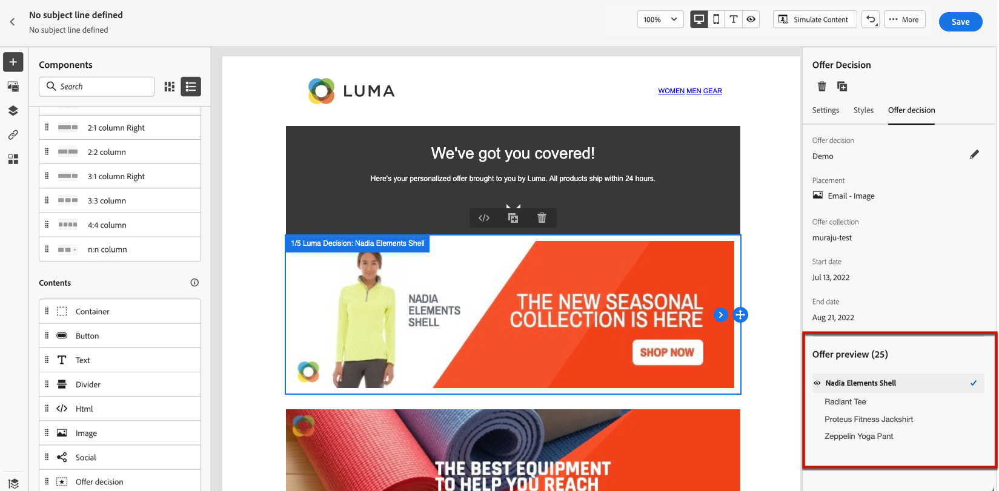

# 添加个性化优惠 {#deliver-personalized-offers}

在[!DNL Journey Optimizer]封电子邮件中，您可以插入将利用决策管理引擎的决策，以选择向客户提供的最佳优惠。

例如，您可以添加一个决策，该决策将在您的电子邮件中显示一个特殊的折扣优惠，该优惠将因收件人的忠诚度级别而异。

>[!IMPORTANT]
>
>如果对历程消息中使用的优惠决策进行了更改，则需要取消发布该历程并重新发布。  这将确保将更改纳入历程的消息中，并且消息与最新更新一致。

* 有关如何创建和管理优惠的更多信息，请参阅[此部分](../offers/get-started/starting-offer-decisioning.md)。
* 若要查看显示如何配置优惠、在决策中使用优惠并在电子邮件中利用此决策的&#x200B;**完整端到端示例**，请查看[此部分](../offers/offers-e2e.md#insert-decision-in-email)。

➡️[在此视频中了解如何添加优惠作为个性化](#video-offers)

## 在电子邮件中插入决策 {#insert-offers}

>[!CAUTION]
>
>在开始之前，您必须[定义优惠决定](../offers/offer-activities/create-offer-activities.md)。

要在电子邮件中插入决策，请执行以下步骤：

1. 创建电子邮件，然后打开电子邮件Designer以配置其内容。

1. 添加&#x200B;**[!UICONTROL 优惠决策]**&#x200B;内容组件。

   

   在[本节](content-components.md)中了解如何使用内容组件。

1. **[!UICONTROL 优惠决策]**&#x200B;选项卡显示在右侧面板中。 单击&#x200B;**[!UICONTROL 选择优惠决策]**：

   1. 在显示的窗口中，选择与要显示的选件对应的版面。

      [投放位置](../offers/offer-library/creating-placements.md)是用于展示优惠的容器。 在本例中，我们将使用“电子邮件顶部图像”投放位置。 此投放位置已在选件库中创建，用于显示位于消息顶部的图像类型选件。

   1. 将显示与所选投放位置匹配的决策。 选择要在内容组件中使用的决策，然后单击&#x200B;**[!UICONTROL 添加]**。

      >[!NOTE]
      >
      >只有与所选投放位置兼容的决策才会显示在列表中。 在本例中，只有一个选件活动与“电子邮件顶部图像”投放位置匹配。

      

决策现已添加到组件中。 保存更改后，在将消息作为历程的一部分发送时，您的优惠可随时显示给相关用户档案。

>[!NOTE]
>
>当您更新消息中直接或间接引用的优惠、后备优惠、优惠收藏集或优惠决策时，更新会自动反映在相应的消息中。

## 在电子邮件中预览优惠 {#preview-offers-in-email}

您可以使用&#x200B;**[!UICONTROL 选件]**&#x200B;部分或内容组件箭头预览作为添加到电子邮件决策一部分的不同选件。

要在客户配置文件中显示作为决策一部分的不同优惠，请执行以下步骤。

1. 选择要用于预览选件的测试配置文件：

   1. 单击&#x200B;**[!UICONTROL 模拟内容按钮]**&#x200B;按钮，然后从&#x200B;**[!UICONTROL 标识命名空间]**&#x200B;字段中选择用于标识测试配置文件的命名空间。

      >[!NOTE]
      >
      >在此示例中，我们使用&#x200B;**电子邮件**&#x200B;命名空间。 在本节[&#128279;](../audience/get-started-identity.md)中了解有关Adobe Experience Platform身份命名空间的更多信息。

   1. 在&#x200B;**[!UICONTROL 标识值]**&#x200B;字段中，输入用于标识测试配置文件的值。 在此示例中，输入测试用户档案的电子邮件地址。

   <!--For example enter smith@adobe.com and click the **[!UICONTROL Add profile]** button.-->

   1. 添加其他用户档案，以便根据用户档案数据测试消息的不同变体。

      

1. 单击&#x200B;**[!UICONTROL 预览]**&#x200B;选项卡测试您的消息，然后选择测试用户档案。 将显示与所选用户档案（女性）对应的选件。

   

   您可以选择其他测试用户档案来预览消息每个变体的电子邮件内容。 消息内容中现在会显示与选定测试用户档案（现在为男性）对应的选件。

在[本节](#preview-your-messages)中了解有关查看邮件预览的详细步骤。

## 操作方法视频{#video-offers}

了解如何将决策管理组件添加到[!DNL Journey Optimizer]中的消息。

>[!VIDEO](https://video.tv.adobe.com/v/3415686?quality=12&captions=chi_hans)
