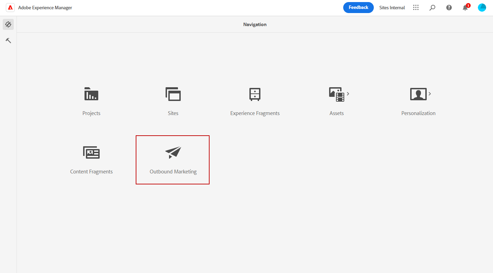
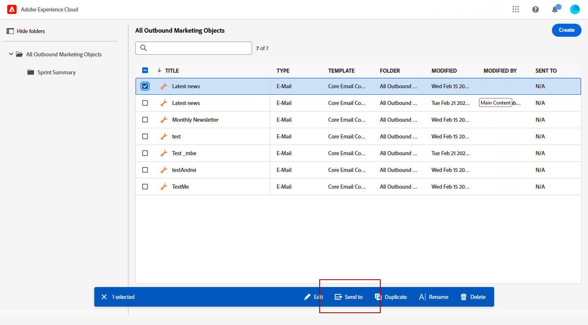
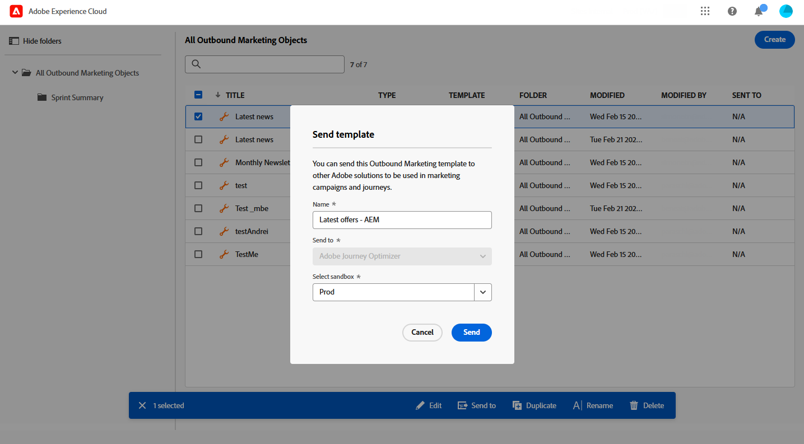
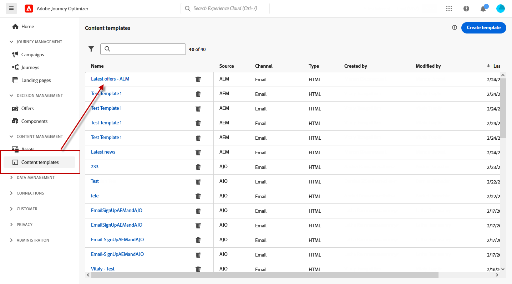

# 使用Adobe Experience Manager模板 {#aem-templates}

>[!AVAILABILITY]
>
>目前，与Adobe Experience Manager的集成仅作为测试版提供给部分用户。
> 作为测试版用户，请使用 [此表单](https://forms.office.com/pages/responsepage.aspx?id=Wht7-jR7h0OUrtLBeN7O4Wf0cbVTQ3tCpW_unE-w8-JUN1FaNlAzNkhPSUdaSkJXVFRCNTRJNVRFSy4u){target="_blank"} 以分享反馈。

借助Adobe Journey Optimizer，您可以通过Adobe Experience Manager站点创建自定义定制消息。 首先，使用Adobe Experience Manager的内容源设计模板，然后将其发送到Adobe Journey Optimizer。 共享后，即可在Adobe Journey Optimizer的电子邮件设计器中访问这些模板，从而简化设计消息并将消息发送到所需受众的过程。

## 先决条件 {#prerequisites}

在开始使用此功能之前，请确保符合以下要求：

* **Experience Manager设置**

  此功能适用于 [Adobe Experience Manager as a Cloud Service](https://experienceleague.adobe.com/docs/experience-manager-cloud-service/content/overview/introduction.html?lang=zh-Hans){target="_blank"}.

  作为测试版计划的一部分，Cloud Service配置将由Adobe Experience Manager中的Adobe执行，以连接到Adobe Journey Optimizer。

* **Permissions**

  要在Adobe Journey Optimizer中创建、编辑和删除内容模板，您必须具有 **[!DNL Manage Library Items]** 权限包含在 **[!DNL Content Library Manager]** 产品配置文件。 [了解详情](../administration/ootb-product-profiles.md#content-library-manager)

## 护栏和限制{#aem-templates-limitations}

为了进一步优化将Adobe Experience Manager与Adobe Journey Optimizer结合使用，请务必了解以下其他护栏和限制：

* Experience Manager模板中的个性化需要正确的Journey Optimizer语法才能生效。 [了解详情](../personalization/personalization-syntax.md)

* 当前不支持批量模板导出，必须单独导出模板。

* Experience Manager与Journey Optimizer之间的同步当前不可用。 如果在将模板发送到Journey Optimizer后对Experience Manager模板进行了更改，则用户需要重新导出该模板并将其重新发送到Journey Optimizer。

## 将模板发送到Journey Optimizer{#aem-templates-send}

要将Adobe Experience Manager模板导出到Adobe Journey Optimizer，请执行以下步骤：

1. 从Adobe Experience Manager主页中，选择 **[!UICONTROL 出站营销]**.

   

1. 在内容库中，您可以使用之前配置的模板或从头开始创建模板。 [了解详情](https://experienceleague.adobe.com/docs/experience-manager-65/authoring/authoring/managing-pages.html#creating-a-new-page)

1. 通过将Journey Optimizer个性化语法合并到模板中，您可以增强其自定义功能。 [了解详情](../personalization/personalization-syntax.md)

   

1. 选择要导出到Journey Optimizer的模板，然后单击 **[!UICONTROL 发送至]** 从高级菜单中。

   

1. 输入 **[!UICONTROL 名称]** 并选择目标 **[!UICONTROL 沙盒]**.

   

1. 在您单击 **[!UICONTROL 发送]** 按钮时，将开始导出过程。 导出完成后，您将在用户界面中看到以下消息：“模板“XX”已成功发送到AJO”。

该模板将添加到选定沙盒的Adobe Journey Optimizer内容模板。

## 使用和个性化Adobe Experience Manager模板{#aem-templates-perso}

在Journey Optimizer中作为内容模板提供Experience Manager模板后，您可以识别并合并电子邮件的必要内容，包括个性化。

1. 在Journey Optimizer中，从 **[!UICONTROL 内容模板]** 菜单，访问导入的模板。

   

1. 通过单击 **[!UICONTROL 警报]** 按钮上，您可以快速检查是否缺少任何重要设置。 这将有助于确保消息配置正确并防止任何潜在的错误或问题。

   

1. 在 **[!UICONTROL 模板属性]** 窗口中，单击 **[!UICONTROL 管理访问权限]** 按钮以将自定义或核心数据使用标签分配给模板。 [了解有关对象级访问控制(OLAC)的更多信息](../administration/object-based-access.md)

1. 要进一步个性化您的Experience Manager模板并将自定义个性化添加到您的内容，请单击 **[!UICONTROL 编辑内容]**. 这样，您就可以轻松地做出更改，并根据特定需求定制模板。 [了解详情](get-started-email-design.md)

   >[!WARNING]
   >
   > 如果要编辑模板并使其个性化，则只能使用兼容模式。

1. 当内容模板准备就绪时， [测试和验证](../content-management/content-templates.md#test-template).

1. 定义内容后，您可以在创建新电子邮件时通过浏览 **[!UICONTROL 已保存模板]** 收藏集。 然后，选择 **[!UICONTROL 使用此模板]**.

   

1. 您现在可以编辑和个性化您的内容。 有关如何构建电子邮件内容的更多信息，请参阅此 [页面](content-from-scratch.md).

   

1. 如果您向Experience Manager模板添加了个性化内容，请单击 **[!UICONTROL 模拟内容]** 以使用测试用户档案预览它在消息中的显示方式。

[了解有关预览和测试用户档案的更多信息](../email/preview.md)

   

1. 在查看消息预览时，任何个性化元素都会自动替换为所选测试用户档案中的相应数据。

   如果需要，可以通过添加其他测试用户档案 **[!UICONTROL 管理测试用户档案]** 按钮。

   

当您的电子邮件准备就绪时，完成您的 [历程](../building-journeys/journey-gs.md) 或 [营销活动](../campaigns/create-campaign.md)，并激活它以发送消息。
