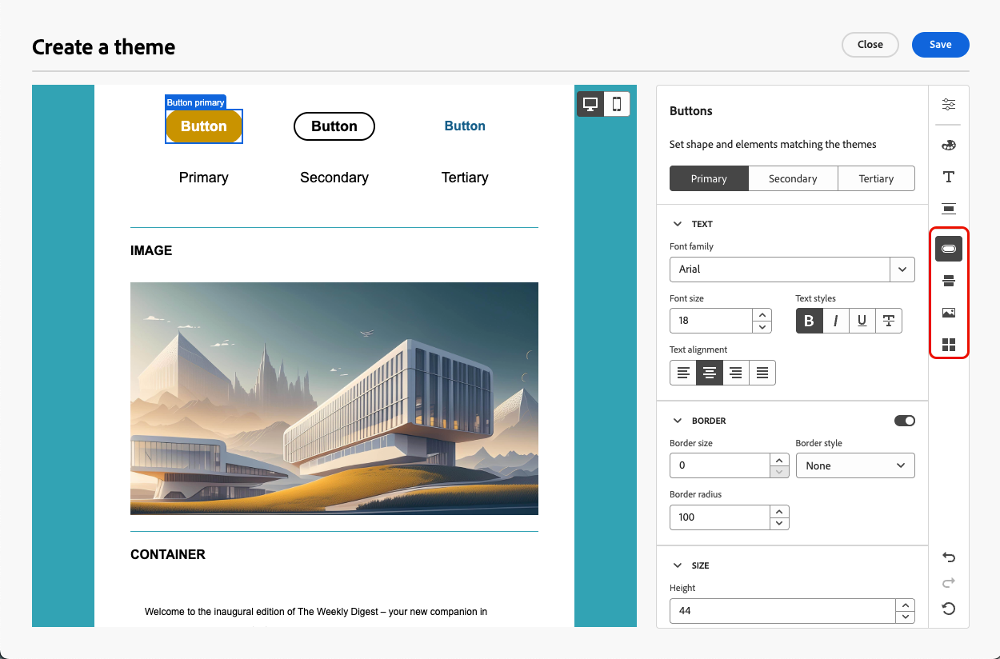

# 将主题应用于您的电子邮件内容 {#apply-email-themes}

>[!CONTEXTUALHELP]
>id="ajo_use_theme"
>title="将主题应用到您的电子邮件"
>abstract="为您的电子邮件选择一个主题，以快速应用适合您的品牌和设计的特定样式。"

>[!AVAILABILITY]
>
>此功能处于有限可用状态。 请联系 Adobe 代表以获取访问权限。

对于主题，非技术用户能够通过添加标准模板<!-- to achieve brand specific results-->上的自定义样式来创建符合特定品牌和设计语言的可重用内容。

此功能使营销人员能够更快更轻松地利用具有视觉吸引力的品牌一致性电子邮件，同时提供高级自定义选项以满足独特的设计需求。

## 护栏和限制 {#themes-guardrails}

* 从头开始创建电子邮件时，您可以选择使用主题开始构建内容，以快速应用符合您的品牌和设计的特定样式。

  如果选择“手动样式设置”模式，除非重置电子邮件，否则无法应用任何主题。

* [片段](../content-management/fragments.md)在使用主题和手动样式设置模式之间不兼容。

   * 要在主题内容中利用[片段](../content-management/fragments.md)，必须使用主题创建此片段。 [了解详情](#leverage-themes-fragment)

   * 在电子邮件内容中使用片段时，请确保应用为此片段定义的主题。 否则，可能会导致显示问题，尤其是在Outlook 2021及更早版本中。 [了解详情](#leverage-themes-fragment)

* 如果使用在HTML中创建的内容，您将处于[兼容模式](existing-content.md)，并且不能将主题直接应用于此内容。

   * 要应用主题，必须先将导入的内容[另存为新模板](../content-management/create-content-templates.md#save-as-template)，然后将此模板转换为与主题兼容的内容。 然后，您可以使用此模板创建电子邮件内容。 在[本节](#theme-convertor)中了解如何转换使用手动样式创建的模板。

   * 您仍然可以转换导入的HTML内容。 [了解详情](existing-content.md)

  <!--To fully leverage all the capabilities of the Email Designer, including themes, you must either create a new content in Use Themes mode, or convert your imported HTML content. [Learn more](existing-content.md)-->

<!--If you apply a theme to a content using a [fragment](../content-management/fragments.md) created with Manual Styling mode, the rendering may not be optimal.-->

## 创建主题 {#create-and-edit-themes}

要定义可在未来电子邮件内容中利用的主题，请执行以下步骤。

1. 若要开始，请创建新的[内容模板](../content-management/create-content-templates.md)。

1. 选择创建或编辑主题&#x200B;**[!UICONTROL 选项。]**

   

1. 选择Adobe主题。 在此示例中，选择&#x200B;**[!UICONTROL 默认主题]**&#x200B;并单击&#x200B;**[!UICONTROL 创建]**。

   

1. 您还可以从&#x200B;**[!UICONTROL 我的主题]**&#x200B;选项卡中选择自定义模板，然后单击&#x200B;**[!UICONTROL 编辑]**&#x200B;进行更新。

   

1. 在&#x200B;**[!UICONTROL 常规设置]**&#x200B;选项卡中，通过为主题指定适合您品牌的特定名称来开始定义主题。 您可以调整电子邮件的默认视区宽度，还可以将当前主题导出为[在沙盒中共享](../configuration/copy-objects-to-sandbox.md)。

   <!---->

1. 使用右侧的边栏浏览不同的选项卡并更新您的设计设置。

   

1. 从&#x200B;**[!UICONTROL 颜色]**&#x200B;选项卡：

   * 使用&#x200B;**[!UICONTROL 编辑]**&#x200B;按钮为您的品牌设置带有默认颜色的&#x200B;**[!UICONTROL 调色板]**。 选择&#x200B;**[!UICONTROL 预设]**&#x200B;以快速创建颜色方案，或单独调整主题的每种颜色。 您也可以同时使用这两种方法。

     

   * 单击&#x200B;**[!UICONTROL 添加变体]**&#x200B;以创建多种颜色变体，如浅色和深色模式，其中主题的每个变体都有自己的调色板和细微控件。

     

   * 对于每个变体，单击&#x200B;**[!UICONTROL 编辑]**&#x200B;图标以编辑任何单个元素。 您可以使用已创建的默认调色板或任何自定义颜色。

     

1. 在&#x200B;**[!UICONTROL 文本设置]**&#x200B;中，您可以设置要用于整个主题的全局字体。 为了获得更细粒度的控件，您还可以编辑每个标题和段落类型以调整字体、大小、样式等。

   

1. 在&#x200B;**[!UICONTROL 间距]**&#x200B;选项卡中，从列表中选择单个元素，以在不同组件之间正确间隔该元素。

   <!---->

1. 使用右侧的其他选项卡，您可以单独管理此主题的每个按钮元素、分隔条、其他图像格式和网格布局间距。

   

1. 单击&#x200B;**[!UICONTROL 保存]**&#x200B;以存储此主题以供将来使用。 它现在显示在&#x200B;**[!UICONTROL 我的主题]**&#x200B;选项卡中。

<!--A little strange upon hitting Save, because once the theme is created, you need to hit Close to go back to Design your template screen, then click Cancel if you don't want to proceed with template creation.-->

## 将主题应用于电子邮件内容 {#apply-themes-email}

要将默认或自定义样式主题应用于内容模板或电子邮件，请执行以下步骤。

1. 在[!DNL Journey Optimizer]中，[将电子邮件](create-email.md)操作添加到历程或营销活动，或者创建电子邮件[内容模板](../content-management/create-content-templates.md#create-template-from-scratch)，然后[编辑电子邮件正文](get-started-email-design.md#key-steps)。

1. 您可以选择以下操作之一：

   * 选择内置[电子邮件模板](use-email-templates.md)以打开Email Designer。 系统会自动应用特定于每个模板的默认主题。

   * 从头开始设计[新内容](content-from-scratch.md)并选择&#x200B;**[!UICONTROL 使用主题]**&#x200B;以预定义样式主题开始。

     

     >[!CAUTION]
     >
     >如果选择“手动样式化”模式，除非重置设计，否则无法应用任何主题。
     >
     >要在主题内容中利用[片段](../content-management/fragments.md)，必须使用主题创建此片段。 [了解详情](#leverage-themes-fragment)

1. 进入Email Designer后，单击右边栏上的&#x200B;**[!UICONTROL 主题]**&#x200B;按钮。 将显示默认主题或模板主题。 您可以在此主题的两个颜色变体之间切换。

   

1. 单击当前使用的主题旁边的箭头。 此时将显示可用自定义主题和Adobe主题的列表。

   

1. 单击&#x200B;**[!UICONTROL 我的主题]**&#x200B;并选择您创建的主题。

   

1. 单击下拉列表外部。 新选择的自定义主题会自动将其样式应用于所有电子邮件组件。 您可以在颜色变体（如果有）之间进行切换。

1. 在内容模板中选择主题时，您可以单击&#x200B;**[!UICONTROL 编辑主题]**&#x200B;按钮以更新主题。 [了解详情](#create-and-edit-themes)

   {width="40%"}

   >[!NOTE]
   >
   >在电子邮件内容中使用主题时，此选项不可用。

1. 如果使用多种颜色变体来利用主题，则可以为给定结构组件选择特定变体。 这允许您为整个内容定义颜色变体，并仅对一个特定结构使用不同的变体。

   >[!NOTE]
   >
   >您无法在内容组件上执行此操作。

   为此，请选择一个结构组件，单击右侧&#x200B;**[!UICONTROL 样式]**&#x200B;选项卡中的&#x200B;**[!UICONTROL 使用特定主题的变体选项]**，然后将所需的变体应用到该结构。

   

   在本示例中，当前主题的第一个颜色变量应用于整个电子邮件内容，而第三个颜色变量应用于选定结构。 您可以看到该特定结构的正文和视区的背景颜色与内容的其余部分不同。

您可以随时切换主题。 电子邮件内容保持不变，但样式将更新以反映新主题。

### 解锁样式 {#unlocking-styles}

选择某个组件后，您可以使用&#x200B;**[!UICONTROL 样式]**&#x200B;选项卡中的专用图标解锁其样式。

{width="90%"}

所选主题仍应用于该组件，但您可以覆盖其样式元素。 如果更改主题，则新主题仅应用于未覆盖的样式元素。<!--can you revert this action?-->

例如，如果解锁文本组件，则可以将<!--the font size from 11 to 14 and -->字体颜色从黑色更改为红色：

{width="80%" align="center" zoomable="yes"}

如果更改主题，<!--the font size is still 14 and -->该组件的字体颜色仍为红色，但此组件的背景颜色将随新主题而更改：

{width="80%"}

## 在片段中利用主题 {#leverage-themes-fragment}

要在应用了[主题](#apply-themes-email)的模板或电子邮件中利用片段，必须使用主题创建此片段。 否则，您将无法在主题内容中使用此片段。

要创建与主题兼容的片段，请执行以下步骤。

1. 在[!DNL Journey Optimizer]中，创建一个可视化片段，然后单击&#x200B;**[!UICONTROL 创建]**&#x200B;以设计片段的内容。 [了解如何操作](../content-management/create-fragments.md)

1. 选择&#x200B;**[!UICONTROL 使用主题]**&#x200B;以预定义样式主题开始。

   {width="100%"}

   >[!CAUTION]
   >
   >如果选择“手动样式化”模式，您将无法应用任何主题，除非重置片段设计。

1. 一旦进入电子邮件Designer，您就可以开始构建片段。

1. 单击右边栏上的&#x200B;**[!UICONTROL 主题]**&#x200B;按钮。 将显示默认主题。 您可以在此主题的不同颜色变体之间切换。

   {width="100%" align="center" zoomable="yes"}

1. 您可以选择其他主题来预览片段内容。 为此，请选择默认主题旁边的箭头，然后单击&#x200B;**[!UICONTROL 选择主题]**。

   {width="40%"}

1. 您可以在&#x200B;**[!UICONTROL Adobe主题]**&#x200B;和&#x200B;**[!UICONTROL 我的主题]**&#x200B;选项卡之间导航，并为您的片段选择最多五个兼容的主题（从这两个选项卡）。

   {width=70%}

   >[!CAUTION]
   >
   >在电子邮件内容中使用片段时，请确保您[应用为此片段定义的主题](#apply-themes-email)。 否则，可能会导致显示问题，尤其是在Outlook 2021及更早版本中。

1. 单击&#x200B;**[!UICONTROL 关闭]**。

1. 再次选择&#x200B;**[!UICONTROL 默认主题]**&#x200B;旁边的箭头。 现在，您可以在刚刚选择的其他主题之间切换，以预览每个样式渲染。

   {width=90%}

1. 再次单击&#x200B;**[!UICONTROL 选择主题]**&#x200B;以添加更多主题或更改您的选择。

## 使模板与主题兼容 {#theme-convertor}

[!DNL Journey Optimizer]允许您将使用手动样式创建的模板转换为与主题兼容的内容。 如果在将主题引入[!DNL Journey Optimizer]之前创建内容模板，或者正在导入外部内容，则此功能会特别有用。

1. 打开电子邮件[内容模板](../content-management/create-content-templates.md)并使用Email Designer编辑其内容。

1. 选择右边栏上的&#x200B;**[!UICONTROL 主题]**&#x200B;图标，然后单击&#x200B;**[!UICONTROL 从内容生成主题]**&#x200B;按钮。

   {width=100%}

1. 将打开&#x200B;**[!UICONTROL 创建主题]**&#x200B;窗口。 [!DNL Journey Optimizer]自动检测样式元素并将其合并到新主题中。

   {width=90%}

1. 提供主题的名称。

1. 根据需要自行调整，就像从头开始创建主题时所做的那样，例如添加颜色变体、编辑字体等。 [了解如何操作](#create-and-edit-themes)

   {width=90%}

1. 单击&#x200B;**[!UICONTROL 保存]**&#x200B;以存储此新主题以供重用。 您现在可以将此主题应用于您的内容，例如任何其他主题。 [了解如何操作](#leverage-themes-fragment)