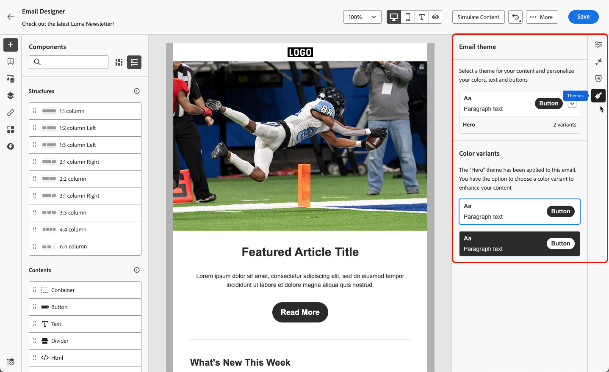

# 将主题应用于您的电子邮件内容 {#apply-email-themes}

>[!CONTEXTUALHELP]
>id="ajo_use_theme"
>title="将主题应用于电子邮件"
>abstract="选择电子邮件的主题，以快速应用符合您的品牌和设计的特定样式。"

<!--This documentation provides a comprehensive guide to using themes to streamline your email creation process. With the ability to define reusable themes and leverage pre-designed modules, marketers can create professional, brand-aligned emails faster and with less effort.-->

>[!AVAILABILITY]
>
>此功能目前为 Beta 版，仅供 Beta 版客户使用。要加入 Beta 版计划，请联系 Adobe 代表。

对于主题，非技术用户能够通过添加标准模板<!-- to achieve brand specific results-->上的自定义样式来创建符合特定品牌和设计语言的可重用内容。

此功能使营销人员能够更快更轻松地利用具有视觉吸引力的品牌一致性电子邮件，同时提供高级自定义选项以满足独特的设计需求。

<!--What is the Enhanced Email Authoring Experience?

This feature introduces two key components to simplify and enhance email creation:

* **Theme Management System**: A centralized system for creating, customizing, and applying reusable themes to emails. Themes ensure consistent styling across campaigns and eliminate the need for repetitive manual styling.

* **Modules**: Pre-designed, reusable content blocks that abstract common email elements (e.g., titles, descriptions, images, and links). Modules are built using customizable low-level components, offering flexibility while maintaining design standards.

Key Benefits:

- **Consistency**: Ensure all emails align with your brand's design guidelines.
- **Efficiency**: Save time by reusing themes and modules across campaigns.
- **Customization**: Add custom CSS and mobile-specific styles for advanced designs.
- **Scalability**: Eliminate repetitive styling tasks, enabling faster email creation.-->

## 护栏和限制 {#themes-guardrails}

* 从头开始创建电子邮件时，您可以选择使用主题开始构建内容，以快速应用符合您的品牌和设计的特定样式。

  如果选择“经典”模式，除非重置电子邮件，否则无法应用任何主题。

* [Fragments](../content-management/fragments.md)在Theme和Classic模式之间不兼容。

  要在应用主题的内容中使用片段，必须在主题模式下创建此片段。

* 如果使用在HTML中创建的内容，您将处于[兼容模式](existing-content.md)，并且不能将主题应用于此内容。

  要充分利用Email Designer的所有功能（包括主题），您必须在主题模式下创建新内容，或转换导入的HTML内容。 [了解详情](existing-content.md)

<!--If using a content created in Classic mode or HTML, you cannot apply themes to this content. You must create a new content in Theme mode.

If you apply a theme to a content using a [fragment](../content-management/fragments.md) created in Classic mode, the rendering may not be optimal.-->

## 创建主题 {#create-and-edit-themes}

要定义可在未来电子邮件内容中利用的主题，请执行以下步骤。

1. 若要开始，请创建新的[内容模板](../content-management/create-content-templates.md)。

1. 选择创建或编辑主题&#x200B;**[!UICONTROL 选项。]**

   

1. 您可以选择默认主题，也可以使用Adobe或自定义模板。 在此示例中，选择默认主题并单击&#x200B;**[!UICONTROL 创建]**。

   

1. 在&#x200B;**[!UICONTROL 常规设置]**&#x200B;选项卡中，通过为主题指定特定品牌名称来开始定义主题。 您可以调整电子邮件的默认宽度，还可以将当前主题导出为[在沙盒之间共享主题](../configuration/copy-objects-to-sandbox.md)。

   <!---->

1. 使用右侧的边栏浏览不同的选项卡并更新您的设计设置。

   

1. 从&#x200B;**[!UICONTROL 颜色]**&#x200B;选项卡：

   * 使用&#x200B;**[!UICONTROL 编辑]**&#x200B;按钮为您的品牌设置带有默认颜色的&#x200B;**[!UICONTROL 调色板]**。 选择&#x200B;**[!UICONTROL 预设]**&#x200B;以快速创建颜色方案，或单独调整主题的每种颜色。 您也可以同时使用这两种方法。

     

   * 单击&#x200B;**[!UICONTROL 添加变体]**&#x200B;以创建多个颜色变体，如浅色和深色模式，其中每个变体都有自己的调色板和细微控件。

     

   * 对于每个变体，单击编辑图标以编辑任何单个元素。 您可以使用已创建的默认调色板或任何自定义颜色。

     

1. 在&#x200B;**[!UICONTROL 文本设置]**&#x200B;中，您可以设置要用于整个主题的全局字体。 为了获得更细粒度的控件，您还可以编辑每个标题和段落类型以调整字体、大小、样式等。

   

1. 在&#x200B;**[!UICONTROL 间距]**&#x200B;选项卡中，从列表中选择单个元素，以在不同组件之间正确间隔该元素。

   <!---->

1. 使用右侧的其他选项卡，您可以单独管理此主题的每个按钮元素、分隔条、其他图像格式和网格布局间距。

   <!---->

1. 单击&#x200B;**[!UICONTROL 保存]**&#x200B;以存储此主题以供将来使用。

## 将主题应用到电子邮件 {#apply-themes}

要将默认或自定义样式主题应用于电子邮件，请执行以下步骤。

1. 在[!DNL Journey Optimizer]中，[将电子邮件](create-email.md)操作添加到历程或营销活动，并[编辑您的电子邮件正文](get-started-email-design.md#key-steps)。

1. 您可以选择以下操作之一：

   * 选择内置[电子邮件模板](use-email-templates.md)以打开Email Designer。 系统会自动应用特定于每个模板的默认主题。

   * 从头开始设计[新内容](content-from-scratch.md)并选择&#x200B;**[!UICONTROL 主题]**&#x200B;以预定义样式主题开始。

     

     >[!CAUTION]
     >
     >如果选择“经典”模式，除非重置电子邮件，否则无法应用任何主题。
     >
     >要在主题模式下使用[片段](../content-management/fragments.md)，必须已使用主题模式自行创建此片段。

1. 进入Email Designer后，单击右边栏上的&#x200B;**[!UICONTROL 主题]**&#x200B;按钮。 将显示默认主题或模板主题。 您可以在此主题的两个颜色变体之间切换。

   

1. 单击当前使用的主题旁边的箭头。 此时将显示可用自定义主题和Adobe主题的列表。

   

1. 单击&#x200B;**[!UICONTROL 自定义主题]**&#x200B;并选择您创建的主题。

   

1. 单击下拉列表外部。 新选择的自定义主题会自动将其样式应用于所有电子邮件组件。 您可以在两种颜色变体之间切换。

1. 选择某个组件后，您仍然可以使用专用图标解锁其样式。

   

您可以随时切换主题。 电子邮件内容保持不变，但样式将更新以反映新主题。

<!--
>[!NOTE]
> - Themes apply styles globally. Ensure your theme is finalized before applying it to multiple emails.
> - Switching themes may override custom styles applied to individual components.

>[!CAUTION]
> - When using fragments, the email's theme will override the fragment's styles. A warning will be displayed in the editor if there is a conflict.

## Example Use Cases {#example-use-cases}

### 1. Creating a New Theme
- A marketer creates a theme with their brand's colors, fonts, and button styles.
- The theme is saved and reused across multiple email campaigns.

### 2. Switching Themes
- A marketer applies a holiday-themed design to an existing email by switching to a pre-designed holiday theme.-->
