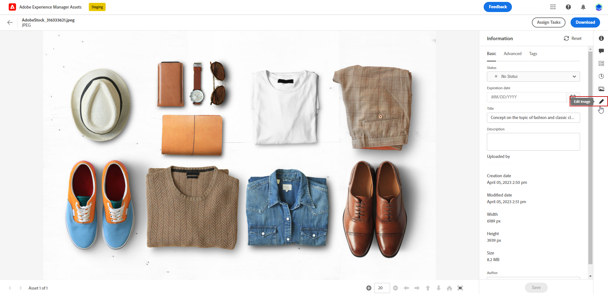

# 使用创建和管理资产 [!DNL Assets Essentials]{#experience-manager-assets}

## 开始使用 [!DNL Assets Essentials] {#get-started-assets-essentials}

利用 [!DNL Adobe Experience Manager Assets Essentials] 整合营销和创意工作流。与 [!DNL Adobe Journey Optimizer] 原生集成，可访问 [!DNL Assets Essentials] 来存储、管理、发现和分配数字资源。提供了单一集中式资源存储库，您可以使用它来填充消息。

[!DNL Adobe Experience Manager Assets Essentials] 是一个协作式和集中的资产工作区，可扩展您的创意系统并统一数字资产以交付体验。 您可以轻松组织、标记和查找已批准的生产资产，以确保各个团队的品牌一致性。 凭借其直观的用户体验， [!DNL Assets Essentials] 即时在您的Adobe创意和Experience Cloud应用程序中共享资产。

在 [Adobe Experience Manager Assets Essentials文档](https://experienceleague.adobe.com/docs/experience-manager-assets-essentials/help/introduction.html){target="_blank"}.

通过左侧菜单[!DNL Adobe Experience Manager Assets Essentials]资源[!DNL Adobe Journey Optimizer]部分的 **[!UICONTROL ，可直接访问]**。您还可以在 [设计电子邮件内容](get-started-email-design.md).

## 先决条件{#assets-prerequisites}

使用之前 [!DNL Adobe Experience Manager Assets Essentials]，则必须将用户添加到 **Assets Essentials消费者用户** 或/和 **Assets Essentials用户** 产品配置文件。 有关更多信息，请参阅 [Assets Essentials文档](https://experienceleague.adobe.com/docs/experience-manager-assets-essentials/help/deploy-administer.html?lang=zh-Hans){target="_blank"}.

>[!NOTE]
>对于在 2022 年 1 月 6 日之前购买的 Journey Optimizer 产品，您必须为组织部署 [!DNL Adobe Experience Manager Assets Essentials]。在[部署 Assets Essentials](https://experienceleague.adobe.com/docs/experience-manager-assets-essentials/help/deploy-administer.html?lang=zh-Hans){target="_blank"} 部分中了解详情。

## 上传和插入资产{#add-asset}

将文件导入 [!DNL Assets Essentials]，则首先需要浏览或创建要存储到其中的文件夹。 然后，您便能够将它们插入到电子邮件内容中。

有关如何上传资产的更多信息，请参阅 [Adobe Experience Manager Assets Essentials文档](https://experienceleague.adobe.com/docs/experience-manager-assets-essentials/help/add-delete.html){target="_blank"}.

1. 从 [!DNL Adobe Journey Optimizer] 主页，选择 **[!UICONTROL 资产]** 选项卡 **[!UICONTROL 内容管理]** 访问菜单 [!DNL Assets Essentials].

   

1. 从中央部分或树视图中双击文件夹以将其打开。

   您还可以单击 **[!UICONTROL 创建文件夹]** 创建新文件夹。

   

1. 进入选定或创建的文件夹后，单击 **[!UICONTROL 添加资产]** 将新资产上传到您的文件夹。

   

1. 从 **[!UICONTROL 上传文件]**，单击 **[!UICONTROL 浏览]** 然后选择 **[!UICONTROL 浏览文件]** 或 **[!UICONTROL 浏览文件夹]**.

1. 选择要上传的文件。 完成后，单击 **[!UICONTROL 上传]**. 要了解有关如何管理资产的更多信息，请参阅 [页面](https://experienceleague.adobe.com/docs/experience-manager-assets-essentials/help/manage-organize.html).

1. 要使用Adobe Photoshop Express进一步编辑您的资产，请双击资产。 然后，从右侧菜单中，选择 **[!UICONTROL 编辑模式]** 图标。 [了解详情](https://experienceleague.adobe.com/docs/experience-manager-assets-essentials/help/edit-images.html){target="_blank"}.

   

1. 从 [!DNL Adobe Journey Optimizer]，选择 **[!UICONTROL 资产选取器]** 菜单。

   

1. 选择您之前创建的 **[!UICONTROL 资产]** 文件夹。 您还可以在搜索栏中搜索资产或文件夹。

1. 将资产拖放到电子邮件内容中。

   

1. 您可以进一步自定义您的资产，例如使用 **[!UICONTROL 设置]** 和 **[!UICONTROL 样式]** 选项卡。 [了解有关组件设置的更多信息](content-components.md)

   

   <!--
    After adding your asset to your email, use the **[!UICONTROL Find similar Stock photos]** option to locate Stock photos that match the content, color, and composition of your image. [Learn more about Adobe Stock](stock.md).

    Note that this option is available for licensed/unlicensed Stock images and images from your Assets folder. 

    
    -->