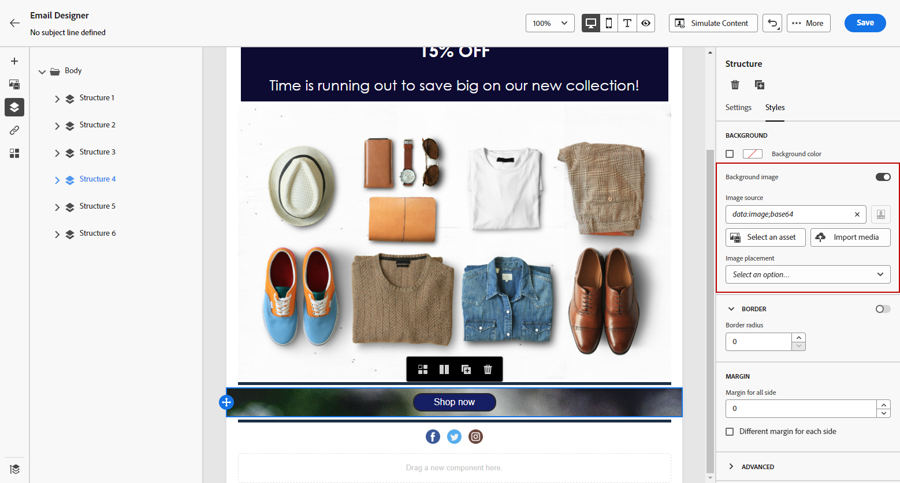

# 个性化电子邮件背景 {#backgrounds}

>[!CONTEXTUALHELP]
>id="ac_edition_backgroundimage"
>title="背景设置"
>abstract="您可以为自己的内容使用个性化的背景颜色或背景图像。 请注意，并非所有电子邮件客户端都支持背景图像。"

在使用电子邮件设计器设置背景时，Adobe 有以下建议：

1. 如果设计需要，可对电子邮件正文应用背景颜色。
1. 通常，在列级别设置背景颜色。
1. 尽量不要在图像或文本组件上使用背景颜色，因为它们难以管理。

以下是可使用的可用背景设置。

* 为整个电子邮件设置&#x200B;**[!UICONTROL 背景颜色]**。 请务必在可从左侧调色板访问的导航树中选择正文设置。

  

* 通过选择&#x200B;**[!UICONTROL 视口背景颜色]**&#x200B;来为所有结构组件设置同一背景颜色。 此选项可让您从背景颜色中选择其他设置。

  

* 为每个结构组件设置不同的背景颜色。 在可从左侧调色板访问的导航树中选择一个结构，以仅将特定的背景颜色应用于该结构。

  切勿设置视口背景颜色，因为它可能会隐藏结构背景颜色。

  

* 设置结构组件的内容的&#x200B;**[!UICONTROL 背景图像]**。

  >[!NOTE]
  >
  >某些电子邮件程序不支持背景图像。 如果不支持，将改用行背景颜色。 请务必选择合适的备用背景颜色，以防图像无法显示。

  

* 在列级别设置背景颜色。

  >[!NOTE]
  >
  >这是最常见的用例。 Adobe 建议在列级别设置背景颜色，因为这可在编辑整个电子邮件内容时提供更大的灵活性。

  您也可以在列级别设置背景图像，但很少这样做。
