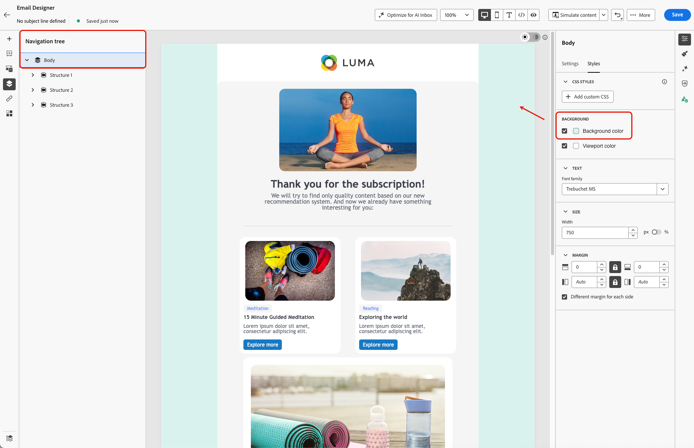
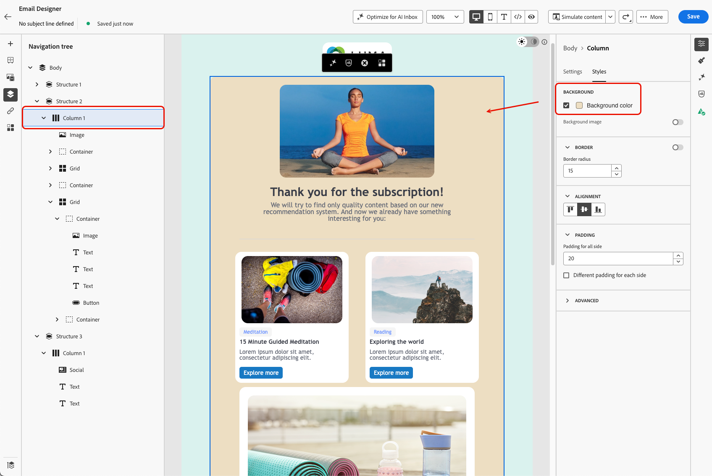
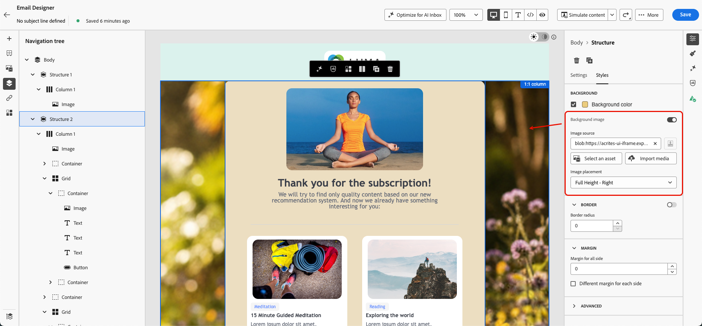

# 个性化电子邮件背景 {#backgrounds}

>[!BEGINSHADEBOX]

**在此页面上：**&#x200B;了解如何在 Email Designer 中设置电子邮件正文、视口、结构和列级别的背景颜色和图像。

>[!ENDSHADEBOX]

>[!CONTEXTUALHELP]
>id="ac_edition_backgroundimage"
>title="背景设置"
>abstract="您可以为自己的内容使用个性化的背景颜色或背景图像。 请注意，并非所有电子邮件客户端都支持背景图像。"

背景可帮助您强化品牌识别，并吸引读者关注电子邮件中的关键领域。 在Email Designer中，您可以在内容的不同级别设置背景颜色或图像（从整体主体到单个结构和列），从而精确控制背景在电子邮件中的呈现方式。

在电子邮件Designer中设置背景时，请牢记以下最佳实践：

* 仅当您的设计需要背景颜色时，才对主体应用背景颜色。
* 最好尽可能在列级别设置背景颜色。
* 避免在图像或文本组件上使用背景颜色，因为这些颜色更难管理。
* 在发送之前测试实际电子邮件客户端中的背景图像，因为渲染可能与电子邮件Designer预览不同。

以下设置允许您在电子邮件内容的任何级别应用背景颜色或图像，从正文向下应用到单个结构和列。

>[!TIP]
>
>如果将主题应用于电子邮件，则不能直接覆盖由给定组件的主题设置的背景颜色。 必须先使用&#x200B;**[!UICONTROL 样式]**&#x200B;选项卡中的专用图标解锁该样式。 [了解如何操作](apply-email-themes.md#unlocking-styles)

## 设置背景颜色 {#background-color}

1. **正文背景颜色** — 为整个电子邮件设置&#x200B;**[!UICONTROL 背景颜色]**。 确保从左侧面板访问的&#x200B;**[!UICONTROL 导航树]**&#x200B;中选择&#x200B;**[!UICONTROL 正文]**，并使用右侧的&#x200B;**[!UICONTROL 样式]**&#x200B;选项卡中的专用选项。

   

1. **视区背景颜色** — 设置&#x200B;**[!UICONTROL 视区颜色]**&#x200B;以对所有结构组件应用相同的背景颜色，而不依赖于主体的背景颜色。

   

1. **结构背景颜色** — 要将背景颜色应用于单个结构组件，请直接在画布中或从左侧面板中选择它，然后为该结构设置特定颜色。

   

   >[!TIP]
   >
   >在这种情况下，请勿设置视区背景颜色，因为它可能会隐藏结构背景颜色。

1. **列背景颜色** — 在列级别设置背景颜色。 同样，请确保从左侧面板中选择所需的列，并设置该列的特定颜色。

   

   >[!TIP]
   >
   >这是最常见的使用案例和最佳实践，因为它为您在编辑电子邮件内容的其余部分时提供了更大的灵活性。

## 设置背景图像 {#background-image}

您还可以为结构或列组件的内容设置&#x200B;**[!UICONTROL 背景图像]**。 这在结构级别最常使用；在列级别设置一个是可能的，但很少使用。

>[!NOTE]
>
>某些电子邮件程序不支持背景图像。 如果不支持，将改用行背景颜色。 请务必选择合适的备用背景颜色，以防图像无法显示。

>[!TIP]
>
>在发送之前预览实际电子邮件客户端中的背景图像，而不仅仅是在Email Designer预览中。 相同的图像和放置可以在编辑器中正确呈现，但在某些客户端中（例如iOS上的Outlook）以不同的方式拉伸或裁切。

设置背景图像后，使用&#x200B;**[!UICONTROL 图像位置]**&#x200B;下拉菜单控制图像填充结构或列的方式。 以下选项可供选择：

{width=80%}

**缩放以填充，居中：**

* **[!UICONTROL 适合]** — 拉伸图像以在两个轴上填充容器，而不保留其宽高比。
* **[!UICONTROL 全宽]** — 按比例缩放图像到容器的宽度并将其垂直居中。
* **[!UICONTROL 全高]** — 按比例缩放图像到容器的高度并将其水平居中。

**缩放以填充，锚定到边缘：**

* **[!UICONTROL 全宽 — 顶部]** — 与&#x200B;**[!UICONTROL 全宽]**&#x200B;相同，固定到容器顶部。 溢出在底部被裁剪。
* **[!UICONTROL 全宽 — 底部]** — 与固定在容器底部的&#x200B;**[!UICONTROL 全宽]**&#x200B;相同。 溢出在顶部被裁剪。
* **[!UICONTROL 全高 — 左侧]** — 与固定在容器左侧的&#x200B;**[!UICONTROL 全高]**&#x200B;相同。 右侧将裁剪溢出。
* **[!UICONTROL 全高 — 右]** — 与&#x200B;**[!UICONTROL 全高]**&#x200B;相同，锚定在容器的右侧。 在左侧裁切溢出。

**磁贴：**

* **[!UICONTROL 重复]** — 以原始大小平铺图像以填充容器。

**位置（不缩放）：**

* **[!UICONTROL 左]**、**[!UICONTROL 右]**、**[!UICONTROL 中]**、**[!UICONTROL 上]**、**[!UICONTROL 下]** — 将图像定位为其原始大小，并将其锚定到容器的相应边缘或中心。

>[!NOTE]
>
>与上方居中选项相比，边缘锚定选项可让您更好地控制图像的哪个部分与结构的比例不匹配时保持处于视图状态。

{{$include /help/_includes/do-not-localize/email/ai-augmented-backgrounds.md}}
