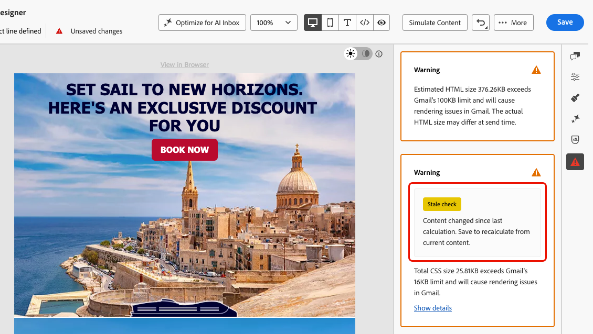

# 电子邮件设计器中的内容检查 {#content-check}

>[!CONTEXTUALHELP]
>id="ajo_email_content_check"
>title="验证您的电子邮件内容"
>abstract="内容检查会在发送前自动检测电子邮件中的 HTML 和 CSS 问题。 它们会标记不受支持的标签、空 div 元素以及可能导致 Gmail 或 Microsoft Outlook 渲染异常的大小限制问题。 问题会以错误、警告或信息提示的形式显示，并提供相关上下文信息以及可用的一键修复功能。"

[!DNL Journey Optimizer]包括直接在Email Designer中的自动技术验证，可帮助您在发送之前捕获HTML和CSS问题。

结果在“创作”面板中显示为错误、警告或信息性通知，其中包括上下文详细信息和一键式修复（如果可用），因此无需退出Email Designer即可解决问题。

## 访问内容检查 {#access-content-checks}

内容检查在电子邮件Designer中始终可用。 要查看它们，请单击右边栏中的“问题”图标以打开&#x200B;**[!UICONTROL 内容检查]**&#x200B;窗格 — 此处列出了所有检测到的问题。

电子邮件Designer中的

>[!NOTE]
>
>检查会针对电子邮件的当前状态并在每次编辑后自动运行。 [了解详情](#recalculation)

检查具有三个严重性级别：

| 严重性 | 颜色 | 描述 |
|---|---|---|
| **错误** | 红色 | 会导致投放或呈现失败的关键问题。 发送前解决。 |
| **Warning** | 橙色 | 可能影响特定电子邮件客户端中呈现的潜在问题。 建议查看并解决。 |
| **信息** | 蓝色 | 有关不阻止发送但可能影响内容长期可维护性的条件的信息性通知。 |

未检测到问题时，窗格显示&#x200B;**未检测到问题**，相应的图标为绿色。

电子邮件Designer中的

根据问题，您可以查看更多上下文、应用一键式修复或保存电子邮件以刷新检查结果。

* 对于某些检测到的问题，您可以单击&#x200B;**[!UICONTROL 显示详细信息]**&#x200B;按钮以查看更多上下文。单击&#x200B;**[!UICONTROL 隐藏详细信息]**&#x200B;以折叠。
  电子邮件Designer中的{width="80%"}
* 同样，您可以单击&#x200B;**[!UICONTROL 显示修复]**&#x200B;按钮并在可用处应用一键修复。如果无法自动应用修复，则会显示一条消息，您必须手动解决该问题。
  {width="80%"}

### 重新计算支票 {#recalculation}

大多数检查（例如不支持的HTML元素、空div和HTML大小）会在每次编辑电子邮件时重新计算，因此它们始终反映您的当前内容。

其他检查（例如CSS大小）是根据序列化内容（加载或保存电子邮件的版本）计算的，而不是从Email Designer中的实时编辑状态计算的。 在这种情况下，保存的内容可能与编辑时看到的内容略有不同。 如果未保存即进行编辑，则显示&#x200B;**[!UICONTROL 失效检查]**&#x200B;标签，指示结果可能不再准确。 保存您的电子邮件以刷新计算。

{width="100%"}

## 修复检测到的问题 {#fix-issues}

下表列出了所有可能的消息以及针对每条消息推荐的操作。 展开与您在&#x200B;**[!UICONTROL 内容检查]**&#x200B;窗格中看到的消息匹配的类别。

+++ 不支持的HTML元素

| 消息 | 严重性 | 要做什么 |
|---|---|---|
| 您的内容包含`<script>`标记，任何电子邮件系统均不支持该标记。 将其移除以避免投放和呈现问题。 | 错误 | 从HTML内容中找到并删除所有`<script>`标记。 |
| 您的内容包含`<base>`标记，这可能会导致Email Designer中出现链接和资源解析问题。 要解决此问题，您需要将其删除。 | 错误 | 从HTML中删除`<base>`标记。 |
| 您的内容包含一个带有刷新功能的HTML meta标记，而电子邮件Designer不支持此功能。 删除它可防止意外行为。 | 警告 | 从HTML中删除meta refresh标记。 |
| 您的内容包含空div，这可能会导致Microsoft Outlook (MSO)出现布局问题。 要解决此问题，请删除空的div，然后改用同级元素的间距。 | 警告 | 删除空的`
`元素，并调整周围元素上的填充或边距以保持间距。 |

+++

+++ CSS问题

| 消息 | 严重性 | 要做什么 |
|---|---|---|
| CSS总大小超过Gmail的16 KB限制，将导致Gmail中出现渲染问题。 | 错误 | 使用&#x200B;**[!UICONTROL 应用修复]**&#x200B;自动删除未使用的CSS规则，或手动简化您的样式。 |
| CSS总大小接近Gmail的16 KB限制，如果添加更多CSS，可能会导致呈现问题。 | 警告 | 使用&#x200B;**[!UICONTROL 应用修复]**&#x200B;删除未使用的CSS规则，或在添加更多内容之前减少样式。 |
| 此片段的CSS总大小超过3 KB。 将此与其他片段结合使用可能会导致电子邮件CSS总数超过Gmail的16 KB限制，并导致呈现问题。 | 警告 | 简化此片段中的CSS，将合并的电子邮件CSS保留在16 KB以下。 |
| 内容包含未使用的CSS规则。 这可能会导致Gmail中出现呈现问题。 | 警告 | 使用&#x200B;**[!UICONTROL 应用修复]**&#x200B;可自动删除引用电子邮件中不再存在的元素的CSS规则。 |

<!--
| Message | Severity | What to do |
|---|---|---|
| Your content has modifications to the system-generated default CSS. These changes may be overridden by future Email Designer updates. To preserve your styles, add them using the Custom CSS feature instead. | Info | Move your custom styles to [Custom CSS](custom-css.md) to ensure they are preserved across Email Designer updates. |
-->

+++

+++ HTML大小

| 消息 | 严重性 | 要做什么 |
|---|---|---|
| 预计HTML大小超过Gmail的100 KB限制，将导致Gmail中出现呈现问题。 发送时HTML的实际大小可能不同。 | 错误 | 减少电子邮件内容 — 删除不必要的元素、简化结构或跨多个发送拆分内容。 |
| 预计的HTML大小接近Gmail的100 KB限制，如果添加更多HTML，可能会导致呈现问题。 发送时HTML的实际大小可能不同。 | 警告 | 在添加更多内容之前简化内容。 超过Gmail限制的电子邮件将被裁剪给收件人。 |
| 此片段的预计HTML大小超过20 KB。 将此与其他片段结合使用时，可能会导致HTML中的电子邮件总数超过Gmail的100 KB限制，并导致呈现问题。 发送时HTML的实际大小可能不同。 | 警告 | 减小此片段中的HTML以将合并的电子邮件大小保持在Gmail的100 KB限制以下。 |

+++

## 关于HTML和CSS大小 {#size-estimation}

HTML和CSS大小值是在创作时计算的&#x200B;**估计值**，并且可能与交付给收件人的实际大小不同 — 例如，当您的电子邮件使用条件块时（每个收件人只有一个分支呈现），或在发送时启用HTML缩小时。

大小警告是主动信号，可帮助您在发送之前优化内容，而不是优化硬块。
