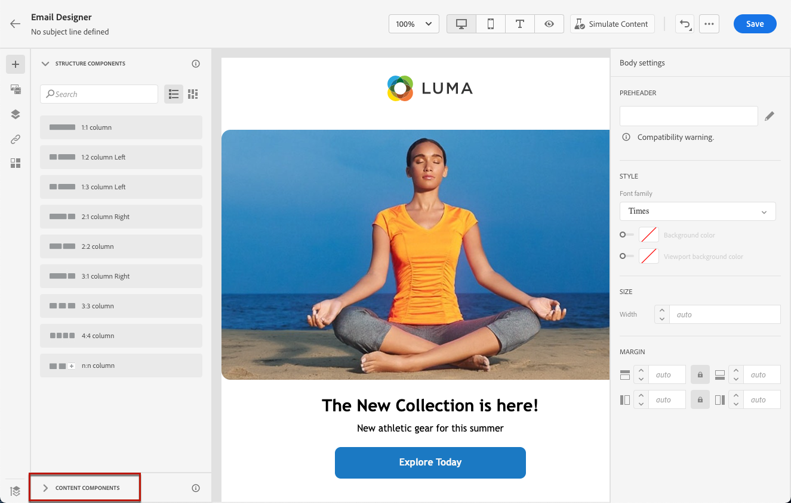
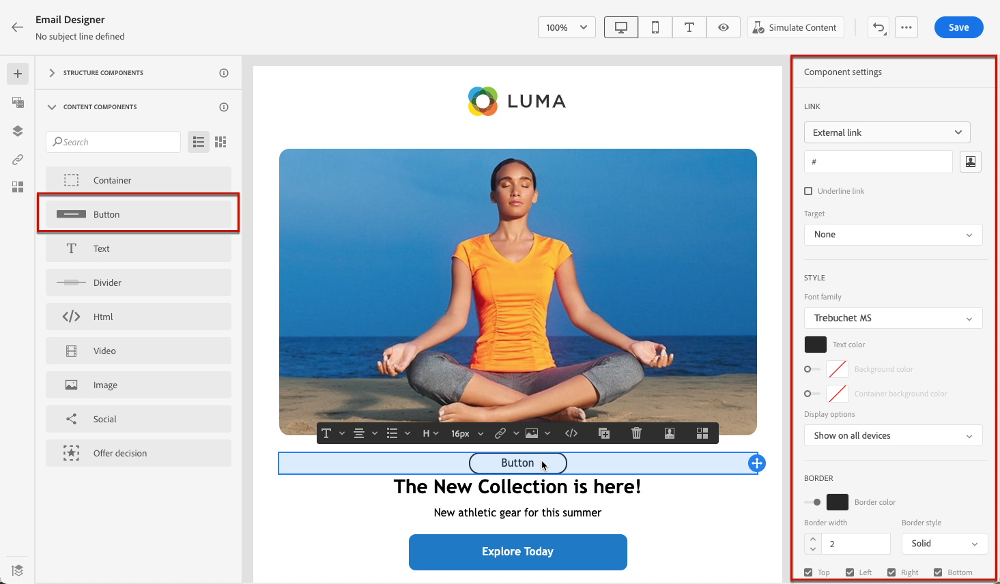

# 使用Email Designer内容组件 {#content-components}

>[!CONTEXTUALHELP]
>id="ac_content_components_email"
>title="关于内容组件"
>abstract="内容组件是空的内容占位符，您可用它来创建电子邮件的版面。"

>[!CONTEXTUALHELP]
>id="ac_content_components_landing_page"
>title="关于内容组件"
>abstract="内容组件是空的内容占位符，您可用它来创建登陆页面的版面。"

>[!CONTEXTUALHELP]
>id="ac_content_components_fragment"
>title="关于内容组件"
>abstract="内容组件是空的内容占位符，您可用它来创建片段的版面。"

>[!CONTEXTUALHELP]
>id="ac_content_components_template"
>title="关于内容组件"
>abstract="内容组件是空的内容占位符，您可用它来创建模板的版面。"

创建电子邮件内容时， **[!UICONTROL 内容组件]** 允许您使用原始组件进一步个性化电子邮件，一旦这些组件放入电子邮件中即可编辑。

您可以根据需要在一个或多个结构组件中添加任意数量的内容组件，这些组件定义电子邮件的布局。

## 添加内容组件 {#add-content-components}

要将内容组件添加到您的电子邮件中，并根据您的需要调整这些内容组件，请执行以下步骤。

1. 在电子邮件设计器中，使用现有内容或将&#x200B;**[!UICONTROL 结构组件]**&#x200B;拖放到空白内容中以定义电子邮件版面。[了解如何操作](content-from-scratch.md)

1. 要访问&#x200B;**[!UICONTROL 内容组件]**&#x200B;部分，请从电子邮件设计器左窗格中选择相应的按钮。

   

1. 将所选内容组件拖放到相关的结构组件中。

   

   >[!NOTE]
   >
   >您可以将多个组件添加到单个结构组件中，也可以将它们添加到结构组件的每个列中。

1. 使用调整每个组件的属性和样式 **[!UICONTROL 设置]** 和 **[!UICONTROL 样式]** 选项卡位于右侧。 例如，您可以更改每个组件的文本样式、内边距或边距。[了解有关对齐方式和内边距的更多信息](alignment-and-padding.md)

   

1. 从的高级菜单中 **[!UICONTROL 内容组件]**&#x200B;中，您可以根据需要轻松删除或复制任何内容组件。

   

## 容器 {#container}

要将特定样式应用于一组内容组件，您可以添加 **[!UICONTROL 容器]** 组件，然后将所需的内容组件添加到其中。 这允许您向容器应用不同的样式，这与应用于内部内容组件的样式不同。

例如，添加一个&#x200B;**[!UICONTROL 容器]**&#x200B;组件，然后在该容器中添加一个[按钮](#button)组件。可以为该容器使用一个特定背景，并为按钮使用另一个背景。

## 按钮 {#button}

使用&#x200B;**[!UICONTROL 按钮]**&#x200B;组件可将一个或多个按钮插入电子邮件中，并将电子邮件受众重定向到另一个页面。

1. 从&#x200B;**[!UICONTROL 内容组件]**&#x200B;中，将&#x200B;**[!UICONTROL 按钮]**&#x200B;组件拖放到&#x200B;**[!UICONTROL 结构组件]**&#x200B;中。

1. 单击新添加的按钮以个性化文本并访问 **[!UICONTROL 设置]** 和 **[!UICONTROL 样式]** 选项卡。

   

1. 从 **[!UICONTROL 链接]** 菜单，添加您单击按钮时要重定向到的URL。

1. 选择将通过 **[!UICONTROL Target]** 下拉列表：

   * **[!UICONTROL 无]**：单击时在同一框架中打开链接（默认）。
   * **[!UICONTROL 空白]**：在新窗口或标签页中打开链接。
   * **[!UICONTROL 自身]**：单击时在同一框架中打开链接。
   * **[!UICONTROL 父]**：在父框架中打开链接。
   * **[!UICONTROL 顶部]**：在窗口的整个正文中打开链接。

   

1. 您可以通过从以下位置更改样式属性（例如&#x200B;**[!UICONTROL 边框]**、**[!UICONTROL 大小]**、**[!UICONTROL 边距]**&#x200B;等）来进一步个性化您的按钮：**[!UICONTROL 组件设置]**&#x200B;窗格。

## 文本 {#text}

使用&#x200B;**[!UICONTROL 文本]**&#x200B;组件将文本插入电子邮件中，并使用 **[!UICONTROL 样式]** 选项卡。

1. 从 **[!UICONTROL 内容组件]**，拖放 **[!UICONTROL 文本]** 组件到 **[!UICONTROL 结构组件]**.

1. 单击新添加的组件以个性化文本并访问 **[!UICONTROL 设置]** 和 **[!UICONTROL 样式]** 选项卡。

1. 使用工具栏中的以下可用选项更改文本：

   

   * **[!UICONTROL 更改文本样式]**：对文本应用粗体、斜体、下划线或删除线。
   * **更改对齐方式**：为文本选择左对齐、右对齐、居中对齐或两端对齐。
   * **[!UICONTROL 创建列表]**：将项目符号或编号列表添加到文本中。
   * **[!UICONTROL 设置标题]**：向文本添加最多六个标题级别。
   * **字体大小**：选择文本的字体大小（以像素为单位）。
   * **[!UICONTROL 更改字体颜色]**：选择字体的颜色。
   * **[!UICONTROL 插入链接]**：向内容添加任何类型的链接。
   * **[!UICONTROL 编辑图像]**：将图像或资产添加到文本组件。[了解有关资产管理的更多信息](assets-essentials.md)
   * **[!UICONTROL 更改字体颜色]**：选择字体的颜色。
   * **[!UICONTROL 添加个性化]**：添加个性化字段以自定义配置文件数据中的内容。[详细了解内容个性化](../personalization/personalize.md)
   * **[!UICONTROL 显示源代码]**：显示文本的源代码。不能修改。
   * **[!UICONTROL 启用条件内容]**：添加条件内容以使组件内容适应目标配置文件。[了解有关动态内容的更多信息](../personalization/get-started-dynamic-content.md)
   * **[!UICONTROL 复制]**：添加文本组件的副本。
   * **[!UICONTROL 删除]**：从电子邮件中删除选定的文本组件。

1. 从以下位置调整其他样式属性，例如文本颜色、字体系列、边框、内边距、边距等：从 **[!UICONTROL 样式]** 选项卡。

   

## 分隔条 {#divider}

使用&#x200B;**[!UICONTROL 分隔条]**&#x200B;组件可插入分隔线来整理电子邮件的版面和内容。

可从&#x200B;**[!UICONTROL 设置]**&#x200B;和&#x200B;**[!UICONTROL 样式]**&#x200B;选项卡调整线条颜色、样式和高度等样式属性。

## HTML {#HTML}

使用 **[!UICONTROL HTML]** 组件可复制并粘贴现有 HTML 的不同部分。这使您能够创建免费的模块化 HTML 组件以重用某些外部内容。

1. 从&#x200B;**[!UICONTROL 内容组件]**&#x200B;中，将 **[!UICONTROL HTML]** 组件拖放到&#x200B;**[!UICONTROL 结构组件]**&#x200B;中。

1. 单击新添加的组件，然后从上下文工具栏中选择&#x200B;**[!UICONTROL 显示源代码]**&#x200B;以添加 HTML。

   

1. 复制并粘贴要添加到电子邮件中的HTML代码，然后单击 **[!UICONTROL 保存]**.

   

>[!NOTE]
>
>要简单地使外部内容与电子邮件设计器兼容，Adobe 建议从头开始创建邮件并将现有电子邮件中的内容复制到组件中。

## 图像 {#image}

使用 **[!UICONTROL 图像]** 用于将图像文件从计算机插入电子邮件内容的组件。

1. 从 **[!UICONTROL 内容组件]**，拖放 **[!UICONTROL 图像]** 组件到 **[!UICONTROL 结构组件]**.

   

1. 单击&#x200B;**[!UICONTROL 浏览]**&#x200B;以从您的资源中选择图像文件。

   要了解更多关于 [!DNL Assets Essentials]，请参阅 [Adobe Experience Manager Assets Essentials文档](https://experienceleague.adobe.com/docs/experience-manager-assets-essentials/help/introduction.html){target="_blank"}.

1. 单击新添加的组件，然后从以下位置设置图像属性： **[!UICONTROL 设置]** 选项卡：

   * 使用&#x200B;**[!UICONTROL 图像标题]**&#x200B;可以定义图像的标题。
   * 使用&#x200B;**[!UICONTROL 替代文字]**&#x200B;可以定义链接到图像的题注。这对应于 alt HTML 属性。

   

1. 您还可以选择 **[!UICONTROL 查找类似的Stock照片]**. [了解详情](stock.md)

1. 从 **[!UICONTROL 样式]** 选项卡，调整其他样式属性，如边距、边框等。 或者从&#x200B;**[!UICONTROL 组件设置]**&#x200B;窗格中添加链接，以将受众重定向到其他内容。

## 社交 {#social}

使用&#x200B;**[!UICONTROL 社交]**&#x200B;组件可将指向社交媒体页面的链接插入到电子邮件内容中。

1. 从&#x200B;**[!UICONTROL 内容组件]**&#x200B;中，将&#x200B;**[!UICONTROL 社交]**&#x200B;组件拖放到&#x200B;**[!UICONTROL 结构组件]**&#x200B;中。

1. 选择新添加的组件。

1. 在&#x200B;**[!UICONTROL 设置]**&#x200B;选项卡的&#x200B;**[!UICONTROL 社交]**&#x200B;字段中，选择要添加或删除的社交媒体。

   

1. 通过专用字段选择图标的大小。

1. 单击每个社交媒体图标以配置 **[!UICONTROL URL]** 您的受众将被重定向到的目标位置。

   

1. 如果需要，您还可以从资源中更改每个社交媒体的图标。

1. 从以下位置调整其他样式属性（例如样式、边距、边框等）：从 **[!UICONTROL 样式]** 选项卡。

## 优惠决策 {#offer-decision}

使用 **[!UICONTROL 优惠决策]** 用于将选件插入到消息中的组件。 此 [决策管理](../offers/get-started/starting-offer-decisioning.md) engine将选择向客户提供的最佳选件。

1. 从 **[!UICONTROL 内容组件]**，拖放 **[!UICONTROL 优惠决策]** 组件到 **[!UICONTROL 结构组件]**.

1. 单击 **[!UICONTROL 添加]** 以选择您的 **[!UICONTROL 优惠决策]**.

   

1. 从下拉列表中，选择您的 **[!UICONTROL 版面]**.  然后，选择 **[!UICONTROL 优惠决策]** 要添加到您的内容并单击 **[!UICONTROL 添加]**.

   

1. 从 **[!UICONTROL 优惠决策]** 选项卡，您可以预览或更改插入的选件。

了解如何在电子邮件中添加个性化优惠 [本节](add-offers-email.md).

>[!IMPORTANT]
>
>如果对历程消息中使用的优惠决策进行了更改，则需要取消发布该历程并重新发布。  这将确保将更改纳入历程的消息中，并且消息与最新更新一致。
