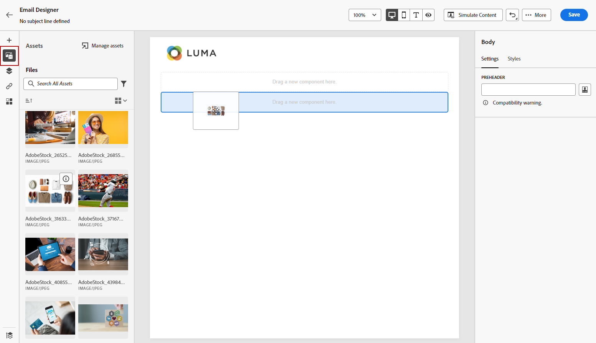

# 从头开始设计内容 {#content-from-scratch}

>[!CONTEXTUALHELP]
>id="ac_structure_components_email"
>title="添加结构组件"
>abstract="结构组件定义电子邮件的版面。将&#x200B;**结构**&#x200B;组件拖放到画布中，开始设计您的电子邮件内容。"

>[!CONTEXTUALHELP]
>id="ac_structure_components_landing_page"
>title="添加结构组件"
>abstract="结构组件定义登陆页面的版面。拖放&#x200B;**结构**&#x200B;组件到画布中，开始设计您的登陆页面内容。"

>[!CONTEXTUALHELP]
>id="ac_structure_components_fragment"
>title="添加结构组件"
>abstract="结构组件定义片段的版面。拖放&#x200B;**结构**&#x200B;组件到画布中，开始设计您的片段内容。"

>[!CONTEXTUALHELP]
>id="ac_structure_components_template"
>title="添加结构组件"
>abstract="结构组件定义模板的版面。拖放&#x200B;**结构**&#x200B;组件到画布中，开始设计您的模板内容。"

>[!CONTEXTUALHELP]
>id="ac_edition_columns_email"
>title="定义电子邮件列"
>abstract="使用电子邮件设计器，您可以通过选择列结构来轻松定义电子邮件的版面。"

>[!CONTEXTUALHELP]
>id="ac_edition_columns_landing_page"
>title="定义登陆页面列"
>abstract="使用电子邮件设计器，您可以通过选择列结构来轻松定义登陆页面的版面。"

>[!CONTEXTUALHELP]
>id="ac_edition_columns_fragment"
>title="定义片段列"
>abstract="使用电子邮件设计器，您可以通过选择列结构来轻松定义片段的版面。"

>[!CONTEXTUALHELP]
>id="ac_edition_columns_template"
>title="定义模板列"
>abstract="使用电子邮件设计器，您可以通过选择列结构来轻松定义模板的版面。"

使用Adobe Journey Optimizer Designer轻松定义内容的结构。 通过简单的拖放操作添加和移动结构元素，您可以在几秒钟内设计内容的形状。

要开始构建内容，请执行以下步骤：

1. 从Designer主页中，选择 **[!UICONTROL 从头开始设计]** 选项。

   

1. 通过拖放开始设计内容 **[!UICONTROL 结构]** 放入画布以定义电子邮件的布局。

   >[!NOTE]
   >
   >堆叠列并非与所有电子邮件程序都兼容。当不支持时，将不会栈叠列。

   <!--Once placed in the email, you cannot move nor remove your components unless there is already a content component or a fragment placed inside. This is not true in AJO - TBC?-->

1. 添加任意数量 **[!UICONTROL 结构]** 并根据需要在右侧的专用窗格中编辑其设置。

   

   选择 **[!UICONTROL n:n 列]**&#x200B;组件来定义所选列数（3 和 10 之间）。还可以通过移动每个列底部的箭头来定义该列的宽度。

   >[!NOTE]
   >
   >每个列的大小不能小于结构组件的总宽度的 10%。不能删除非空列。

1. 展开 **[!UICONTROL 目录]** 部分，并将所需数量的元素添加到一个或多个结构组件中。 [详细了解内容组件](content-components.md)

1. 可使用进一步自定义每个组件 **[!UICONTROL 设置]** 或 **[!UICONTROL 样式]** 选项卡。 例如，您可以更改每个组件的文本样式、内边距或边距。[了解有关对齐方式和内边距的更多信息](alignment-and-padding.md)

   

1. 从 **[!UICONTROL 资产选取器]**&#x200B;中，您可以直接选择存储在以下位置中的资源： **[!UICONTROL 资产库]**. [了解有关资产管理的更多信息](../content-management/assets-essentials.md)

   双击包含资产的文件夹。 将它们拖放到结构组件中。

   

1. 插入个性化字段以根据用户档案属性、受众成员资格、上下文属性等自定义您的内容。 [详细了解内容个性化](../personalization/personalize.md)

   

1. 单击 **[!UICONTROL 启用条件内容]** 添加动态内容，并根据条件规则将内容调整为定向的用户档案。 [动态内容入门](../personalization/get-started-dynamic-content.md)

   

1. 单击 **[!UICONTROL 链接]** 选项卡，以显示要跟踪的内容的所有URL。 您可以修改其 **[!UICONTROL 跟踪类型]** 或 **[!UICONTROL 标签]** 并添加 **[!UICONTROL 标记]** 如果需要。 [了解有关链接和跟踪的更多信息](message-tracking.md)

   

1. 如果需要，可以通过单击高级菜单中的&#x200B;**[!UICONTROL 切换到代码编辑器]**&#x200B;来进一步个性化电子邮件。例如，这允许您编辑电子邮件源代码以添加跟踪或自定义 HTML 标记。[详细了解代码编辑器](code-content.md)

   >[!CAUTION]
   >
   >切换到代码编辑器后，无法恢复到此电子邮件的可视设计器。

1. 内容准备就绪后，单击 **[!UICONTROL 模拟内容]** 按钮以检查渲染。 可以选择桌面或移动视图。有关如何选择测试用户档案和预览内容的详细信息，请参阅 [内容管理](../content-management/preview-test.md) 部分。

   

1. 内容就绪后，单击 **[!UICONTROL 保存]**.
