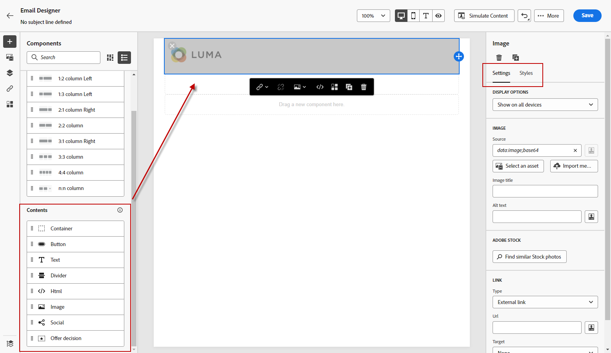

# 使用电子邮件 Designer 从头开始设计内容 {#content-from-scratch}

>[!BEGINSHADEBOX]

**在此页面上：**&#x200B;了解如何在Adobe Journey Optimizer Email Designer中从头开始设计电子邮件内容，方法是添加结构和内容组件，然后个性化和预览电子邮件。

>[!ENDSHADEBOX]

>[!CONTEXTUALHELP]
>id="ac_structure_components_email"
>title="添加结构组件"
>abstract="结构组件定义电子邮件的版面。 将&#x200B;**结构**&#x200B;组件拖放到画布中，开始设计您的电子邮件内容。"

>[!CONTEXTUALHELP]
>id="ac_structure_components_landing_page"
>title="添加结构组件"
>abstract="结构组件定义登陆页面的版面。 拖放&#x200B;**结构**&#x200B;组件到画布中，开始设计您的登陆页面内容。"

>[!CONTEXTUALHELP]
>id="ac_structure_components_fragment"
>title="添加结构组件"
>abstract="结构组件定义片段的版面。 拖放&#x200B;**结构**&#x200B;组件到画布中，开始设计您的片段内容。"

>[!CONTEXTUALHELP]
>id="ac_structure_components_template"
>title="添加结构组件"
>abstract="结构组件定义模板的版面。 拖放&#x200B;**结构**&#x200B;组件到画布中，开始设计您的模板内容。"

>[!CONTEXTUALHELP]
>id="ac_edition_columns_email"
>title="定义电子邮件列"
>abstract="使用电子邮件 Designer，您可以通过选择列结构来轻松定义电子邮件的版面。"

>[!CONTEXTUALHELP]
>id="ac_edition_columns_landing_page"
>title="定义登陆页面列"
>abstract="使用电子邮件 Designer，您可以通过选择列结构来轻松定义登陆页面的版面。"

>[!CONTEXTUALHELP]
>id="ac_edition_columns_fragment"
>title="定义片段列"
>abstract="使用电子邮件 Designer，您可以通过选择列结构来轻松定义片段的版面。"

>[!CONTEXTUALHELP]
>id="ac_edition_columns_template"
>title="定义模板列"
>abstract="使用电子邮件 Designer，您可以通过选择列结构来轻松定义模板的版面。"

使用[!DNL Adobe Journey Optimizer]电子邮件Designer可轻松定义内容的结构。 通过简单的拖放操作添加和移动结构元素，您可以在几秒钟内设计内容的形状。

>[!NOTE]
>
>《[欧洲无障碍法案](https://eur-lex.europa.eu/legal-content/EN/TXT/?uri=CELEX%3A32019L0882){target="_blank"}》规定，所有数字通信都应支持无障碍访问。 在[!DNL Journey Optimizer]中设计内容时，请确保遵循[此页面](accessible-content.md)上列出的特定准则。

要开始构建内容，请执行以下步骤：

1. 从Designer主页中，选择&#x200B;**[!UICONTROL 从头开始设计]**&#x200B;选项。

   

1. 若要快速入门，请使用&#x200B;**[!UICONTROL 模块]**（即用即用的预设计内容块，如页眉、主页部分和页脚）来加快电子邮件创建速度并保持营销活动在视觉上保持一致。 [了解有关模块的更多信息](email-modules.md)

   

1. 否则，将&#x200B;**[!UICONTROL 结构]**&#x200B;拖放到画布中以定义电子邮件的布局，从而设计内容。

   >[!TIP]
   >
   >或者，使用“生成内容”来加速电子邮件的创建，以生成完整的电子邮件内容，包括文本和图像，使用[使用AI生成完整内容](../content-management/generative-full-content.md)。 然后，您可以跳到预览和验证内容。

1. 根据需要添加任意数量的&#x200B;**[!UICONTROL 结构]**，并在右侧的专用窗格中编辑其设置。

   

   >[!NOTE]
   >
   >在窄屏幕（例如，移动设备）中，列默认垂直栈叠以提高可读性。 某些电子邮件客户端不支持此行为，在这种情况下，列将并排保留。 您也可以使用&#x200B;**[!UICONTROL 设置]**&#x200B;选项卡中的&#x200B;**[!UICONTROL 在移动设备上不栈叠列]**&#x200B;切换来关闭此功能。

1. 大多数结构（**[!UICONTROL 1:1列]**、**[!UICONTROL 2:2列]**、**[!UICONTROL 1:2列左]**&#x200B;等）是固定预设。 改为选择&#x200B;**[!UICONTROL n:n列]**&#x200B;组件以定义您选择的任意列数（3到10之间）。

   

   您可以随时从&#x200B;**[!UICONTROL 设置]**&#x200B;选项卡增加现有结构的&#x200B;**[!UICONTROL 列数]**，即使向其中添加内容后也是如此 — 现有内容将被保留，而不会丢失。

   您还可以直接在画布上调整每列的宽度，或者在&#x200B;**[!UICONTROL 设置]**&#x200B;选项卡中编辑百分比。

   >[!NOTE]
   >
   >每个列的大小不能小于结构组件的总宽度的 10%。 不能删除非空列。

1. 从&#x200B;**[!UICONTROL 内容]**&#x200B;部分中，将所需数量的元素添加到一个或多个结构组件中。 [详细了解内容组件](content-components.md)

1. 可以使用右菜单中的&#x200B;**[!UICONTROL 设置]**&#x200B;或&#x200B;**[!UICONTROL 样式]**&#x200B;选项卡进一步自定义每个组件。 例如，您可以更改每个组件的文本样式、内边距或边距。 [了解有关对齐方式和内边距的更多信息](alignment-and-padding.md)

   

1. 您可以从&#x200B;**[!UICONTROL 资产选取器]**&#x200B;中直接选择存储在&#x200B;**[!UICONTROL Assets库]**&#x200B;中的资产。 [了解有关资产管理的更多信息](../integrations/assets.md)

   双击包含资产的文件夹。 将它们拖放到结构组件中。

   

1. 插入个性化字段以根据用户档案属性、受众成员资格、上下文属性等自定义您的内容。 [详细了解内容个性化](../personalization/personalize.md)

   

1. 单击&#x200B;**[!UICONTROL 启用条件内容]**&#x200B;以添加动态内容，并根据条件规则将内容调整为目标配置文件。 [开始使用动态内容](../personalization/get-started-dynamic-content.md)

   

1. 单击左窗格中的&#x200B;**[!UICONTROL 链接]**&#x200B;选项卡，以显示要跟踪的内容的所有URL。 您可以修改其&#x200B;**[!UICONTROL 跟踪类型]**&#x200B;或&#x200B;**[!UICONTROL 标签]**，并根据需要添加&#x200B;**[!UICONTROL 标签]**。 [了解有关链接和跟踪的详细信息](message-tracking.md)

   

1. 如果需要，可以通过单击高级菜单中的&#x200B;**[!UICONTROL 切换到代码编辑器]**&#x200B;来进一步个性化电子邮件。 例如，这允许您编辑电子邮件源代码以添加跟踪或自定义 HTML 标记。 [详细了解代码编辑器](code-content.md)

   >[!CAUTION]
   >
   >切换到代码编辑器后，无法恢复到此电子邮件的可视设计器。

1. 内容准备就绪后，请使用任一模拟方法来检查渲染。 可以选择桌面或移动视图。 [内容管理](../content-management/preview-test.md)部分中提供了详细信息。

   

1. 您还可以验证内容质量，以评估可读性、有效性和内容一致性。 [详细了解内容质量验证](../content-management/brands-score.md#validate-quality)

1. 内容就绪后，单击&#x200B;**[!UICONTROL 保存]**。

{{$include /help/_includes/do-not-localize/email/ai-augmented-content-from-scratch.md}}
