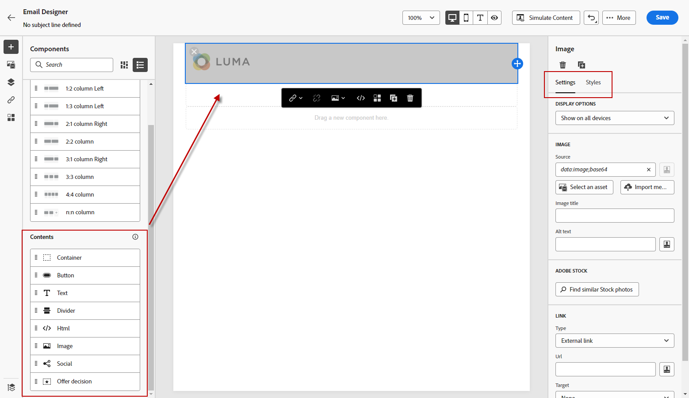

# 从零开始 {#content-from-scratch}

>[!CONTEXTUALHELP]
>id="ac_structure_components_email"
>title="关于结构组件"
>abstract="结构组件定义电子邮件的版面。"

>[!CONTEXTUALHELP]
>id="ac_structure_components_landing_page"
>title="关于结构组件"
>abstract="结构组件定义登陆页面的版面。"

>[!CONTEXTUALHELP]
>id="ac_structure_components_fragment"
>title="关于结构组件"
>abstract="结构组件定义片段的版面。"

>[!CONTEXTUALHELP]
>id="ac_structure_components_template"
>title="关于结构组件"
>abstract="结构组件定义模板的版面。"

>[!CONTEXTUALHELP]
>id="ac_edition_columns_email"
>title="定义电子邮件列"
>abstract="使用电子邮件设计器，您可以通过定义列结构来轻松定义电子邮件的版面。"

>[!CONTEXTUALHELP]
>id="ac_edition_columns_landing_page"
>title="定义登陆页面列"
>abstract="使用电子邮件设计器，您可以通过定义列结构来轻松定义登陆页面的版面。"

>[!CONTEXTUALHELP]
>id="ac_edition_columns_fragment"
>title="定义片段列"
>abstract="使用电子邮件设计器，您可以通过定义列结构来轻松定义片段的版面。"

>[!CONTEXTUALHELP]
>id="ac_edition_columns_template"
>title="定义模板列"
>abstract="使用电子邮件设计器，您可以通过定义列结构来轻松定义模板的版面。"

通过Email Designer，可轻松定义电子邮件的结构。 通过通过简单的拖放操作添加和移动结构元素，您可以在几秒内设计电子邮件的形状。

要开始构建电子邮件内容，请执行以下步骤：

1. 从Email Designer主页中，选择 **[!UICONTROL 从头开始设计]** 选项。

   

1. 通过拖放开始设计电子邮件内容 **[!UICONTROL 结构部件]** 到画布中以定义电子邮件的布局。

   >[!NOTE]
   >
   >堆叠列与所有电子邮件程序不兼容。 不支持时，不会堆叠列。

   <!--Once placed in the email, you cannot move nor remove your components unless there is already a content component or a fragment placed inside. This is not true in AJO - TBC?-->

1. 添加任意数量的 **[!UICONTROL 结构部件]** 根据需要，在右侧的专用窗格中编辑其设置。

   

   选择 **[!UICONTROL n:n列]** 组件来定义所选的列数（在3到10之间）。 您还可以通过在每列底部移动箭头来定义每列的宽度。

   

   >[!NOTE]
   >
   >每个列大小不能低于结构组件总宽度的10%。 无法删除不为空的列。

1. 展开 **[!UICONTROL 内容组件]** ，并将所需数量的元素添加到一个或多个结构组件中。 [了解有关内容组件的更多信息](content-components.md)

1. 可使用 **[!UICONTROL 组件设置]** 窗格。 例如，您可以更改每个组件的文本样式、内边距或边距。 [了解有关对齐和填充的更多信息](alignment-and-padding.md)

   

1. 从 **[!UICONTROL 资产选取器]**，您可以直接选择存储在 **[!UICONTROL 资产库]**. [了解有关资产管理的更多信息](assets-essentials.md)

   双击包含您的资产的文件夹。 将它们拖放到结构组件中。

   

1. 插入个性化字段以根据用户档案数据自定义电子邮件内容。 [了解有关内容个性化的更多信息](../personalization/personalize.md)

   

1. 添加动态内容以根据条件规则将内容调整为目标用户档案。 [动态内容入门](../personalization/get-started-dynamic-content.md)

   

1. 单击 **[!UICONTROL 链接]** 选项卡，以显示要跟踪的内容的所有URL。 您可以修改 **[!UICONTROL 跟踪类型]** 或 **[!UICONTROL 标签]** 添加 **[!UICONTROL 标记]** （如果需要）。 [了解有关链接和消息跟踪的更多信息](message-tracking.md)

   

1. 如果需要，您可以通过单击 **[!UICONTROL 切换到代码编辑器]** 中。 [了解有关代码编辑器的更多信息](code-content.md)

   

   >[!CAUTION]
   >
   >切换到代码编辑器后，您将无法还原到此电子邮件的可视设计器。

1. 内容准备就绪后，单击 **[!UICONTROL 模拟内容]** 以检查电子邮件渲染。 您可以选择桌面视图或移动设备视图。 [了解有关预览电子邮件的更多信息](preview.md)

   

1. 准备好电子邮件后，单击 **[!UICONTROL 保存]**.

