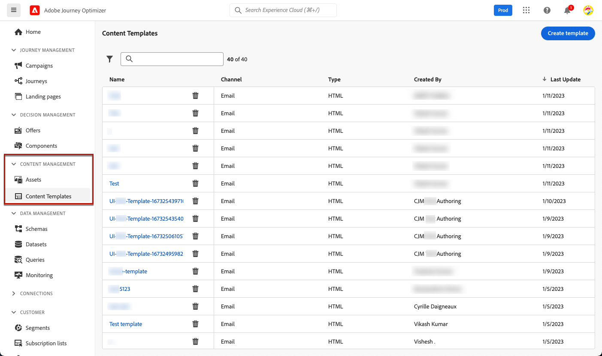
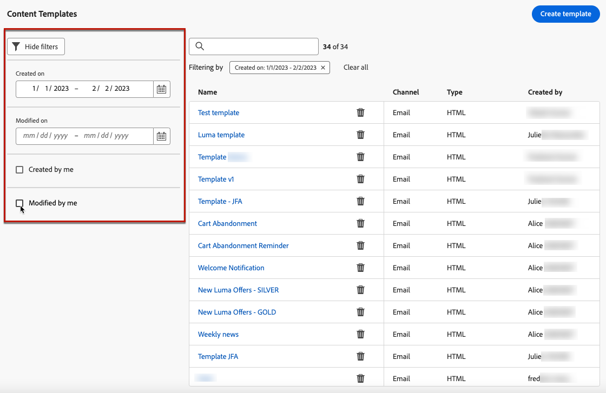
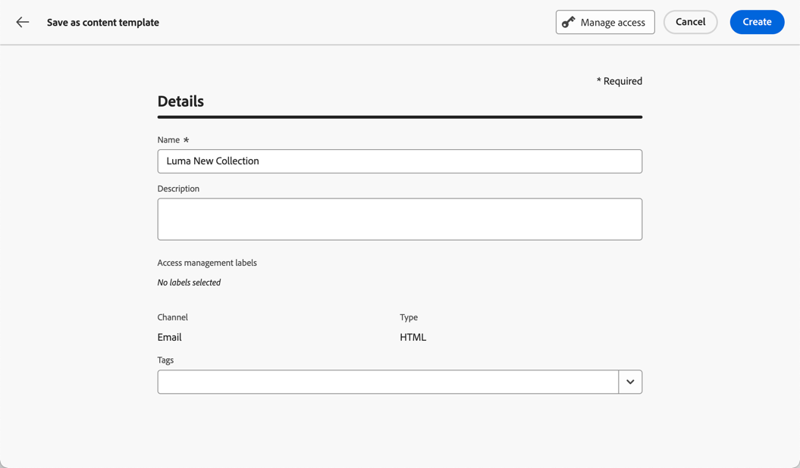

# 使用内容模板 {#content-templates}

为了加快并改进设计过程，您可以创建独立的模板，以轻松地在上下文中重复使用自定义内容 [!DNL Journey Optimizer] 营销活动和历程。

此功能使面向内容的用户能够处理营销活动或历程之外的模板。 然后，营销用户可以在自己的历程或营销策划中重用和调整这些独立内容模板。

例如，公司内的用户仅负责内容，因此无法访问营销活动或历程。 但是，此用户可创建一个电子邮件模板，贵组织的营销人员可以将该模板作为起点选择用于所有电子邮件。

您还可以使用API创建和管理内容模板。 有关详细信息，请参见 [Journey Optimizer API文档](https://developer.adobe.com/journey-optimizer-apis/references/content/).

➡️ [在本视频中了解如何创建和使用模板](#video-templates)

>[!CAUTION]
>
>要创建、编辑和删除内容模板，您必须具有 **[!DNL Manage Library Items]** 权限包含在 **[!DNL Content Library Manager]** 产品配置文件。 [了解详情](../administration/ootb-product-profiles.md#content-library-manager)

## 访问和管理模板 {#access-manage-templates}

要访问内容模板列表，请选择 **[!UICONTROL 内容管理]** > **[!UICONTROL 内容模板]** 从左侧菜单。

在当前沙盒中创建的所有模板 — 来自使用进行的历程或营销活动 [另存为模板](#save-as-template) 选项，来自 **[!UICONTROL 内容模板]** 菜单 — 显示。

您可以按创建或修改日期对内容模板进行排序。 您还可以选择仅显示您创建或修改的项目。

要编辑模板内容，请在列表中单击所需项目并选择 **[!UICONTROL 编辑内容]**.

要删除模板，请选择所需模板旁边的垃圾桶图标。

>[!NOTE]
>
>编辑或删除模板时，使用此模板创建的营销活动或历程（包括电子邮件）不会受到影响。

## 创建内容模板 {#create-content-templates}

>[!CONTEXTUALHELP]
>id="ajo_create_template"
>title="定义您自己的内容模板"
>abstract="从头开始创建独立的自定义模板，这样您的内容便可在多个历程和营销活动中重复使用。"

创建内容模板的方法有两种：

* 使用左边栏从头开始创建内容模板 **[!UICONTROL 内容模板]** 菜单。 [了解如何操作](#create-template-from-scratch)

* 在营销活动或历程中设计电子邮件时，将电子邮件内容另存为模板。 [了解如何操作](#save-as-template)

保存后，您的内容模板即可用于营销活动或历程。 无论是从头开始还是从以前的电子邮件创建的，您现在都可以在构建任何模板时使用此模板 [电子邮件](get-started-email-design.md) 范围 [!DNL Journey Optimizer]. [了解如何操作](email-templates.md)

>[!NOTE]
>
>* 无论对内容模板所做的更改是实时的还是草稿的，都不会传播到营销活动或历程。
>
>* 同样，在营销策划或历程中使用模板时，您对营销策划和历程内容进行的任何编辑都不会影响以前使用的内容模板。

### 从头开始创建模板 {#create-template-from-scratch}

要从头开始创建内容模板，请执行以下步骤。

1. 通过以下方式访问内容模板列表 **[!UICONTROL 内容管理]** > **[!UICONTROL 内容模板]** 左侧菜单。

1. 选择 **[!UICONTROL 创建模板]**.

1. 填写模板详细信息。

   

   >[!NOTE]
   >
   >当前仅 **电子邮件** 渠道和 **HTML** 类型受支持。

1. 要将自定义或核心数据使用标签分配给模板，请选择 **[!UICONTROL 管理访问权限]**. [了解有关对象级访问控制(OLAC)的更多信息](../administration/object-based-access.md).

1. 从中选择或创建Adobe Experience Platform标记 **[!UICONTROL 标记]** 用于对模板进行分类以改进搜索的字段。 [了解详情](../start/search-filter-categorize.md#tags)

1. 单击 **[!UICONTROL 创建]** 并从不同的选项中选择所需的模板设计方式：

   * [从头开始设计电子邮件](content-from-scratch.md) 通过Email Designer的界面。

   * [编码或复制粘贴原始HTML](code-content.md) 直接导入Email Designer。

   * 从文件或 .zip 文件夹[导入现有 HTML 内容](existing-content.md)。

   * 使用内置或自定义模板列表中的现有内容。 有关在电子邮件中使用内容模板的步骤，请参阅 [本节](email-templates.md).

   

1. 此 [电子邮件设计工具](get-started-email-design.md) 显示。 根据需要编辑内容，就像根据所选选项对历程或营销活动中的任何电子邮件执行操作一样。

   您可以根据需要测试内容。 [了解如何操作](#test-template)

1. 模板准备就绪后，单击 **[!UICONTROL 保存]**.

1. 如果需要，单击模板名称旁边的箭头以返回 **[!UICONTROL 详细信息]** 屏幕并编辑您的模板。

   

现在，在中构建任何电子邮件时可使用此模板 [!DNL Journey Optimizer]. [了解如何操作](email-templates.md)

### 另存为模板 {#save-as-template}

>[!CONTEXTUALHELP]
>id="ajo_messages_depecrated_inventory"
>title="了解如何迁移您的消息"
>abstract="从 2022 年 7 月 25 日开始，消息菜单取消，现在直接在历程中创作消息。如果您重用历程中的旧消息，则需要将它们另存为模板。"

设计 [电子邮件](get-started-email-design.md) 在营销活动或历程中，您可以保存电子邮件内容以供将来重复使用。 为此，请执行以下步骤。

1. 在Email Designer中，单击屏幕右上方的省略号。

1. 选择 **[!UICONTROL 另存为内容模板]** 从下拉菜单中。

   

1. 添加此模板的名称和描述。

   

1. 要将自定义或核心数据使用标签分配给模板，请选择 **[!UICONTROL 管理访问权限]**. [了解详情](../administration/object-based-access.md)。

1. 从中选择或创建Adobe Experience Platform标记 **标记** 用于对模板进行分类的字段。 [了解详情](../start/search-filter-categorize.md#tags)

1. 单击&#x200B;**[!UICONTROL 保存]**。

1. 模板将保存到 **[!UICONTROL 内容模板]** 列表，可从访问 [!DNL Journey Optimizer] 专用菜单。 它会变成一个独立的内容模板，可以像该列表中的任何其他项目一样访问、编辑和删除该模板。 [了解详情](#access-manage-templates)

现在，您可以在构建任何 [电子邮件](get-started-email-design.md) 范围 [!DNL Journey Optimizer]. [了解如何操作](email-templates.md)

>[!NOTE]
>
>对该新模板所做的任何更改都不会传播到该模板所来自的电子邮件中。 同样，在该电子邮件中编辑原始内容时，不会修改新模板。

## 测试您的内容模板 {#test-template}

您可以测试任何电子邮件内容模板的渲染，无论是从草稿还是从电子邮件创建的。 要实现此目的，请执行以下步骤。

>[!CAUTION]
>
>要模拟内容，您必须具有 **[!DNL Manage Simulate Content]** 权限包含在 **[!DNL Content Library Manager]** 产品配置文件。 [了解详情](../administration/ootb-product-profiles.md#content-library-manager)

1. 通过以下方式访问内容模板列表 **[!UICONTROL 内容管理]** > **[!UICONTROL 内容模板]** 菜单，然后选择任意模板。

1. 单击 **[!UICONTROL 编辑内容]** 从 **[!UICONTROL 模板属性]**.

1. 单击 **[!UICONTROL 模拟内容]** 并选择测试用户档案以检查电子邮件渲染。 可以选择桌面或移动视图。[了解详情](preview.md)

   

1. 您可以发送校样以测试您的内容，并在将其用于历程或营销策划之前，先获得一些内部用户的批准。

   * 要执行此操作，请单击 **[!UICONTROL 发送验证]** 按钮并按照中所述的步骤操作。 [本节](preview.md#send-proofs).

   * 在发送校样之前，您必须选择 [电子邮件表面](../configuration/channel-surfaces.md) 将用于测试您的内容。

     

>[!CAUTION]
>
>当前在测试电子邮件内容模板时不支持跟踪，这意味着跟踪事件、UTM参数和登陆页面链接将在从模板发送的验证中无效。 要测试跟踪， [使用内容模板](email-templates.md) 在电子邮件和 [发送验证](preview.md#send-proofs).

## 操作方法视频 {#video-templates}

了解如何在中创建、编辑和使用内容模板 [!DNL Journey Optimizer].

>[!VIDEO](https://video.tv.adobe.com/v/3413743/?quality=12)
