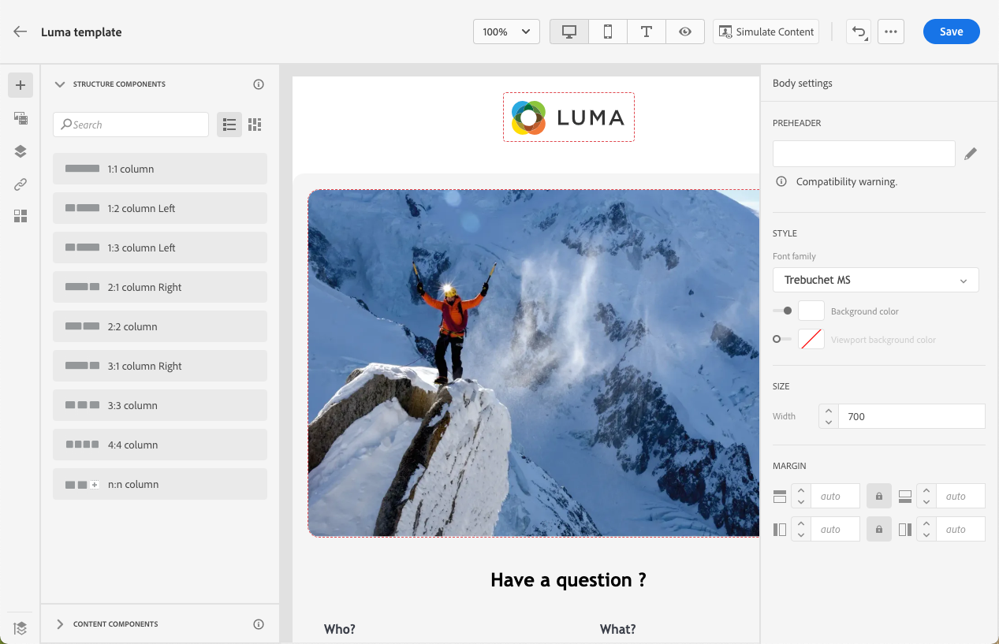

# 创建内容模板 {#content-templates}

>[!CONTEXTUALHELP]
>id="ajo_content_templates"
>title="创建内容模板"
>abstract="创建独立模板以跨历程和营销活动创建内容。"

对于经过加快和改进的设计流程，您可以创建独立模板以在 [!DNL Journey Optimizer] 营销活动和历程。

此功能允许面向内容的用户在营销活动或历程之外使用模板。 然后，营销用户可以在自己的历程或营销活动中重复使用和调整这些独立的内容模板。

>[!CAUTION]
>
>要创建、编辑和删除内容模板，您必须具有 **[!DNL Manage Library Items]** 包含的权限 **[!DNL Content Library Manager]** 产品配置文件。 [了解详情](../administration/ootb-product-profiles.md#content-library-manager)

例如，贵公司内的用户仅负责内容，因此无权访问营销活动或历程。 但是，此用户可以创建一个电子邮件模板，贵组织的营销人员将能够选择该模板以用于所有电子邮件，作为起点。

>[!NOTE]
>
>* 对内容模板所做的更改不会传播到营销活动或历程，无论这些更改是实时模板还是草稿模板。
>
>* 同样，当在营销活动或历程中使用模板时，您对营销活动和历程内容所做的任何编辑都不会影响以前使用的内容模板。

➡️ [在此视频中了解如何创建和使用模板](#video-templates)

要创建内容模板，请执行以下步骤。

1. 要访问内容模板列表，请选择 **[!UICONTROL 内容管理]** > **[!UICONTROL 内容模板]** 菜单中。

   

1. 在当前沙盒中创建的所有模板 — 历程、营销策划或 **[!UICONTROL 内容模板]** 菜单 — 显示。

   >[!NOTE]
   >
   >您可以按创建或修改日期对内容模板进行排序。

1. 选择 **[!UICONTROL 创建模板]**.

1. 填写模板详细信息。

   

   >[!NOTE]
   >
   >当前仅 **电子邮件** 渠道和 **HTML** 类型受支持。

1. 要为模板分配自定义或核心数据使用标签，请选择 **[!UICONTROL 管理访问权限]**. [了解有关对象级别访问控制(OLAC)的更多信息](../administration/object-based-access.md).

1. 单击 **[!UICONTROL 创建]** 并从以下选项中选择设计电子邮件的方式：

   * **[!UICONTROL 从头开始设计]**
   * **[!UICONTROL 编码您自己的]**
   * **[!UICONTROL 导入HTML]**
   * **[!UICONTROL 选择设计模板]**

   

   >[!NOTE]
   >
   >如果选择模板，则可以选择 **[!UICONTROL 示例模板]**，它们是现成的电子邮件模板，以及 **[!UICONTROL 保存的模板]**，这些是从历程、营销策划或从 **[!UICONTROL 内容模板]** 菜单。 [了解详情](email-templates.md#save-as-template)

1. 此时会显示Email Designer。 根据需要编辑内容，与根据您选择的选项对历程或营销策划内的任何电子邮件执行的操作相同：

   * [从头开始设计电子邮件](content-from-scratch.md) 通过设计人员的界面并利用 [Adobe Experience Manager Assets Essentials](assets-essentials.md).

   * [代码或复制粘贴原始HTML](code-content.md) 直接导入Email Designer。

   * [导入现有HTML内容](existing-content.md) 文件或.zip文件夹中。

   * [使用现有内容](email-templates.md) 从内置或自定义模板列表。

   

1. 单击 **[!UICONTROL 模拟内容]** 以检查电子邮件渲染。 您可以选择桌面视图或移动设备视图。 [了解详情](preview.md)

   >[!CAUTION]
   >
   >要模拟内容，您必须具有 **[!DNL Manage Simulate Content]** 包含的权限 **[!DNL Content Library Manager]** 产品配置文件。 [了解详情](../administration/ootb-product-profiles.md#content-library-manager)

   

1. 您可以发送校样以测试内容，并在历程或营销策划中使用之前，先获得某些内部用户的批准。

   * 要执行此操作，请单击 **[!UICONTROL 发送校样]** 按钮，并按照 [此部分](preview.md#send-proofs).

   * 在发送校样之前，您必须选择 [电子邮件界面](../configuration/channel-surfaces.md) 用于测试内容。

      

1. 模板准备就绪后，单击 **[!UICONTROL 保存]**.

1. 如果需要，单击模板名称旁边的箭头可返回到 **[!UICONTROL 详细信息]** 并编辑模板。

   

1. 现在，您可以在构建任何 [电子邮件](get-started-email-design.md) within [!DNL Journey Optimizer]. 了解详情 [使用保存的模板](email-templates.md#use-saved-template).

   

## 操作方法视频{#video-templates}

了解如何在 [!DNL Journey Optimizer].

>[!VIDEO](https://video.tv.adobe.com/v/3413743/?quality=12)