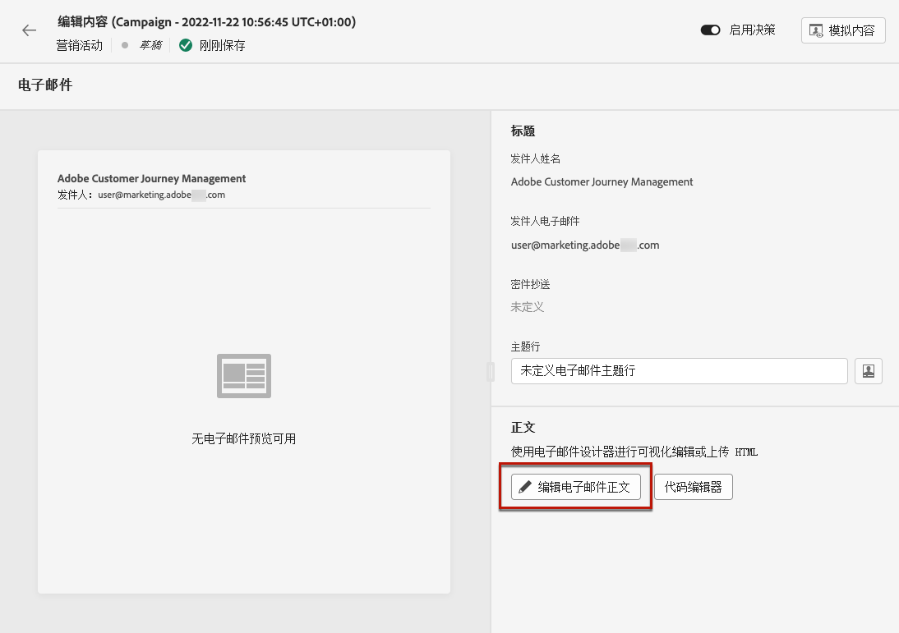
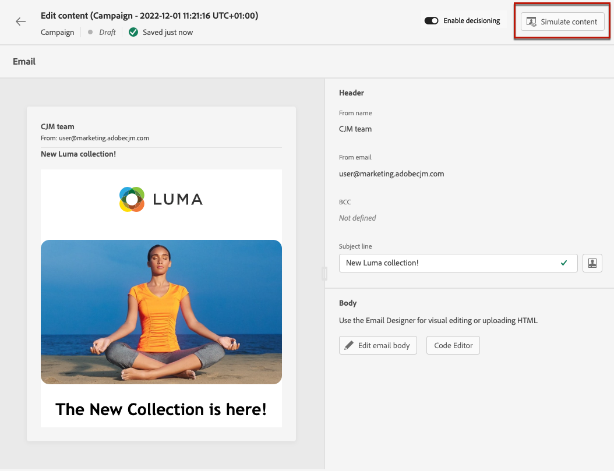

# 创建电子邮件 {#create-email}

>[!CONTEXTUALHELP]
>id="ajo_message_email"
>title="电子邮件创建"
>abstract="只需三个简单的步骤即可定义您的电子邮件参数。"

在中创建电子邮件 [!DNL Journey Optimizer]，请按照以下步骤操作。

## 在历程或营销策划中创建电子邮件 {#create-email-journey-campaign}

添加 **[!UICONTROL 电子邮件]** 向历程或营销策划执行操作，并根据您的具体情况执行以下步骤。

>[!BEGINTABS]

>[!TAB 向历程添加电子邮件]

1. 打开您的历程，然后拖放 **[!UICONTROL 电子邮件]** 中的活动 **[!UICONTROL 操作]** 面板的部分。

1. 提供有关消息的基本信息（标签、描述、类别）。

1. 选择 [电子邮件表面](email-settings.md) 以使用。

   

   默认情况下，该字段会预填充为用户用于该渠道的最后一个表面。

>[!NOTE]
>
>如果您从历程发送电子邮件，则可以利用Adobe Journey Optimizer的发送时间优化功能，根据历史打开率和点击率预测发送消息的最佳时间，从而最大限度地提高参与度。 [了解如何使用发送时间优化](../building-journeys/journeys-message.md#send-time-optimization)

有关如何配置旅程的更多信息，请参阅 [此页面](../building-journeys/journey-gs.md).

>[!TAB 向营销活动添加电子邮件]

1. 创建新的计划或API触发的营销活动，然后选择 **[!UICONTROL 电子邮件]** 作为您的操作。

1. 选择 [电子邮件表面](email-settings.md) 以使用。

   

1. 单击&#x200B;**[!UICONTROL 创建]**。

1. 完成相应步骤以创建电子邮件营销活动，如营销活动属性， [受众](../audience/about-audiences.md)、和 [计划](../campaigns/create-campaign.md#schedule).

   

<!--
From the **[!UICONTROL Action]** section, specify if you want to track how your recipients react to your delivery: you can track email opens, and/or clicks on links and buttons in your email.

-->

有关如何配置营销活动的更多信息，请参阅 [此页面](../campaigns/get-started-with-campaigns.md).

>[!ENDTABS]

## 定义您的电子邮件内容 {#define-email-content}

<!-- update the quarry component with right ID value-->

>[!CONTEXTUALHELP]
>id="test_id"
>title="配置电子邮件内容"
>abstract="创建电子邮件的内容。定义其主题，然后利用电子邮件设计器构建和个性化电子邮件正文。"

1. 在历程或营销策划配置屏幕中，单击 **[!UICONTROL 编辑内容]** 按钮以配置电子邮件内容。 [了解详情](get-started-email-design.md)

   

1. 在 **[!UICONTROL 页眉]** 的部分 **[!UICONTROL 编辑内容]** 屏幕， **[!UICONTROL 发件人姓名]**， **[!UICONTROL 发件人电子邮件]** 和 **[!UICONTROL 密件抄送]** 字段来自您选择的电子邮件表面。 [了解详情](email-settings.md) <!--check if same for journey-->

   

1. 您可以添加主题行。 在相应的字段中直接键入纯文本，或使用 [表达式编辑器](../personalization/personalization-build-expressions.md) 以个性化您的主题行。

1. 单击 **[!UICONTROL 编辑电子邮件正文]** 按钮以开始使用构建您的内容 [!DNL Journey Optimizer] 电子邮件设计器。 [了解详情](get-started-email-design.md)

   

1. 如果您在营销策划中，也可以单击 **[!UICONTROL 代码编辑器]** 按钮，使用显示的弹出窗口以纯HTML编码您自己的内容。

   

   >[!NOTE]
   >
   >如果您已通过Email Designer创建或导入内容，则此内容将显示为HTML。

## 检查警报 {#check-email-alerts}

设计消息时，如果缺少关键设置，会在界面（屏幕右上方）中显示警报。

>[!NOTE]
>
>如果未看到此按钮，则表示未检测到警报。

下面列出了系统检查的设置和元素。 您还将找到有关如何调整配置以解决相应问题的信息。

可能会发生两种类型的警报：

* **警告** 请参阅相关建议和最佳实践，例如：

   * **[!UICONTROL 电子邮件正文中不存在选择退出链接]**：最佳做法是在电子邮件正文中添加退订链接。 了解如何在中配置它 [本节](../privacy/opt-out.md#opt-out-management).

     >[!NOTE]
     >
     >营销类型电子邮件必须包含选择退出链接，这对于事务型邮件不是必需的。消息类别(**[!UICONTROL 营销]** 或 **[!UICONTROL 事务性]**)定义于 [渠道表面](email-settings.md#email-type) 级别和时间 [创建消息](#create-email-journey-campaign) 旅程或营销活动中的。

   * **[!UICONTROL HTML的文本版本为空]**：别忘了定义电子邮件正文的文本版本，因为当HTML内容无法显示时，将使用该版本。 了解如何在中创建文本版本 [本节](text-version-email.md).

   * **[!UICONTROL 电子邮件正文中存在空链接]**：检查电子邮件中的所有链接是否正确。 了解如何在中管理内容和链接 [本节](content-from-scratch.md).

   * **[!UICONTROL 电子邮件大小已超出100KB的限制]**：要获得最佳投放，请确保电子邮件大小不超过100 KB。 了解如何在中编辑电子邮件内容 [本节](content-from-scratch.md).

* **错误** 阻止测试或激活历程/营销活动，只要它们未解析，例如：

   * **[!UICONTROL 缺少主题行]**：电子邮件主题行是必填项。 了解如何在中定义和个性化它 [本节](create-email.md).

  <!--HTML is empty when Amp HTML is present-->

   * **[!UICONTROL 消息的电子邮件版本为空]**：当电子邮件内容未配置时，将显示此错误。 了解如何在中设计电子邮件内容 [本节](get-started-email-design.md).

   * **[!UICONTROL 表面不存在]**：如果在创建消息后删除了所选表面，则无法使用消息。 如果出现此错误，请在消息中选择另一个曲面 **[!UICONTROL 属性]**. 在中了解有关渠道界面的更多信息 [本节](../configuration/channel-surfaces.md).

>[!CAUTION]
>
>要能够使用电子邮件测试或激活历程/营销活动，您必须解决所有 **错误** 警报。

## 预览并发送电子邮件

定义消息内容后，您可以预览该内容以控制电子邮件的呈现，并使用测试用户档案检查个性化设置。 [了解详情](preview.md)

当您的电子邮件准备就绪时，完成您的 [历程](../building-journeys/journey-gs.md) 或 [营销活动](../campaigns/create-campaign.md)，并激活它以发送消息。

>[!NOTE]
>
>要通过电子邮件打开和/或交互跟踪收件人的行为，请确保提供的专用选项 **[!UICONTROL 跟踪]** 在历程的已启用部分 [电子邮件活动](../building-journeys/journeys-message.md) 或在电子邮件中 [营销活动](../campaigns/create-campaign.md).<!--to move?-->

<!--

## Define your email content {#email-content}

Use [!DNL Journey Optimizer] Email Designer to [design your email from scratch](../email/content-from-scratch.md). If you have an existing content, you can [import it in the Email Designer](../email/existing-content.md), or [code your own content](../email/code-content.md) in [!DNL Journey Optimizer]. 

[!DNL Journey Optimizer] comes with a set of [built-in templates](email-templates.md) to help you start. Any email can also be saved as a template.

Use [!DNL Journey Optimizer] Expression editor to personalize your messages with profiles' data. For more on personalization, refer to [this section](../personalization/personalize.md).

Adapt the content of your messages to the targeted profiles by using [!DNL Journey Optimizer] dynamic content capabilities. [Get started with dynamic content](../personalization/get-started-dynamic-content.md)

## Email tracking {#email-tracking}

If you want to track the behavior of your recipients through openings and/or clicks on links, enable the following options: **[!UICONTROL Email opens]** and **[!UICONTROL Click on email]**. 

Learn more about tracking in [this section](message-tracking.md).

## Validate your email content {#email-content-validate}

Control the rendering of your email, and check personalization settings with test profiles, using the preview section on the left-hand side. For more on this, refer to [this section](preview.md).

You must also check alerts in the upper section of the editor.  Some of them are simple warnings, but others can prevent you from using the message. 

-->

