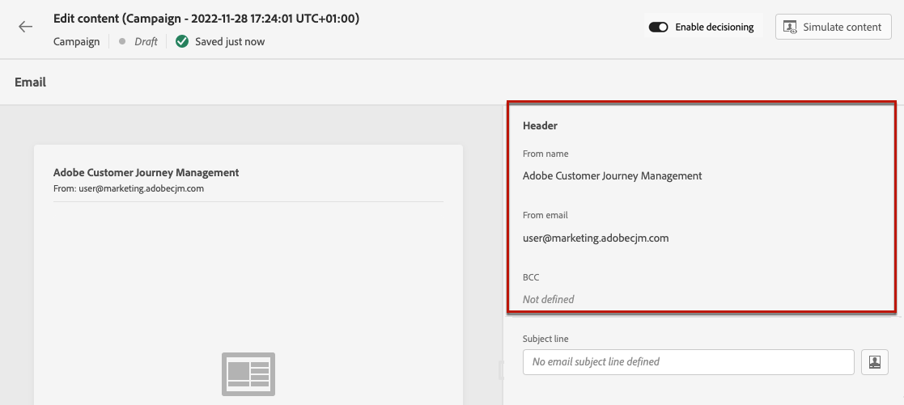

# 创建电子邮件 {#create-email}

>[!CONTEXTUALHELP]
>id="ajo_message_email"
>title="创建电子邮件"
>abstract="定义电子邮件主题行，然后打开电子邮件设计器以创建电子邮件的内容。"

## 添加电子邮件操作 {#email-action}

要在[!DNL Journey Optimizer]中创建电子邮件，请将&#x200B;**[!UICONTROL 电子邮件]**&#x200B;操作添加到历程或营销策划。 然后，根据您的情况执行以下步骤。

>[!BEGINTABS]

>[!TAB 向历程添加电子邮件]

1. 打开您的历程，然后从调色板的&#x200B;**[!UICONTROL 操作]**&#x200B;部分拖放&#x200B;**[!UICONTROL 电子邮件]**&#x200B;活动。

1. 提供有关消息的基本信息（标签、描述、类别）。

1. 选择或创建[电子邮件配置](email-settings.md)。

   

   默认情况下，该字段会预填充用户用于该渠道的最后一个配置。

>[!NOTE]
>
>您可以使用发送时间优化选项根据历史打开率和点击率预测发送消息的最佳时间，以最大化参与度。 [了解如何使用发送时间优化](../building-journeys/send-time-optimization.md)

有关如何配置历程的详细信息，请参阅[此页面](../building-journeys/journey-gs.md)。

>[!TAB 向营销活动添加电子邮件]

1. 创建新的计划活动或API触发的活动，并选择&#x200B;**[!UICONTROL 电子邮件]**&#x200B;作为您的操作。

1. 完成这些步骤以创建电子邮件营销活动，如营销活动属性、[受众](../audience/about-audiences.md)和[计划](../campaigns/create-campaign.md#schedule)。

   

1. 选择&#x200B;**[!UICONTROL 电子邮件]**&#x200B;操作。

1. 选择或创建电子邮件配置。 [了解详情](email-settings.md)

   

<!--
From the **[!UICONTROL Action]** section, specify if you want to track how your recipients react to your delivery: you can track email opens, and/or clicks on links and buttons in your email.

-->

有关如何配置营销活动的详细信息，请参阅[此页面](../campaigns/get-started-with-campaigns.md)。

>[!ENDTABS]

## 定义电子邮件内容 {#define-email-content}

<!-- update the quarry component with right ID value-->

>[!CONTEXTUALHELP]
>id="test_id"
>title="配置电子邮件内容"
>abstract="创建电子邮件的内容。定义其主题，然后利用电子邮件设计器生成和个性化电子邮件正文。"

1. 在历程或营销策划配置屏幕中，单击&#x200B;**[!UICONTROL 编辑内容]**&#x200B;按钮以配置电子邮件内容。 [了解详情](get-started-email-design.md)

   

   在&#x200B;**[!UICONTROL 编辑内容]**&#x200B;屏幕的&#x200B;**[!UICONTROL 标头]**&#x200B;部分中，**[!UICONTROL 发件人姓名]**、**[!UICONTROL 发件人电子邮件]**&#x200B;和&#x200B;**[!UICONTROL 密件抄送]**&#x200B;字段是在您选择的电子邮件配置中配置的。 [了解详情](email-settings.md) <!--check if same for journey-->

   

1. 为消息添加主题行。 要使用个性化编辑器配置和个性化主题行，请单击&#x200B;**[!UICONTROL 打开个性化对话框]**&#x200B;图标。 [了解详情](../personalization/personalization-build-expressions.md)

   >[!NOTE]
   >
   >* 主题行是必填的。
   >
   >* 主题行不得包含换行符。

1. 单击&#x200B;**[!UICONTROL 编辑电子邮件正文]**&#x200B;按钮可访问电子邮件Designer并开始构建内容。 [了解详情](get-started-email-design.md)

   

1. 如果您在营销活动中，还可以单击&#x200B;**[!UICONTROL 代码编辑器]**&#x200B;按钮，以使用显示的弹出窗口在普通HTML中编码您自己的内容。

   

   >[!NOTE]
   >
   >如果您已通过Email Designer创建或导入内容，则此内容将显示在HTML中。

## 检查警报 {#check-email-alerts}

设计消息时，如果缺少关键设置，会在界面（屏幕右上方）中显示警报。

>[!NOTE]
>
>如果未看到此按钮，则表示未检测到警报。

下面列出了系统检查的设置和元素。 您还将找到有关如何调整配置以解决相应问题的信息。

可能会发生两种类型的警报：

* **警告**&#x200B;参考推荐和最佳实践，例如：

   * **[!UICONTROL 电子邮件正文中不存在选择退出链接]**：最佳做法是在电子邮件正文中添加退订链接。 在[本节](../privacy/opt-out.md#opt-out-management)中了解如何配置它。

     >[!NOTE]
     >
     >营销类型电子邮件必须包含选择退出链接，这对于事务型邮件不是必需的。消息类别（**[!UICONTROL Marketing]**&#x200B;或&#x200B;**[!UICONTROL Transactional]**）在[渠道配置](email-settings.md#email-type)级别和[从历程或营销活动创建消息](#create-email-journey-campaign)时定义。

   * **[!UICONTROL HTML的文本版本为空]**：请不要忘记定义电子邮件正文的文本版本，因为在HTML内容无法显示时将使用该文本版本。 在[本节](text-version-email.md)中了解如何创建文本版本。

   * **[!UICONTROL 电子邮件正文中存在空链接]**：检查电子邮件中的所有链接是否正确。 在[本节](content-from-scratch.md)中了解如何管理内容和链接。

   * **[!UICONTROL 电子邮件大小已超出100KB的限制]**：要获得最佳投放，请确保电子邮件大小不超过100KB。 在[本节](content-from-scratch.md)中了解如何编辑电子邮件内容。

* **错误**&#x200B;会阻止您测试或激活历程/营销活动，前提是这些错误未解决，例如：

   * **[!UICONTROL 主题行缺失]**：电子邮件主题行是必需的。 在[本节](create-email.md)中了解如何定义和个性化它。

  <!--HTML is empty when Amp HTML is present-->

   * **[!UICONTROL 邮件的电子邮件版本为空]**：当尚未配置电子邮件内容时，将显示此错误。 在[本节](get-started-email-design.md)中了解如何设计电子邮件内容。

   * **[!UICONTROL 配置不存在]**：如果在创建消息后删除了您选择的配置，则无法使用消息。 如果出现此错误，请在消息&#x200B;**[!UICONTROL 属性]**&#x200B;中选择其他配置。 在[本节](../configuration/channel-surfaces.md)中了解有关渠道配置的更多信息。

>[!CAUTION]
>
>若要能够使用电子邮件测试或激活历程/营销活动，您必须解决所有&#x200B;**错误**&#x200B;警报。

## 检查并发送电子邮件

定义消息内容后，您可以使用测试用户档案进行预览、发送校样并控制它在常用桌面、移动和基于Web的客户端中的呈现。 如果插入个性化内容，则可以使用测试用户档案数据检查此内容在消息中的显示方式。

>[!NOTE]
>
>除了测试用户档案之外，[!DNL Journey optimizer]还允许您测试内容的不同变体，方法是预览内容并使用从CSV/JSON文件上传或手动添加的示例输入数据发送校样。 [了解如何使用示例输入数据测试内容](../test-approve/simulate-sample-input.md)

为此，请单击&#x200B;**[!UICONTROL 模拟内容]**，然后添加测试用户档案以使用测试用户档案数据检查您的消息。

有关如何选择测试用户档案和预览内容的详细信息，请参阅[内容管理](../content-management/preview-test.md)部分。

当电子邮件准备就绪时，请完成[历程](../building-journeys/journey-gs.md)或[营销活动](../campaigns/create-campaign.md)的配置，并激活它以发送消息。

>[!NOTE]
>
>要通过电子邮件打开和/或交互跟踪收件人的行为，请确保在历程的[电子邮件活动](../building-journeys/journeys-message.md)或电子邮件[营销活动](../campaigns/create-campaign.md).<!--to move?-->中启用了&#x200B;**[!UICONTROL 跟踪]**&#x200B;部分中的专用选项

<!--

## Define your email content {#email-content}

Use [!DNL Journey Optimizer] Email Designer to [design your email from scratch](../email/content-from-scratch.md). If you have an existing content, you can [import it in the Email Designer](../email/existing-content.md), or [code your own content](../email/code-content.md) in [!DNL Journey Optimizer]. 

[!DNL Journey Optimizer] comes with a set of [built-in templates](email-templates.md) to help you start. Any email can also be saved as a template.

Use [!DNL Journey Optimizer] personalization editor to personalize your messages with profiles' data. For more on personalization, refer to [this section](../personalization/personalize.md).

Adapt the content of your messages to the targeted profiles by using [!DNL Journey Optimizer] dynamic content capabilities. [Get started with dynamic content](../personalization/get-started-dynamic-content.md)

## Email tracking {#email-tracking}

If you want to track the behavior of your recipients through openings and/or clicks on links, enable the following options: **[!UICONTROL Email opens]** and **[!UICONTROL Click on email]**. 

Learn more about tracking in [this section](message-tracking.md).

## Validate your email content {#email-content-validate}

Control the rendering of your email, and check personalization settings with test profiles, using the preview section on the left-hand side. For more on this, refer to [this section](preview.md).

You must also check alerts in the upper section of the editor.  Some of them are simple warnings, but others can prevent you from using the message. 

-->

