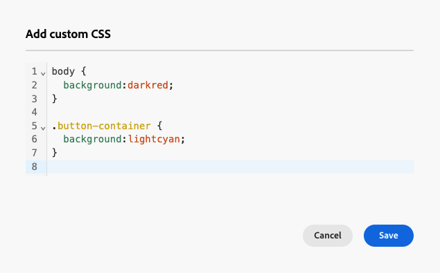

# 为电子邮件内容添加自定义 CSS {#email-metadata}

>[!CONTEXTUALHELP]
>id="ac_edition_css"
>title="输入您的自定义 CSS"
>abstract="为了实现更高的灵活性和对内容外观的精细控制，您可以在 Email Designer 中直接添加自定义 CSS，从而应用高级且具体的样式设置。"

在设计电子邮件时，您可以直接在[!DNL Journey Optimizer] [电子邮件Designer](get-started-email-design.md)中添加自己的自定义CSS。 此功能使您能够应用高级和特定的样式，从而更加灵活地控制内容的外观。

## 定义自定义CSS {#define-custom-css}

要向电子邮件内容添加自定义CSS，请执行以下步骤。

1. 通过添加至少一个[组件](content-components.md)，确保在电子邮件Designer中定义了一些内容。

1. 从左侧的&#x200B;**[!UICONTROL 导航树]**&#x200B;或右窗格顶部选择&#x200B;**[!UICONTROL 正文]**。 **[!UICONTROL CSS样式]**&#x200B;部分将显示在右侧。

   {width="85%"}

   >[!NOTE]
   >
   >仅当编辑器中已存在内容时，**[!UICONTROL CSS样式]**&#x200B;部分才可用。

1. 单击&#x200B;**[!UICONTROL 添加自定义CSS]**&#x200B;按钮。

   >[!NOTE]
   >
   >**[!UICONTROL 添加自定义CSS]**&#x200B;按钮仅在选择&#x200B;**[!UICONTROL 正文]**&#x200B;时可用。 但是，您可以将自定义CSS样式应用于内容中的所有组件。

1. 在弹出的专用文本区域中输入CSS代码。 确保自定义CSS有效并遵循正确的语法。 [了解详情](#use-valid-css)

   {width="65%"}

   >[!NOTE]
   >
   >使用包含锁定内容[的](../content-management/content-locking.md#use)模板时，无法向内容添加自定义CSS。 按钮标签更改为&#x200B;**[!UICONTROL 查看自定义CSS]**，内容中已存在的任何自定义CSS均为只读。

1. 保存自定义CSS并检查自定义CSS是否正确应用于您的内容。 如果不是这种情况，请查看[疑难解答](#troubleshooting)部分。

   {width="85%"}

1. 如果删除所有内容，则该部分将消失，并且之前定义的自定义CSS将不再应用。

1. 将内容添加回编辑器，以使&#x200B;**[!UICONTROL CSS样式]**&#x200B;部分重新显示。 再次应用自定义CSS。

## 确保使用有效的CSS {#use-valid-css}

您可以在&#x200B;**[!UICONTROL 添加自定义CSS]**&#x200B;文本区域中输入任何有效的CSS字符串。 格式正确的CSS会立即应用于内容。

>[!CAUTION]
>
>用户负责其自定义CSS的安全性。 确保CSS不会引入漏洞或与现有内容冲突。
>
>避免使用可能无意中破坏内容布局或功能的CSS。

### 有效的CSS

以下是有效CSS的示例。

```css
.acr-component[data-component-id="form"] {
  display: flex;
  justify-content: center;
  background: none;
}

.acr-Form {
  width: 100%;
  padding: 20px 100px;
  border-spacing: 0px 8px;
  box-sizing: border-box;
  margin: 0;
}

.acr-Form .spectrum-FieldLabel {
  width: 20%;
}

.acr-Form.spectrum-Form--labelsAbove .spectrum-FieldLabel,
.acr-Form [data-form-item="checkbox"] .spectrum-FieldLabel {
  width: auto;
}

.acr-Form .spectrum-Textfield {
  width: 100%;
}

#acr-form-error,
#acr-form-confirmation {
  width: 100%;
  padding: var(--spectrum-global-dimension-static-size-500);
  display: flex;
  align-items: center;
  flex-direction: column;
  justify-content: center;
  gap: var(--spectrum-global-dimension-static-size-200);
}

.spectrum-Form-item.is-required .spectrum-FieldLabel:after{
  content: '*';
  font-size: 1.25rem;
  margin-left: 5px;
  position: absolute;
}

/* Error field placeholder */
.spectrum-HelpText {
  display: none !important;
}

.spectrum-HelpText.is-invalid,
.is-invalid ~ .spectrum-HelpText {
  display: flex !important;
}
```

```css
@media only screen and (min-width: 600px) {
  .acr-paragraph-1 {
    width: 100% !important;
  }
}
```

### CSS无效

如果输入的CSS无效，则会显示一条错误消息，指示CSS无法保存。 以下是无效CSS的示例。

不接受使用`<style>`标记：

```html
<style type="text/css">
  .acr-Form {
    width: 100%;
    padding: 20px 100px;
    border-spacing: 0px 8px;
    box-sizing: border-box;
    margin: 0;
  }
</style>
```

不接受无效语法，例如缺少大括号：

```css
body {
  background: red;
```

## 技术实施 {#implementation}

您的自定义CSS已添加至`<head>`部分的末尾，作为具有`<style>`属性的`data-name="global-custom"`标记的一部分，如下面的示例所示。 这可确保将自定义样式全局应用于内容。

```html
<!DOCTYPE html>
<html>
  <head>
    <meta charset="utf-8">
    <meta name="content-version" content="3.3.31">
    <meta name="x-apple-disable-message-reformatting">
    <meta name="viewport" content="width=device-width,initial-scale=1.0">
    <style data-name="default" type="text/css">
      td { padding: 0; }
      th { font-weight: normal; }
    </style>
    <style data-name="grid" type="text/css">
      .acr-grid-table { width: 100%; }
    </style>
    <style data-name="acr-theme" type="text/css" data-theme="default" data-variant="0">
      body { margin: 0; font-family: Arial; }
    </style>
    <style data-name="media-default-max-width-500px" type="text/css">
      @media screen and (max-width: 500px) {
        body { width: 100% !important; }
      }
    </style>
    <style data-name="global-custom" type="text/css">
      /* Add you custom CSS here */
    </style>
  </head>
  <body>
    <!-- Minimal content -->
  </body>
</html>
```

电子邮件Designer的&#x200B;**[!UICONTROL 设置]**&#x200B;窗格未解释或验证自定义CSS。 它是完全独立的，只能通过&#x200B;**[!UICONTROL 添加自定义CSS]**&#x200B;选项进行修改。

### 导入的内容

如果要对导入到Email Designer中的内容使用自定义CSS，请考虑以下事项：

* 如果导入包括CSS的外部HTML内容，除非转换该内容，否则它将处于&#x200B;**[!UICONTROL 兼容模式]**，其中&#x200B;**[!UICONTROL CSS样式]**&#x200B;部分不可用。 [了解有关导入现有内容的更多信息](existing-content.md)

* 如果导入使用Email Designer创建的内容（包括通过&#x200B;**[!UICONTROL 添加自定义CSS]**&#x200B;选项应用的CSS），则之前应用的CSS将可通过同一选项显示和编辑。

<!--
* If importing content created with the Email Designer with CSS applied externally, the CSS code previously applied cannot be accessed within the **[!UICONTROL Add custom CSS]** pop-up window, but you can still override it with new custom CSS.-->

## 故障排除 {#troubleshooting}

如果未应用您的自定义CSS，请考虑以下选项。

* 确保CSS有效并且没有语法错误（例如缺少大括号、属性名称不正确）。 [了解如何操作](#use-valid-css)

* 确保将您的CSS添加到具有`<style>`属性的`data-name="global-custom"`标记中。

* 检查`global-custom`样式标记是否将属性`data-disabled`设置为`true`。 如果是这种情况，则不会应用自定义CSS。 例如：

  ```html
  <style data-name="global-custom" type="text/css" data-disabled="true"> body: { color: red; } </style>
  ```

* 确保您的CSS不会被其他CSS规则覆盖，包括应用于内容的任何[主题](apply-email-themes.md)。

   * 使用浏览器开发人员工具检查内容，并验证CSS是否针对正确的选择器。

   * 考虑将`!important`添加到声明以确保它们优先。 例如：

     ```css
     .acr-Form {
       background: red !important;
     }
     ```
