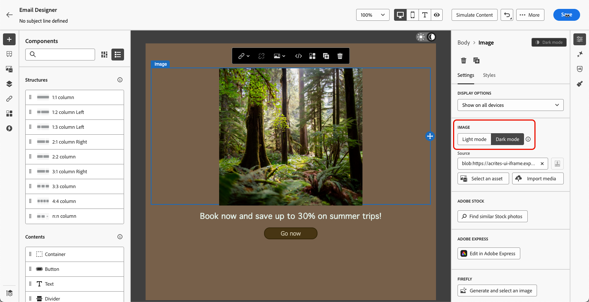

# 管理深色模式内容 {#dark-mode}

>[!CONTEXTUALHELP]
>id="ac_edition_darkmode"
>title="切换到深色模式"
>abstract="切换到深色模式，您可以在其中预览其呈现方式，并定义特定的自定义设置。  最终渲染取决于收件人的电子邮件客户端。 请注意，所有电子邮件客户端均不支持自定义深色模式。"

>[!CONTEXTUALHELP]
>id="ac_edition_darkmode_preview"
>title="切换到深色模式"
>abstract="切换至深色模式，以预览内容在支持深色模式的电子邮件客户端中的呈现效果。 最终渲染取决于收件人的电子邮件客户端。 请注意，所有电子邮件客户端均不支持深色模式。"

>[!AVAILABILITY]
>
>此功能目前为测试版本，仅供测试版客户使用。<!--To join the beta program, contact your Adobe representative.-->

设计电子邮件时，[!DNL Journey Optimizer] [电子邮件Designer](get-started-email-design.md)允许您切换到&#x200B;**[!UICONTROL 深色模式]**&#x200B;视图。

在此<!--Email Designer -->深色模式视图中，您还可以定义特定的自定义设置，支持此功能的电子邮件客户端在其深色模式打开时将显示这些设置。

<!--When designing your emails, the Journey Optimizer Email Designer allows you to switch to Dark mode where you can define specific custom settings. When dark mode is on, the supporting email clients will display the settings that you defined for this mode.-->

## 什么是深色模式？ {#what-is-dark-mode}

在各种电子邮件客户端中呈现深色模式的方式比较复杂。 让我们先定义深色模式。

深色模式允许支持此功能的电子邮件客户端和应用程序为文本、按钮和其他UI元素显示具有更暗背景和更浅颜色的电子邮件。 它可减少眼睛疲劳、节省电池续航时间，并改善在弱光环境中的可读性，以获得更舒适的观看体验。

<!--Dark Mode uses a dark color palette with light text and UI elements to reduce eye strain, save battery life, and improve readability in low-light environments.-->

作为主要操作系统和应用程序<!-- (Apple Mail, Gmail, Outlook, Twitter, Slack)-->中的一种增长趋势，它已成为现代电子邮件设计中的一个重要考虑因素，以确保内容清晰易读，并且对所有用户都具有吸引力。

## 护栏 {#guardrails}

必须谨慎考虑暗模式渲染的期望，因为不同的电子邮件客户端应用暗模式的方式可能大不相同。

<!--The dark mode final rendering depends on the recipient's email client. It is not possible to guarantee that your email will look the same in dark mode across all devices.-->

在[!DNL Journey Optimizer]电子邮件Designer中使用深色模式之前，了解主要电子邮件客户端如何处理该模式至关重要。 有三种情况可以区分：

<!--
* Check out the list of [email clients supporting dark mode](https://www.caniemail.com/search/?s=dark){target="_blank"}

* Learn more on Dark mode in this [Litmus blog post](https://www.litmus.com/blog/the-ultimate-guide-to-dark-mode-for-email-marketers){target="_blank"}
-->

### 客户端不支持深色模式 {#not-supporting}

某些电子邮件客户端根本不支持此功能，例如：

* Yahoo！邮件
* AOL

无论您是否在Email Designer中定义深色模式自定义设置，这些电子邮件客户端都不会显示任何深色模式渲染。<!--Regardless of whether the interface is in light or dark mode, your email will render the same.-->

### 客户端应用自己的深色模式 {#default-support}

某些电子邮件客户端会系统地将其自己的默认深色模式应用于收到的所有电子邮件。 颜色、背景、图像等 使用特定于电子邮件客户端的深色模式设置自动进行调整，这意味着无法进行外部修改。

<!--It is important to note that less than 25% of email clients offer customization options for dark mode. Clients such as Gmail implement their own dark mode rendering, which is not subject to external modification.-->

例如，这些客户端包括：

* Gmail(桌面Webmail、iOS、Android、Mobile Webmail)
* Outlook Windows
* Outlook Windows Mail

在这种情况下，如果您在电子邮件Designer中定义自定义深色模式设置，则电子邮件客户端设置会覆盖这些设置。

请务必了解一点，这些电子邮件客户端确实可以处理深色模式，但不会呈现您特定的深色模式设计。

<!--In this case, the custom settings that you defined in the Email Designer cannot be rendered.-->

<!--Some visual changes may also be caused by the email app or device overriding the original design.-->

### 支持自定义深色模式的客户端 {#custom-support}

其他电子邮件客户端提供了使用`@media (prefers-color-scheme: dark)`查询呈现自定义深色模式的选项，该查询是[!DNL Journey Optimizer]电子邮件Designer使用的方法。

以下是处理此选项的主要客户端列表：

* Apple Mail macOS
* Apple Mail iOS
* Outlook macOS
* Outlook.com
* Outlook iOS
* Outlook Android

在这种情况下，应显示您在电子邮件Designer中定义的特定设置。

>[!NOTE]
>
>在[本节](#define-custom-dark-mode)中了解如何使用Email Designer定义自定义深色模式设置。

但是，可能会根据每个电子邮件客户端应用某些限制。 例如，如果电子邮件内容中存在图像，则某些客户端(例如Apple Mail 16 (macOs 13))将不会生成深色模式。

为了获得最佳结果，请使用您定位的电子邮件客户端测试您的内容。 若要查看与每个客户端的最终结果尽可能接近的模拟，请使用Email Designer中的[电子邮件渲染](../content-management/rendering.md)选项。

## 电子邮件设计器中的深色模式 {#dark-mode-email-designer}

在Email Designer中，当涉及到深色模式时，需要考虑两个方面：

* 您可以预览默认深色模式在大多数支持的电子邮件客户端中的呈现方式。 [了解详情](#preview-dark-mode)

<!--
    >[!CAUTION]
    >
    >The final rendering may vary according to the recipient's email client. To see the exact rendering for each email client, use the [Email rendering](../content-management/rendering.md) option.-->

* 如果要覆盖支持电子邮件客户端的默认设置，可以定义应用于正在编辑的电子邮件的自定义深色模式设置。 [了解详情](#define-custom-dark-mode)

<!--
    >[!WARNING]
    >
    >Not all email clients support custom dark mode. Some email clients only apply their own default dark mode for all emails that are received. In this case, the custom settings that you defined in the Email Designer cannot be rendered. [Learn more](#guardrails)-->

### 预览默认深色模式 {#preview-dark-mode}

要在Email Designer中访问深色模式并预览默认深色模式设置，请执行以下步骤。

1. 从电子邮件Designer主页中，选择&#x200B;**[!UICONTROL 从头开始设计]**&#x200B;选项。 [了解详情](content-from-scratch.md)

<!--Should work with templates and themes, NOT for LP and fragments - but TBC with eng.
    >[!NOTE]
    >
    >Currently you may not be able to switch to dark mode if you select an [email template](use-email-templates.md) or if you apply a [theme](apply-email-themes.md).-->

1. 将[结构](content-from-scratch.md)和[内容组件](content-components.md)添加到您的内容中。

1. 在中心画布的右上角，将切换开关切换到&#x200B;**[!UICONTROL 深色模式]**。

   

1. 默认深色模式预览显示。

   

默认情况下， Email Designer深色模式预览会将“全色反色”配色方案应用于除图像和图标之外的所有元素。

这意味着它可以检测包含亮元素和暗元素的区域，并将它们反转，这样浅色背景变为深色，深色文本变为浅色，而深色背景变为浅色，浅色文本变为深色。

>[!CAUTION]
>
>最终渲染可能会因收件人的电子邮件客户端而异。 若要查看尽可能接近每个电子邮件客户端最终结果的模拟，请使用[电子邮件渲染](../content-management/rendering.md)选项。

<!--This is custom dark mode:

  

Here you can see that we have applied a different background, defined another image and change the color of the text and button.-->

### 定义自定义深色模式 {#define-custom-dark-mode}

>[!CONTEXTUALHELP]
>id="ac_edition_darkmode_image"
>title="为深色模式使用特定图像"
>abstract="您可以选择另一张图像，在深色模式启用时显示。 添加深色模式的特定图像无法保证它在所有电子邮件客户端中正确呈现。 请注意，所有电子邮件客户端均不支持自定义深色模式。"

切换到&#x200B;**[!UICONTROL 深色模式]**&#x200B;后，您可以选择编辑内容的特定样式元素，这些样式元素仅在收件人的电子邮件客户端中启用深色模式时才会显示，前提是它支持该功能。

>[!WARNING]
>
>深色模式的最终渲染取决于每个电子邮件客户端，因此结果可能因不同而异。 [了解详情](#guardrails)

<!--
>[!WARNING]
>
>Not all email clients support dark mode. Moreover, some email clients only apply their own default dark mode for all emails that are received. In both cases, the custom settings that you defined in the Email Designer cannot be rendered.-->

为了利用Email Designer自定义深色模式样式，Journey Optimizer使用<!-- `@media (prefers-color-scheme: dark)` method--> `@media (prefers-color-scheme: dark)` CSS查询，可检测用户的电子邮件客户端是否设置为深色模式，并应用电子邮件中定义的深色主题设计。

要定义自定义深色模式设置，请执行以下步骤。

1. 确保切换到电子邮件Designer中的&#x200B;**[!UICONTROL 深色模式]**&#x200B;预览。 [了解如何操作](#preview-dark-mode)

1. 编辑任何样式颜色属性，如文本、背景、按钮等。

1. 您无法更改图像和图标的颜色，但只能为深色模式定义特定资产。 要执行此操作，请选择任意图像。 使用&#x200B;**[!UICONTROL 设置]**&#x200B;窗格中的专用切换开关切换到&#x200B;**[!UICONTROL 深色模式]**&#x200B;并选择其他资源。

   

   <!---->

1. 您随时可以&#x200B;**[!UICONTROL 切换到实时视图]**，以便检查您的内容在各种设备大小上呈现的方式。 从该视图中，选择屏幕顶部的深色模式切换开关以预览不同设备上内容的深色模式版本。

   {width="80%" align="center"}

   >[!CAUTION]
   >
   >实时视图是一个通用预览，用于比较呈现在各种设备大小中的外观。 最终渲染可能会因收件人的电子邮件客户端而异。

1. 对深色模式的更改感到满意后，单击&#x200B;**[!UICONTROL 模拟内容]**。

   

1. 选择&#x200B;**[!UICONTROL 渲染电子邮件]**&#x200B;并连接到您的Litmus帐户。 您可以看到各种电子邮件客户端的最终深色模式渲染。 了解有关[电子邮件渲染](../content-management/rendering.md)的更多信息。

   >[!WARNING]
   >
   >虽然模拟与电子邮件在深色模式中的显示方式非常接近，但实际呈现方式可能会因电子邮件服务提供商或设备级设置的不同而有所不同。

## 最佳实践 {#best-practices}

随着主要电子邮件客户端采用深色模式的次数增加，必须考虑您的电子邮件在浅色和深色环境中的呈现方式 — 无论您是否使用[自定义深色模式](#define-custom-dark-mode)。

深色模式可以改变颜色、背景和图像 — 有时会覆盖设计选择。 要确保可视一致性、可访问性和品牌完整性，请遵循下面列出的最佳实践。

**优化您的图像和徽标**

* 将徽标和图标保存为具有透明背景的PNG，以避免在深色模式下显示白色框。

* 避免使用带有硬编码白色或浅色背景的图像。

* 如果无法使用透明度，请将图像置于设计中的纯色背景上，以防止尴尬的颜色反转。

**观看您的背景**

* 确保文本颜色和背景颜色之间的对比度足以在浅色和深色模式下阅读。

* 避免仅依赖背景颜色处理关键内容。 某些客户端在深色模式下会覆盖背景颜色，因此请确保关键信息仍然可见。

<!--**Inline critical styles**

Inline CSS helps maintain more control over styling, as some clients strip external styles in dark mode.-->

**在深色模式下设计可访问的内容**

<!--KEEP dark mode accessibility best practices IN ONE SINGLE LOCATION - for now listed on this page.
If needed, it can be moved to the Design accessible content page:
The best practices for designing accesible content in dark mode are listed in [this section](accessible-content.md#dark-mode).-->

* 使用颜色组合，易于区分色盲人士。

* 使用中间调调色板确保与明暗背景的对比度。

* 使用具有高对比度的无障碍颜色组合以提高可读性并符合Web内容无障碍准则(WCAG)标准。 使用WebAIM的对比度检查器等工具验证颜色对比度。

* 避免使用细字体，因为它可能会影响可读性。 如果您的品牌需要细字体，请在深色模式下将其粗体。

* 跳过纯黑色的纯白色，因为它可能会导致眼睛疲劳，并且可能会被一些电子邮件客户自动翻转。

* 如果不支持深色模式，请提供可访问的回退样式。

**在深色模式环境中测试电子邮件**

* 使用Email Designer的[深色模式预览](#preview-dark-mode)，该预览使用反转的配色方案来提早发现问题。

* 使用[电子邮件渲染](../content-management/rendering.md)选项，该选项可利用Litmus在主要电子邮件客户端(Apple Mail、Gmail、Outlook)间模拟您的设计，并查看颜色和图像在深色模式下的行为。

<!--

## Email clients supporting dark mode {#supporting-email-clients}

Below is a list of the main email clients supporting dark mode using the with the `@media (prefers-color-scheme: dark)` query.

>[!NOTE]
>
>Some versions of these email clients do not support dark mode, so they are also presented in this table for the sake of clarity.

| Email clients supporting custom dark mode| Compatible versions | *Unsupported versions* |
|---------|----------|---------|
| Apple Mail macOS| 12.4, 16.0 | *10.3* |
| Apple Mail iOS | 13.0, 16.1 | *12.2* |
| Outloook macOS | 2019, 16.70, 16.80 | NA |
| Outlook.com | 2019-07, 2022-12 | NA |
| Outloook iOS | 2020-01, 2022-12 | NA |
| Outloook Android | 2023-03 | *2020-01, 2022-12* |

| Other email clients supporting custom dark mode| Compatible versions | *Unsupported versions* |
|---------|----------|---------|
| Samsung Email (Android) | 6.1 | *6.0* |
| Mozilla Thunderbird (macOS) | 68.4 | *60.8, 78.5, 91.13* |
| Fastmail (Desktop Webmail)| 2022-12 | *2021-07* |
| HEY (Desktop Webmail)| 2020-06 | *2022-12* |
| Orange Desktop Webmail| 2019-08, 2021-03, 2022-12, 2024-04 | NA |
| Orange iOS | 2022-12, 2024-04 | *2020-01* |
| Orange Android | 2024-04 | *2020-01, 2022-12* |
| LaPoste.net | 2021-08, 2022-12 | NA |
| SFR  Desktop Webmail | 2019-08, 2022-12 | NA |
| GMX (iOs and Android) | 2022-06 | NA |
| 1&1 (Desktop Webmail and Android) | 2022-06 | NA |
| WEB.DE (iOs and Android) | 2022-06 | NA |
| Free.fr | 2022-12 | NA |

>[!WARNING]
>
>The dark mode final rendering depends on each email client, so results can vary from one to another.

## Email clients not supporting dark mode {#non-supporting-email-clients}

Some email clients allow users to switch their interface to dark mode, but this setting does not affect how HTML emails are displayed.  Here is a list of those clients:

| Main email clients with their own dark mode| 
|---------|
| Gmail (Desktop Webmail, iOS, Android, Mobile Webmail) | 
| Outloook Windows |
| Outlook Windows Mail |

Other email clients do not support dark mode at all:

| Main email clients not supporting dark mode| 
|---------|
| Yahoo!Mail | 
| AOL | 

| Other mail clients not supporting dark mode| 
|---------|
| ProtonMail |
| SFR iOS |
| SFR Android | 
| GMX Desktop Webmail | 
| Mail.ru | 
| WEB.DE Desktop Webmail | 
| T-online.de |

-->