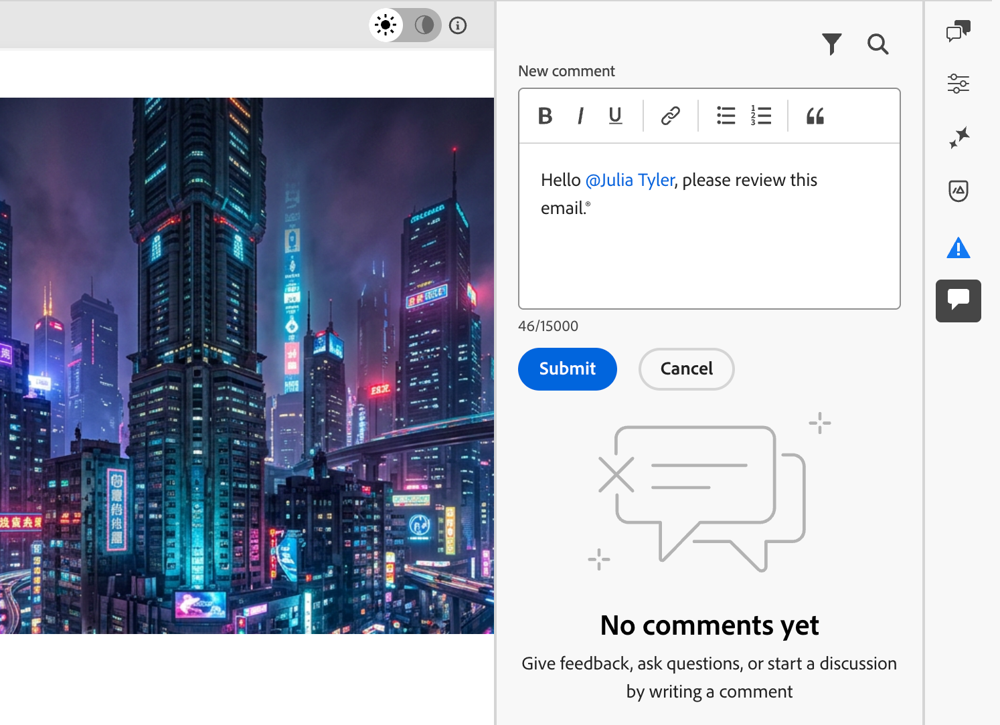

# 在Email Designer中协作处理电子邮件内容 {#email-collaboration}

>[!CONTEXTUALHELP]
>id="ajo_email_collaboration"
>title="对您的电子邮件进行协作"
>abstract="直接在Email Designer中添加评论、标记审阅者和跟踪反馈，而无需离开创作体验。"

Email Designer包括用于注释和解决的协作工具，以便营销团队可以直接在[!DNL Journey Optimizer]内无缝审查、讨论和最终确定电子邮件内容。 用户可以在Email Designer中评论、建议编辑和解决反馈，而不是通过外部工具（如聊天、电子邮件线程或电子表格）共享草稿。 使用这些工具简化工作流，减少错误，并确保在启动电子邮件之前利益相关者保持一致。

* **集中式反馈** — 在一个位置收集和跟踪所有反馈。
* **更快的审阅** — 协作者可以在创作环境中审阅电子邮件副本和资产。
* **准确性提高** — 通过使所有编辑都绑定到电子邮件本身，降低了通信错误的风险。
* **透明度** — 所有评论和解决方案均保持记录状态，以明确说明建议和实施了哪些更改。
* **上下文中的Collaboration** — 查看布局中的电子邮件正文副本、图像和call-to-action (CTA)元素。

<!--Check if like some other collaboration workflows, specific permission is required to use the collaboration tools in the Email Designer.-->

## 显示协作工具和注释 {#access-collaboration}

在Email Designer中创建、编辑或查看内容时，您可以访问&#x200B;**[!UICONTROL Collaboration]**&#x200B;面板以添加或管理电子邮件内容的注释。

单击右侧导航中的&#x200B;**[!UICONTROL Collaboration]**&#x200B;图标。

电子邮件Designer右侧导航中的{width="90%"}

## Collaboration工作流程 {#collaboration-workflow}

您可以使用协作工具遵循标准内容工作流：

1. **邀请**&#x200B;您的协作者和审阅者。
1. **审阅人**&#x200B;添加备注。
1. 阅读评论，**添加回复**&#x200B;以讨论反馈，并进行必要的编辑。
1. **审阅者或作者**&#x200B;解决评论。

### 使用协作工具的最佳实践 {#best-practices}

* 使用&#x200B;**@**&#x200B;标记，以便反馈能快速到达合适的团队成员。
* 将相关反馈分组到单个注释线程中，而不是多个分散的注释中。
* 始终在收到注释后立即将其解决，以保持工作流程干净。
* 保存最终批准的版本以供合规/审核之用。

## 邀请协作者和审阅者 {#invite-collaborators}

您可以邀请协作者和审阅人就您的电子邮件内容提供反馈，或添加任何可能与电子邮件设计工作流相关的评论。 请按照以下步骤操作。

1. 选择电子邮件的正文以输入有关电子邮件内容的一般注释。
1. 单击右侧导航中的&#x200B;**[!UICONTROL Collaboration]**&#x200B;图标。
1. 在右侧面板的顶部，输入邀请文本，以便用户进行协作并提供反馈。
1. 使用&#x200B;**@**&#x200B;符号寻址和通知用户。 这些用户会收到电子邮件和产品内[!DNL Pulse]通知。

   在符号后面输入名称的前几个字母时，弹出列表会显示匹配的用户名。 您可以在名称中输入更多字母以改善结果。

   使用@](assets/email_designer_collaboration_addresses.png){width="90%"}进行标记时，![显示匹配用户名的弹出列表

1. 选择要为通知添加的名称。 添加您希望在邀请中包括的任意数量的协作者或审阅人。

   {width="90%"}

1. 单击&#x200B;**[!UICONTROL 提交]**。

每个新评论都会启动一个跟帖，协作者可以在其中使用&#x200B;**[!UICONTROL 回复]**&#x200B;继续讨论。 与设计元素关联的每个注释/线程都进行了编号，以便您可以轻松识别其应用位置的元素。

### 组件注释 {#component-comments}

1. 选择结构或内容组件。
1. 单击工具栏中的&#x200B;**[!UICONTROL Collaboration]**&#x200B;工具。

   组件工具栏中的{width="80%"}

1. 在文本字段中输入您的评论。
1. 单击&#x200B;**[!UICONTROL 提交]**。

协作者可以单击电子邮件画布上的编号图钉图标以查看注释。

## 回复评论 {#reply-to-comment}

对于每个评论，您可以使用&#x200B;**[!UICONTROL 回复]**&#x200B;功能继续讨论或回答问题。

单击评论底部的&#x200B;**[!UICONTROL 回复]**，然后输入回复文本。 要在回复中包含当前评论的引用，请单击&#x200B;**[!UICONTROL 更多菜单]** (...)图标，然后选择&#x200B;**[!UICONTROL 引用回复]**。

{width="100%"}

## 解决评论 {#resolve-comments}

作为作者或设计者，评估审阅人的反馈并确定要进行的更改。 完成更改并满足请求后，单击&#x200B;**[!UICONTROL 更多菜单]** (...)图标，然后选择&#x200B;**[!UICONTROL 解决]**。

{width="100%"}

解析后，注释/线程将从主视图中隐藏，但可通过过滤器选项访问。

## 管理评论 {#manage-comments}

管理评论和线程以评估协作工作的状态。

### 发表评论 {#place-comment}

如果注释未与电子邮件画布上的元素关联，您可以根据需要将注释固定到元素。 单击&#x200B;**[!UICONTROL 更多菜单]** (...)图标，然后选择&#x200B;**[!UICONTROL 置入评论]**。 然后，在画布上选择设计组件。

{width="60%"}

### 删除或删除评论 {#remove-delete-comments}

您可以通过删除注释日志来清理它们。 单击&#x200B;**[!UICONTROL 更多菜单]** (...)图标，然后选择&#x200B;**[!UICONTROL 删除评论]**&#x200B;或&#x200B;**[!UICONTROL 删除]**。

* 移除注释时，该操作会将该注释与设计元素（在创建注释时选择）分离。 该评论仍然是电子邮件的评论记录的一部分。
* 删除评论时，该操作会将其从记录中永久删除。

### 已解决的评论 {#resolved-comments}

默认情况下，已解析的注释在&#x200B;**[!UICONTROL Collaboration]**&#x200B;面板中隐藏。 通过清除过滤器，您可以随时显示已解析的注释。 单击&#x200B;**[!UICONTROL 筛选器]**&#x200B;图标并清除&#x200B;**[!UICONTROL 隐藏已解析的评论]**&#x200B;复选框。

{width="60%"}

已解析的注释包括&#x200B;**[!UICONTROL Unresolve]**&#x200B;图标。 如果您确定未解析注释/线程且需要进一步更改，请单击图标以删除&#x200B;**[!UICONTROL 已解析]**&#x200B;标记。

已解析评论上的{width="60%"}
