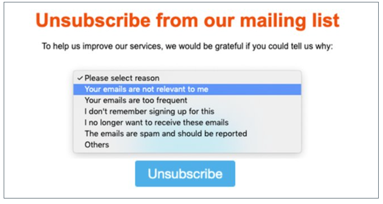
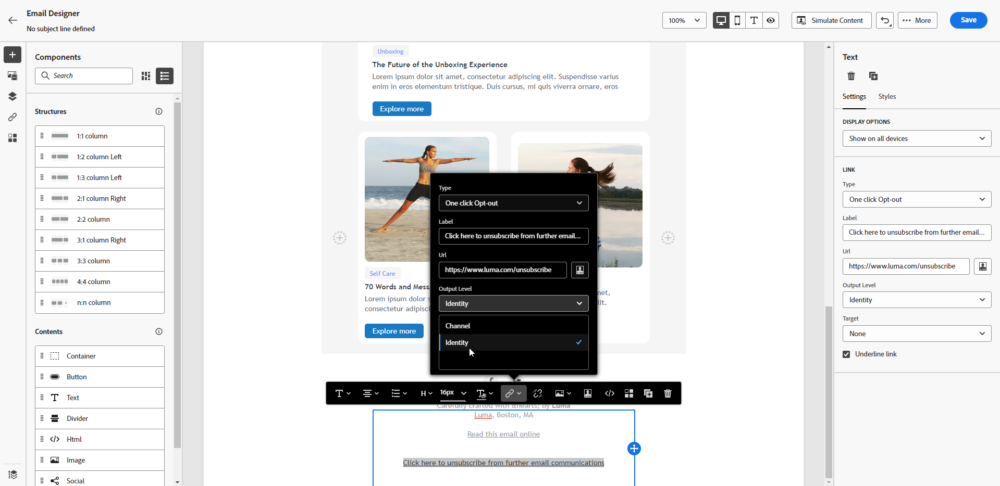

# 电子邮件选择退出管理 {#email-opt-out}

为了向收件人提供取消订阅以停止接收电子邮件通信的功能，您必须始终包含 **取消订阅链接** 发往收件人的每封电子邮件中。 [了解有关隐私和选择退出管理的更多信息](../privacy/opt-out.md)

为此，您可以：

* 插入 **链接到登陆页面** 以使用户能够取消订阅以停止接收来自您品牌的通信。 它可以是：

   * A **[!DNL Journey Optimizer]登陆页面**. [了解如何添加选择退出登陆页面](../landing-pages/lp-use-cases.md#opt-out)

   * A **外部登陆页面**. [了解如何添加外部选择退出链接](#opt-out-external-lp)

* 添加 **一键式选择退出链接** 添加到您的电子邮件内容中。 该链接可让您的收件人快速取消订阅您的通信，而无需重定向到需要确认其选择的登陆页面，从而简化取消订阅流程。 [了解如何添加一键式选择退出链接](#one-click-opt-out)

* 在电子邮件标头中添加取消订阅链接。 如果 **[!UICONTROL 列表 — 取消订阅]** 选项在渠道平面级别启用，使用Journey Optimizer发送的相应电子邮件将在电子邮件标头中包含取消订阅链接。 [了解有关电子邮件标题中选择退出的更多信息](#unsubscribe-header)

>[!NOTE]
>
>营销类型电子邮件必须包含选择退出链接，这对于事务型邮件不是必需的。消息类别(**[!UICONTROL 营销]** 或 **[!UICONTROL 事务性]**)定义于 [渠道表面](../configuration/channel-surfaces.md#email-type) 级别和创建消息时)。

## 外部选择退出 {#opt-out-external-lp}

### 添加取消订阅链接 {#add-unsubscribe-link}

您首先需要在消息中添加取消订阅链接。为此，请执行以下步骤：

1. 构建自己的退订登陆页面。

1. 在您选择的第三方系统上托管它。

1. 在历程中创建消息。

1. 在内容中选择文本，然后使用上下文工具栏[插入链接](../email/message-tracking.md#insert-links)。

   

1. 从&#x200B;**[!UICONTROL 链接类型]**&#x200B;下拉列表中选择&#x200B;**[!UICONTROL 外部选择退出/退订]**。

   

1. 在&#x200B;**[!UICONTROL 链接]**&#x200B;字段中，将链接粘贴到您的第三方登陆页面。

   

1. 单击&#x200B;**[!UICONTROL 保存]**。

### 为选择退出实施 API 调用 {#opt-out-api}

要在收件人从登陆页面提交选择时为其完成选择退出，您必须实施 **订阅API调用** 到 [Adobe Developer](https://developer.adobe.com){target="_blank"} 以更新相应用户档案的偏好设置。

此 POST 调用如下：

端点：https://platform.adobe.io/journey/imp/consent/preferences

查询参数：

* **params**：包含加密后的有效负载
* **pid**：加密后的用户档案 ID

以上三个参数将包含在发送给您的收件人的第三方登陆页面 URL 中：


标头要求：

* x-api-key
* x-gw-ims-org-id
* x-sandbox-name
* 授权（技术帐户中的用户令牌）

请求正文：

```
{
   "marketing": [
       {
            "type": "email",           
            "choice": "no",          
            "scope": "channel"       
        }
    ],
 
}
```

[!DNL Journey Optimizer] 将使用这些参数更新相应用户档案的选择 [Adobe Developer](https://developer.adobe.com){target="_blank"} API调用。

### 使用取消订阅链接发送消息 {#send-message-unsubscribe-link}

配置指向登陆页面的取消订阅链接并实施 API 调用后，即可发送消息。

1. 通过[历程](../building-journeys/journey.md)发送包含链接的消息。

1. 收到消息后，如果收件人单击取消订阅链接，则会显示您的登陆页面。

   

1. 如果收件人提交了表单（在此处，通过点击登陆页面中的 **Unsubscribe** 按钮），将通过 [API 调用](#opt-out-api)更新用户档案数据。

1. 然后，选择退出的收件人将被重定向至确认消息屏幕，提示收件人选择退出已成功完成。

   

   因此，除非再次订阅，否则这个用户将不会收到来自您的品牌的通信。

1. 要检查相应用户档案的选择是否已更新，请转到 Experience Platform，并通过选择身份命名空间和相应的身份值访问该用户档案。在中了解详情 [Experience Platform文档](https://experienceleague.adobe.com/docs/experience-platform/profile/ui/user-guide.html?lang=zh-Hans#getting-started){target="_blank"}.

   

   在&#x200B;**[!UICONTROL 属性]**&#x200B;选项卡中，您可以看到&#x200B;**[!UICONTROL 选择]**&#x200B;的值已更改为&#x200B;**[!UICONTROL 否]**。

## 一键式选择退出 {#one-click-opt-out}

要在电子邮件中添加选择退出链接，请执行以下步骤。

1. [插入链接](../email/message-tracking.md#insert-links)并选择&#x200B;**[!UICONTROL 一键式选择退出]**&#x200B;作为链接类型。

   

1. 输入用户取消订阅后将被重定向到的登陆页面的 URL。此页面仅用于确认选择退出是否成功。

   >[!NOTE]
   >
   >如果在渠道平面级别启用了 **List-Unsubscribe** 选项，则当用户单击电子邮件标头中的取消订阅链接时，也会使用此 URL。[了解详情](#unsubscribe-header)

   

   您可以个性化自己的链接。在[本节](../personalization/personalization-syntax.md)中了解更多关于个性化 URL 的信息。

1. 选择您要应用选择退出的层级：渠道、身份或订阅。

   

   * **[!UICONTROL 渠道]**：选择退出适用于将来发送到当前渠道的用户档案目标（即电子邮件地址）的消息。如果多个目标与一个用户档案关联，则选择退出适用于该渠道的用户档案中的所有目标（即电子邮件地址）。
   * **[!UICONTROL 标识]**：选择退出适用于在将来发送给当前消息所使用的特定目标（即电子邮件地址）的消息。
   * **[!UICONTROL 订阅]**：选择退出适用于与特定订阅列表关联的将来发送的消息。仅在当前消息与订阅列表关联时，才能选择此选项。

1. 保存更改。

通过[历程](../building-journeys/journey.md)发送消息后，如果收件人点击了选择退出链接，会立即选择退出他们的用户档案。

## 电子邮件标头中的取消订阅链接 {#unsubscribe-header}

>[!CONTEXTUALHELP]
>id="ajo_admin_preset_unsubscribe"
>title="向电子邮件标头添加取消订阅链接"
>abstract="启用“列表取消订阅”以向电子邮件标头添加取消订阅链接。要设置取消订阅 URL，请在电子邮件内容中插入一个一键式选择退出链接。"
>additional-url="https://experienceleague.adobe.com/docs/journey-optimizer/using/privacy/consent/opt-out.html?lang=zh-Hans#one-click-opt-out" text="一键式选择退出"

如果在渠道平面级别启用 [List-Unsubscribe](email-settings.md#list-unsubscribe) 选项，使用 [!DNL Journey Optimizer] 发送的相应电子邮件将在电子邮件标头中包含取消订阅链接。

例如，取消订阅链接在 Gmail 中将会如下图这样显示：


>[!NOTE]
>
>要在电子邮件标头中显示取消订阅链接，收件人的电子邮件客户端必须支持此功能。

取消订阅地址是相应渠道界面中显示的默认 **[!UICONTROL Mailto（取消订阅）]**&#x200B;地址。[了解详情](email-settings.md#list-unsubscribe)

要设置个性化的取消订阅 URL，请在电子邮件内容中插入一键式选择退出链接，然后输入您选择的 URL。[了解详情](#one-click-opt-out)

根据电子邮件客户端的不同，单击标头中的取消订阅链接可能会产生以下影响：

* 取消订阅请求被发送到默认的取消订阅地址。

* 收件人被定向到您在向消息添加选择退出链接时指定的登陆页面 URL。

  >[!NOTE]
  >
  >如果您没有在消息内容中添加一键式选择退出链接，则不会显示登陆页面。

* 相应的用户档案会立即退出订阅，并且此选择将在 Experience Platform 中更新。在中了解详情 [Experience Platform文档](https://experienceleague.adobe.com/docs/experience-platform/profile/ui/user-guide.html?lang=zh-Hans#getting-started){target="_blank"}.
