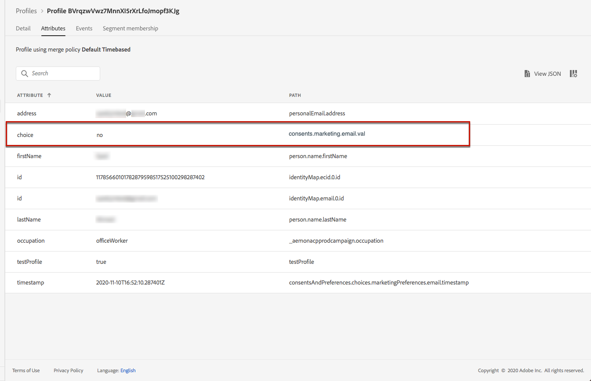
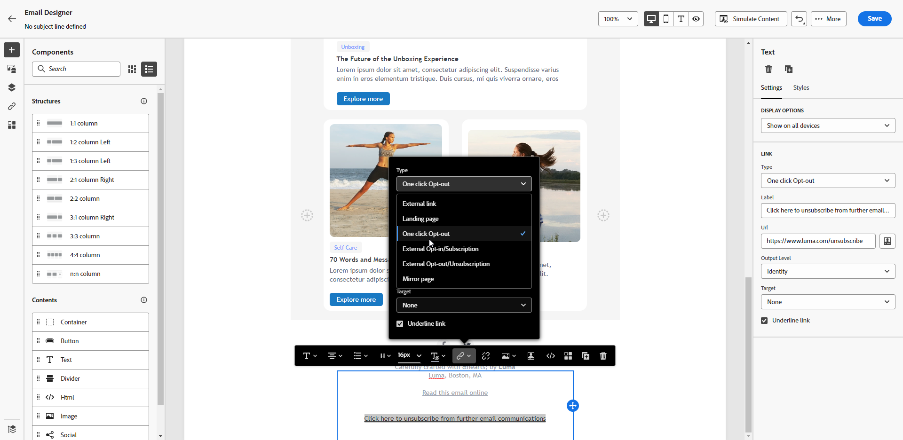
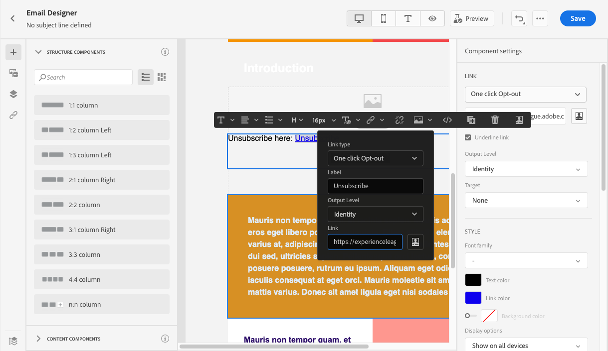
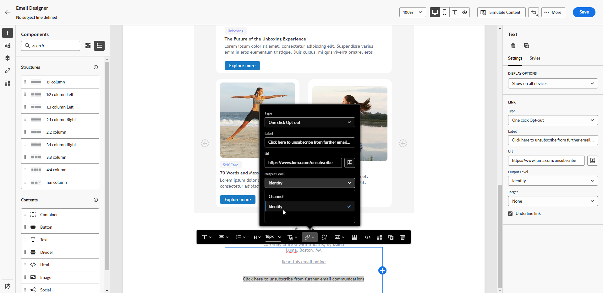
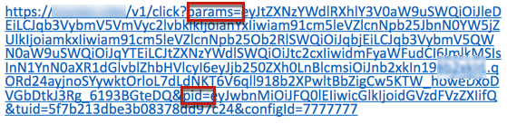
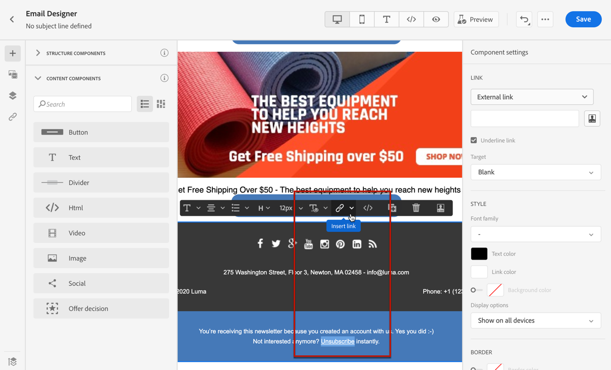
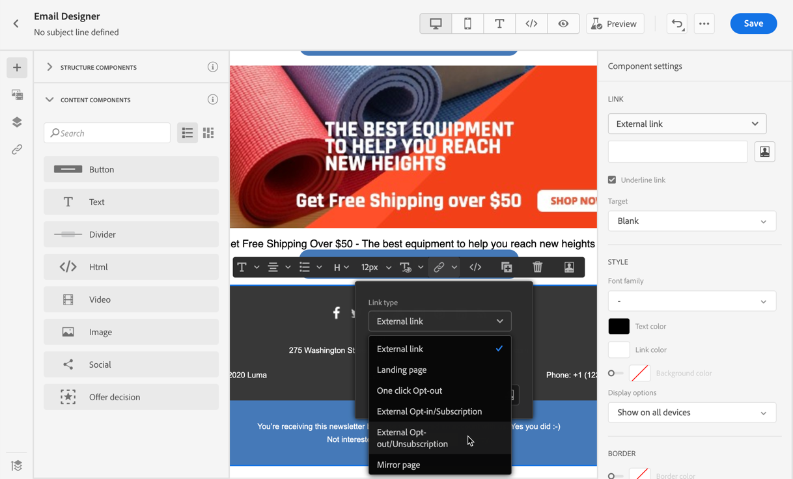
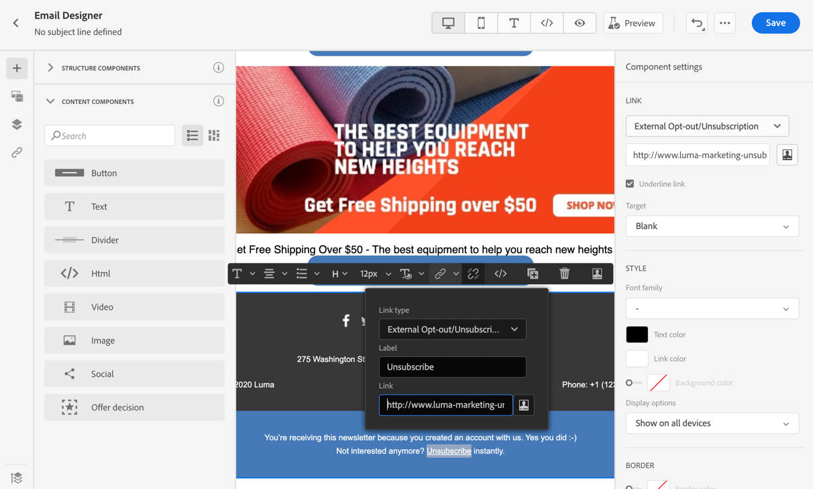
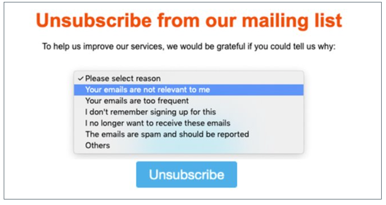
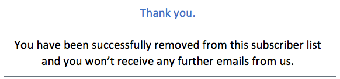

# 电子邮件选择退出管理 {#email-opt-out}

>[!BEGINSHADEBOX]

**在此页面上：**&#x200B;了解如何向电子邮件添加取消订阅选项，包括电子邮件标题或正文中的一键式选择退出链接，以及通过登陆页面执行的两步式选择退出，以便收件人可以停止未来的通信。

>[!ENDSHADEBOX]

在从历程或活动发送消息时，必须始终确保客户可以取消订阅未来的通信。 取消订阅后，轮廓将自动从未来营销消息的受众中删除。  [了解有关隐私和选择退出管理的更多信息](../privacy/opt-out.md)

>[!NOTE]
>
>您的所有营销消息必须包含选择退出链接。 对于事务型消息，这不是必需的。 消息类别 — **[!UICONTROL 营销]**&#x200B;或&#x200B;**[!UICONTROL 事务性]** — 在[渠道配置](email-settings.md#email-type)级别和创建消息时定义。

要在电子邮件内容中插入退订链接，您可以：

* 在电子邮件标头中添加一键式取消订阅URL。 渠道配置级别的&#x200B;**[!UICONTROL 启用List-Unsubscribe]**&#x200B;选项为电子邮件标头添加了选择退出链接。 [了解有关电子邮件标头中选择退出的更多信息](#unsubscribe-header)

* 为您的电子邮件启用&#x200B;**一键式选择退出链接**。  [了解如何添加一键式选择退出链接](#one-click-opt-out)

* 插入指向登陆页面&#x200B;**的**&#x200B;链接。 [了解如何添加选择退出登陆页面](#opt-out-external-lp)

当收件人单击选择退出链接时，将相应地处理其取消订阅请求。

要检查相应用户档案的选择是否已更新，请转到Experience Platform并[浏览到该用户档案](https://experienceleague.adobe.com/en/docs/experience-platform/profile/ui/user-guide?lang=en#browse-tab){target="_blank"}。 在[属性选项卡](https://experienceleague.adobe.com/en/docs/experience-platform/profile/ui/user-guide#attributes){target="_blank"}中，您可以看到&#x200B;**[!UICONTROL 选择]**&#x200B;的值已更改为&#x200B;**[!UICONTROL no]**。 在 [Experience Platform 文档](https://experienceleague.adobe.com/docs/experience-platform/landing/governance-privacy-security/consent/adobe/overview.html?lang=zh-hans){target="_blank"}中进一步了解同意处理。



>[!NOTE]
>
>有时，由于下游数据处理的原因，取消订阅事件可能需要更长的时间才能体现在用户档案级别。 系统进行更新可能会需要一些时间。

## 一步式选择退出 {#opt-out-one-step}

使用[!DNL Adobe Journey Optimizer]，您可以在电子邮件标题中使用自动生成的一键式取消订阅URL和邮件地址配置[电子邮件配置设置](email-settings.md#list-unsubscribe)，或者在电子邮件正文中包含一键式选择退出URL。

### 电子邮件标头中的一键取消订阅 URL {#unsubscribe-header}

一键式列表取消订阅URL是电子邮件发件人信息旁边显示的取消订阅链接或按钮，收件人只需单击一下即可立即选择退出您的邮件列表。 了解如何管理[本节](list-unsubscribe.md)中的&#x200B;**[!UICONTROL 列表取消订阅]**&#x200B;选项。

### 从电子邮件内容中一键式选择退出 {#one-click-opt-out}

要设置个性化的取消订阅URL，请在电子邮件内容中插入一键式选择退出链接，然后输入您选择的URL，如下所述：

1. 访问您的电子邮件内容并[插入链接](../email/message-tracking.md#insert-links)。
1. 选择&#x200B;**[!UICONTROL 一次单击退出]**&#x200B;作为链接类型。

   

1. 输入用户取消订阅后重定向到的登陆页面的URL。 此页用于确认选择退出是否成功。

   >[!NOTE]
   >
   >如果在[渠道配置级别](email-settings.md#list-unsubscribe)启用了&#x200B;**[!UICONTROL List-Unsubscribe]**&#x200B;选项，并且取消选中了默认的&#x200B;**[!UICONTROL 一键取消订阅URL]**&#x200B;选项，则当用户单击电子邮件标头中的取消订阅链接时，也会使用此登陆页面URL。 [了解详情](list-unsubscribe.md)

   

   您可以个性化自己的链接。 在[本节](../personalization/personalization-syntax.md)中了解更多关于个性化URL的信息。

1. 选择您要应用选择退出的方式：在渠道或身份级别。

   

   * **[!UICONTROL 渠道]**：选择退出适用于将来发送到当前渠道的轮廓目标（即电子邮件地址）的消息。 如果多个目标与一个轮廓关联，则选择退出适用于该渠道的轮廓中的所有目标（即电子邮件地址）。
   * **[!UICONTROL 身份标识]**：选择退出适用于在将来发送给当前消息所使用的特定目标（即电子邮件地址）的消息。
     <!--* **[!UICONTROL Subscription]**: The opt-out applies to future messages associated with a specific subscription list. This option can only be selected if the current message is associated with a subscription list.-->

1. 保存您的更改。


## 两步式选择退出 {#opt-out-external-lp}

标准选择退出机制依赖于两个步骤：订阅者单击电子邮件中的选择退出链接，然后被重定向到选择退出登陆页面，以确认取消订阅。

要实施此退订模式，您必须创建和发布选择退出登陆页面，并在电子邮件中添加退订链接，其中含有指向登陆页面的链接。 这些步骤概述如下。


### 先决条件 {#prereq-lp}

要设置两步式选择退出机制，您必须创建自己的退订登陆页面。 第一个登陆页面将从您的消息中链接，并且必须包含一个call-to-action按钮。 用户单击按钮时，将显示确认消息。

了解如何在Adobe Journey Optimizer中创建登陆页面以管理[此页面](../landing-pages/lp-use-cases.md#opt-out)上的取消订阅。

您还可以使用外部登陆页面。 在这种情况下，请配置API以在收件人取消订阅时将信息发送到Adobe Journey Optimizer。

+++ 了解如何实施选择退出API调用

要在收件人从登陆页面提交选择时为其完成选择退出，您必须通过[Adobe Developer](https://developer.adobe.com){target="_blank"}实施&#x200B;**订阅API调用**&#x200B;以更新相应用户档案的偏好设置。

此 POST 调用如下：

端点：https://platform.adobe.io/journey/imp/consent/preferences

查询参数：

* **params**：包含加密后的有效负载
* **pid**：加密后的轮廓 ID

这两个参数将包含在发送给您的收件人的第三方登陆页面URL中：



标头要求：

* x-api-key
* x-gw-ims-org-id
* x-sandbox-name
* 授权（用于技术帐户认证的用户令牌）

请求正文：

```
{
   "marketing": [
       {
            "type": "email",           
            "choice": "no",          
            "scope": "channel"       
        }
    ],
 
}
```

[!DNL Journey Optimizer]使用这些参数通过[Adobe Developer](https://developer.adobe.com){target="_blank"} API调用更新相应用户档案的选择。

+++


### 添加取消订阅链接 {#add-unsubscribe-link}

您首先需要在消息中添加取消订阅链接。 为此，请执行以下步骤：

1. 创建消息并使用上下文工具栏[插入链接](../email/message-tracking.md#insert-links)。

   

1. 从&#x200B;**[!UICONTROL 类型]**&#x200B;下拉列表中选择&#x200B;**[!UICONTROL 登陆页面]**，然后在&#x200B;**[!UICONTROL 登陆页面]**&#x200B;字段中选择您的选择退出登陆页面。

   如果您使用的是外部登陆页面，请从&#x200B;**[!UICONTROL 类型]**&#x200B;下拉列表中选择&#x200B;**[!UICONTROL 外部选择退出/退订]**。

   

   在&#x200B;**[!UICONTROL 链接]**&#x200B;字段中，将链接粘贴到您的第三方登陆页面。

   

1. 单击&#x200B;**[!UICONTROL 保存]**。


### 了解取消订阅流程 {#send-message-unsubscribe-link}

配置指向登陆页面的取消订阅链接后，您可以完成并向订阅者发送消息。

要使整个登陆页面选择退出流程成功完成，需要按顺序发生以下事件：

1. **Click** — 收到邮件后，收件人单击电子邮件中的取消订阅链接。

1. **访问** — 登陆页面加载并向收件人显示。

   

1. **提交** — 收件人通过单击登陆页面上的“取消订阅”按钮提交选择退出表单。

   >[!WARNING]
   >
   >单击电子邮件中的取消订阅链接将仅打开登陆页面。 收件人必须&#x200B;**通过单击登陆页面中的选择退出按钮来提交表单**，以完成退订并更新其配置文件同意。

1. **取消订阅** — 系统处理取消订阅请求。 已选择退出的收件人将被重定向至确认消息屏幕，指示已成功选择退出。

   

1. **同意更新** — 通过API调用在配置文件属性中根据同意更新配置文件数据，这会将配置文件从未来的电子邮件发送中排除。

   因此，除非再次订阅，否则这个用户将不会收到来自您的品牌的通信。

此事件序列可确保正确跟踪退订过程，并在系统中准确反映用户档案的同意首选项。 如果此流程中的任何步骤缺失或不按顺序发生，则可能指示应调查的选择退出实施存在的问题。
