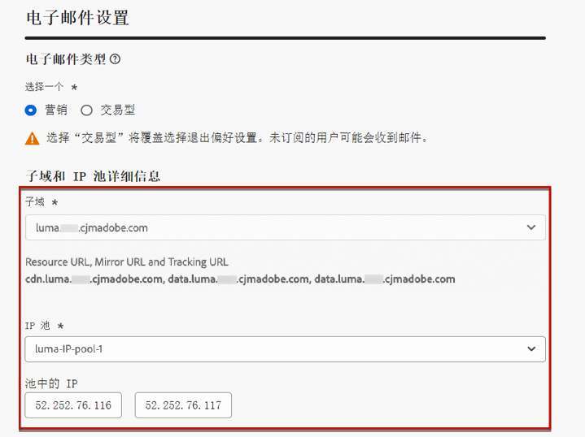
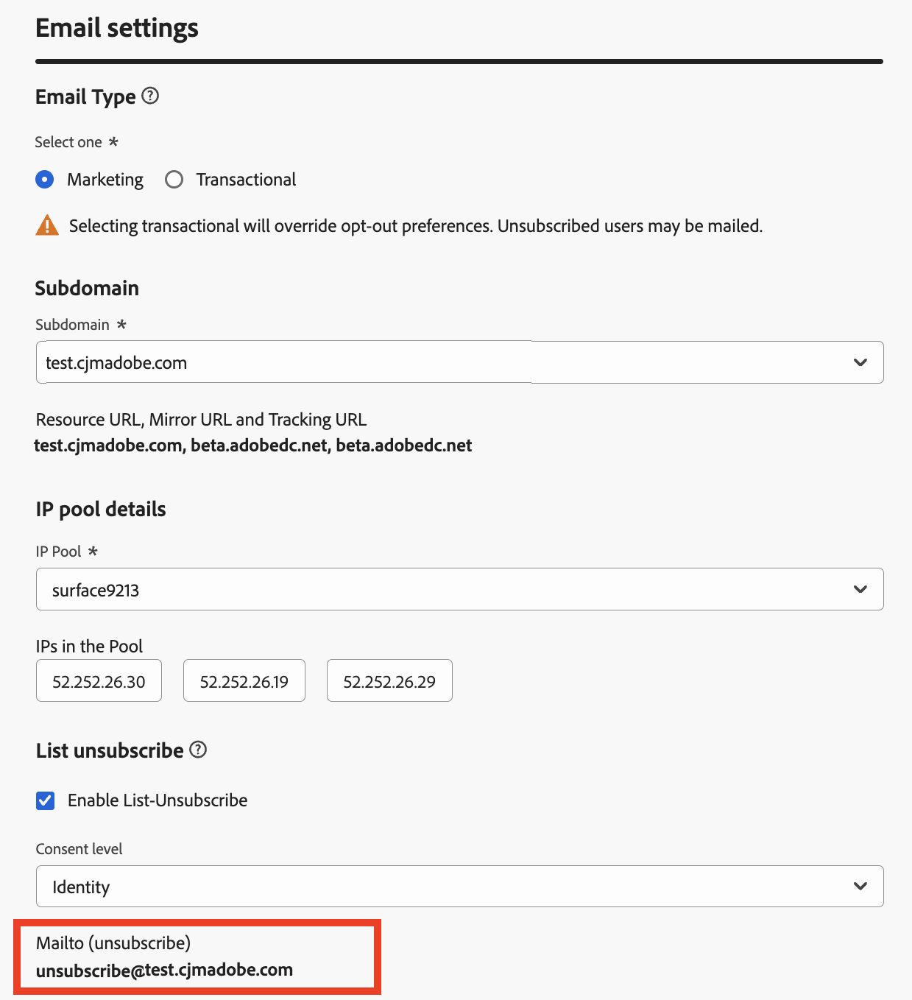

# 配置电子邮件设置 {#email-settings}

要开始创建电子邮件，您需要设置电子邮件渠道界面，以定义消息所需的所有技术参数。 [了解如何创建表面](../configuration/channel-surfaces.md)

>[!NOTE]
>
>为了维护您的信誉并提高可投放性，请在创建电子邮件表面之前设置用于发送电子邮件的子域。 [了解详情](../configuration/about-subdomain-delegation.md)

在渠道平面配置的专用部分中定义电子邮件设置，如下所述。

系统会选取电子邮件表面配置，以便按照以下逻辑发送通信：

* 对于批处理历程，不适用于在进行电子邮件表面配置之前已启动的批处理执行。 将在下次重复或新执行时提取更改。

* 对于事务型消息，会在下次通信时立即拾取更改（最多延迟5分钟）。

>[!NOTE]
>
>更新后的电子邮件表面设置将在使用表面的历程或营销活动中自动提取。

## 电子邮件类型 {#email-type}

>[!CONTEXTUALHELP]
>id="ajo_admin_presets_emailtype"
>title="定义电子邮件类型"
>abstract="选择使用此表面时将发送的电子邮件类型：营销性的促销电子邮件，此时需要用户同意；或者交易型的非商业电子邮件，此时在特定上下文中，也可以发送到未订阅的配置文件。"

在 **电子邮件类型** 部分，为曲面选择消息类型： **[!UICONTROL 营销]** 或 **[!UICONTROL 事务性]**.

* 选择 **营销** 促销电子邮件，如零售商店的每周促销活动。 这些消息需要用户同意。

* 选择 **事务性** 用于非商业电子邮件，例如订单确认、密码重置通知或投放信息。 这些电子邮件可以发送给符合以下条件的用户档案： **已取消订阅** 来自营销通信。 这些消息只能在特定上下文中发送。

创建消息时，必须选择与为电子邮件选择的类别相匹配的有效渠道平面。

## Subdomain {#subdomains}

选择用于发送电子邮件的子域。

为了维护域的信誉、加快IP预热过程并改进可投放性，将发送子域委派给Adobe。 [了解详情](../configuration/about-subdomain-delegation.md)

<!--If needed, you can define dynamic subdomains. [Learn more](../email/surface-personalization.md#dynamic-subdomains)-->

## IP池详细信息 {#ip-pools}

选择要与表面关联的IP池。 [了解详情](../configuration/ip-pools.md)

{width="50%" align="left"}

选定IP池位于下时，无法继续创建表面 [版本](../configuration/ip-pools.md#edit-ip-pool) (**[!UICONTROL 正在处理]** 状态)且从未与选定子域关联。 否则，仍将使用IP池/子域关联的最旧版本。 如果是这种情况，请将表面另存为草稿，并在IP池具有 **[!UICONTROL 成功]** 状态。

>[!NOTE]
>
>对于非生产环境，Adobe不会创建现成的测试子域，也不会授予对共享发送IP池的访问权限。 您需要 [委派您自己的子域](../configuration/delegate-subdomain.md) 并使用分配给贵组织的池中的IP。

选择IP池后，当鼠标悬停在IP池下拉列表下方显示的IP地址上时，会显示PTR信息。 [了解有关PTR记录的更多信息](../configuration/ptr-records.md)

>[!NOTE]
>
>如果未配置PTR记录，请联系您的Adobe代表。

## 列表取消订阅 {#list-unsubscribe}

于 [选择子域](#subdomains-and-ip-pools) 从列表中， **[!UICONTROL 启用List-Unsubscribe]** 选项随即显示。

此选项默认处于启用状态。 如果您将其保留为启用，则取消订阅链接将自动包含在电子邮件标头中，例如：

如果禁用此选项，则电子邮件标头中不显示取消订阅链接。

您可以从 **同意级别** 下拉列表。 可特定于渠道或用户档案标识。 基于此设置，当用户使用电子邮件的列表取消订阅标头链接取消订阅时，同意会在Adobe Journey Optimizer中在渠道级别或ID级别更新。

取消订阅链接包含两个元素：

* An **取消订阅电子邮件地址**，则会将所有取消订阅请求发送到。

  在 [!DNL Journey Optimizer]，默认使用取消订阅电子邮件地址 **[!UICONTROL Mailto（取消订阅）]** 渠道界面中显示的地址，基于 [所选子域](#subdomains-and-ip-pools).

  {width="50%" align="left"}

* 此 **取消订阅URL**，这是登陆页面的URL，取消订阅后，用户将重定向到该页面。

  如果添加 [一键式选择退出链接](../privacy/opt-out.md#one-click-opt-out) 对于使用此界面创建的消息，取消订阅URL将为一键式选择退出链接定义的URL。

  

  >[!NOTE]
  >
  >如果您没有在消息内容中添加一键式选择退出链接，则不会向用户显示登陆页面。

在中详细了解如何添加指向消息的标头取消订阅链接 [本节](../privacy/opt-out.md#unsubscribe-header).

<!--If you have added one or more dynamic subdomains, URLs will be populated based on the resolved dynamic subdomain. [Learn more](../email/surface-personalization.md#dynamic-subdomains)-->

<!--Select the **[!UICONTROL Custom List-Unsubscribe]** option to enter your own Unsubscribe URL and/or your own Unsubscribe email address.(to add later)-->

## 标题参数 {#email-header}

在 **[!UICONTROL 标题参数]** 部分，输入与使用该表面发送的电子邮件类型关联的发件人姓名和电子邮件地址。

* **[!UICONTROL 发件人姓名]**：发件人的名称，如您的品牌名称。
* **[!UICONTROL 发件人电子邮件]**：要用于通信的电子邮件地址。
* **[!UICONTROL 回复（姓名）]**：收件人单击 **回复** 电子邮件客户端软件中的URL按钮。
* **[!UICONTROL 回复（电子邮件）]**：收件人单击 **回复** 电子邮件客户端软件中的URL按钮。 [了解详情](#reply-to-email)
* **[!UICONTROL 错误电子邮件]**：在此地址上接收ISP在投放邮件几天后生成的所有错误（异步退回）。 在此地址上还会收到“不在办公室”通知和质询回复。

  如果您希望在未委派给Adobe的特定电子邮件地址上接收休假通知和质询响应，则需要设置 [转发进程](#forward-email). 在这种情况下，请确保您拥有手动或自动化解决方案来处理登陆此收件箱的电子邮件。

>[!CAUTION]
>
>此 **[!UICONTROL 发件人电子邮件]** 和 **[!UICONTROL 错误电子邮件]** 地址必须使用当前选定的 [已委派的子域](../configuration/about-subdomain-delegation.md). 例如，如果委派的子域为 *marketing.luma.com*，您可以使用 *contact@marketing.luma.com* 和 *error@marketing.luma.com*.

>[!NOTE]
>
>地址必须以字母(A - Z)开头，并且只能包含字母数字字符。 您也可以使用下划线 `_`，点`.` 和连字符 `-` 个字符。

### 回复电子邮件 {#reply-to-email}

定义 **[!UICONTROL 回复（电子邮件）]** 地址，您可以指定任何电子邮件地址，但前提是它是有效的地址，格式正确，并且没有任何拼写错误。

用于回复的收件箱将收到所有回复电子邮件，但以下地址收到的离职通知和质询回复除外： **[!UICONTROL 错误电子邮件]** 地址。

为确保正确管理回复，请遵循以下建议：

* 确保专用收件箱有足够的接收能力，可接收使用电子邮件界面发送的所有回复电子邮件。 如果收件箱返回退件，则可能无法收到客户的某些回复。

* 处理回复时必须牢记隐私和合规义务，因为它们可能包含个人身份信息(PII)。

* 请勿在回复收件箱中将邮件标记为垃圾邮件，因为这将影响发送到此地址的所有其他回复。

此外，在定义 **[!UICONTROL 回复（电子邮件）]** 地址，请确保使用具有有效MX记录配置的子域，否则电子邮件表面处理将失败。

如果您在提交电子邮件界面时遇到错误，则表示没有为所输入地址的子域配置MX记录。 请与您的管理员联系以配置相应的MX记录，或使用另一个具有有效MX记录配置的地址。

>[!NOTE]
>
>如果您输入的地址的子域是 [已完全委派](../configuration/delegate-subdomain.md#full-subdomain-delegation) 要Adobe，请联系您的Adobe客户经理。

### 转发电子邮件 {#forward-email}

要将收到的所有电子邮件转发到特定的电子邮件地址，请执行以下操作 [!DNL Journey Optimizer] 有关已委派的子域，请联系Adobe客户关怀部门。

>[!NOTE]
>
>如果使用的子域 **[!UICONTROL 回复（电子邮件）]** 地址未委派给Adobe，转发无法用于此地址。

您需要提供：

* 您选择的转发电子邮件地址。 请注意，转发电子邮件地址域不能与委派给Adobe的任何子域匹配。
* 您的沙盒名称。
* 要为其使用转发电子邮件地址的表面名称或子域。
  <!--* The current **[!UICONTROL Reply to (email)]** address or **[!UICONTROL Error email]** address set at the channel surface level.-->

>[!NOTE]
>
>每个子域只能有一个转发电子邮件地址。 因此，如果多个表面使用相同的子域，则必须对所有表面使用相同的转发电子邮件地址。

转发电子邮件地址由Adobe设置。 这可能需要3到4天时间。

完成后，在 **[!UICONTROL 回复（电子邮件）]** 和 **[!UICONTROL 错误电子邮件]** 地址将转发到您提供的特定电子邮件地址。

## 密送电子邮件 {#bcc-email}

您可以发送由发送的相同电子邮件副本（或密件副本） [!DNL Journey Optimizer] 到BCC收件箱中，将存储这些文件以用于合规性或归档目的。

为此，请启用 **[!UICONTROL 密送电子邮件]** 渠道曲面级别的可选功能。 [了解详情](../configuration/archiving-support.md#bcc-email)

此外，在定义 **[!UICONTROL 密件抄送电子邮件]** 地址，请确保使用具有有效MX记录配置的子域，否则电子邮件表面处理将失败。

如果您在提交电子邮件界面时遇到错误，则表示没有为所输入地址的子域配置MX记录。 请与您的管理员联系以配置相应的MX记录，或使用另一个具有有效MX记录配置的地址。

## 发送到已禁止的电子邮件地址 {#send-to-suppressed-email-addresses}

>[!CONTEXTUALHELP]
>id="ajo_surface_suppressed_addresses"
>title="覆盖禁止列表优先级"
>abstract="可决定将交易型消息发送到配置文件，即使这些消息的电子邮件地址因垃圾邮件投诉而被列入 Adobe Journey Optimizer 禁止列表也是如此。默认禁用此选项。"
>additional-url="https://experienceleague.adobe.com/docs/journey-optimizer/using/configuration/monitor-reputation/manage-suppression-list.html?lang=zh-Hans" text="管理禁止列表"

>[!IMPORTANT]
>
>此选项仅在您选择 **[!UICONTROL 事务性]** 电子邮件类型。 [了解详情](#email-type)

在 [!DNL Journey Optimizer]，则所有标记为硬退回、软退回和垃圾邮件投诉的电子邮件地址都会自动收集到 [禁止显示列表](../configuration/manage-suppression-list.md) 且被排除在发送历程或营销活动之外。

但是，您可以决定继续发送 **事务性** 键入用户档案，即使其电子邮件地址因用户投诉垃圾邮件而包含在禁止列表上。

事实上，事务型消息通常包含有用和预期的信息，例如订单确认或密码重置通知。 因此，即使他们举报了您的某封营销邮件为垃圾邮件，在大多数情况下，您仍希望客户收到此类非商业电子邮件。

要在事务型消息受众中包含由于垃圾邮件投诉而抑制的电子邮件地址，请从中选择相应的选项 **[!UICONTROL 发送到禁止显示的电子邮件地址]** 部分。

>[!NOTE]
>
>默认禁用此选项。

作为可投放性最佳实践，此选项默认处于禁用状态，以确保不联系已选择退出的客户。 但是，您可以更改此默认选项，这样您便可以向客户发送事务型消息。

启用此选项后，尽管客户将您的营销电子邮件标记为垃圾邮件，但这些客户将能够使用当前表面接收您的事务型消息。 始终确保根据可投放性最佳实践管理选择退出偏好设置。

## 种子列表 {#seed-list}

>[!CONTEXTUALHELP]
>id="ajo_surface_seed_list"
>title="添加种子列表"
>abstract="选择所选的种子列表以自动将特定的内部地址添加到受众。在投放执行时将纳入这些种子地址，并且这些种子地址将收到与消息完全一致的副本，以便让人放心。"
>additional-url="https://experienceleague.adobe.com/docs/journey-optimizer/using/configuration/seed-lists.html#use-seed-list" text="什么是种子列表？"

中的种子列表 [!DNL Journey Optimizer] 使您能够在投放中自动包含特定的电子邮件种子地址。 [了解详情](../configuration/seed-lists.md)

>[!CAUTION]
>
>目前，此功能仅适用于电子邮件渠道。

在中选择与您相关的列表 **[!UICONTROL 种子列表]** 部分。 了解如何在中创建种子列表 [本节](../configuration/seed-lists.md#create-seed-list).

>[!NOTE]
>
>一次只能选择一个种子列表。

在营销活动或历程中使用当前表面时，投放执行时间将包含所选种子列表上的电子邮件地址，这意味着他们将收到投放的副本以进行保证。

了解如何在营销活动或历程中使用种子列表 [本节](../configuration/seed-lists.md#use-seed-list).

## 电子邮件重试参数 {#email-retry}

>[!CONTEXTUALHELP]
>id="ajo_admin_presets_retryperiod"
>title="调整重试时段"
>abstract="当电子邮件投放由于临时软退回错误失败时，将重试 3.5 天（84 小时）。您可以调整此默认重试时段以更好地满足您的需求。"
>additional-url="https://experienceleague.adobe.com/docs/journey-optimizer/using/configuration/monitor-reputation/retries.html?lang=zh-Hans" text="关于重试"

您可以配置 **电子邮件重试参数**.

默认情况下， [重试时段](../configuration/retries.md#retry-duration) 设置为84小时，但您可以调整此设置以更好地满足您的需求。

必须输入以下范围内的整数值（以小时或分钟为单位）：

* 对于营销电子邮件，最小重试期限为6小时。
* 对于事务性电子邮件，最小重试时间为10分钟。
* 对于这两种电子邮件类型，最大重试时间为84小时（或5040分钟）。

在中了解有关重试的更多信息 [本节](../configuration/retries.md).

## URL 跟踪 {#url-tracking}

>[!CONTEXTUALHELP]
>id="ajo_admin_preset_utm"
>title="定义 URL 跟踪参数"
>abstract="使用此部分可自动将跟踪参数附加到在电子邮件内容中提供的 URL。此功能属于可选功能。"

>[!CONTEXTUALHELP]
>id="ajo_admin_preset_url_preview"
>title="预览 URL 跟踪参数"
>abstract="查看如何对电子邮件内容中出现的 URL 附加跟踪参数。"

您可以使用 **[!UICONTROL URL跟踪参数]** 衡量您跨渠道营销工作的有效性。 此功能属于可选功能。

此部分中定义的参数将被附加到电子邮件内容中包含的URL的末尾。 然后，您可以在Adobe Analytics或Google Analytics等网站分析工具中捕获这些参数，并创建各种性能报表。

您可以使用添加最多10个跟踪参数 **[!UICONTROL 添加新参数]** 按钮。

要配置URL跟踪参数，您可以直接在 **[!UICONTROL 名称]** 和 **[!UICONTROL 值]** 字段。

您还可以编辑每个 **[!UICONTROL 值]** 字段使用的 [表达式编辑器](../personalization/personalization-build-expressions.md). 单击版本图标以打开编辑器。 从该位置，您可以选择可用的上下文属性和/或直接编辑文本。

可通过表达式编辑器使用以下预定义的值：

* **源操作ID**：添加到历程或营销策划的电子邮件操作的ID。

* **源操作名称**：添加到历程或营销策划的电子邮件操作的名称。

* **源ID**：发送电子邮件的伴随历程或营销活动的ID。

* **源名称**：发送电子邮件的历程或营销活动的名称。

* **源版本ID**：发送电子邮件的历程或营销活动版本的ID。

* **优惠ID**：电子邮件中使用的选件的ID。

>[!NOTE]
>
>可以组合键入文本值并使用表达式编辑器中的上下文属性。 每个 **[!UICONTROL 值]** 字段可以包含最多5 KB的字符数。

<!--You can drag and drop the parameters to reorder them.-->

以下是与Adobe Analytics和Google Analytics兼容的URL示例。

* 与Adobe Analytics兼容的URL： `www.YourLandingURL.com?cid=email_AJO_{{context.system.source.id}}_image_{{context.system.source.name}}`

* 与Google Analytics兼容的URL： `www.YourLandingURL.com?utm_medium=email&utm_source=AJO&utm_campaign={{context.system.source.id}}&utm_content=image`

您可以动态预览生成的跟踪URL。 每次添加、编辑或删除参数时，都会自动更新预览。

>[!NOTE]
>
>您还可以向电子邮件内容中存在的链接添加动态个性化跟踪参数，但这在平面级别是不可能的。 使用电子邮件设计器创作消息时，需要执行此操作。 [了解详情](message-tracking.md#url-tracking)
