# 配置电子邮件设置 {#email-settings}

要开始创建电子邮件，您需要设置电子邮件渠道配置，以定义消息所需的所有技术参数。 [了解如何创建配置](../configuration/channel-surfaces.md)

>[!NOTE]
>
>为了维护您的信誉并提高可投放性，请在创建电子邮件配置之前设置您将用于发送电子邮件的子域。 [了解详情](../configuration/about-subdomain-delegation.md)

在渠道配置的专用部分中定义电子邮件设置，如下所述。

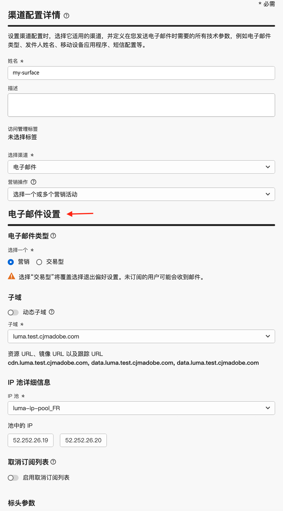{width="50%" align="left"}

系统会选取电子邮件配置，以便按照以下逻辑发送通信：

* 对于批处理历程，不适用于在进行电子邮件表面配置之前已启动的批处理执行。 下次重复执行或新执行时会选取更改。

* 对于事务型消息，会在下次通信时立即拾取更改（最多延迟5分钟）。

>[!NOTE]
>
>更新的电子邮件配置设置会在使用配置的历程或营销活动中自动提取。

## 电子邮件类型 {#email-type}

>[!CONTEXTUALHELP]
>id="ajo_admin_presets_emailtype"
>title="定义电子邮件类型"
>abstract="选择使用此配置时将发送的电子邮件类型：营销性的促销电子邮件，此时需要用户同意；或者交易型的非商业电子邮件，此时在特定上下文中，也可以发送到已取消订阅的轮廓。"

在&#x200B;**电子邮件类型**&#x200B;部分中，为配置选择消息类型： **[!UICONTROL 营销型]**&#x200B;或&#x200B;**[!UICONTROL 事务型]**。

* 为促销电子邮件选择&#x200B;**营销**，如零售商店的每周促销活动。 这些消息需要用户同意。

* 为非商业电子邮件选择&#x200B;**事务型**，例如订单确认、密码重置通知或投放信息。 这些电子邮件可以发送给从营销通信中&#x200B;**取消订阅**&#x200B;的用户档案。 这些消息只能在特定上下文中发送。

创建消息时，必须选择与为电子邮件选择的类别相匹配的有效渠道配置。

## Subdomain {#subdomains}

选择用于发送电子邮件的子域。

>[!NOTE]
>
>为了增强对电子邮件设置的控制，您可以定义动态子域。 [了解详情](../email/surface-personalization.md#dynamic-subdomains)

为了维护域的信誉、加快IP预热过程并改进可投放性，将发送子域委派给Adobe。 [了解详情](../configuration/about-subdomain-delegation.md)

## IP池详细信息 {#ip-pools}

选择要与配置关联的IP池。 [了解详情](../configuration/ip-pools.md)

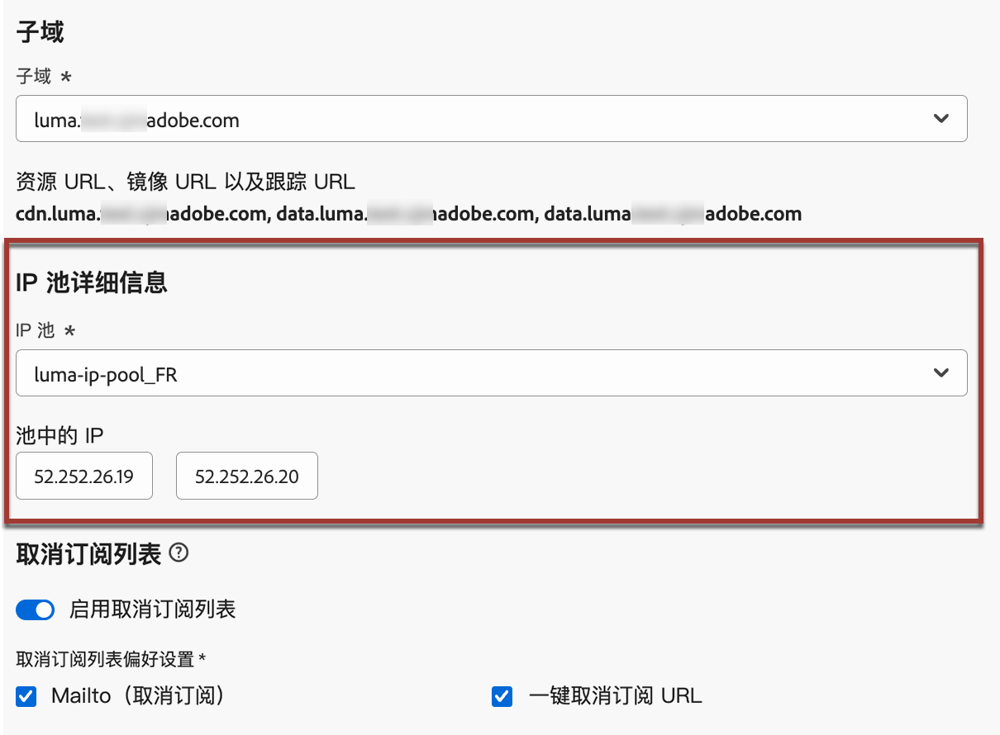{width="50%" align="left"}

当选定的IP池处于[版本](../configuration/ip-pools.md#edit-ip-pool) （**[!UICONTROL 正在处理]**&#x200B;状态）下且从未与选定的子域关联时，您无法继续创建配置。 否则，仍将使用IP池/子域关联的最旧版本。 如果是这种情况，请将配置另存为草稿，并在IP池的状态为&#x200B;**[!UICONTROL 成功]**&#x200B;后重试。

>[!NOTE]
>
>对于非生产环境，Adobe不会创建现成的测试子域，也不会授予对共享发送IP池的访问权限。 您需要[委派自己的子域](../configuration/delegate-subdomain.md)并使用分配给贵组织的池中的IP。

选择IP池后，当鼠标悬停在IP池下拉列表下方显示的IP地址上时，会显示PTR信息。 [了解有关PTR记录的更多信息](../configuration/ptr-records.md)

>[!NOTE]
>
>如果未配置PTR记录，请联系您的Adobe代表。

## 列表取消订阅{#list-unsubscribe}

>[!CONTEXTUALHELP]
>id="ajo_email_config_unsubscribe_custom"
>title="定义如何管理取消订阅数据"
>abstract="**托管Adobe**：同意数据由您在Adobe系统中管理。 **客户托管**：同意数据由您在外部系统中管理，除非您启动，否则不会在Adobe系统中更新任何同意数据的同步。"

<!--Do not modify - Legal Review Done -->

从列表中[选择子域](#subdomains-and-ip-pools)后，将显示&#x200B;**[!UICONTROL 启用List-Unsubscribe]**&#x200B;选项。

默认情况下，启用此选项以在电子邮件标头中包含一键式取消订阅URL，例如：

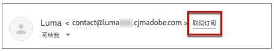

>[!NOTE]
>
>如果禁用此选项，则电子邮件标头中不会显示一键式取消订阅URL。

您可以从&#x200B;**[!UICONTROL 同意级别]**&#x200B;下拉列表中选择同意级别。 可特定于渠道或用户档案标识。 基于此设置，当用户使用电子邮件标头中的列表取消订阅URL取消订阅时，同意会在Adobe Journey Optimizer中在渠道级别或ID级别更新。

List unsubscribe标头提供了两项功能，除非取消选中一项或两项功能，否则默认情况下将启用这两项功能：

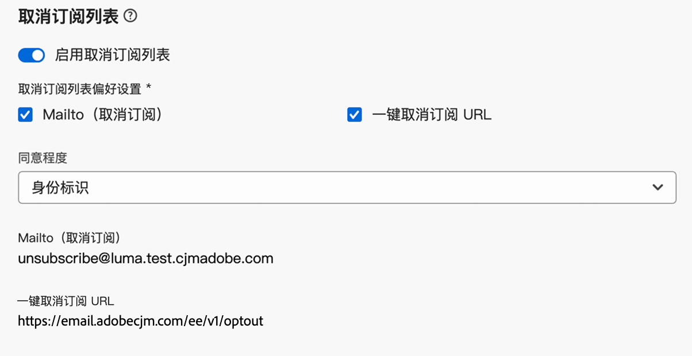{width="80%"}

<!--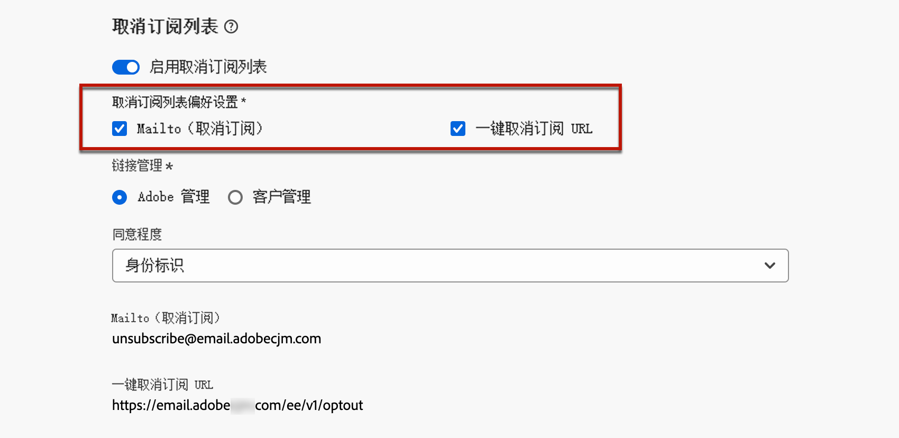{width="80%"}-->

* **Mailto（取消订阅）**&#x200B;地址，这是将取消订阅请求路由到以进行自动处理的目标地址。

  在Journey Optimizer中，取消订阅电子邮件地址是渠道配置中显示的默认&#x200B;**Mailto（取消订阅）**&#x200B;地址，基于您的[所选子域](#subdomains-and-ip-pools)。

* **一键式取消订阅URL**，根据您在渠道配置设置中设置并配置的子域，它默认为一键式选择退出URL生成的列表取消订阅标头。

<!--
    >[!AVAILABILITY]
    >
    >One-click Unsubscribe URL Header will be available in Adobe Journey Optimizer starting June 3, 2024.
    >
-->

**[!UICONTROL Mailto（取消订阅）]**&#x200B;功能和&#x200B;**[!UICONTROL 一键式取消订阅URL]**&#x200B;功能是可选的。

如果您不想使用默认生成的一键式取消订阅URL，则可以取消选中该功能。 在启用了&#x200B;**[!UICONTROL 启用List-Unsubscribe]**&#x200B;选项且取消选中&#x200B;**[!UICONTROL 一键式取消订阅URL]**&#x200B;功能的情况下，如果为使用此配置创建的邮件添加[一键式选择退出链接](../email/email-opt-out.md#one-click-opt-out)，则List unsubscribe标头将选取您已插入到电子邮件正文中的一键式选择退出链接，并将其用作一键式取消订阅URL值。

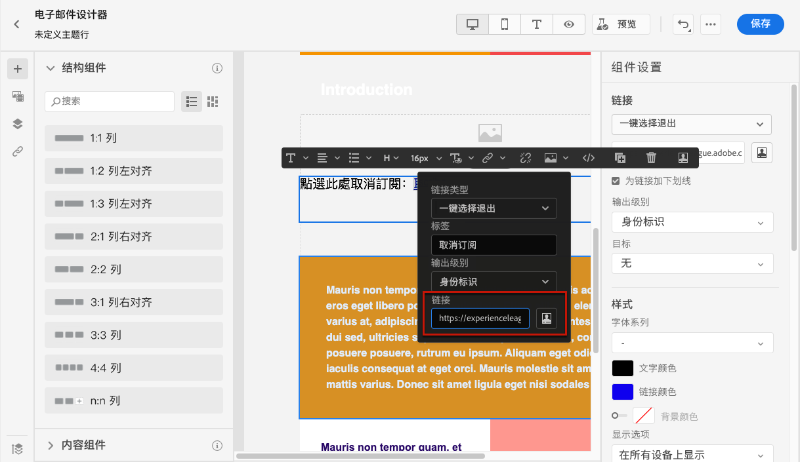

>[!NOTE]
>
>如果您没有在消息内容中添加一键式选择退出链接，并且在渠道配置设置中取消选中默认的&#x200B;**[!UICONTROL 一键式取消订阅URL]**，则不会将URL作为列表取消订阅标头的一部分传递到电子邮件标头。

在[本节](../email/email-opt-out.md#unsubscribe-header)中了解更多有关管理消息中的取消订阅功能的信息。

<!--{width="80%"}-->

## 标题参数 {#email-header}

在&#x200B;**[!UICONTROL 标头参数]**&#x200B;部分中，输入与使用该配置发送的电子邮件类型关联的发件人名称和电子邮件地址。

>[!NOTE]
>
>为了加强对电子邮件设置的控制，您可以个性化标头参数。 [了解详情](../email/surface-personalization.md#personalize-header)

* **[!UICONTROL 发件人姓名]**：发件人的姓名，如您的品牌名称。
* **[!UICONTROL 来自电子邮件前缀]**：要用于通信的电子邮件地址。
* **[!UICONTROL 回复名称]**：收件人单击电子邮件客户端软件中的&#x200B;**回复**&#x200B;按钮时将使用的名称。
* **[!UICONTROL 回复电子邮件]**：收件人单击电子邮件客户端软件中的&#x200B;**回复**&#x200B;按钮时将使用的电子邮件地址。 [了解详情](#reply-to-email)
* **[!UICONTROL 错误电子邮件前缀]**：此地址上接收了ISP在发送邮件几天后生成的所有错误（异步退回）。 在此地址上还会收到“不在办公室”通知和质询回复。

  如果要在未委派给Adobe的特定电子邮件地址上接收休假通知和质询回复，您需要设置[转发流程](#forward-email)。 在这种情况下，请确保您拥有手动或自动化解决方案来处理登陆此收件箱的电子邮件。

>[!NOTE]
>
>**[!UICONTROL 来自电子邮件前缀]**&#x200B;和&#x200B;**[!UICONTROL 错误电子邮件前缀]**&#x200B;地址使用当前选定的[委派的子域](../configuration/about-subdomain-delegation.md)发送电子邮件。 例如，如果委派的子域是&#x200B;*marketing.luma.com*：
>* 输入&#x200B;*contact*&#x200B;作为&#x200B;**[!UICONTROL 发件人电子邮件前缀]** — 发件人电子邮件为&#x200B;*contact@marketing.luma.com*。
>* 输入&#x200B;*error*&#x200B;作为&#x200B;**[!UICONTROL Error电子邮件前缀]** — 错误地址为&#x200B;*error@marketing.luma.com*。

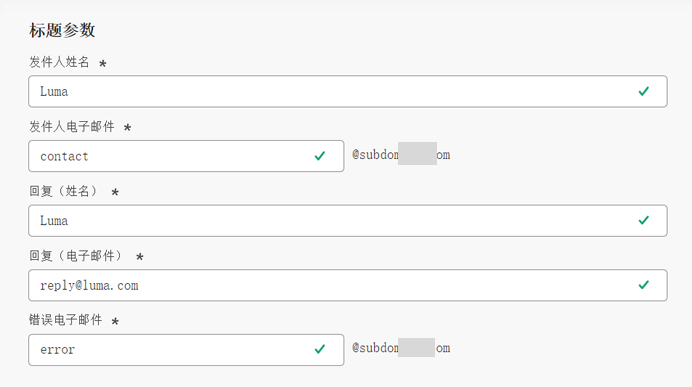{width="80%"}

>[!NOTE]
>
>地址必须以字母(A - Z)开头，并且只能包含字母数字字符。 您还可以使用下划线`_`、点`.`和连字符`-`字符。

### 回复电子邮件 {#reply-to-email}

在定义&#x200B;**[!UICONTROL 回复电子邮件]**&#x200B;地址时，您可以指定任何电子邮件地址，但前提是它是有效的地址，格式正确，并且没有任何拼写错误。

用于回复的收件箱将收到所有回复电子邮件，但通过&#x200B;**错误电子邮件**&#x200B;地址收到的离职通知和质询回复除外。

为确保正确管理回复，请遵循以下建议：

* 确保专用收件箱有足够的接收容量，可接收使用电子邮件配置发送的所有回复电子邮件。 如果收件箱返回退件，则可能无法收到客户的某些回复。

* 处理回复时必须牢记隐私和合规义务，因为它们可能包含个人身份信息(PII)。

* 请勿在回复收件箱中将邮件标记为垃圾邮件，因为这将影响发送到此地址的所有其他回复。

此外，在定义&#x200B;**[!UICONTROL 回复电子邮件]**&#x200B;地址时，请确保使用具有有效MX记录配置的子域，否则电子邮件配置处理将失败。

如果您在提交电子邮件配置时遇到错误，则表示没有为输入地址的子域配置MX记录。 请与您的管理员联系以配置相应的MX记录，或使用另一个具有有效MX记录配置的地址。

>[!NOTE]
>
>如果您输入的地址的子域是[已完全委派给Adobe](../configuration/delegate-subdomain.md#full-subdomain-delegation)的域，请与您的Adobe业务主管联系。

### 转发电子邮件 {#forward-email}

要将[!DNL Journey Optimizer]收到的委派子域的所有电子邮件转发到特定的电子邮件地址，请与Adobe客户关怀部门联系。

>[!NOTE]
>
>如果用于&#x200B;**[!UICONTROL 回复电子邮件]**&#x200B;地址的子域未委派给Adobe，则转发无法用于此地址。

您需要提供：

* 您选择的转发电子邮件地址。 请注意，转发电子邮件地址域不能与委派给Adobe的任何子域匹配。
* 您的沙盒名称。
* 将为其使用转发电子邮件地址的配置名称或子域。
  <!--* The current **[!UICONTROL Reply to (email)]** address or **[!UICONTROL Error email]** address set at the channel configuration level.-->

>[!NOTE]
>
>每个子域只能有一个转发电子邮件地址。 因此，如果多个配置使用相同的子域，则必须对所有配置使用相同的转发电子邮件地址。

转发电子邮件地址由Adobe设置。 这可能需要3到4天时间。

完成后，**[!UICONTROL 回复电子邮件]**&#x200B;和&#x200B;**错误电子邮件**&#x200B;地址接收的所有邮件，以及发送到&#x200B;**发件人电子邮件**&#x200B;地址的所有电子邮件，都将转发到您提供的特定电子邮件地址。

>[!NOTE]
>
>默认情况下，如果未启用转发，则直接发送到&#x200B;**发件人电子邮件**&#x200B;地址的电子邮件将被丢弃。

## 密送电子邮件 {#bcc-email}

您可以将[!DNL Journey Optimizer]所发送的电子邮件的相同副本（或密件副本）发送到密件抄送收件箱，这些邮件将存储于其中以供合规性或存档之用。

为此，请在渠道配置级别启用&#x200B;**[!UICONTROL 密件抄送电子邮件]**&#x200B;可选功能。 [了解详情](../configuration/archiving-support.md#bcc-email)

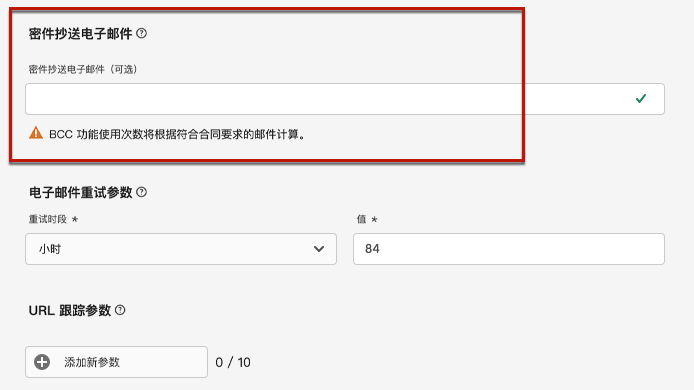

此外，在定义&#x200B;**[!UICONTROL 密件抄送电子邮件]**&#x200B;地址时，请确保使用具有有效MX记录配置的子域，否则电子邮件配置处理将失败。

如果您在提交电子邮件配置时遇到错误，则表示没有为输入地址的子域配置MX记录。 请与您的管理员联系以配置相应的MX记录，或使用另一个具有有效MX记录配置的地址。

## 发送到已禁止的电子邮件地址 {#send-to-suppressed-email-addresses}

>[!CONTEXTUALHELP]
>id="ajo_surface_suppressed_addresses"
>title="覆盖禁止列表优先级"
>abstract="可决定将交易型消息发送到轮廓，即使这些消息的电子邮件地址因垃圾邮件投诉而被列入 Adobe Journey Optimizer 禁止列表也是如此。默认禁用此选项。"
>additional-url="https://experienceleague.adobe.com/docs/journey-optimizer/using/configuration/monitor-reputation/manage-suppression-list.html?lang=zh-Hans" text="管理禁止列表"

>[!IMPORTANT]
>
>仅当您选择了&#x200B;**[!UICONTROL 事务型]**&#x200B;电子邮件类型时，此选项才可用。 [了解详情](#email-type)

在[!DNL Journey Optimizer]中，所有标记为硬退回、软退回和垃圾邮件投诉的电子邮件地址都会自动收集到[禁止列表](../configuration/manage-suppression-list.md)中，并且不会发送历程或营销活动。

但是，您可以决定继续向用户档案发送&#x200B;**事务型**&#x200B;邮件，即使其电子邮件地址因用户投诉垃圾邮件而包含在禁止列表上。

事实上，事务型消息通常包含有用和预期的信息，例如订单确认或密码重置通知。 因此，即使他们举报了您的某封营销邮件为垃圾邮件，在大多数情况下，您仍希望客户收到此类非商业电子邮件。

要在事务型消息受众中包含由于垃圾邮件投诉而抑制的电子邮件地址，请从&#x200B;**[!UICONTROL 发送到抑制的电子邮件地址]**&#x200B;部分中选择相应的选项。

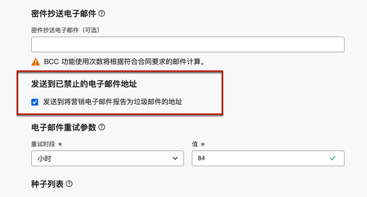

>[!NOTE]
>
>默认禁用此选项。

作为可投放性最佳实践，此选项默认处于禁用状态，以确保不联系已选择退出的客户。 但是，您可以更改此默认选项，这样您便可以向客户发送事务型消息。

启用此选项后，尽管客户将您的营销电子邮件标记为垃圾邮件，但这些客户将能够使用当前配置接收您的事务型消息。 始终确保根据可投放性最佳实践管理选择退出偏好设置。

## 种子列表 {#seed-list}

>[!CONTEXTUALHELP]
>id="ajo_surface_seed_list"
>title="添加种子列表"
>abstract="选择所选的种子列表以自动将特定的内部地址添加到受众。在投放执行时将纳入这些种子地址，并且这些种子地址将收到与消息完全一致的副本，以便让人放心。"
>additional-url="https://experienceleague.adobe.com/docs/journey-optimizer/using/configuration/seed-lists.html#use-seed-list" text="什么是种子列表？"

[!DNL Journey Optimizer]中的种子列表允许您在投放中自动包含特定的电子邮件种子地址。 [了解详情](../configuration/seed-lists.md)

>[!CAUTION]
>
>目前，此功能仅适用于电子邮件渠道。

在&#x200B;**[!UICONTROL 种子列表]**&#x200B;部分中选择与您相关的列表。 在[本节](../configuration/seed-lists.md#create-seed-list)中了解如何创建种子列表。

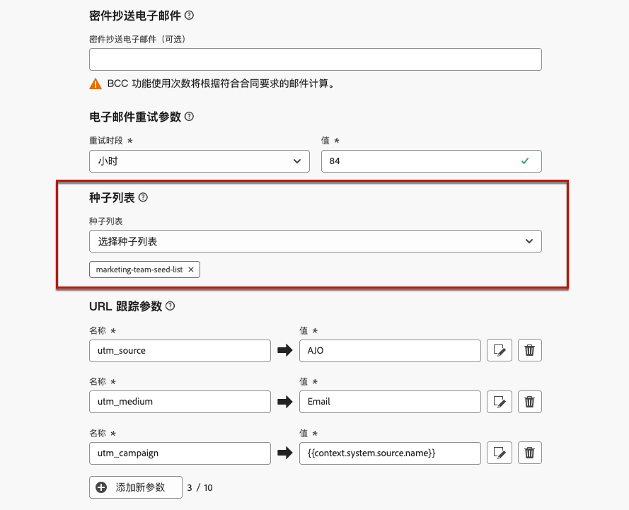{width="80%"}

>[!NOTE]
>
>一次只能选择一个种子列表。

在营销活动或历程中使用当前配置时，投放执行时间将包含所选种子列表上的电子邮件地址，这意味着他们将收到投放的副本以进行保证。

在[本节](../configuration/seed-lists.md#use-seed-list)中了解如何在营销活动或历程中使用种子列表。

## 电子邮件重试参数 {#email-retry}

>[!CONTEXTUALHELP]
>id="ajo_admin_presets_retryperiod"
>title="调整重试时段"
>abstract="当电子邮件投放由于临时软退回错误失败时，将重试 3.5 天（84 小时）。您可以调整此默认重试时段以更好地满足您的需求。"
>additional-url="https://experienceleague.adobe.com/docs/journey-optimizer/using/configuration/monitor-reputation/retries.html" text="关于重试"

您可以配置&#x200B;**电子邮件重试参数**。

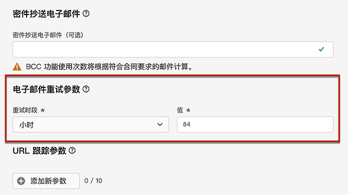

默认情况下，[重试时段](../configuration/retries.md#retry-duration)设置为84小时，但您可以调整此设置以更好地满足您的需求。

必须输入以下范围内的整数值（以小时或分钟为单位）：

* 对于营销电子邮件，最小重试期限为6小时。
* 对于事务性电子邮件，最小重试时间为10分钟。
* 对于这两种电子邮件类型，最大重试时间为84小时（或5040分钟）。

在[本节](../configuration/retries.md)中了解重试的详细信息。

## URL 跟踪 {#url-tracking}

>[!CONTEXTUALHELP]
>id="ajo_admin_preset_utm"
>title="定义 URL 跟踪参数"
>abstract="使用此部分可自动将跟踪参数附加到在电子邮件内容中提供的 URL。此功能属于可选功能。"

>[!CONTEXTUALHELP]
>id="ajo_admin_preset_url_preview"
>title="预览 URL 跟踪参数"
>abstract="查看如何对电子邮件内容中出现的 URL 附加跟踪参数。"

您可以使用&#x200B;**[!UICONTROL URL跟踪参数]**&#x200B;来衡量跨渠道营销工作的有效性。 此功能属于可选功能。

此部分中定义的参数将被附加到电子邮件内容中包含的URL的末尾。 然后，您可以在Adobe Analytics或Google Analytics等网站分析工具中捕获这些参数，并创建各种性能报表。

您可使用&#x200B;**[!UICONTROL 添加新参数]**&#x200B;按钮添加最多10个跟踪参数。

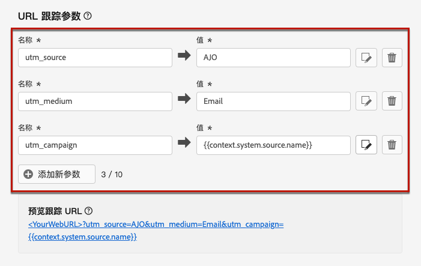{width="80%"}

要配置URL跟踪参数，可以直接在&#x200B;**[!UICONTROL 名称]**&#x200B;和&#x200B;**[!UICONTROL 值]**&#x200B;字段中输入所需的值。

您还可以使用[个性化编辑器](../personalization/personalization-build-expressions.md)编辑每个&#x200B;**[!UICONTROL 值]**&#x200B;字段。 单击版本图标以打开编辑器。 从该位置，您可以选择可用的上下文属性和/或直接编辑文本。

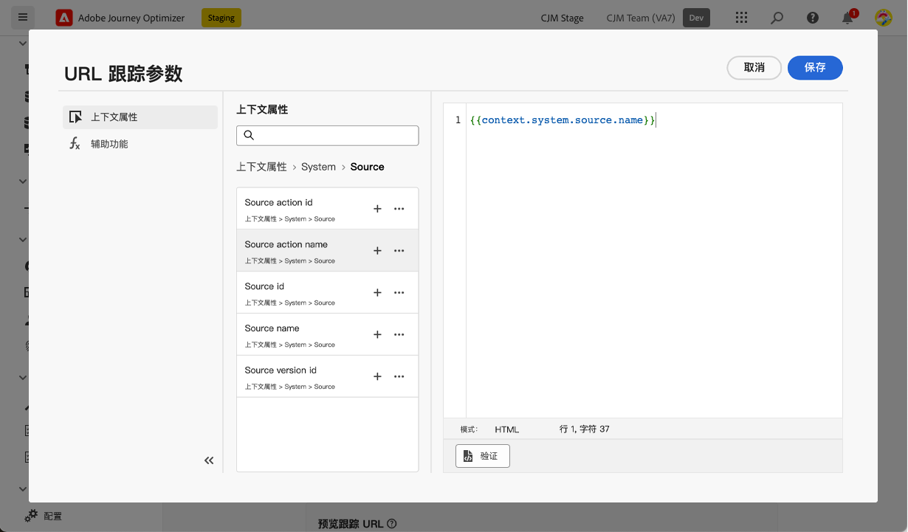

以下预定义值可通过个性化编辑器使用：

* **Source操作ID**：添加到历程或营销策划的电子邮件操作的ID。

* **Source操作名称**：添加到历程或营销策划的电子邮件操作的名称。

* **Source id**：发送电子邮件的历程或营销活动的ID。

* **Source名称**：发送电子邮件的历程或营销活动的名称。

* **Source版本ID**：发送电子邮件的历程或营销活动版本的ID。

* **优惠ID**：电子邮件中使用的优惠ID。

>[!NOTE]
>
>您可以组合键入文本值，并使用个性化编辑器中的上下文属性。 每个&#x200B;**[!UICONTROL 值]**&#x200B;字段可以包含个字符，最大限制为5 KB。

<!--You can drag and drop the parameters to reorder them.-->

以下是与Adobe Analytics和Google Analytics兼容的URL示例。

* 与Adobe Analytics兼容的URL： `www.YourLandingURL.com?cid=email_AJO_{{context.system.source.id}}_image_{{context.system.source.name}}`

* 与Google Analytics兼容的URL： `www.YourLandingURL.com?utm_medium=email&utm_source=AJO&utm_campaign={{context.system.source.id}}&utm_content=image`

您可以动态预览生成的跟踪URL。 每次添加、编辑或删除参数时，都会自动更新预览。

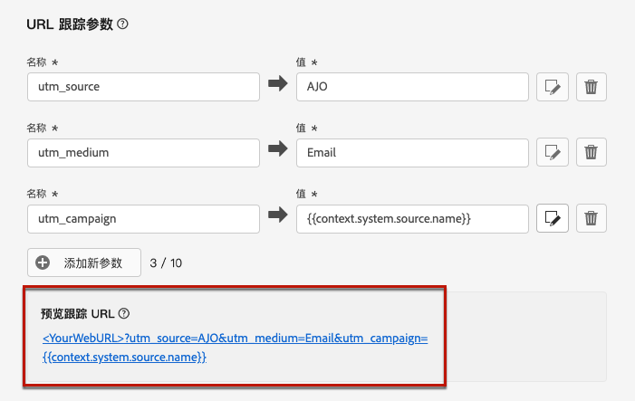

>[!NOTE]
>
>您还可以向电子邮件内容中存在的链接添加动态个性化跟踪参数，但这在配置级别是不可能的。 使用电子邮件设计器创作消息时，需要执行此操作。 [了解详情](message-tracking.md#url-tracking)

## 执行地址 {#execution-address}

>[!CONTEXTUALHELP]
>id="ajo_email_config_execution_address"
>title="覆盖要使用的默认执行地址"
>abstract="当数据库中有多个电子邮件地址（个人、职业等）时，您可以选择优先向哪个电子邮件地址或电话号码发送。主要地址在沙盒级别定义，但您可以在此处覆盖此特定电子邮件设定的默认设置。"

定向用户档案时，数据库中可能会提供多个电子邮件地址（专业电子邮件地址、个人电子邮件地址等）。

在这种情况下，[!DNL Journey Optimizer]在沙盒级别使用&#x200B;**[!UICONTROL 执行字段]**&#x200B;中指定的地址来确定要优先从配置文件服务中使用的电子邮件地址。 [了解详情](../configuration/primary-email-addresses.md)

>[!NOTE]
>
>要检查当前默认使用的字段，请访问&#x200B;**[!UICONTROL 管理]** > **[!UICONTROL 渠道]** > **[!UICONTROL 常规设置]** > **[!UICONTROL 执行字段]**&#x200B;菜单。

但是，您可以在电子邮件渠道配置级别更改此默认执行字段。 然后，您可以将此设置应用于特定营销活动或历程。

为此，请编辑&#x200B;**[!UICONTROL 投放地址]**&#x200B;字段并从可用电子邮件类型XDM字段列表中选择一个项目。

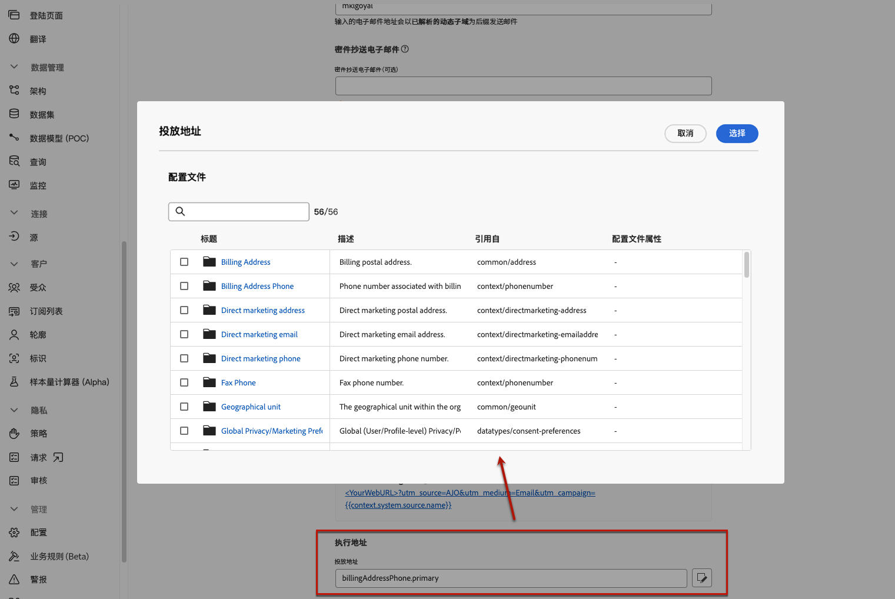

执行字段已更新，然后用作主地址。 它覆盖沙盒级别的常规设置。
