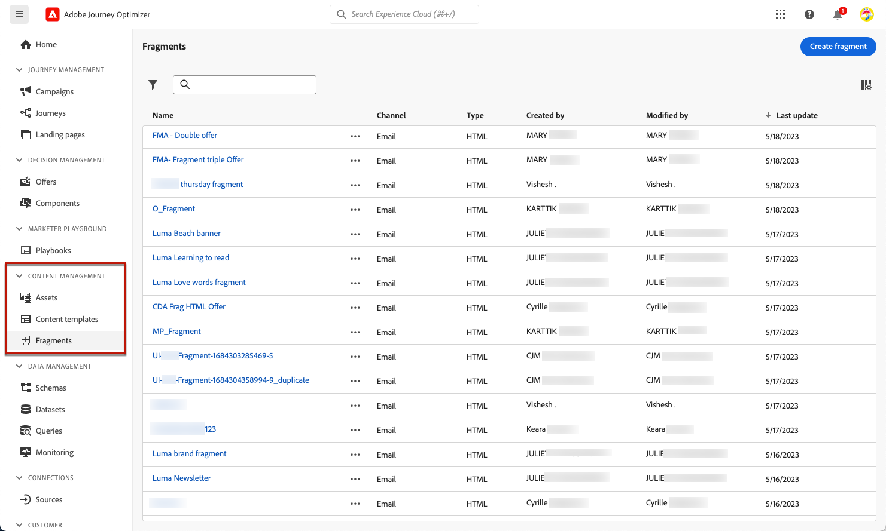
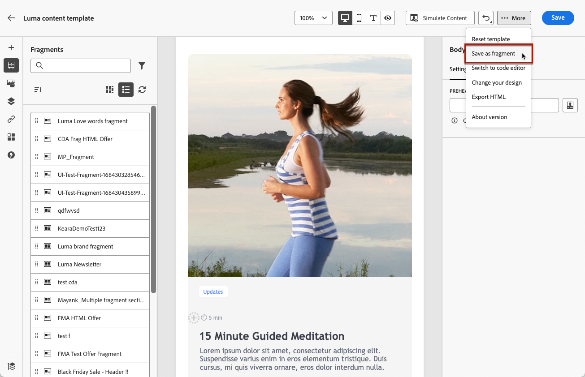

# 使用片段 {#fragments}

片段是可重复使用的组件，可在的一个或多个电子邮件中引用 [!DNL Journey Optimizer] 营销活动和历程。

此功能允许预先构建多个自定义内容块，非技术性营销用户可以使用这些内容块在改进的设计过程中快速组合电子邮件内容。

➡️ [在此视频中了解如何管理、创作和使用片段](#video-fragments)

>[!CAUTION]
>
>要创建、编辑和存档片段，您必须拥有 **[!DNL Manage Library Items]** 权限包含在 **[!DNL Content Library Manager]** 产品配置文件。 [了解详情](../administration/ootb-product-profiles.md#content-library-manager)

要充分利用片段，请执行以下操作：

* 创建您自己的片段。 参见 [创建片段](#create-fragments)
* 在电子邮件中根据需要多次使用它们。 参见 [使用片段](#use-fragments)

>[!NOTE]
>
>目前，此功能仅适用于电子邮件。

## 访问和管理片段 {#access-manage-fragments}

要访问片段列表，请选择 **[!UICONTROL 内容管理]** > **[!UICONTROL 片段]** 从左侧菜单中。

在当前沙盒上创建的所有片段 — 来自 **[!UICONTROL 片段]** 菜单，使用 [另存为片段](#save-as-fragment) 选项 — 将显示。

您可以在创建或修改日期筛选片段。 您可以选择显示所有片段，或仅显示当前用户创建或修改的项目。 您还可以显示 **[!UICONTROL 已存档]** 片段。 [了解详情](#archive-fragments)

从 **[!UICONTROL 更多操作]** 图标旁边，您可以：

* 复制片段。

* 使用 **[!UICONTROL 浏览引用]** 选项以查看使用它的历程、营销活动或模板。 [了解详情](#explore-references)

* 存档片段。 [了解详情](#archive-fragments)

### 编辑片段 {#edit-fragments}

要编辑片段，请执行以下步骤。

1. 单击以下位置中所需的项目： **[!UICONTROL 片段]** 列表。
1. 在片段属性中，您可以 [浏览引用](#explore-references)， [管理其访问权限](../administration/object-based-access.md) 并更新片段详细信息。

   

1. 选择相应的按钮以编辑内容，就像从头开始创建片段时所做的那样。 [了解详情](#create-from-scratch)

>[!NOTE]
>
>编辑片段时，更改会自动传播到包含该片段的所有电子邮件或模板，但中使用的电子邮件除外 **[!UICONTROL 实时]** 历程或营销活动。 您还可以中断来自原始片段的继承。 [了解详情](#break-inheritance)

<!--Changes made to a fragment are not propagated to live journeys or campaigns where it is used.-->

<!--When added to an email, if you want to modify a fragment for a specific email, you can break the synchronization with the original fragment. The fragment becomes part of the email content and the changes will not be synchronized anymore. [Learn more](#break-inheritance)-->

### 浏览引用 {#explore-references}

您可以显示当前使用片段的历程、营销活动和内容模板列表。

要执行此操作，请选择 **[!UICONTROL 浏览引用]** 来自 **[!UICONTROL 更多操作]** 菜单，或从片段属性屏幕中进行查看。

选择一个选项卡，可在历程、营销活动和模板之间切换。 您可以查看其状态，然后单击名称以重定向到引用片段的相应项目。

>[!NOTE]
>
>如果片段用在历程、营销策划或模板中，且带有阻止您访问片段的标签，您将在所选选项卡顶部看到一条警报消息。 [了解有关对象级访问控制(OLAC)的更多信息](../administration/object-based-access.md)

### 存档片段 {#archive-fragments}

您可以从不再与您的品牌相关的项目中清理片段列表。

要执行此操作，请单击 **[!UICONTROL 更多操作]** 图标，然后选择 **[!UICONTROL 存档]**. 它会从片段列表中消失，从而阻止用户在未来电子邮件或模板中使用它。

>[!NOTE]
>
>如果您存档在电子邮件或内容模板中使用的片段， <!--it will remain in the email or template, but you won't be able to select it from the fragment list to edit it-->电子邮件或模板不会受到影响。

要取消存档片段，请在 **[!UICONTROL 已存档]** 项并选择 **[!UICONTROL 取消存档]** 从 **[!UICONTROL 更多操作]** 菜单。 现在可从片段列表再次访问该区域，并可在任何电子邮件或模板中使用。

## 创建片段 {#create-fragments}

创建片段的方法有两种：

* 使用，从头开始创建一个片段 **[!UICONTROL 片段]** 专用菜单。 [了解如何操作](#create-template-from-scratch)

* 设计电子邮件或内容模板时，将部分内容另存为片段。 [了解如何操作](#save-as-template)

保存后，您的片段即可用于历程、营销策划或模板。 无论是从头创建还是从现有内容创建，您现在都可以在构建任何内容时使用此片段 [电子邮件](get-started-email-design.md) 或 [内容模板](content-templates.md) 范围 [!DNL Journey Optimizer]. [了解详情](#use-fragments)

### 从头开始创建 {#create-from-scratch}

>[!CONTEXTUALHELP]
>id="ajo_create_fragment"
>title="定义您自己的片段"
>abstract="从头开始创建一个独立片段，以使您的内容可在多个历程和营销活动中重复使用。"

要从头开始创建片段，请执行以下步骤。

1. 通过访问片段列表 **[!UICONTROL 内容管理]** > **[!UICONTROL 片段]** 左侧菜单。

1. 选择 **[!UICONTROL 创建片段]**.

1. 填写片段详细信息，即名称和描述（如果需要）。

   

   >[!NOTE]
   >
   >当前仅 **[!UICONTROL 可视片段]** 类型和 **电子邮件** 支持渠道。

1. 要将自定义或核心数据使用标签分配给片段，请选择 **[!UICONTROL 管理访问权限]**. [了解有关对象级访问控制(OLAC)的更多信息](../administration/object-based-access.md).

1. 单击&#x200B;**[!UICONTROL 创建]**。

1. 此 [电子邮件设计工具](get-started-email-design.md) 显示。 根据需要编辑内容，就像对历程或营销活动中的任何电子邮件执行操作一样。

   >[!NOTE]
   >
   >您可以添加个性化字段和动态内容，但片段中不支持上下文属性。

   

1. 片段准备就绪后，单击 **[!UICONTROL 保存]**.

1. 如果需要，单击片段名称旁边的箭头以返回到 **[!UICONTROL 详细信息]** 屏幕并进行编辑。

   

现在，此片段已准备好在构建任意 [电子邮件](get-started-email-design.md) 或 [内容模板](content-templates.md) 范围 [!DNL Journey Optimizer]. [了解如何操作](#use-fragments)

### 另存为片段 {#save-as-fragment}

设计 [内容模板](content-templates.md) 或 [电子邮件](get-started-email-design.md) 在营销活动或历程中，您可以将部分内容另存为片段以供将来重复使用。 为此，请执行以下步骤。

1. 在 [电子邮件设计工具](get-started-email-design.md)中，单击屏幕右上方的省略号。

1. 选择 **[!UICONTROL 另存为片段]** 下拉菜单中。

   

1. 此 **[!UICONTROL 另存为片段]** 屏幕显示。 其中选择要包含在片段中的元素，包括个性化字段和动态内容。 请注意，片段中不支持上下文属性。

   >[!CAUTION]
   >
   >只能选取彼此相邻的截面。 不能选择空的结构或其他片段。

   

1. 单击&#x200B;**[!UICONTROL 创建]**。填写片段详细信息，即名称和描述（如果需要）。

   

   >[!NOTE]
   >
   >当前仅 **[!UICONTROL 可视片段]** 类型和 **电子邮件** 支持渠道。

1. 要将自定义或核心数据使用标签分配给片段，请选择 **[!UICONTROL 管理访问权限]**. [了解有关对象级访问控制(OLAC)的更多信息](../administration/object-based-access.md).

1. 单击 **[!UICONTROL 创建]** 再来一次。 片段将保存到 **[!UICONTROL 片段]** 列表，可从访问 [!DNL Journey Optimizer] 专用菜单。

   它会变成一个独立的片段，可以 [已访问](#access-manage-fragments)， [已编辑](#edit-fragments) 和 [已存档](#archive-fragments) 与列表上的任何其他项目相同。

现在，您可以在构建任何 [电子邮件](get-started-email-design.md) 或 [内容模板](content-templates.md) 范围 [!DNL Journey Optimizer]. [了解如何操作](#use-fragments)

>[!NOTE]
>
>对该新片段所做的任何更改都不会传播到它来自的电子邮件或模板。 同样，在该电子邮件或模板中编辑原始内容时，不会修改新片段。

## 使用片段 {#use-fragments}

您可以在以下位置使用片段 [电子邮件](get-started-email-design.md) 在历程或营销策划中，或在 [内容模板](content-templates.md).

1. 使用打开任何电子邮件或模板内容 [电子邮件设计工具](get-started-email-design.md).

1. 选择 **[!UICONTROL 片段]** 图标。

   

1. 此时将显示在当前沙盒中创建的所有片段的列表。 您可以：

   * 通过开始键入其标签来搜索特定片段。
   * 按升序或降序对片段排序。
   * 更改片段的显示方式（卡片或列表视图）。

1. 您还可以刷新列表。

   >[!NOTE]
   >
   >如果在编辑内容时修改或添加了某些片段，则列表将使用最新更改进行更新。

1. 将列表中的任何片段拖放到要插入它的区域。

   

1. 与任何其他组件一样，您可以在内容中移动片段。

1. 选择片段以在右侧显示相应的窗格。 从该位置，您可以从内容中删除片段或复制片段。 您还可以直接从片段顶部显示的上下文菜单执行这些操作。

   

1. 从 **[!UICONTROL 设置]** 选项卡，您可以：

   * 选择您希望片段显示的设备。
   * 根据需要，在新选项卡中打开片段以对其进行编辑。 [了解详情](#edit-fragments)
   * 浏览引用。 [了解详情](#explore-references)

1. 您可以使用进一步自定义片段 **[!UICONTROL 样式]** 选项卡。

1. 如果需要，您可以使用原始片段中断继承。 [了解详情](#break-inheritance)

1. 添加所需数量的片段，并 **[!UICONTROL 保存]** 您所做的更改。

### 中断继承 {#break-inheritance}

编辑片段时，更改将同步。 它们会自动传播到所有 **[!UICONTROL 草稿]** 历程/营销活动和包含该片段的内容模板。

>[!NOTE]
>
>更改不会传播到中使用的电子邮件 **[!UICONTROL 实时]** 历程或营销活动。

添加到电子邮件或内容模板时，片段默认进行同步。

但是，您可以中断来自原始片段的继承。 在这种情况下，片段的内容将会复制到当前设计中，并且所做的更改将不再同步。

要中断继承，请执行以下步骤：

1. 选择片段。

1. 单击上下文工具栏中的解锁图标。

   

1. 该片段将成为不再链接到原始片段的独立元素。 将其编辑为内容中的任何其他内容组件。 [了解详情](content-components.md)

## 操作方法视频 {#video-fragments}

了解如何在中管理、创作和使用片段 [!DNL Journey Optimizer].

>[!VIDEO](https://video.tv.adobe.com/v/3419932/?quality=12)

