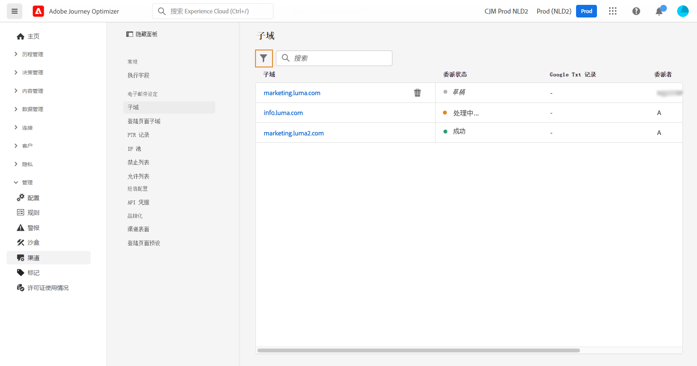
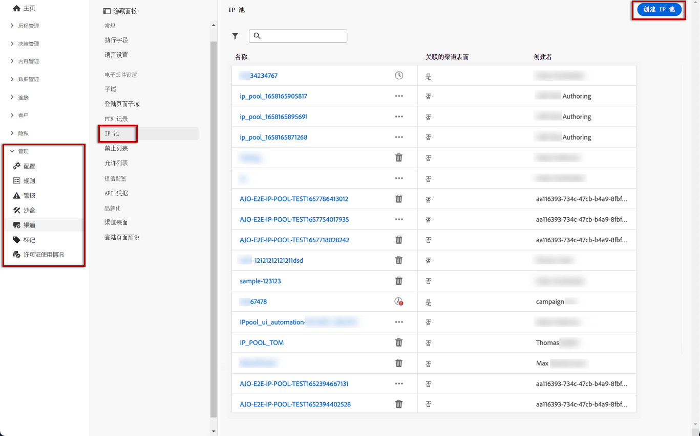
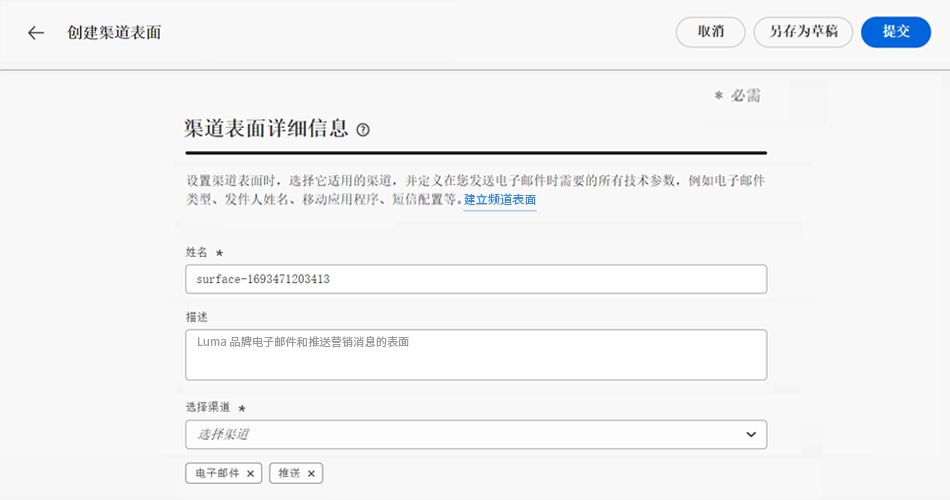
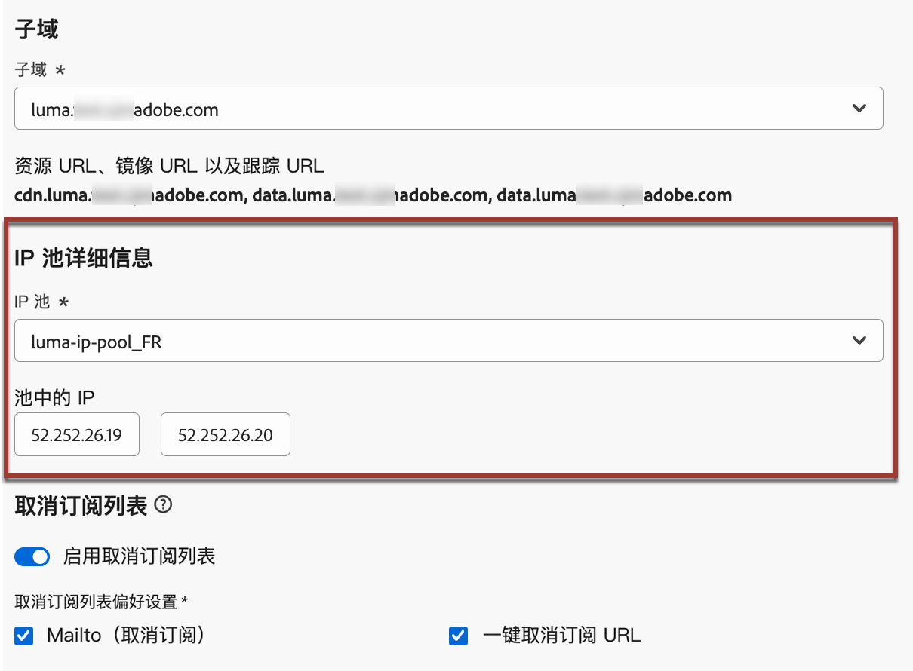
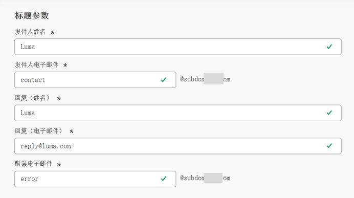
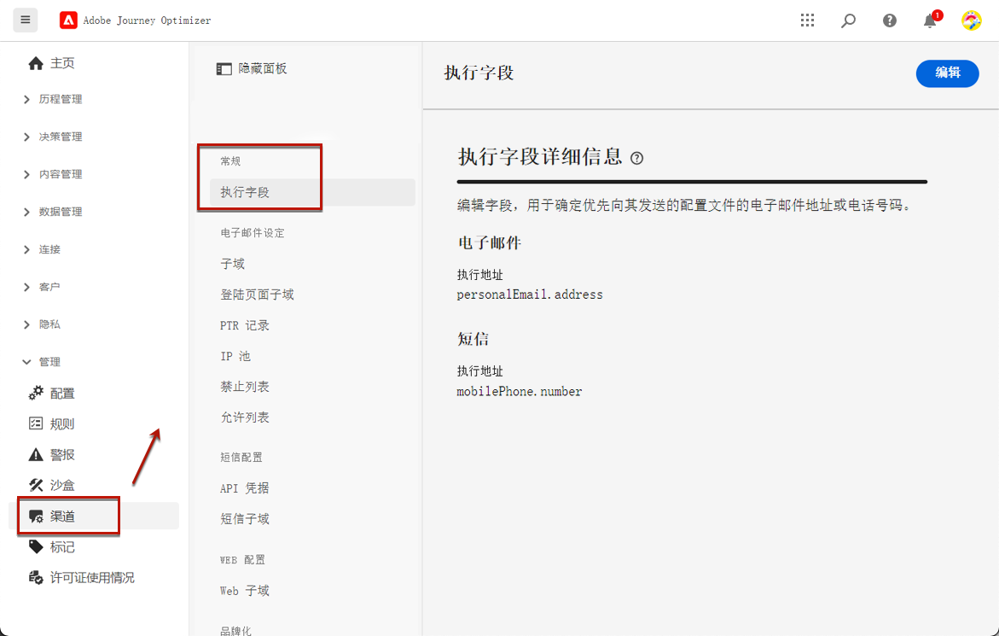
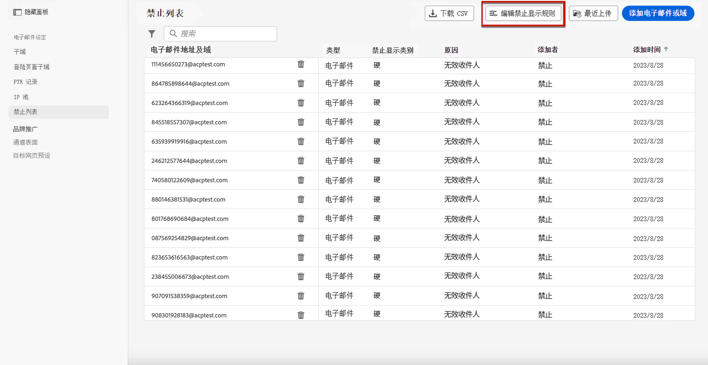

# 电子邮件配置快速入门 {#get-starte-email-config}

>[!BEGINSHADEBOX]

**在此页面上：**&#x200B;了解在Adobe Journey Optimizer中配置电子邮件渠道的基本步骤，从委派子域和创建IP池到设置渠道配置、执行字段和重试。

>[!ENDSHADEBOX]

在 Adobe Journey Optimizer 中配置电子邮件渠道是创建具有影响力、个性化的电子邮件体验的关键，可有效吸引受众。

此部分将指导您完成通过[!DNL Journey Optimizer]发送电子邮件所需的基本配置步骤。 您还将了解如何设置电子邮件标头、为多个品牌进行个性化设置、启用 URL 跟踪以进行分析，甚至添加一键取消订阅链接为用户提供便捷。 每个主题都建立在前一个主题的基础上，为您提供微调电子邮件策略的工具，同时保持控制和精确性。

要在 [!DNL Journey Optimizer] 中通过历程和营销活动发送电子邮件，需要完成多个配置步骤。 这些步骤如下所示：

1. 为确保最佳投放效果并保护声誉，请首先&#x200B;**委派给 Adobe 您要用于通过 [!DNL Journey Optimizer] 发送电子邮件的子域**。 这些子域将确定要跟踪的网页和镜像页面 URL 等元素。 [了解详情](../configuration/about-subdomain-delegation.md)

   

1. 创建 IP 池，将使用实例设置的 **IP 地址分组在一起**。 [了解详情](../configuration/ip-pools.md)

   

1. 创建&#x200B;**渠道配置**，然后选择&#x200B;**[!UICONTROL 电子邮件]**&#x200B;渠道。 [了解详情](../configuration/channel-surfaces.md)

   

1. 在每个电子邮件渠道配置中，配置发送电子邮件所需的所有&#x200B;**技术参数**。 [了解详情](email-settings.md)

   * 在这里，您可以选择要用于发送电子邮件的子域，以及要与配置关联的 IP 池。 [了解详情](email-settings.md#ip-pools)

   

   * **[!UICONTROL 发件人电子邮件前缀]**&#x200B;和&#x200B;**[!UICONTROL 错误电子邮件前缀]**&#x200B;使用当前所选的[委派子域](../configuration/about-subdomain-delegation.md)。 或者，**[!UICONTROL 发件人姓名]**&#x200B;和&#x200B;**[!UICONTROL 发件人电子邮箱]**&#x200B;可用于标识不同的传输方（完整的&#x200B;**发件人**&#x200B;地址，不与该子域后缀关联）。 [了解详情](header-parameters.md#sender-header)

   

1. 通过设置其他高级参数完成电子邮件渠道配置，例如启用密送、为分析定义 URL 跟踪或添加一键取消订阅链接为用户提供便捷。 [了解详情](email-settings.md)

1. 当 Adobe Experience Platform 中有多个地址可用时，确定要优先为收件人使用的&#x200B;**执行字段**。 [了解详情](../configuration/primary-email-addresses.md)

   

1. 管理在将电子邮件地址发送到禁止列表之前执行&#x200B;**重试**&#x200B;的天数。 [了解详情](../configuration/manage-suppression-list.md)

   

:::: landing-cards-container
:::

电子邮件配置快速入门

了解配置电子邮件功能的基本步骤，包括子域委派、IP 池和禁止列表管理。

[开始配置电子邮件](get-started-email-config.md)
:::

:::

定义电子邮件配置设置

设置电子邮件配置以实现可投放性、合规性和自定义，包括密送、禁止列表覆盖和 URL 跟踪等高级功能。

[配置设置](email-settings.md)
:::

:::

启用并配置取消列表订阅

了解如何启用“取消列表订阅”功能，在电子邮件标头中加入一键取消订阅 URL，以便收件人选择退出。

[设置取消列表订阅](list-unsubscribe.md)
:::

:::

配置电子邮件标头参数

自定义发件人和回复电子邮件地址、处理错误并转发电子邮件，以实现有效通信。

[设置标头参数](header-parameters.md)
:::

:::

为电子邮件渠道配置 URL 跟踪

设置 URL 跟踪参数以衡量电子邮件促销活动的效果并与分析工具集成。

[设置 URL 跟踪](url-tracking.md)
:::

:::

个性化电子邮件配置设置

设置动态子域、个性化标头和 URL 跟踪，以提供定制化的电子邮件体验。

[配置个性化电子邮件](surface-personalization.md)
:::

::::
