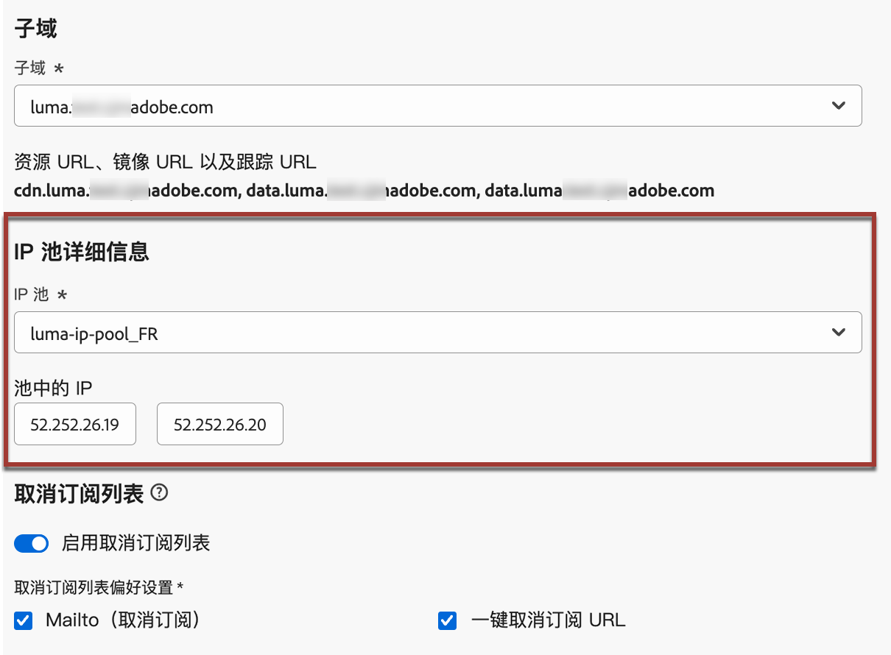

# 电子邮件配置入门 {#get-starte-email-config}

要在 [!DNL Journey Optimizer] 中通过历程和营销活动发送电子邮件，需要完成多个配置步骤。

1. 为确保获得最佳可投放性并保护您的声誉，请首先通过&#x200B;**向Adobe委派您用于发送电子邮件的子域**。 [!DNL Journey Optimizer]这些子域将确定要跟踪的网页和镜像页面 URL 等元素。[了解详情](../configuration/about-subdomain-delegation.md)

   

1. 创建IP池，以将&#x200B;**与使用实例设置的IP地址**&#x200B;分组在一起。 [了解详情](../configuration/ip-pools.md)

   

1. 创建&#x200B;**渠道配置**&#x200B;并选择&#x200B;**[!UICONTROL 电子邮件]**&#x200B;渠道。 [了解详情](../configuration/channel-surfaces.md)

   

1. 在每个电子邮件渠道配置中，配置发送电子邮件所需的所有&#x200B;**技术参数**。 [了解详情](email-settings.md)

   * 在这里，您可以选择要用于发送电子邮件的子域，以及要与配置关联的 IP 池。[了解详情](email-settings.md#subdomains-and-ip-pools)

   

   * **[!UICONTROL 发件人电子邮件]**&#x200B;和&#x200B;**[!UICONTROL 错误电子邮件]**&#x200B;地址必须使用当前选定的委派子域。[了解详情](email-settings.md#email-header)

   

1. 当Adobe Experience Platform中有多个地址可用时，确定要优先用于收件人的&#x200B;**执行字段**。 [了解详情](../configuration/primary-email-addresses.md)

   

1. 管理在将电子邮件地址发送到禁止列表之前执行&#x200B;**重试**&#x200B;的天数。[了解详情](../configuration/manage-suppression-list.md)

   
