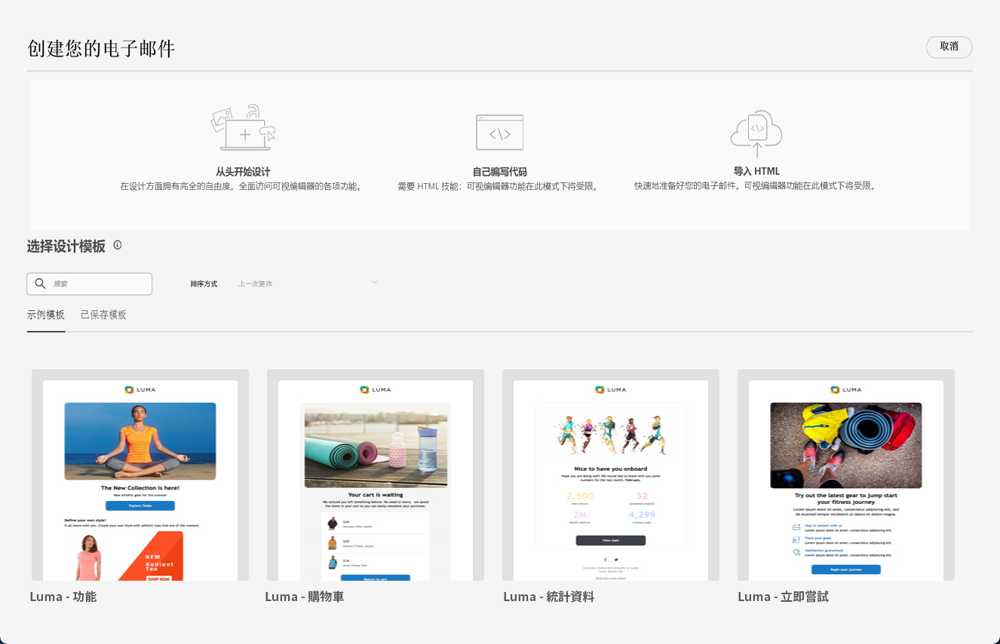
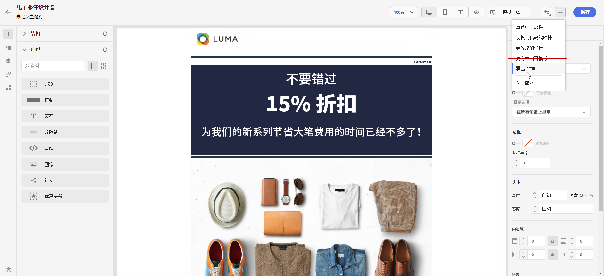

# 电子邮件设计入门 {#get-started-content-design}

您可以在 [!DNL Journey Optimizer] 中导入现有内容或利用内容设计功能：

* 使用[!DNL Journey Optimizer]**电子邮件设计功能**，设计或导入响应式电子邮件。[了解详情](content-from-scratch.md)

* 利用 **Adobe Experience Manager Assets Essentials** 来丰富您的电子邮件，构建和管理自己的资源数据库。[了解详情](assets-essentials.md)

* 查找 **Adobe Stock 照片**&#x200B;以构建内容并改进电子邮件设计。[了解详情](stock.md)

* 根据客户的个人资料属性创建个性化的动态消息以增强客户体验。详细了解[个性化](../personalization/personalize.md)和[动态内容](../personalization/get-started-dynamic-content.md)。

➡️ [在视频中了解此功能](#video)

## 电子邮件设计最佳实践 {#best-practices}

发送电子邮件时，请务必考虑收件人可能会转发这些电子邮件，这有时可能会导致电子邮件呈现出现问题。当使用电子邮件服务提供商可能不支持的 CSS 类进行转发时（例如，如果您使用“is-desktop-hidden”CSS 类在移动设备上隐藏图像），尤其如此。

为了最大限度地减少这些呈现问题，我们建议尽可能简化电子邮件设计结构。请尝试使用适用于桌面和移动设备的单个设计，并避免使用复杂的 CSS 类或其他设计元素，可能并非所有电子邮件客户端都完全支持这些元素。遵循这些最佳实践有助于您确保电子邮件均能始终如一地正确呈现，无论收件人如何查看或转发电子邮件。

## 创建电子邮件内容的关键步骤 {#key-steps}

将[电子邮件添加](create-email.md)到历程或营销活动后，您便可以开始创建电子邮件内容。

1. 在历程或营销活动配置屏幕中，浏览&#x200B;**[!UICONTROL 编辑内容]**&#x200B;屏幕，访问“电子邮件设计器”。[了解详情](create-email.md#define-email-content)

   

1. 在“电子邮件设计器”主页上，从以下选项中选择设计电子邮件的方式：

   * 通过电子邮件设计器的界面&#x200B;**从头开始设计电子邮件**，并利用 [Adobe Experience Manager Assets Essentials](assets-essentials.md) 中的图像。要了解如何设计电子邮件内容，请参阅[此部分](content-from-scratch.md)。

   * 在电子邮件设计器中直接&#x200B;**编码或粘贴原始 HTML**。要了解如何编码自己的内容，请参阅[此部分](code-content.md)。

      >[!NOTE]
      >
      >在营销活动中，您还可以选择&#x200B;**[!UICONTROL 编辑内容]**&#x200B;屏幕中的&#x200B;**[!UICONTROL 代码编辑器]**&#x200B;按钮。[了解详情](create-email.md#define-email-content)

   * 从文件或 .zip 文件夹&#x200B;**导入现有 HTML 内容**。要了解如何导入电子邮件内容，请参阅[此部分](existing-content.md)。

   * 从内置或自定义模板列表中&#x200B;**选择现有内容**。要了解如何使用电子邮件模板，请参阅[此部分](email-templates.md)。

   

1. 定义并个性化电子邮件内容后，即可导出内容以供验证或稍后使用。单击&#x200B;**[!UICONTROL 导出 HTML]** 在计算机上保存一个 zip 文件，其中将包含您的 HTML 和资源。

   

## 操作方法视频 {#video}

了解如何使用消息编辑器创建电子邮件内容。

>[!VIDEO](https://video.tv.adobe.com/v/334150?quality=12)