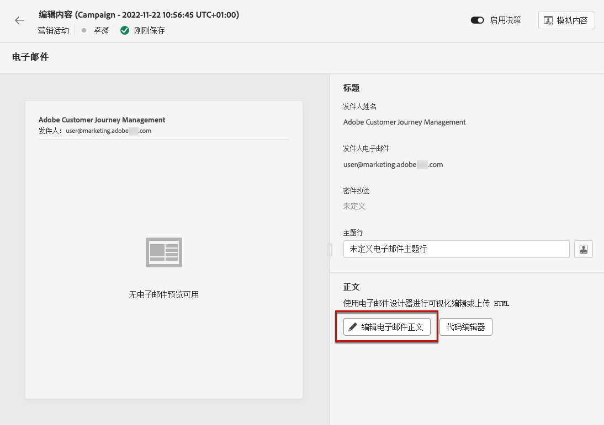
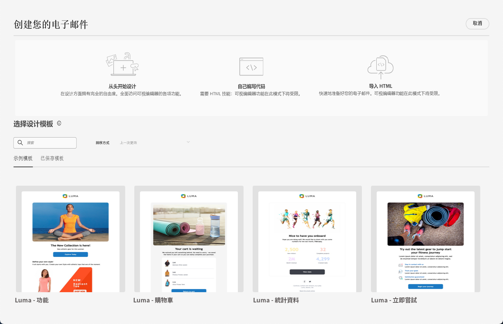
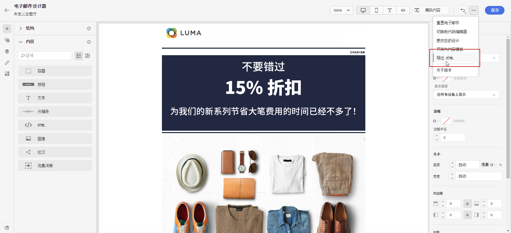

# 电子邮件设计快速入门 {#get-started-content-design}

>[!BEGINSHADEBOX]

**在此页面上：**&#x200B;了解如何在电子邮件设计器中设计电子邮件内容，从头开始、通过代码或导入的 HTML 构建内容的关键步骤，以及使电子邮件在客户端之间呈现良好渲染效果的最佳实践。

>[!ENDSHADEBOX]

要访问电子邮件设计器并开始设计电子邮件内容，您必须先在历程或营销活动中[创建电子邮件](create-email.md)。

然后，您可以使用[!DNL Journey Optimizer]**电子邮件设计功能**&#x200B;导入现有内容或从头开始构建响应式电子邮件。 [了解详情](content-from-scratch.md)

通过电子邮件设计器，您还可以：

* 利用 **Adobe Experience Manager Assets Essentials** 来丰富您的电子邮件，构建和管理自己的资源数据库。 [了解详情](../integrations/assets.md)

* 查找 **Adobe Stock 照片**&#x200B;以构建内容并改进电子邮件设计。 [了解详情](../integrations/stock.md)

* 根据客户的轮廓属性创建个性化的动态消息以增强客户体验。 详细了解[个性化](../personalization/personalize.md)和[动态内容](../personalization/get-started-dynamic-content.md)。

➡️ [通过观看视频了解此功能](#video)

## 创建电子邮件内容的关键步骤 {#key-steps}

创建电子邮件后，即可开始设计电子邮件内容。

1. 在历程或营销活动配置屏幕中，浏览&#x200B;**[!UICONTROL 编辑内容]**&#x200B;屏幕，访问“电子邮件设计器”。 [了解详情](create-email.md#define-email-content)

   

1. 在“电子邮件设计器”主页上，从以下选项中选择设计电子邮件的方式：

   * 通过电子邮件设计器的界面，并利用 [Adobe Experience Manager Assets Essentials](../integrations/assets.md) 中的图像，**从头开始设计电子邮件**。 要了解如何设计电子邮件内容，请参阅[此部分](content-from-scratch.md)。

   * 直接在电子邮件设计器中&#x200B;**编写或粘贴原始 HTML**。 要了解如何编码自己的内容，请参阅[此部分](code-content.md)。

     >[!NOTE]
     >
     >在营销活动中，您还可以选择&#x200B;**[!UICONTROL 编辑内容]**&#x200B;屏幕中的&#x200B;**[!UICONTROL 代码编辑器]**&#x200B;按钮。 [了解详情](create-email.md#define-email-content)

   * 从文件或 .zip 文件夹&#x200B;**导入现有 HTML 内容**。 要了解如何导入电子邮件内容，请参阅[此部分](existing-content.md)。

   * **使用 AI 驱动的图像到 HTML 转换器，将图像设计转换为 HTML 模板**。 在[本节](../content-management/image-to-html.md)中了解如何将静态图像转换为可编辑的电子邮件模板。

   * 从内置或自定义模板列表中&#x200B;**选择现有内容**。 通过[本节](../email/use-email-templates.md)了解如何使用电子邮件模板。

   

1. 定义电子邮件内容并进行个性化后，您便可以通过&#x200B;**自动内容检查**&#x200B;来验证电子邮件内容，以便在发送之前直接在创作面板中捕获 HTML 和 CSS 问题，例如不支持的标记、空 div 和大小限制违规。 [了解详情](content-check.md)

   >[!NOTE]
   >
   >系统还会在您设计时检查关键设置并显示警告（建议和最佳实践）和错误（阻止测试或激活的阻止问题）警报。 [详细了解电子邮件警报](create-email.md#check-email-alerts)

   

1. 您还可以验证内容质量，以确定可读性、内容一致性和有效性方面的潜在问题。 [详细了解内容质量验证](../content-management/brands-score.md#validate-quality)

   

1. 最后，您可以导出内容以供验证或稍后使用。 单击&#x200B;**[!UICONTROL 导出 HTML]** 以在计算机上保存一个 zip 文件，其中将包含您的 HTML 和资源。

   

## 电子邮件设计最佳实践 {#best-practices}

在发送电子邮件时，请务必考虑到收件人可能会转发它们，而这有时会导致电子邮件的呈现出现问题。 当用于转发的电子邮件提供商无法支持所使用的 CSS 类时尤为如此，例如，如果您使用“is-desktop-hidden”CSS 类来隐藏移动设备上的图像。

为了最大限度地减少这些呈现问题，我们建议尽可能简化电子邮件设计结构。 请尝试使用适用于桌面和移动设备的单个设计，并避免使用复杂的 CSS 类或其他设计元素，可能并非所有电子邮件客户端都完全支持这些元素。

>[!NOTE]
>
>当电子邮件通过移动 Web 浏览器在 Gmail 或 Outlook 中打开时也是如此，其中 CSS 处理方式与原生应用程序存在显着差异 — 使用完全内联样式的简单、基于表格的布局是最安全的选择。 [了解详情](#mobile-web-limitations)

遵循这些最佳实践有助于您确保电子邮件均能始终如一地正确呈现，无论收件人如何查看或转发电子邮件。

有关电子邮件设计的最佳实践，请参阅下表：

| 推荐 | 谨慎使用 | 不推荐 |
|-|-|-|
| <ul><li>用于结构的<b>基于表的静态布局</b></li> <li>用于保持布局一致性的 <b>HTML 表和嵌套表</b></li> <li>介于 600px 和 800px 之间的<b>模板宽度</b> </li> <li>用于设置样式的<b>简单内联 CSS</b> </li> <li>用于实现通用兼容性的 <b>Web 安全字体</b></li> | <ul><li>某些电子邮件平台可能不显示<b>背景图像</b>。</li><li><b>自定义 Web 字体</b>缺少通用支持。</li><li><b>宽布局</b>在较小的屏幕上显示效果不佳。</li><li><b>图像映射</b>提供有限的功能。</li><li><b>嵌入式 CSS</b> 在电子邮件投放期间有时会被删除。</li> | <ul><li>电子邮件环境中通常不支持 <b>JavaScript</b>。</li> <li> 大多数平台会阻止 <b>`<iframe>`</b> 标记。 </li> <li><b>Flash</b> 已过期，不再受支持。</li> <li><b>嵌入式音频</b>经常无法播放。</li> <li><b>嵌入式视频</b>与许多电子邮件平台不兼容。</li> <li> <b>表单</b>无法在电子邮件中运行。</li> <li> `
` 分层可能会导致渲染问题。</li> |

>[!NOTE]
>
>《[欧洲无障碍法案](https://eur-lex.europa.eu/legal-content/EN/TXT/?uri=CELEX%3A32019L0882){target="_blank"}》规定，所有数字通信都应支持无障碍访问。 除了本节中列出的电子邮件设计最佳实践之外，请确保您还遵循[此页面](accessible-content.md)上列出的准则，这些准则专门针对使用电子邮件设计器生成无障碍内容。

## 特定护栏和限制 {#email-guardrails}

即使是结构良好的电子邮件，其呈现方式也可能因客户端或打开所在环境的不同而有所不同。 以下部分记录了在设计电子邮件时要牢记的已知限制和客户端特定行为。

### 移动 Web 浏览器限制 {#mobile-web-limitations}

当收件人通过移动 Web 浏览器&#x200B;**（例如，手机上的 Chrome）打开 Gmail 或 Outlook**，而不是使用原生移动应用程序或桌面客户端时，电子邮件的呈现效果可能会有所不同。 这是移动 Web 邮件环境的已知限制，并非特定于 Journey Optimizer。

这种渲染差异源于 Web 邮件客户端在移动浏览器中的行为。 浏览器首先渲染完整的桌面 Web 邮件 UI，将电子邮件置于两层深处 — 超出任何响应式 CSS 或媒体查询的覆盖范围。 Gmail Web 还会剥离 CSS `<style>` 块，并将电子邮件内容包装在其自己的 `
` 中，这会覆盖您的样式并导致对齐冲突。

典型问题包括文本对齐偏移（左对齐文本居中显示居中）、内容部分之间的额外白色分隔行，以及整体布局与模板设计不符。

仅当通过移动浏览器访问时，Gmail Web 和 Outlook Web 中才会出现这些问题。 Outlook 和 Gmail 本机移动应用程序以及所有桌面客户端都不会受到影响。

>[!TIP]
>
>要最大限度地减少影响，请执行以下操作：
>
>* 使用基于表格的简单布局和完全内联 CSS。
>
>* 避免依赖媒体查询或 `<style>` 块获取重要布局属性，如文本对齐方式。

### Outlook 渲染注意事项 {#outlook-tips}

Outlook 有许多渲染异常，如果在设计期间未考虑这些异常，则可能会影响电子邮件布局。 要帮助确保电子邮件在 Outlook 中正确渲染，请遵循以下最佳实践：

* 内边距、字号和宽度使用偶数。 Outlook 会在内部将像素转换为磅值，当使用奇数时，这可能会导致间距不均或出现多余的白色线条。
* 设置表格宽度（以像素为单位，而非百分比）。 基于百分比的宽度可能会破坏 Outlook 中的布局。 直接在每个表格的样式属性中应用宽度值。
* 始终使用 `width` 属性设置图像宽度。 Outlook 会忽略图像上的 CSS `width` 和 `height` 属性，如果未设置 HTML 属性，则会回退到文件的原始尺寸。
* 在所有图像上包含替换文本。 这样可以防止在图像被阻止时出现显示和安全问题。
* 将边框应用于表格单元格，而不是应用于表格元素本身。 如果边框未按预期渲染，请将其从 `<table>` 移至 `<td>`。
* 避免使用圆角。 Outlook 对 CSS `border-radius` 的支持不可靠 — 方角是安全的默认选择。

有关深色模式的设计注意事项，包括如何使用媒体查询和特定于 Outlook.com 的图像交换技术，请参阅[此页面](dark-mode.md)。

## 操作说明视频 {#video}

了解如何使用消息编辑器创建电子邮件内容。

>[!VIDEO](https://video.tv.adobe.com/v/334150?quality=12)

了解如何配置内容试验以进行 A/B 测试，并探索电子邮件内容以最有效地推动业务目标的实现。

>[!VIDEO](https://video.tv.adobe.com/v/3419893)

{{$include /help/_includes/do-not-localize/email/ai-augmented-get-started-email-design.md}}
