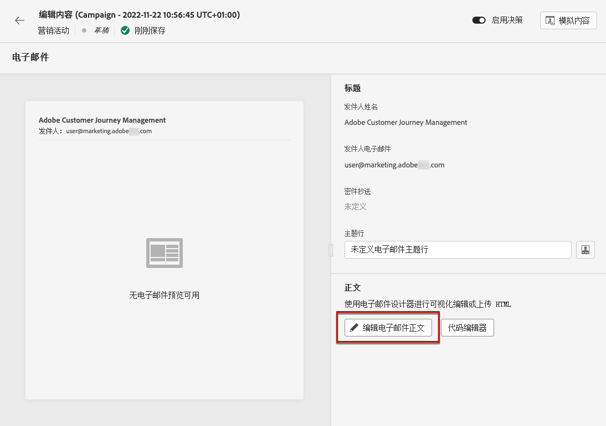

# 电子邮件设计入门 {#get-started-content-design}

您可以在 [!DNL Journey Optimizer] 或利用内容设计功能：

* 使用 [!DNL Journey Optimizer] **电子邮件设计功能** 设计或导入响应式电子邮件。 [了解更多](content-from-scratch.md)

* 利用 **Adobe Experience Manager Assets Essentials** 要扩充您的电子邮件，请构建和管理您自己的资产数据库。 [了解更多](assets-essentials.md)

* 查找 **Adobe Stock Photos** 以构建内容并改进电子邮件设计。 [了解更多](stock.md)

* 通过根据客户的用户档案属性创建个性化的动态消息来增强客户体验。 详细了解 [个性化](../personalization/personalize.md) 和 [动态内容](../personalization/get-started-dynamic-content.md).

➡️ [在视频中发现此功能](#video)

一旦 [添加了电子邮件](create-email.md) 到历程或营销策划，您可以开始创建电子邮件内容。

1. 在历程或营销活动配置屏幕中，浏览 **[!UICONTROL Edit content]** 来访问Email Designer。 [了解更多](create-email.md#define-email-content)

   

1. 在Email Designer主页上，从以下选项中选择要设计电子邮件的方式：

   * **从头开始设计电子邮件** 通过email designer的界面，并利用 [Adobe Experience Manager Assets Essentials](assets-essentials.md). 了解如何在 [此部分](content-from-scratch.md).

   * **代码或粘贴原始HTML** 直接在email designer中。 了解如何在 [此部分](code-content.md).

      >[!NOTE]
      >
      >在营销策划中，您还可以选择 **[!UICONTROL Code Editor]** 按钮 **[!UICONTROL Edit content]** 屏幕。 [了解更多](create-email.md#define-email-content)

   * **导入现有HTML内容** 文件或.zip文件夹中。 了解如何在 [此部分](existing-content.md).

   * **选择现有内容** 从内置或自定义模板列表。 了解如何使用电子邮件模板 [此部分](email-templates.md).

   

## 操作方法视频 {#video}

了解如何使用消息编辑器创建电子邮件内容。

>[!VIDEO](https://video.tv.adobe.com/v/334150?quality=12)