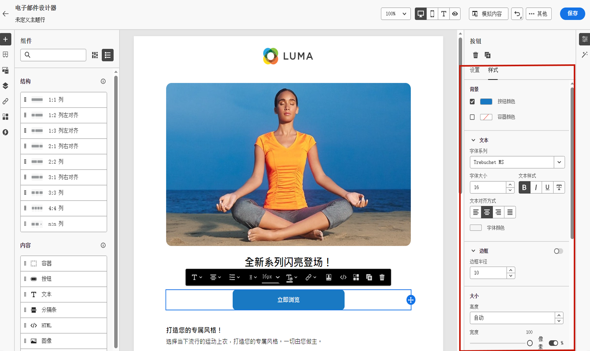

# 电子邮件样式入门 {#get-started-email-style}

在中开始创建电子邮件内容后 [!DNL Journey Optimizer]中，您可以从Email Designer中调整许多样式参数和属性 **[!UICONTROL 样式]** 窗格。

您可以将更改应用到电子邮件正文、结构组件或内容组件。

请访问以下链接，了解如何调整电子邮件中的某些样式设置。

* 了解如何[个性化电子邮件背景](backgrounds.md)
* 了解如何[管理垂直对齐方式和间距](alignment-and-padding.md)
* 了解如何[自定义内联样式属性](inline-styling.md)
