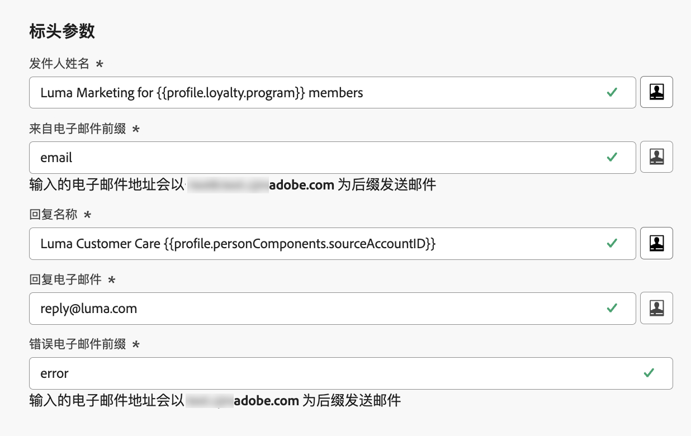

# 标头参数 {#email-header}

配置新的[电子邮件渠道配置](email-settings.md)时，在&#x200B;**[!UICONTROL 标头参数]**&#x200B;部分中，输入与使用该配置发送的电子邮件类型关联的发件人名称和电子邮件地址。

>[!NOTE]
>
>为了增强对电子邮件设置的控制，您可以个性化标头参数。[了解详情](../email/surface-personalization.md#personalize-header)

* **[!UICONTROL 发件人姓名]**：发件人的名称，如您的品牌名称。
* **[!UICONTROL 发件人电子邮件前缀]**：要用于通信的电子邮件地址。
* **[!UICONTROL 回复名称]**：收件人单击电子邮件客户端软件中的&#x200B;**回复**&#x200B;按钮时将使用的名称。
* **[!UICONTROL 回复电子邮件]**：收件人单击电子邮件客户端软件中的&#x200B;**回复**&#x200B;按钮时将使用的电子邮件地址。[了解详情](#reply-to-email)
* **[!UICONTROL 错误电子邮件前缀]**：此地址会接收 ISP 在发送邮件几天后产生的所有错误（异步退回）。此地址还会接收休假通知和质询回复。

  如果要通过未委派给 Adobe 的特定电子邮件地址接收休假通知和质询回复，您需要设置[转发流程](#forward-email)。在这种情况下，请确保您拥有手动或自动化解决方案来处理登陆此收件箱的电子邮件。

>[!NOTE]
>
>**[!UICONTROL 发件人电子邮件前缀]**&#x200B;和&#x200B;**[!UICONTROL 错误电子邮件前缀]**&#x200B;地址使用当前所选的[委派子域](../configuration/about-subdomain-delegation.md)发送电子邮件。例如，如果委派的子域是 *marketing.luma.com*：
>* 输入 *contact* 作为&#x200B;**[!UICONTROL 发件电子邮件前缀]**，发件人电子邮件将是 *contact@marketing.luma.com*。
>* 输入 *error* 作为&#x200B;**[!UICONTROL 错误电子邮件前缀]**，错误地址将是 *error@marketing.luma.com*。

{width="80%"}

>[!NOTE]
>
>地址必须以字母 (A-Z) 开头，并且只能包含字母数字字符。您还可以使用下划线 `_`、点 `.` 和连字符 `-` 符号。

## 回复电子邮件 {#reply-to-email}

在定义&#x200B;**[!UICONTROL 回复电子邮件]**&#x200B;地址时，您可以指定任何电子邮件地址，只要是有效的地址、格式正确并且没有任何拼写错误。

用于回复的收件箱将收到所有回复电子邮件，但通过&#x200B;**错误电子邮件**&#x200B;地址收到的休假通知和质询回复除外。

为确保正确管理回复，请遵循以下建议：

* 确保专用收件箱有足够的接收容量，可接收使用电子邮件配置发送的所有回复电子邮件。如果收件箱返回退信，则可能无法收到客户的某些回复。

* 处理回复时必须牢记隐私和合规义务，因为它们可能包含个人身份信息 (PII)。

* 请勿在回复收件箱中将消息标记为垃圾邮件，因为这将影响发送到此地址的所有其他回复。

此外，在定义&#x200B;**[!UICONTROL 回复电子邮件]**&#x200B;地址时，请确保使用具有有效 MX 记录配置的子域，否则电子邮件配置处理将失败。

如果您在提交电子邮件配置时遇到错误，则表示没有为输入的地址子域配置 MX 记录。请联系管理员以配置相应的 MX 记录，或使用另一个具有有效 MX 记录配置的地址。

>[!NOTE]
>
>如果您输入的地址子域是已[完全委派](../configuration/delegate-subdomain.md#full-subdomain-delegation)给 Adobe 的域，请与您的 Adobe 帐户主管联系。

## 转发电子邮件 {#forward-email}

要将 [!DNL Journey Optimizer] 收到的特定电子邮件地址的所有电子邮件转发到委派的子域，请与 Adobe 客户关怀部门联系。

>[!NOTE]
>
>如果用于&#x200B;**[!UICONTROL 回复电子邮件]**&#x200B;的子域地址未委派给 Adobe，则转发对此地址无效。

您需要提供：

* 您选择的转发电子邮件地址。请注意，转发电子邮件地址的域不能与委派给 Adobe 的任何子域匹配。
* 您的沙盒名称。
* 将用于转发电子邮件地址的配置名称或子域。
  <!--* The current **[!UICONTROL Reply to (email)]** address or **[!UICONTROL Error email]** address set at the channel configuration level.-->

>[!NOTE]
>
>每个子域只能有一个转发电子邮件地址。因此，如果多个配置使用相同的子域，则必须对所有配置使用相同的转发电子邮件地址。

转发电子邮件地址由 Adobe 设置。这可能需要 3 到 4 天。

完成后，**[!UICONTROL 回复电子邮件]**&#x200B;和&#x200B;**错误电子邮件**&#x200B;地址接收的所有邮件，以及发送到&#x200B;**发件人电子邮件**&#x200B;地址的所有电子邮件，都将被转发到您提供的特定电子邮件地址。

>[!NOTE]
>
>默认情况下，如果未启用转发，直接发送到&#x200B;**发件人电子邮件**&#x200B;地址的电子邮件将被丢弃。
