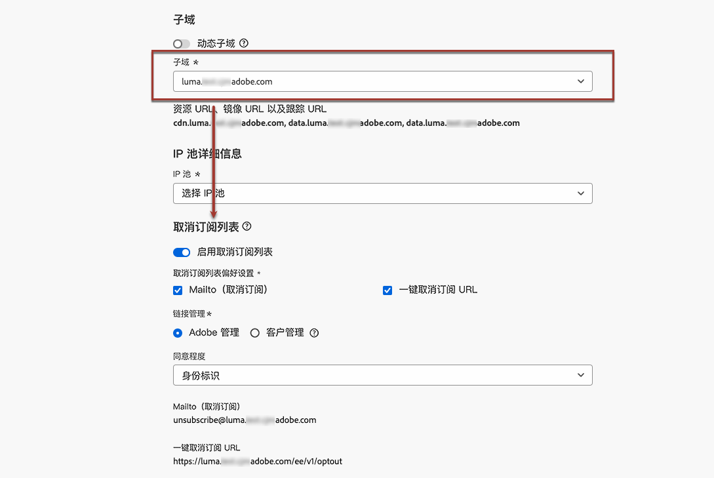

# 列表取消订阅{#list-unsubscribe}

<!--Do not modify - Legal Review Done -->

配置新的电子邮件渠道配置时，在从列表中[选择子域](email-settings.md#subdomains-and-ip-pools)后，将显示&#x200B;**[!UICONTROL 启用列表取消订阅]**&#x200B;选项。

## 启用列表取消订阅 {#enable-list-unsubscribe}

在默认情况下将启用此选项，以在电子邮件标头中包含一键式取消订阅 URL，例如：

>[!NOTE]
>
>如果禁用此选项，则电子邮件标头中不会显示一键式取消订阅 URL。

列表取消订阅标头提供了两个选项，除非您取消选中一项或两项，否则默认情况下将启用这两项：

{width="80%"}

* **[!UICONTROL Mailto（取消订阅）]**&#x200B;地址，这会将取消订阅请求路由到目标地址以进行自动处理。

  在 [!DNL Journey Optimizer] 中，基于您的[所选子域](#subdomains-and-ip-pools)，取消订阅电子邮件地址是渠道配置中显示的默认 **[!UICONTROL Mailto（取消订阅）]**&#x200B;地址。<!--With this method, clicking the Unsubscribe link sends a pre-filled email to the unsubscribe address specified in the email header.-->

* **[!UICONTROL 一键式取消订阅 URL]** 默认情况下是一键式选择退出 URL 生成的列表取消订阅标头，这基于您在渠道配置设置中设置和配置的子域。<!--With this method, clicking the Unsubscribe link directly unsubscribes the user, requiring only a single action to unsubscribe.-->

您可以从对应的下拉列表中选择&#x200B;**[!UICONTROL 同意程度]**。它可特定于渠道或特定于用户档案标识。基于此设置，当用户使用电子邮件标头中的列表取消订阅 URL 进行取消订阅操作时，会在 [!DNL Adobe Journey Optimizer] 渠道级别或 ID 级别更新同意。

您可以选择 **[!UICONTROL Mailto（取消订阅）]**&#x200B;功能和&#x200B;**[!UICONTROL 一键式取消订阅 URL]** 功能。

如果您不想使用默认生成的一键式取消订阅 URL，则可以取消选中该功能。在打开了&#x200B;**[!UICONTROL 启用取消订阅列表]**&#x200B;选项且未选中&#x200B;**[!UICONTROL 一键式取消订阅 URL]** 功能的情况下，如果为使用此配置创建的邮件添加[一键式选择退出链接](../email/email-opt-out.md#one-click-opt-out)，则列表取消订阅标头将提取您已插入到电子邮件正文中的一键式选择退出链接，并将其用作一键式取消订阅 URL 值。

>[!NOTE]
>
>如果您没有在消息内容中添加一键式选择退出链接，并且在渠道配置设置中取消选中默认的&#x200B;**[!UICONTROL 一键式取消订阅 URL]**，则不会将 URL 作为列表取消订阅标头的一部分传递到电子邮件标头。

要了解有关在消息中管理取消订阅功能的更多信息，请参阅[此部分](../email/email-opt-out.md#unsubscribe-header)。

## 从外部管理取消订阅数据 {#custom-managed}

>[!CONTEXTUALHELP]
>id="ajo_email_config_unsubscribe_custom"
>title="定义如何管理取消订阅数据"
>abstract="**Adobe 管理**：同意数据由您在 Adobe 系统内管理。 **客户管理**：同意数据由您在外部系统中管理，除非由您启动，否则 Adobe 系统中不会更新同意数据的同步。"

如果您在 Adobe 之外管理同意，请选择&#x200B;**[!UICONTROL 客户托管]**&#x200B;选项，以输入自定义取消订阅电子邮件地址和您自己的一键取消订阅 URL。

{width="80%"}

>[!WARNING]
>
>如果您使用&#x200B;**[!UICONTROL 客户托管]**&#x200B;选项，Adobe 不会存储任何取消订阅或同意数据。使用&#x200B;**[!UICONTROL 客户托管]**&#x200B;选项，组织将选择使用外部系统，并将负责在此类外部系统中管理其同意数据。在外部系统与 [!DNL Journey Optimizer] 之间，不会自动同步同意数据。要同步任何来自外部系统的同意数据并更新 [!DNL Journey Optimizer] 中的用户同意数据，都必须由组织发起数据传输，以将同意数据推回 [!DNL Journey Optimizer]。

### 配置解密 API {#configure-decrypt-api}

选择&#x200B;**[!UICONTROL 客户托管]**&#x200B;选项后，如果您输入自定义端点并将其用于营销活动或历程，当您的收件人单击“取消订阅”链接时，[!DNL Journey Optimizer] 会将一些特定于用户档案的默认参数附加到同意更新事件 <!--sent to the custom endpoint -->。

将以加密方式把这些参数发送到端点。因此，外部同意系统需要通过 [Adobe Developer](https://developer.adobe.com){target="_blank"} 实施特定 API 以解密 Adobe 发送的参数。

用于检索这些参数的 GET 调用取决于您正在使用的列表取消订阅选项，即&#x200B;**[!UICONTROL 一键式取消订阅 URL]** 或 **[!UICONTROL Mailto（取消订阅）]**。

<!--To configure the API to send back the information to [!DNL Adobe Journey Optimizer] when a recipient has unsubscribed using the List unsubscribe option with custom endpoints, follow the steps below.-->

+++ 一键式取消订阅 URL

使用&#x200B;**[!UICONTROL 一键式取消订阅 URL]** 选项，单击“取消订阅”链接将直接取消订阅用户。

GET 调用如下：

端点：https://platform.adobe.io/journey/imp/consent/decrypt

查询参数：

* **params**：包含加密后的有效负载
* **pid**：加密后的用户档案 ID

这两个参数将包含在发送到自定义端点的同意更新事件中。

标头要求：

* x-api-key
* x-gw-ims-org-id
* 授权（技术帐户中的用户令牌）

+++

+++ Mailto（取消订阅）

使用 **[!UICONTROL Mailto（取消订阅）]**&#x200B;选项，单击“取消订阅”链接会向指定的取消订阅地址发送预填电子邮件。

GET 调用如下。

端点：https://platform.adobe.io/journey/imp/consent/decrypt

查询参数：

* **emailParams**：包含 **params**（加密负载）和 **pid**（加密用户档案 ID）参数的字符串。

**params** 和 **pid** 参数将包含在发送到自定义端点的同意更新事件中。

标头要求：

* x-api-key
* x-gw-ims-org-id
* 授权（技术帐户中的用户令牌）

+++
