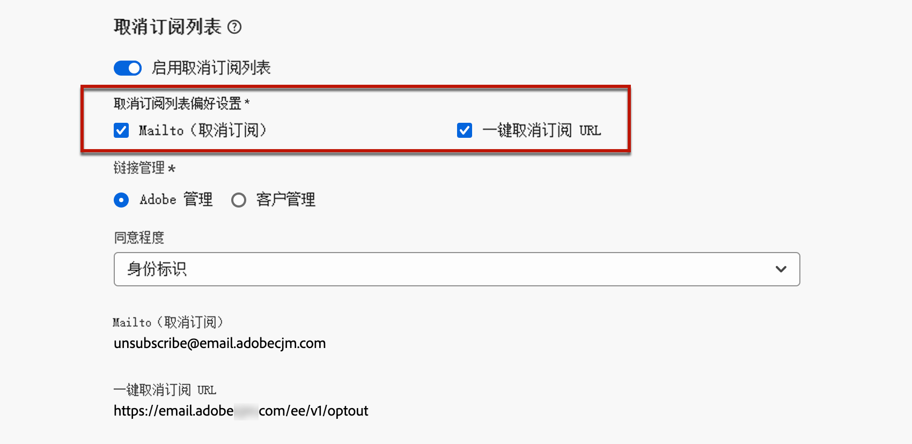

# 取消列表订阅{#list-unsubscribe}

<!--Do not modify - Legal Review Done -->

在 [!DNL Adobe Journey Optimizer] 中，在配置新的电子邮件渠道时，在从列表中[选择子域](email-settings.md#subdomains-and-ip-pools)后，将显示&#x200B;**[!UICONTROL 启用取消列表订阅]**&#x200B;选项。默认情况下，它处于启用状态。


一键式列表取消订阅 URL 是电子邮件发件人信息旁边显示的取消订阅链接或按钮，收件人只需单击一下即可立即选择退出邮件列表。

例如，一键式取消订阅 URL 会在 Gmail 中显示一个链接，如下所示：


>[!IMPORTANT]
>
>要在电子邮件标头中显示一键式取消订阅 URL，收件人的电子邮件客户端必须支持此功能。

根据电子邮件客户端和电子邮件配置退订设置，单击电子邮件标头中的取消订阅链接可能会产生以下影响：

* 启用 **Mailto（取消订阅）**&#x200B;功能后，会根据您配置的子域将取消订阅请求发送到默认取消订阅地址。
* 启用&#x200B;**一键式取消订阅 URL** 功能后，或者在电子邮件正文内容中插入取消订阅 URL 后，当收件人单击一键式取消订阅 URL（基于您配置的子域）时，收件人可以直接在渠道级别或 ID 级别（取决于同意的设置方式）选择退出。

>[!NOTE]
>
>通过下方的[此部分](#enable-list-unsubscribe)，了解如何管理退订设置。

在这两种情况下，当收件人单击选择退出链接时，将会相应地处理其取消订阅请求。相应的轮廓会立即退出订阅，并且此选择将在 [Experience Platform](https://experienceleague.adobe.com/docs/experience-platform/profile/ui/user-guide.html?lang=zh-Hans#getting-started){target="_blank"} 中更新。

>[!NOTE]
>
>有时，由于下游数据处理的原因，取消订阅事件可能需要更长的时间才能体现在用户档案级别。系统进行更新可能会需要一些时间。

## 启用取消列表订阅 {#enable-list-unsubscribe}

>[!CONTEXTUALHELP]
>id="ajo_admin_preset_unsubscribe"
>title="向您的电子邮件添加取消订阅 URL"
>abstract="启用此选项以向电子邮件标头自动添加取消订阅 URL。您也可以在电子邮件内容中插入一键式选择禁用链接，在消息中设置取消订阅 URL。"
>additional-url="https://experienceleague.adobe.com/zh-hans/docs/journey-optimizer/using/channels/email/email-opt-out#one-click-opt-out" text="在电子邮件内容中设置一键式选择退出"

启用&#x200B;**[!UICONTROL 启用列表取消订阅]**&#x200B;选项后，如果收件人的电子邮件客户端支持此功能，那么电子邮件标头将默认同时包含 Mailto 和/或 URL，收件人可以使用这两种选项取消订阅邮件列表。

>[!NOTE]
>
>如果禁用此选项，则电子邮件标头中不会显示一键取消订阅 URL。

取消列表订阅标头提供两个选项，默认情况下均为启用状态，除非您取消选中至少一项：

{width="80%"}

* **[!UICONTROL Mailto（取消订阅）]**&#x200B;地址，这是取消订阅请求被路由到的目标地址，以进行自动处理。在[!DNL Journey Optimizer]中，基于您的[所选子域](email-settings.md#subdomains)，取消订阅电子邮件地址是渠道配置中显示的默认 **[!UICONTROL Mailto（取消订阅）]**&#x200B;地址。 <!--With this method, clicking the Unsubscribe link sends a pre-filled email to the unsubscribe address specified in the email header.-->

* **[!UICONTROL 一键式取消订阅 URL]**，默认情况下是一键式选择退出 URL 生成的列表取消订阅标头（基于[所选子域](email-settings.md#subdomains)）。<!--With this method, clicking the Unsubscribe link directly unsubscribes the user, requiring only a single action to unsubscribe.-->

您可以从对应的下拉列表中选择&#x200B;**[!UICONTROL 同意程度]**。它可特定于渠道或轮廓身份标识基于此设置，当用户使用电子邮件标头中的列表取消订阅 URL 进行取消订阅操作时，会在 [!DNL Adobe Journey Optimizer] 渠道级别或 ID 级别更新同意。

## 护栏和建议 {#list-unsubscribe-guardrails}

通过一键式列表取消订阅 URL 功能，您的收件人可以轻松选择退出通信。但是，由于并非所有电子邮件客户端都支持在电子邮件标头中使用此链接，Adobe 建议您在电子邮件正文中同时添加[一键式选择退出链接](email-opt-out.md#one-click-opt-out)或[取消订阅链接](email-opt-out.md#add-unsubscribe-link)。

**[!UICONTROL Mailto（取消订阅）]**&#x200B;功能和&#x200B;**[!UICONTROL 一键式取消订阅 URL]** 功能是可选的。

* 如果您在[电子邮件设定设置](email-settings.md)中启用了&#x200B;**[!UICONTROL 启用列表取消订阅]**&#x200B;选项，我们建议您同时启用这两种方法 - **Mailto（取消订阅）**&#x200B;和&#x200B;**一键式取消订阅 URL**。并非所有电子邮件客户端都支持 HTTP 方法。通过为您提供 Mailto 列表取消订阅功能作为可选择的替代方案，您可以更好地维护身为发件人的声誉，您的所有收件人都能够使用取消订阅功能。

* 如果您不想使用默认生成的一键式取消订阅 URL，则可以取消选中该功能。

   * 在打开了&#x200B;**[!UICONTROL 启用取消列表订阅]**&#x200B;选项且未选中&#x200B;**[!UICONTROL 一键取消订阅 URL]** 功能的情况下，如果为使用此配置创建的消息添加[一键选择退出链接](../email/email-opt-out.md#one-click-opt-out)，则取消列表订阅标头将提取您已插入到电子邮件正文中的一键选择退出链接，并将其用作一键取消订阅 URL 值。

     

   * 如果您没有在消息内容中添加一键选择退出链接，并且在渠道配置设置中取消选中默认的&#x200B;**[!UICONTROL 一键取消订阅 URL]**，则不会将 URL 作为取消列表订阅标头的一部分传递到电子邮件标头。

  >[!NOTE]
  >
  >要了解有关管理消息中的取消订阅功能的更多信息，请参阅[此部分](../email/email-opt-out.md#unsubscribe-header)。

在 [!DNL Journey Optimizer] 中，同意由 Experience Platform [同意架构](https://experienceleague.adobe.com/docs/experience-platform/xdm/field-groups/profile/consents.html?lang=zh-Hans){target="_blank"}处理。默认情况下，同意字段的值为空，并视为同意接收您的通信。您可以在加入时修改此默认值，使其成为[此处](https://experienceleague.adobe.com/docs/experience-platform/xdm/data-types/consents.html?lang=zh-Hans#choice-values){target="_blank"}列出的可能值之一，或使用[同意策略](../action/consent.md)覆盖默认逻辑。

目前，[!DNL Journey Optimizer] 不会将特定标记附加到由列表取消订阅功能触发的取消订阅事件。如果您需要区分列表取消订阅点击与其他取消订阅操作，则必须在外部实施自定义标记，或利用外部登陆页面进行跟踪。

## 从外部管理取消订阅数据 {#custom-managed}

>[!CONTEXTUALHELP]
>id="ajo_email_config_unsubscribe_custom"
>title="定义如何管理取消订阅数据"
>abstract="**Adobe 管理**：同意数据由您在 Adobe 系统内管理。<br>**客户管理**：同意数据由您在外部系统中管理，除非由您启动，否则 Adobe 系统中不会更新同意数据的同步。"

>[!CONTEXTUALHELP]
>id="ajo_email_config_unsubscribe_custom_url"
>title="输入您自己的一键式取消订阅 URL"
>abstract="**一键式取消订阅 URL** 必须使用 POST 请求方法。"

如果您在 Adobe 之外管理同意，请选择&#x200B;**[!UICONTROL 客户管理]**&#x200B;选项，以输入自定义取消订阅电子邮件地址和您自己的一键取消订阅 URL。

{width="80%"}

**[!UICONTROL 一键式取消订阅 URL]** 必须是 POST URL。

>[!WARNING]
>
>如果您使用&#x200B;**[!UICONTROL 客户管理]**&#x200B;选项，Adobe 不会存储任何取消订阅或同意数据。使用&#x200B;**[!UICONTROL 客户管理]**&#x200B;选项，组织将选择使用外部系统，并将负责在此类外部系统中管理其同意数据。在外部系统与 [!DNL Journey Optimizer] 之间，不会自动同步同意数据。要同步任何来自外部系统的同意数据并更新 [!DNL Journey Optimizer] 中的用户同意数据，都必须由组织发起数据传输，以将同意数据推回 [!DNL Journey Optimizer]。

### 配置解密 API {#configure-decrypt-api}

选择&#x200B;**[!UICONTROL 客户托管]**&#x200B;选项后，如果您输入自定义端点并将其用于营销活动或历程，当您的收件人单击“取消订阅”链接时，[!DNL Journey Optimizer] 会将一些特定于用户档案的默认参数附加到同意更新事件 <!--sent to the custom endpoint -->。

将以加密方式把这些参数发送到端点。因此，外部同意系统需要通过 [Adobe Developer](https://developer.adobe.com){target="_blank"} 实施特定 API 以解密 Adobe 发送的参数。

用于检索这些参数的 GET 调用取决于您正在使用的列表取消订阅选项，即&#x200B;**[!UICONTROL 一键式取消订阅 URL]** 或 **[!UICONTROL Mailto（取消订阅）]**。

<!--To configure the API to send back the information to [!DNL Adobe Journey Optimizer] when a recipient has unsubscribed using the List unsubscribe option with custom endpoints, follow the steps below.-->

+++ 一键取消订阅 URL

使用&#x200B;**[!UICONTROL 一键式取消订阅 URL]** 选项，单击“取消订阅”链接将直接取消订阅用户。

GET 调用如下：

端点：https://platform.adobe.io/journey/imp/consent/decrypt

查询参数：

* **params**：包含加密后的有效负载
* **pid**：加密后的轮廓 ID

这两个参数将包含在发送到自定义端点的同意更新事件中。

标头要求：

* x-api-key
* x-gw-ims-org-id
* 授权（用于技术帐户认证的用户令牌）

以下是示例参数和同意响应：

| 查询参数 | 示例负载 |
|---------|----------|
| pid | {<br>&quot;pid&quot;  : &quot;5142733041546020095851529937068211571&quot;,<br>&quot;pns&quot;  : &quot;CRMID&quot;,<br>&quot;e&quot;    : &quot;john@google.com&quot;,<br>&quot;ens&quot;  : &quot;Email&quot;,<br>} |
| params | {<br>&quot;m&quot;  : &quot;messageExecutionId&quot;,<br>&quot;ci&quot;  : &quot;campaignId&quot;,<br>&quot;jv&quot; : &quot;journeyVersionId&quot;,<br>&quot;ja&quot; : &quot;journeyActionId&quot;,<br>&quot;s&quot;  : &quot;sandboxId&quot;,<br>&quot;us&quot; : &quot;unsubscribeScope&quot;<br>} |

同意响应：

```
{
    "profileNameSpace": " CRMID ",
    "profileId": "5142733041546020095851529937068211571",
    "emailAddress": "john@google.com",
    "emailNameSpace": "Email",
    "sandboxId": "sandboxId",
    "optOutLevel": "channel",
    "channelType": "email",
    "timestamp": "2024-11-26T14:25:09.316930Z"
}
```

+++

+++ Mailto（取消订阅）

使用 **[!UICONTROL Mailto（取消订阅）]**&#x200B;选项，单击“取消订阅”链接会向指定的取消订阅地址发送预填电子邮件。

GET 调用如下。

端点：https://platform.adobe.io/journey/imp/consent/decrypt

查询参数：

* **emailParams**：包含 **params**（加密负载）和 **pid**（加密轮廓 ID）参数的字符串。

**params** 和 **pid** 参数将包含在发送到自定义端点的同意更新事件中。

标头要求：

* x-api-key
* x-gw-ims-org-id
* 授权（用于技术帐户认证的用户令牌）

以下是示例参数和同意响应：

| 查询参数 | 示例负载 |
|---------|----------|
| emailParams | {<br>&quot;p&quot;  : &quot;profileId&quot;,<br>&quot;pn&quot;  : &quot;profileNamespace&quot;,<br>&quot;en&quot;  : &quot;emailNamespace&quot;,<br>&quot;ci&quot;  : &quot;campaignId&quot;,<br>&quot;jv&quot; : &quot;journeyVersionId&quot;,<br>&quot;ja&quot; : &quot;journeyActionId&quot;,<br>&quot;si&quot;  : &quot;sandboxId&quot;,<br>&quot;us&quot;: &quot;unsubscribeScope&quot;<br>} |

同意响应：

```
{
    "profileNameSpace": " CRMID ",
    "profileId": "5142733041546020095851529937068211571",
    "emailAddress": "john@google.com",
    "emailNameSpace": "Email",
    "sandboxId": "sandboxId",
    "optOutLevel": "channel",
    "channelType": "email",
    "timestamp": "2024-11-26T14:25:09.316930Z"
}
```

+++
