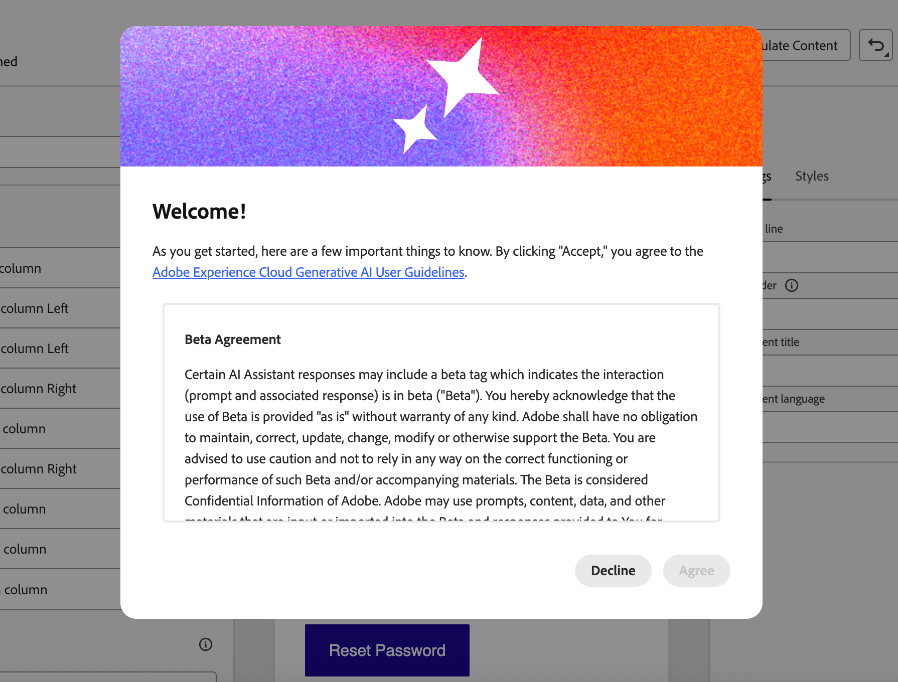

# 针对 AI 收件箱优化电子邮件 {#email-text-optimizer}

>[!BEGINSHADEBOX]

**在此页面上：**&#x200B;了解如何在Email Designer中生成并优化电子邮件的专用版本，以便人工智能辅助收件箱客户端将其摘要和答案加入您的优惠和行动号召中。

>[!ENDSHADEBOX]

[!DNL Adobe Journey Optimizer]附带电子邮件渠道功能，可帮助您构建邮件的特定版本以改进AI辅助收件箱体验，例如[!DNL Gmail]中的[!DNL Apple Intelligence]和[!DNL Google Gemini]，以便他们能够更准确地回答问题并根据您的内容总结邮件，从而获得更好的结果。

您可以使用此功能生成和优化消息的专用版本，以便AI辅助收件箱体验更有可能显示您想要的选件、行动要求和详细信息，而不是精简自动生成文本或不相关的上下文。

<!--
>[!NOTE]
>
>This optimized for AI inboxes text version is not the same as the default or custom plain text version of your messages. [Learn more](text-version-email.md)
-->

## 工作原理 {#how-it-works}

收件人在AI辅助收件箱体验中可能会问的典型问题是&#x200B;*此电子邮件是关于什么的？* 或&#x200B;*这些选件是什么？*。

* 这些AI助理提供的答案可能是简短摘要（例如，消息是促销、提及VIP抢先体验和促销，并包括产品类别的链接）。 但是，它们仍会忽略营销人员关心的目标，因为助理会从他们实际看到的任何文本中推断出来 — 不一定是您打算看到的完整故事。

* 此外，助理可以主动搜索与品牌相关的折扣或优惠券，并将它们折叠到答案中，这样用户就不会再只查看您的消息实际承诺的内容。 这种行为对最终用户很有用，但是对于需要答案来跟踪发送中真实术语的营销人员，这种行为会稀释他们的控制权。

为防止出现这些问题，[!DNL Journey Optimizer]创建了您报文的附加特定版本，以便优惠券、折扣范围、行动要求和其他优先顺序以明确的线性副本显示在最前面。<!--This version is different from the HTML view and default or custom plain text version of your messages.-->

目标是让收件箱AI为您定义的优惠和操作提供基础摘要和问答，而不是依赖简单的默认文本部分或不相关的Web结果。

>[!IMPORTANT]
>
>确切的AI助手行为取决于收件箱提供商和模型版本。 在发送电子邮件后，外部AI客户端提供的答案和摘要可能会错误、不完整或与Web结果混杂在一起。
>
>针对AI收件箱优化电子邮件功能仅在Journey Optimizer中生成专用版本；它无法保证第三方助理如何解释或显示消息。 详细了解第三方收件箱AI[&#128279;](#inbox-ai-risks)的限制和风险。

## 推荐用例 {#use-cases}

<!--
* **Critical details only in images** — Offers, promo codes, or deadlines shown in banners or graphics are invisible in plain text. Use the optimizer (and manual edits) so the same facts appear as text, improving extraction by AI summaries and text-only clients.
-->

* **密集或零碎的内容** — 当电子邮件的内容难以扫描时，优化可以生成更清晰的线性叙述，其中具有明确的选件和链接。

* **控制收件箱问答** — 如果您希望收件人询问助理&#x200B;*电子邮件内容*&#x200B;或&#x200B;*选件内容*，则优化后的AI版本可减少部分摘要并避免依赖与已批准副本无关的Web补充答案。

## 针对AI收件箱体验进行优化 {#optimize-with-ai}

>[!IMPORTANT]
>
>在使用此功能之前，请阅读相关的[风险和限制](#inbox-ai-risks)。
>
>要访问此功能，您必须同意用户协议，该协议在您第一次在[!DNL Journey Optimizer]中使用创作AI时显示。 有关详细信息，请阅读[Adobe Experience Cloud Generative AI用户准则](https://www.adobe.com/cn/legal/licenses-terms/adobe-gen-ai-user-guidelines.html){target="_blank"}。

要通过[!DNL Journey Optimizer]为AI收件箱体验优化电子邮件内容，请执行以下步骤。

1. 在[向Designer发送电子邮件](content-from-scratch.md)中打开您的电子邮件（来自营销活动、历程或模板，具体取决于您的工作流）。

1. 单击&#x200B;**[!UICONTROL 针对AI收件箱进行优化]**&#x200B;按钮可生成一个改进版本，该版本突出显示了用于AI辅助阅读和摘要的关键信息。

   电子邮件Designer中的{zoomable="yes" width="80%"}按钮

1. 如果这是您在[!DNL Journey Optimizer]中第一次使用创作AI，将要求您同意用户协议。 若要了解更多信息，请查看[Adobe Generative AI用户准则](https://www.adobe.com/cn/legal/licenses-terms/adobe-gen-ai-user-guidelines.html){target="_blank"}。

   {width=50%}

   单击&#x200B;**[!UICONTROL 同意]**&#x200B;以继续。

1. 生成的版本显示在&#x200B;**[!UICONTROL AI收件箱优化器]**&#x200B;窗口中。

   {zoomable="yes" width="80%"}

   >[!NOTE]
   >
   >优化版本与电子邮件的HTML和文本视图不同。 它不会更改您的设计、布局或图像。

1. 要编辑自动生成的内容，请选择&#x200B;**[!UICONTROL 启用编辑]**&#x200B;切换开关，并根据需要进行手动更改。

1. 一旦对您的版本满意，请单击&#x200B;**[!UICONTROL 优化电子邮件]**&#x200B;按钮进行确认。 您还可以使用&#x200B;**[!UICONTROL 重新优化]**&#x200B;按钮生成新版本。

1. 您即将重定向到&#x200B;**[!UICONTROL HTML]**&#x200B;视图，并且您的电子邮件现在已成功针对AI收件箱进行优化。 要再次访问或编辑优化版本，请单击&#x200B;**[!UICONTROL 已为AI收件箱优化]**&#x200B;按钮。

   电子邮件Designer中的{zoomable="yes" width="80%"}

1. 此时会显示优化版本。 您可以&#x200B;**[!UICONTROL 删除优化]**，或单击&#x200B;**[!UICONTROL 重新优化]**&#x200B;以生成新版本。

   电子邮件Designer中的{zoomable="yes" width="80%"}

   >[!NOTE]
   >
   >如果您更改了原始HTML内容，则需要重新优化为AI收件箱生成的版本，以便该版本与新内容保持一致。

## 第三方收件箱人工智能的风险和限制 {#inbox-ai-risks}

“针对AI收件箱优化电子邮件”功能可帮助您准备电子邮件的版本，以了解邮箱提供商处理您[!DNL Journey Optimizer]发送的方式。 它不控制这些提供商的产品。 在传递邮件后，[!DNL Gmail]、[!DNL Apple] Mail、[!DNL Outlook]或其他客户端中的任何AI功能都将按照其条款、模型和策略运行，而不是Adobe的运行。

* **不可预测的演示文稿** — 摘要、通知模糊和对话式回答可能会忽略选件、错误地陈述价格或日期、将内容与不相关的Web结果合并，或者以不再匹配您批准的副本的方式进行转述。 供应商更新模型或UI时可能会改变此行为，恕不另行通知。

* **无法保证与HTML的等同性** — 依赖预览或助理答案的收件人可能永远不会看到您的HTML完整设计、图像或法律页脚。 他们认为，这条信息“说”的内容可能只来自于人工智能生成的简短摘要。

* **隐私、合规性和数据使用** — 收件箱AI可以根据提供商的隐私政策、保留和区域规则，处理提供商基础架构上的邮件内容。 受管控行业中的组织应评估收件人使用此类功能是否会影响其义务，而不管电子邮件是如何在[!DNL Journey Optimizer]中创作的。

* **品牌和法律曝光度** — 不正确或不完整的AI摘要仍可能会导致客户对促销活动、条款或选择退出语言产生混淆或争议。 [!DNL Journey Optimizer]不能确保第三方模型忠实地重现电子邮件的优化版本。

* **[!UICONTROL 在[!DNL Journey Optimizer]中针对AI收件箱进行优化]** — Email Designer中的创作时间控件与最终用户收件箱助理不同。 发送之前请始终查看生成的内容。

## 相关主题 {#related-topics}

* [电子邮件设计快速入门](get-started-email-design.md)
* 若要更广泛地了解Adobe的生成功能，请参阅[开始使用AI助手来创建内容](../content-management/gs-generative.md)。
