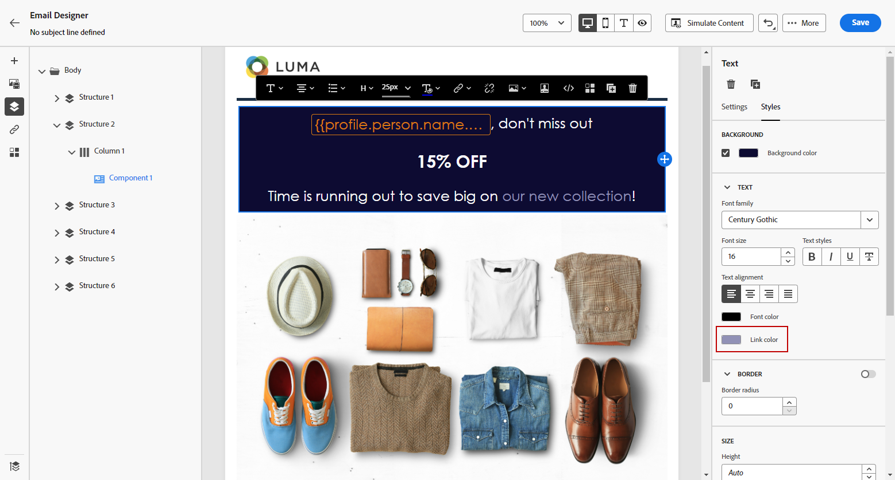

# 添加链接和跟踪消息 {#tracking}

使用[!DNL Journey Optimizer]向内容添加链接并跟踪发送的邮件，以监视收件人的行为。

## 启用跟踪 {#enable-tracking}

在历程或营销策划中创建邮件时，通过检查&#x200B;**[!UICONTROL 电子邮件打开次数]**&#x200B;和/或&#x200B;**[!UICONTROL 单击电子邮件]**&#x200B;选项，可以在电子邮件级别启用跟踪，如以下选项卡所示：

>[!BEGINTABS]

>[!TAB 在历程中启用跟踪]

>[!TAB 在营销活动中启用跟踪]

>[!ENDTABS]

>[!NOTE]
>
>默认情况下，这两个选项都处于启用状态。

启用后，这些选项会跟踪消息的收件人的行为：

* **[!UICONTROL 电子邮件打开次数]**&#x200B;度量检查已打开的邮件数。
* **[!UICONTROL 点击电子邮件]**&#x200B;量度计算电子邮件中链接的点击次数。

## 插入链接 {#insert-links}

启用[跟踪](#enable-tracking)后，将跟踪消息内容中包含的所有链接。

要在电子邮件内容中插入链接，请执行以下步骤：

1. 选择一个元素（文本或图像），然后单击上下文工具栏中的&#x200B;**[!UICONTROL 插入链接]**。

   

1. 选择要创建的链接类型：

   * 选择&#x200B;**[!UICONTROL 外部链接]**&#x200B;以插入指向外部URL的链接。

   * 选择&#x200B;**[!UICONTROL 登陆页面]**&#x200B;以插入指向登陆页面的链接。 [了解详情](../landing-pages/get-started-lp.md)

   * 选择&#x200B;**[!UICONTROL 单击退出]**&#x200B;可插入链接，使用户无需确认退出即可快速取消订阅您的通信。 [了解详情](email-opt-out.md#one-click-opt-out)。

   * 选择&#x200B;**[!UICONTROL 外部选择加入/订阅]**&#x200B;以插入链接以接受来自您品牌的通信。

   * 选择&#x200B;**[!UICONTROL 外部选择退出/退订]**&#x200B;插入链接以取消订阅以停止接收来自您品牌的通信。 在[本节](email-opt-out.md#opt-out-management)中了解有关选择退出管理的更多信息。

   * 选择&#x200B;**[!UICONTROL 镜像页面]**&#x200B;以添加指向电子邮件镜像页面的链接。 [了解详情](#mirror-page)

1. 在相应字段中输入所需的URL，或选择登陆页面，然后定义链接设置和样式。 [了解详情](#adjust-links)

   >[!NOTE]
   >
   >为了解释URL，[!DNL Journey Optimizer]遵循URI语法（[RFC 3986标准](https://datatracker.ietf.org/doc/html/rfc3986){target="_blank"}），该语法禁用URL中的某些特殊国际字符。 在尝试发送验证或电子邮件时，如果系统返回了涉及添加到内容的URL的错误，则可以通过URL对字符串进行编码作为解决方法。

1. 您可以个性化自己的链接。[了解详情](../personalization/personalization-syntax.md#perso-urls)

1. 保存更改。

1. 创建链接后，您仍然可以从右侧的&#x200B;**[!UICONTROL 设置]**&#x200B;和&#x200B;**[!UICONTROL 样式]**&#x200B;窗格中修改链接。

   

>[!NOTE]
>
>营销类型电子邮件必须包含[选择退出链接](../privacy/opt-out.md#opt-out-management)，事务型邮件不需要该链接。 创建消息时，[渠道配置](../configuration/channel-surfaces.md#email-type)中定义了消息类别（**[!UICONTROL Marketing]**&#x200B;或&#x200B;**[!UICONTROL Transactional]**）。

## 链接到镜像页面 {#mirror-page}

镜像页面是电子邮件的在线版本。 添加指向镜像页面的链接是一种电子邮件营销良好实践。 例如，如果用户尝试在收件箱中查看电子邮件时遇到渲染问题或损坏的图像，则可以浏览到电子邮件的镜像页面。此外，建议提供在线版本以方便访问或鼓励社交共享。

Adobe Journey Optimizer生成的镜像页面包含所有个性化数据。

要在电子邮件中添加指向镜像页面的链接，请[插入链接](#insert-links)，并选择&#x200B;**[!UICONTROL 镜像页面]**&#x200B;作为链接类型。

镜像页面会自动创建。 发送电子邮件后，当收件人单击镜像页面链接时，电子邮件的内容将显示在他们的默认 Web 浏览器中。

镜像页面的保留期为&#x200B;**60天**。 在此延迟之后，镜像页面将不再可用。

>[!CAUTION]
>
>* 镜像页面链接是自动生成的，并且无法编辑。它们包含渲染原始电子邮件所需的所有加密的个性化数据。因此，使用具有较大值的个性化属性可能会生成冗长的镜像页面 URL，从而导致无法在具有最大 URL 长度限制的 Web 浏览器中访问链接。
>
>* 在发送到测试配置文件的[验证](../content-management/proofs.md)中，指向镜像页面的链接无效。 它仅在最终消息中处于活动状态。

## 自定义链接外观和目标 {#adjust-links}

您可以调整链接，例如为其加下划线、更改其颜色或选择其目标。  这些更改在内容编辑器右侧部分的&#x200B;**[!UICONTROL 设置]**&#x200B;和&#x200B;**[!UICONTROL 样式]**&#x200B;窗格中设置。

### 目标 {#link-target}

**target**&#x200B;属性用于控制链接页面的打开位置。 在锚点标记中添加目标属性可以指定链接是在新选项卡、同一选项卡还是其他框架中打开。

要定义链接的目标，请执行以下步骤：

1. 在插入链接的&#x200B;**[!UICONTROL 文本]**&#x200B;组件中，选择您的链接。

1. 从&#x200B;**[!UICONTROL 设置]**&#x200B;选项卡中，在&#x200B;**[!UICONTROL Target]**&#x200B;下拉列表中选择链接打开的位置。 可能的值如下所示：

   * **[!UICONTROL 无]**：单击时在同一框架中打开链接（默认）。
   * **[!UICONTROL 空白]**：在新窗口或标签页中打开链接。
   * **[!UICONTROL 自身]**：单击时在同一框架中打开链接。
   * **[!UICONTROL 父]**：在父框架中打开链接。
   * **[!UICONTROL 顶部]**：在窗口的整个正文中打开链接。

   

1. 保存更改。

### 为链接加下划线 {#link-underline}

选中&#x200B;**[!UICONTROL 为链接]**&#x200B;加下划线选项可为链接的标签加下划线。

### 链接颜色 {#link-color}

要更改链接的颜色，请从&#x200B;**[!UICONTROL 样式]**&#x200B;选项卡中单击&#x200B;**[!UICONTROL 链接颜色]**。

## 管理跟踪 {#manage-tracking}

[电子邮件设计器](content-from-scratch.md)允许您管理跟踪的 URL，例如编辑每个链接的跟踪类型。

1. 单击左窗格中的&#x200B;**[!UICONTROL 链接]**&#x200B;图标，以显示要跟踪的内容的所有URL列表。

   此列表提供一个集中式视图，让您能够找到电子邮件内容中的每个 URL。

1. 要编辑链接，请单击相应的铅笔图标。

1. 如果需要，可以修改&#x200B;**[!UICONTROL 跟踪类型]**：

   

   对于每个跟踪的 URL，可以将跟踪模式设置为下列值之一：

   * **[!UICONTROL 已跟踪]**：激活对此 URL 的跟踪。
   * **[!UICONTROL 选择禁用]**：将此 URL 视为选择退出或退订 URL。
   * **[!UICONTROL 镜像页面]**：将此 URL 视为镜像页面 URL。
   * **[!UICONTROL 从不]**：从不激活此URL的跟踪。

有关打开次数和点击次数的报表可在[实时报表](../reports/live-report.md)和[Customer Journey Analytics报表](../reports/report-gs-cja.md)中获取。

## 个性化URL跟踪 {#url-tracking}

通常在配置级别管理[URL跟踪](email-settings.md#url-tracking)，但不支持配置文件属性。 当前唯一的方法是在电子邮件设计器中[个性化URL](../personalization/personalization-syntax.md#perso-urls)。

要向链接添加个性化的URL跟踪参数，请执行以下步骤。

1. 选择一个链接，然后单击上下文工具栏中的&#x200B;**[!UICONTROL 插入链接]**。

1. 选择个性化图标。 它仅适用于以下类型的链接：**外部链接**、**退订链接**&#x200B;和&#x200B;**选择退出**。

   

1. 添加URL跟踪参数，然后从个性化编辑器中选择您选择的配置文件属性。

   

1. 保存更改。

1. 对要将此跟踪参数添加到的每个链接重复上述步骤。

现在，在发送电子邮件时，此参数将自动附加到URL的末尾。 然后，您可以在网站分析工具或性能报表中捕获此参数。

>[!NOTE]
>
>要验证最终URL，您可以[发送校样](../content-management/preview-test.md#send-proofs)，并在收到校样后单击电子邮件内容中的链接。 URL应显示跟踪参数。 在上述示例中，最终URL将为：<https://luma.enablementadobe.com/content/luma/us/en.html?utm_contact=profile.userAccount.contactDetails.homePhone.number>
