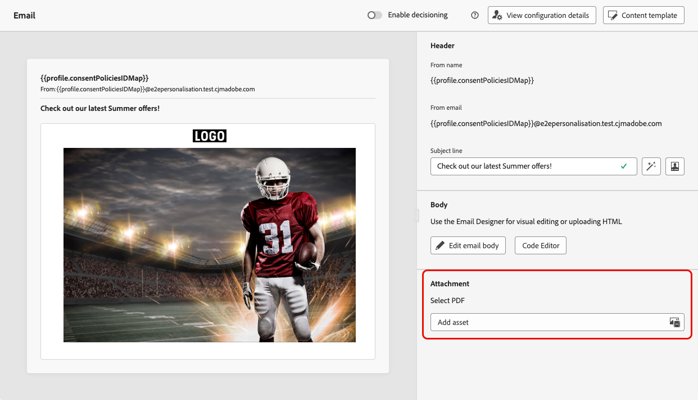

# 在电子邮件上附加 PDF 文件 {#pdf-attachments}

>[!BEGINSHADEBOX]

**在此页面上：**&#x200B;了解如何将静态或个性化的PDF文件附加到电子邮件，包括支持的活动类型以及适用的计数、大小和卷限制。

>[!ENDSHADEBOX]

>[!CONTEXTUALHELP]
>id="ajo_pdf_attachments"
>title="添加 PDF 附件"
>abstract="浏览并选择要附加在电子邮件上的 PDF 文件。</br>每个轮廓每年最多可发送 6 条带有 PDF 附件的消息。 每个附件允许的最大文件大小为 5 MB。</br>如需更大的文件大小或更多的附件发送量，您可以购买 PDF 附件附加组件。 有关更多信息，请与 Adobe 代表联系。"

您可以将静态PDF文件附加到您通过[!DNL Journey Optimizer]发送的电子邮件中。 如果您使用[API触发的营销活动](../campaigns/api-triggered-campaigns.md)，则还可以为每个收件人附加[个性化的PDF文件](#personalized-attachments)。

请注意，个性化的PDF附件需要额外的文件检索和处理。 使用它们的营销活动可能会比没有附件的营销活动具有更高的处理延迟和较低的吞吐量，尤其是在使用多个或更大的PDF文件时。

>[!IMPORTANT]
>
>* 无论附件是静态的还是个性化的，您每年最多可以为每个用户档案发送6封包含PDF附件的邮件。
>
>* 每个附件的最大文件大小为 5 MB。 对于包含[个性化附件](#personalized-attachments)的电子邮件，默认情况下，电子邮件中所有静态和个性化的PDF附件共享合并的5 MB限制。
>
> 对于任何其他大小或容量，您可以购买PDF附件加载项，这会使个性化附件的组合限制提高到10 MB。 有关更多信息，请与 Adobe 代表联系。

要将PDF文件附加到电子邮件，请执行以下步骤。

1. 在历程或营销策划中创建电子邮件。 [了解详情](create-email.md)

1. 在历程或营销活动&#x200B;**[!UICONTROL 内容]**&#x200B;选项卡中，从&#x200B;**[!UICONTROL 附件]**&#x200B;部分选择&#x200B;**[!UICONTROL 添加资产]**。

   

1. Assets Essentials存储库随即显示。

   >[!NOTE]
   >
   >设计消息时，您可以直接从Journey Optimizer界面中访问Assets Essentials存储库。 要了解有关嵌入式[!DNL Assets Essentials]用户界面的更多信息，请参阅[Experience Manager Assets Essentials文档](https://experienceleague.adobe.com/docs/experience-manager-assets-essentials/help/introduction.html?lang=zh-Hans){target="_blank"}。

1. 使用&#x200B;**[!UICONTROL MIME类型]**&#x200B;部分中的&#x200B;**[!UICONTROL PDF]**&#x200B;筛选器将选择限制为正确的文件格式。

   

   >[!NOTE]
   >
   >附件只允许使用PDF格式。

1. 选择您选择的文件。

   * 一次只能选择一个文件。
   * 每个附件的最大文件大小为 5 MB。

1. 完成后，所选文件的名称和大小将显示在&#x200B;**[!UICONTROL 附件]**&#x200B;部分中。

   您可以使用文件名旁边的更多操作图标删除所选文件。

   

>[!NOTE]
>
>将邮件另存为[内容模板](../content-management/create-content-templates.md)时，PDF附件未与模板一起保留。 如果从保存的内容模板创建新电子邮件，则需要重新附加文件。

## 为API触发的营销活动附加个性化的PDF文件 {#personalized-attachments}

您还可以将特定于收件人的PDF文件附加到通过[API触发的营销活动](../campaigns/api-triggered-campaigns.md)发送的单个电子邮件。 与静态附件不同，每个收件人可以收到不同的文件，例如发票、登机证、合同或装运标签。

默认情况下，电子邮件中所有静态和个性化PDF附件的组合大小限制为5 MB。 具有适用的PDF附件加载项的组织可以使用最多10 MB的组合限制。

>[!IMPORTANT]
>
>* 仅事务性API触发的电子邮件营销活动支持个性化PDF附件。
>
>* 一封电子邮件中最多可以包含五个PDF附件。 此限制包括静态附件和个性化附件。 例如，包含一个静态PDF的电子邮件最多可以包含四个个性化PDF。 如果您需要发送更多邮件，请将其拆分为多个通信。
>
>* 个性化和静态PDF附件计入相同的配额。 [了解详情](#pdf-attachments)

必须将个性化的PDF附件上传到特定于附件的[数据登陆区域](https://experienceleague.adobe.com/zh-hans/docs/experience-platform/sources/connectors/cloud-storage/data-landing-zone){target="_blank"}容器，然后在API有效负载中引用。 数据登陆区域是当前唯一支持个性化PDF附件的存储位置。

1. 使用与执行请求相同的IMS组织和沙盒的`type=ajoemailattachments`为沙盒检索数据登陆区域凭据，如[Adobe Experience Platform文档](https://experienceleague.adobe.com/zh-hans/docs/experience-platform/sources/connectors/cloud-storage/data-landing-zone){target="_blank"}中所述。 根据云提供商，使用Azure容器或API返回的AWS存储段和文件夹。

1. 使用您选择的工具生成PDF文件，并将它们上传到您的数据登陆区容器。

   请注意，数据登录区会在七天后自动删除文件，在消息投放和任何重试完成之前，请确保PDF文件在容器中保持可用。

1. 在API有效负载中，为每个收件人添加一个`attachments`数组，该数组包含要发送的PDF的文件名、内容类型和数据登陆区域路径。 [了解如何个性化您的API触发的活动内容](../campaigns/api-triggered-campaign-content.md#contextual)

   ```json
   "attachments": [
     {
       "name": "invoice-12345.pdf",
       "contentType": "application/pdf",
       "source": {
         "type": "dlzPath",
         "path": "attachments/invoice-12345.pdf"
       }
     }
   ]
   ```

   请注意，`source.path`是使用`type=ajoemailattachments`检索到的相对于附件特定数据登陆区域容器的对象路径。 不包括Azure容器名称、AWS存储段或文件夹、凭据或完整存储URL。

在发送时，[!DNL Journey Optimizer]从指定位置获取文件并将其附加到收件人的邮件中。 主区域中的[高吞吐量](../campaigns/api-triggered-high-throughput.md)营销活动支持个性化的PDF附件。 在区域故障转移期间不支持它们。

有关完整的API有效负载引用，请参阅[交互式消息执行API文档](https://developer.adobe.com/journey-optimizer-apis/references/messaging#tag/execution){target="_blank"}。
