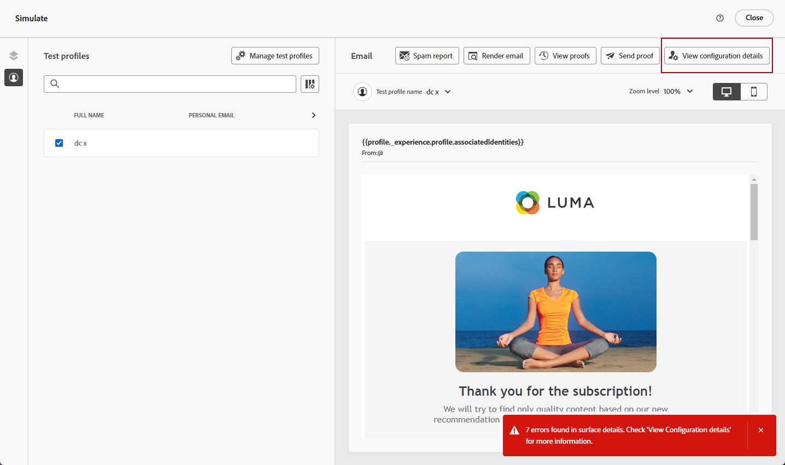

# 个性化电子邮件配置设置 {#surface-personalization}

为了提高对电子邮件设置的灵活性和控制，[!DNL Journey Optimizer]允许您在创建电子邮件配置时定义子域、标题和URL跟踪参数的个性化值。

## 添加动态子域 {#dynamic-subdomains}

>[!CONTEXTUALHELP]
>id="ajo_surface_perso_not_available"
>title="个性化不可用"
>abstract="这个配置在创建时没有任何个性化属性。如果需要个性化，请参阅文档了解解决问题的步骤。"

>[!CONTEXTUALHELP]
>id="ajo_surface_dynamic_subdomain"
>title="启用动态子域"
>abstract="创建电子邮件设定时，您可以根据使用个性化编辑器定义的条件设置动态子域。您最多可以添加 50 个动态子域。"

创建电子邮件配置时，您可以根据特定条件设置动态子域。

例如，如果您在法律上限制每个国家/地区使用专用电子邮件地址发送消息，则可以使用动态子域。 这样，您就可以创建单个配置，其中包含多个对应于不同国家/地区的发送子域，而不是为每个国家/地区创建多个配置。 然后，您可以将基于不同国家/地区的客户整合到一个营销活动中。

要在电子邮件渠道配置中定义动态子域，请执行以下步骤。

1. 在创建配置之前，请根据您的用例设置要用于发送电子邮件的子域。 [了解如何操作](../configuration/about-subdomain-delegation.md)

   例如，假设您想为不同的国家/地区使用不同的子域：设置一个特定于美国的子域，一个特定于英国的子域，等等。

1. 创建渠道配置。 [了解如何操作](../configuration/channel-surfaces.md)

1. 选择&#x200B;**[!UICONTROL 电子邮件]**&#x200B;渠道。

1. 在&#x200B;**子域**&#x200B;部分中，启用&#x200B;**[!UICONTROL 动态子域]**&#x200B;选项。

   

1. 选择第一个&#x200B;**[!UICONTROL 条件]**&#x200B;字段旁边的“编辑”图标。

1. [个性化编辑器](../personalization/personalization-build-expressions.md)打开。 在此示例中，将诸如`Country`等条件设置为`US`。

   

1. 选择要与此条件关联的子域。 [了解有关子域的更多信息](../configuration/about-subdomain-delegation.md)

   >[!NOTE]
   >
   >由于挂起[反馈循环](../reports/deliverability.md#feedback-loops)注册，某些子域当前不可选择。 此过程可能需要长达 10 个工作日。完成后，您可以从所有可用的子域中进行选择。<!--where FL registration happens? is it when delegating a subdomain and you are awaiting from subdomain validation? or is it on ISP side only?-->

   

   所有位于美国的收件人都会收到使用该国家/地区所选子域的消息，这意味着所有涉及的URL（如镜像页面、跟踪URL或取消订阅链接）都将基于该子域进行填充。

1. 根据需要设置其他动态子域。 您最多可以添加50个项目。

   

   <!--Select the [IP pool](../configuration/ip-pools.md) to associate with the configuration. [Learn more](email-settings.md#subdomains-and-ip-pools)-->

1. 定义所有其他[电子邮件设置](email-settings.md)和[提交](../configuration/channel-surfaces.md#create-channel-surface)您的配置。

将一个或多个动态子域添加到配置后，将根据此配置的已解析动态子域填充以下项目：

* 所有URL（资源URL、镜像页面URL和跟踪URL）

* [取消订阅URL](email-settings.md#list-unsubscribe)

* **来自电子邮件**&#x200B;和&#x200B;**错误电子邮件**&#x200B;后缀

>[!NOTE]
>
>如果设置动态子域，然后禁用&#x200B;**[!UICONTROL 动态子域]**&#x200B;选项，则将删除所有动态值。 选择子域并提交配置以使更改生效。

## 个性化您的标题 {#personalize-header}

您还可以对配置中定义的所有标头参数使用个性化。

例如，如果您拥有多个品牌，则可以创建单个配置并为电子邮件标头使用个性化值。 这样，您就可以确保从不同品牌发送的所有电子邮件均使用正确的&#x200B;**发件人**&#x200B;名称和电子邮件发送给每位客户。 同样，当您的收件人在其电子邮件客户端软件中点击&#x200B;**回复**&#x200B;按钮时，您希望&#x200B;**回复**&#x200B;名称和电子邮件对应于正确用户的正确品牌。

要为配置标头参数使用个性化变量，请执行以下步骤。

>[!NOTE]
>
>您可以个性化所有&#x200B;**[!UICONTROL 标头参数]**&#x200B;字段，但&#x200B;**[!UICONTROL 错误电子邮件前缀]**&#x200B;字段除外。

1. 像往常一样定义标题参数。 [了解如何操作](email-settings.md#email-header)

1. 对于每个字段，选择编辑图标。

   

1. [个性化编辑器](../personalization/personalization-build-expressions.md)打开。 根据需要定义条件并保存更改。

   <!--For example, set a condition such as each recipient receives an email from their own brand representative.-->

   >[!NOTE]
   >
   >您只能选择&#x200B;**[!UICONTROL 配置文件属性]**&#x200B;和&#x200B;**[!UICONTROL 帮助程序函数]**。

   例如，您希望动态处理代表关系经理发送的电子邮件，关系经理的详细信息存储在客户配置文件中，以便每个客户都与关系经理关联。 在[历程](../building-journeys/journey-gs.md)中，电子邮件标头（发件人姓名、发件人电子邮件、回复地址）可以使用关系管理器的参数（从配置文件属性中获取）进行个性化。

   <!--The examples below use event parameters, which are currently not available.
    
    Let's say you want to handle dynamically emails sent on behalf of a sales assistant, where the sales assistant is retrieved from an event or campaign contextual parameters. For example: In a [journey](../building-journeys/journey-gs.md), when a purchase event is linked to the sales assistant of a specific shop, the email header (sender name, sender email, reply to address) can be personalized with the sales assistant parameters, taken from the event attributes. In an [API-triggered campaign](../campaigns/api-triggered-campaigns.md), initiated externally by a sales assistant, the triggered email can be sent on behalf of the sales assistant and the header personalization values taken from campaign contextual parameters.-->

1. 对要添加个性化的每个参数重复上述步骤。

>[!NOTE]
>
>如果您将一个或多个动态子域添加到配置，则将基于已解析的&#x200B;**动态子域**&#x200B;填充&#x200B;**来自电子邮件**&#x200B;和[错误电子邮件](#dynamic-subdomains)后缀。

## 使用个性化的URL跟踪 {#personalize-url-tracking}

要使用个性化的URL跟踪参数，请执行以下步骤。

1. 转到电子邮件渠道配置的&#x200B;**[!UICONTROL URL跟踪参数]**&#x200B;部分。 [了解详情](url-tracking.md)

1. 单击每个字段旁边的编辑图标。 除了上下文属性之外，您还可以选择配置文件属性。

1. 从[个性化编辑器](../personalization/personalization-build-expressions.md)中选择您选择的配置文件属性。

1. 对要个性化的每个跟踪参数重复上述步骤。

现在，在发送电子邮件时，个性化参数将自动附加到URL的末尾。 然后，您可以在网站分析工具或性能报表中捕获此参数。

## 查看配置详细信息 {#view-surface-details}

在营销活动或历程中使用具有个性化设置的配置时，您可以直接在营销活动或历程中显示配置详细信息。 请按照以下步骤操作。

1. 创建电子邮件[营销活动](../campaigns/create-campaign.md)或[历程](../building-journeys/journey-gs.md)。

1. 选择&#x200B;**[!UICONTROL 编辑内容]**&#x200B;按钮。

1. 单击&#x200B;**[!UICONTROL 查看配置详细信息]**&#x200B;按钮。

   

1. 将显示&#x200B;**[!UICONTROL 投放设置]**&#x200B;窗口。 您可以查看所有配置设置，包括动态子域和个性化的标头参数。

   >[!NOTE]
   >
   >此屏幕中的所有信息均为只读。

1. 选择&#x200B;**[!UICONTROL 展开]**&#x200B;以显示动态子域的详细信息。

   

## 检查您的配置 {#check-configuration}

在营销活动或历程中使用个性化配置时，您可以使用测试用户档案预览电子邮件内容，以检查您定义的动态设置是否存在潜在错误。 请按照以下步骤操作。

>[!NOTE]
>
>除了测试用户档案之外，[!DNL Journey optimizer]还允许您测试内容的不同变体，方法是预览内容并使用从CSV/JSON文件上传或手动添加的示例输入数据发送校样。 [了解如何模拟内容变体](../test-approve/simulate-sample-input.md)

要使用测试用户档案预览内容，请执行以下步骤：

1. 从消息的编辑内容屏幕或电子邮件Designer中，单击&#x200B;**[!UICONTROL 模拟内容]**&#x200B;按钮。 [了解详情](../content-management/preview.md)

1. 选择[测试配置文件](../content-management/test-profiles.md)。

1. 如果显示错误，请单击&#x200B;**[!UICONTROL 查看配置详细信息]**&#x200B;按钮。

   

1. 检查&#x200B;**[!UICONTROL 投放设置]**&#x200B;屏幕以了解错误详细信息。

   

可能的错误可能如下所示：

* 未解析选定测试配置文件的&#x200B;**子域**。 例如，您的配置使用了多个对应于不同国家/地区的发送子域，但所选配置文件没有为`Country`属性定义值，或者该属性设置为`France`，但此值未与该配置中的任何子域关联。

* 选定的配置文件没有与一个或多个&#x200B;**标头参数**&#x200B;关联的值。

出现上述任何错误时，都不会向选定的测试用户档案发送电子邮件。

为避免此类错误，请确保您定义的标头参数将个性化属性与大多数用户档案的值结合使用。 缺少值可能会影响您的电子邮件可投放性。

>[!NOTE]
>
>在[本节](../reports/deliverability.md)中了解有关可投放性的更多信息
