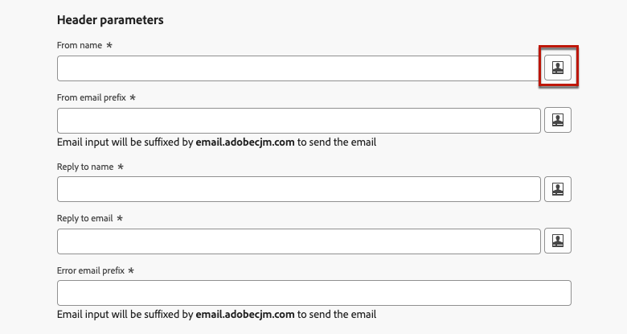

# 个性化电子邮件表面设置 {#surface-personalization}

为了增强对电子邮件设置的灵活性和控制， [!DNL Journey Optimizer] 允许您定义子域和标头的个性化值<!--and URL tracking parameters--> 创建电子邮件界面时。

>[!AVAILABILITY]
>
>此功能目前仅作为测试版提供给选定用户。 <!--To join the beta program, contact Adobe Customer Care.-->

## 添加动态子域 {#dynamic-subdomains}

>[!CONTEXTUALHELP]
>id="ajo_surface_perso_not_available"
>title="个性化不可用"
>abstract="这个表面在创建时没有任何个性化属性。如果需要个性化，请参阅文档了解解决问题的步骤。"

>[!CONTEXTUALHELP]
>id="ajo_surface_dynamic_subdomain"
>title="启用动态子域"
>abstract="创建电子邮件界面时，您可以根据使用表达式编辑器定义的条件设置动态子域。您最多可以添加 50 个动态子域。"

>[!CONTEXTUALHELP]
>id="ajo_surface_dynamic_subdomain_list"
>title="某些子域名可能不可用"
>abstract="由于反馈回路注册尚未完成，某些子域名目前无法选择。此过程可能需要长达 10 个工作日。完成后，您可以从所有可用的子域中进行选择。"
>additional-url="https://experienceleague.adobe.com/zh-hans/docs/journey-optimizer/using/configuration/delegate-subdomains/about-subdomain-delegation" text="子域委派入门"

创建电子邮件界面时，您可以根据特定条件设置动态子域。

例如，如果您在法律上限制每个国家/地区使用专用电子邮件地址发送消息，则可以使用动态子域。 这样，您就可以创建一个单独的表面，其中包含多个对应于不同国家/地区的发送子域，而不是为每个国家/地区创建多个表面。 然后，您可以将基于不同国家/地区的客户整合到一个营销活动中。

要定义电子邮件渠道界面中的动态子域，请执行以下步骤。

1. 在创建表面之前，请根据用例设置要用于发送电子邮件的子域。 [了解如何操作](../configuration/about-subdomain-delegation.md)

   例如，假设您想为不同的国家/地区使用不同的子域：设置一个特定于美国的子域，一个特定于英国的子域，等等。

1. 创建渠道表面。 [了解如何操作](../configuration/channel-surfaces.md)

1. 选择 **[!UICONTROL 电子邮件]** 渠道。

1. 在 **子域** 部分，启用 **[!UICONTROL 动态子域]** 选项。

   

1. 选择第一个页面旁边的编辑图标 **[!UICONTROL 条件]** 字段。

1. 此 [表达式编辑器](../personalization/personalization-build-expressions.md) 打开。 在此示例中，设置一个条件，如 `Country` 等于 `US`.

   

1. 选择要与此条件关联的子域。 [了解有关子域的更多信息](../configuration/about-subdomain-delegation.md)

   >[!NOTE]
   >
   >由于挂起，某些子域当前无法选择 [反馈环](../reports/deliverability.md#feedback-loops) 注册。 此过程可能需要长达 10 个工作日。完成后，您可以从所有可用的子域中进行选择。 <!--where FL registration happens? is it when delegating a subdomain and you're awaiting from subdomain validation? or is it on ISP side only?-->

   

   所有位于美国的收件人都会收到使用该国家/地区所选子域的消息，这意味着所有涉及的URL（如镜像页面、跟踪URL或取消订阅链接）都将基于该子域进行填充。

1. 根据需要设置其他动态子域。 您最多可以添加50个项目。

   

   <!--Select the [IP pool](../configuration/ip-pools.md) to associate with the surface. [Learn more](email-settings.md#subdomains-and-ip-pools)-->

1. 定义所有其他项 [电子邮件设置](email-settings.md) 和 [提交](../configuration/channel-surfaces.md#create-channel-surface) 你的表面。

将一个或多个动态子域添加到曲面后，将根据为此曲面解析的动态子域填充以下项目：

* 所有URL（资源URL、镜像页面URL和跟踪URL）

* 此 [取消订阅URL](email-settings.md#list-unsubscribe)

* 此 **发件人电子邮件** 和 **错误电子邮件** 后缀

>[!NOTE]
>
>如果您设置动态子域，然后禁用 **[!UICONTROL 动态子域]** 选项，则会删除所有动态值。 选择子域并提交表面以使更改生效。

## 个性化您的标题 {#personalize-header}

您还可以对表面中定义的所有标题参数使用个性化。

例如，如果您有多个品牌，则可以创建一个表面，并将个性化的值用于电子邮件标题。 这样，您就可以确保从不同品牌发送的所有电子邮件发送到每位客户，并且提供正确的电子邮件地址和正确地址 **从** 姓名和电子邮件。 同样，当收件人点击 **回复** 按钮时，您希望 **回复** 名称和电子邮件对应于正确用户的正确品牌。

要为表面标题参数使用个性化变量，请执行以下步骤。

>[!NOTE]
>
>您可以个性化所有 **[!UICONTROL 标题参数]** 字段，但 **[!UICONTROL 电子邮件前缀错误]** 字段。

1. 像往常一样定义标题参数。 [了解如何操作](email-settings.md#email-header)

1. 对于每个字段，选择编辑图标。

   

1. 此 [表达式编辑器](../personalization/personalization-build-expressions.md) 打开。 根据需要定义条件，然后保存更改。

   例如，设置条件，如每个收件人都会收到来自其品牌代表的电子邮件。

   >[!NOTE]
   >
   >您只能选择 **[!UICONTROL 配置文件属性]** 和 **[!UICONTROL 辅助函数]**.

1. 对要添加个性化的每个参数重复上述步骤。

>[!NOTE]
>
>如果将一个或多个动态子域添加到曲面，则 **发件人电子邮件** 和 **错误电子邮件** 将根据解析的填充后缀 [动态子域](#dynamic-subdomains).

<!--
## Use personalized URL tracking {#personalize-url-tracking}

To use personalized URL tracking prameters, follow the steps below.

1. Select the profile attribute of your choice from the expression editor.

1. Repeat the steps above for each tracking parameter you want to personalize.

Now when the email is sent out, this parameter will be automatically appended to the end of the URL. You can then capture this parameter in web analytics tools or in performance reports.
-->

## 查看表面详细信息 {#view-surface-details}

在营销策划或营销策划中使用具有个性化设置的营销策划表面时，您可以直接在营销策划或营销策划表面中显示表面详细信息。 请按照以下步骤操作。

1. 创建电子邮件 [营销活动](../campaigns/create-campaign.md) 或 [历程](../building-journeys/journey-gs.md).

1. 选择 **[!UICONTROL 编辑内容]** 按钮。

1. 单击 **[!UICONTROL 查看表面详细信息]** 按钮。

   

1. 此 **[!UICONTROL 投放设置]** 窗口随即显示。 您可以查看所有表面设置，包括动态子域和个性化的标题参数。

   >[!NOTE]
   >
   >此屏幕中的所有信息均为只读。

1. 选择 **[!UICONTROL 展开]** 以显示动态子域的详细信息。

   
