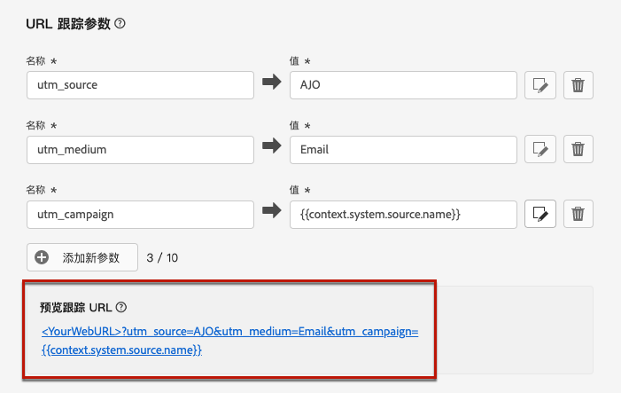

# URL 跟踪 {#url-tracking}

>[!CONTEXTUALHELP]
>id="ajo_admin_preset_utm"
>title="定义 URL 跟踪参数"
>abstract="使用此部分可自动向电子邮件内容中的 URL 附加跟踪参数。此功能为可选项。"

>[!CONTEXTUALHELP]
>id="ajo_admin_preset_url_preview"
>title="预览 URL 跟踪参数"
>abstract="查看如何对电子邮件内容中出现的 URL 附加跟踪参数。"

在配置新的[电子邮件渠道配置](email-settings.md)时，您可以定义&#x200B;**[!UICONTROL URL跟踪参数]**&#x200B;以衡量跨渠道营销工作的有效性。 激活此功能是可选的。

相应部分中定义的参数将被附加到电子邮件内容中包含的URL的末尾。 然后，您可以在 Adobe Analytics 或 Google Analytics 等网站分析工具中捕获这些参数，并创建各种绩效报告。

使用&#x200B;**[!UICONTROL 添加新参数]**&#x200B;按钮，您可以添加最多 10 个跟踪参数。

{width="80%"}

要配置 URL 跟踪参数，可以直接在&#x200B;**[!UICONTROL 名称]**&#x200B;和&#x200B;**[!UICONTROL 值]**&#x200B;字段中输入所需的值。

您还可以使用[个性化编辑器](../personalization/personalization-build-expressions.md)编辑每个&#x200B;**[!UICONTROL 值]**&#x200B;字段。单击编辑图标，打开编辑器。在那里，您可以选择提供的上下文属性和/或直接编辑文本。

可通过个性化编辑器使用以下预定义值：

* **源操作 ID**：添加到历程或营销活动的电子邮件操作的 ID。

* **源操作名称**：添加到历程或营销活动的电子邮件操作的名称。

* **源 ID**：发送电子邮件的历程或营销活动的 ID。

* **源名称**：发送电子邮件时使用的历程或营销活动的名称。

* **源版本 ID**：发送电子邮件的历程或营销活动版本的 ID。

* **优惠 ID**：电子邮件中使用的优惠 ID。

>[!NOTE]
>
>您可以组合键入文本值，并使用个性化编辑器中的上下文属性。每个&#x200B;**[!UICONTROL 值]**&#x200B;的字段可以包含多个字符，最大限制为 5 KB。

<!--You can drag and drop the parameters to reorder them.-->

以下是与 Adobe Analytics 和 Google Analytics 兼容的 URL 示例。

* 与 Adobe Analytics 兼容的 URL：`www.YourLandingURL.com?cid=email_AJO_{{context.system.source.id}}_image_{{context.system.source.name}}`

* 与 Google Analytics 兼容的 URL：`www.YourLandingURL.com?utm_medium=email&utm_source=AJO&utm_campaign={{context.system.source.id}}&utm_content=image`

您可以动态预览生成的跟踪 URL。每次添加、编辑或移除参数时，都会自动更新预览。

>[!NOTE]
>
>您还可以向电子邮件内容中存在的链接添加动态个性化跟踪参数。 [了解详情](surface-personalization.md#personalize-url-tracking)
