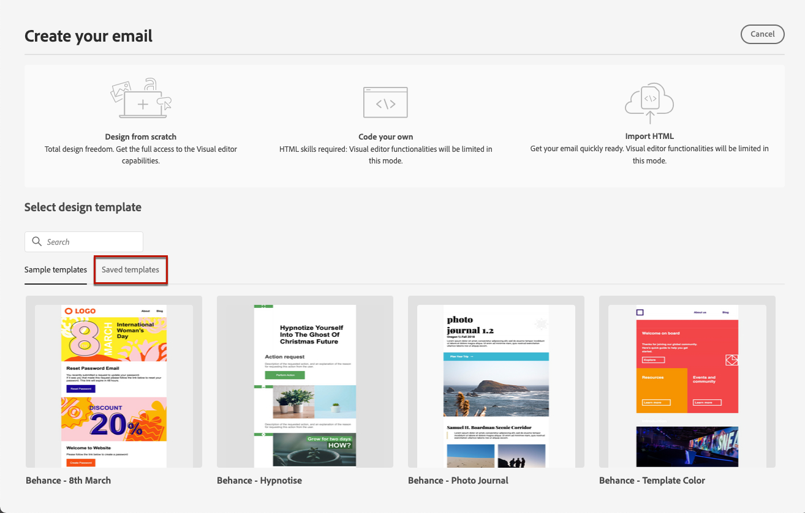

# 使用电子邮件模板 {#email-templates}

>[!BEGINSHADEBOX]

**在此页面上：**&#x200B;了解如何从Email Designer中的示例或保存的设计模板开始构建电子邮件内容。

>[!ENDSHADEBOX]

>[!CONTEXTUALHELP]
>id="ajo_use_template"
>title="从模板生成内容"
>abstract="要开始创建您的电子邮件内容，请选择现成的模板或自定义的现有模板，后者可以是从头开始创建的模板，也可以是从以前的电子邮件另存为的模板。"

在&#x200B;**[!UICONTROL 创建电子邮件]**&#x200B;屏幕中，使用&#x200B;**[!UICONTROL 选择设计模板]**&#x200B;部分开始从模板构建内容。

您可以从以下内容中进行选择：

* **示例模板**。 [!DNL Journey Optimizer]界面提供了20个现成的电子邮件模板，您可以从中进行选择。

* **已保存模板**。 您还可以使用以下任一方式使用的自定义模板：

   * 使用&#x200B;**[!UICONTROL 内容模板]**&#x200B;菜单从头开始创建。 [了解详情](../content-management/content-templates.md#content-templates)

   * 使用&#x200B;**[!UICONTROL 另存为内容模板]**&#x200B;选项从历程或营销活动中的电子邮件保存。 [了解详情](../content-management/content-templates.md#video-templates)

要开始使用示例模板或保存的模板之一构建内容，请执行以下步骤。

1. [从电子邮件&#x200B;**[!UICONTROL 编辑内容]**&#x200B;屏幕访问电子邮件Designer](get-started-email-design.md)。

1. 在&#x200B;**[!UICONTROL 创建电子邮件]**&#x200B;屏幕上，默认选中&#x200B;**[!UICONTROL 示例模板]**&#x200B;选项卡。

1. 若要使用自定义模板，请转到&#x200B;**[!UICONTROL 保存的模板]**&#x200B;选项卡。

   

1. 将显示在当前沙盒上创建的所有[内容模板](../content-management/content-templates.md#content-templates)的列表。 您可以按&#x200B;**[!UICONTROL 名称]**、**[!UICONTROL 上次修改日期]**&#x200B;和&#x200B;**[!UICONTROL 上次创建日期]**&#x200B;对它们进行排序。

   

1. 从列表中选择您选择的模板。

1. 选定后，您可以使用左右箭头在某个类别的所有模板（示例或保存的模板，具体取决于您的选择）之间导航。

   

1. 单击屏幕右上方的&#x200B;**[!UICONTROL 使用此模板]**。

1. 根据需要使用电子邮件Designer编辑您的内容。
