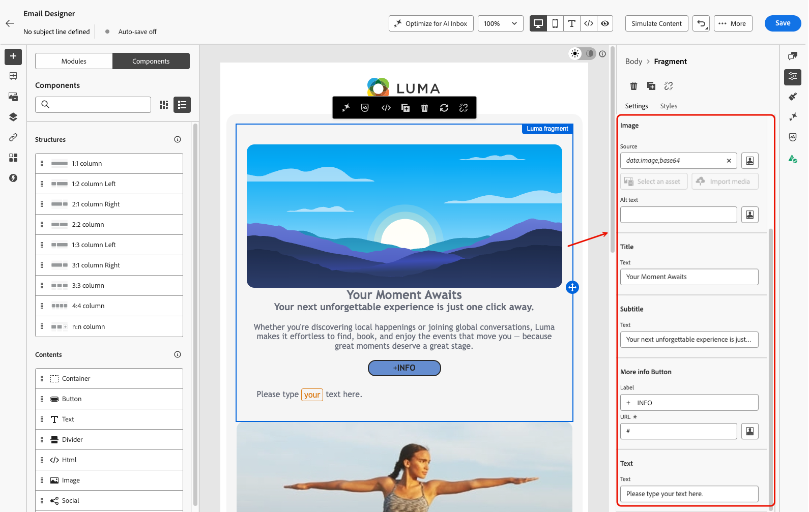
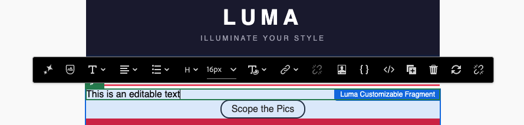

# 将可视片段添加到电子邮件 {#use-visual-fragments}

>[!BEGINSHADEBOX]

**在此页面上：**&#x200B;了解如何在您的电子邮件中插入可重复使用的可视化片段，自定义其可编辑字段，以及中断或保留其与原始片段的继承。

>[!ENDSHADEBOX]

片段是可重复使用的组件，可以在跨Journey Optimizer营销活动、历程或内容模板的一个或多个电子邮件中引用。 此功能允许预先构建多个自定义内容块，营销用户可以使用这些内容块在改进的设计过程中快速组合电子邮件内容。 [了解如何创建和管理片段](../content-management/fragments.md)。

➡️ [在此视频中了解如何管理、创作和使用片段](../content-management/fragments.md#video-fragments)

## 使用片段 {#use-fragment}

要在电子邮件中使用片段，请执行以下步骤。

>[!NOTE]
>
>您最多可以在给定投放中添加30个片段。 片段最多只能嵌套1级。

1. 使用[电子邮件Designer](get-started-email-design.md)打开任何电子邮件或模板内容。

1. 从左边栏中选择&#x200B;**[!UICONTROL 片段]**&#x200B;图标。

   

1. 此时将显示在当前沙盒中创建的所有可视化片段的列表。 它们按创建日期排序：最近添加的可视片段首先显示在列表中。 您可以：

   * 通过开始键入特定片段的标签来搜索该片段。
   * 按升序或降序对片段排序。
   * 更改片段的显示方式（卡片视图或列表视图）。
   * 刷新列表。

   >[!NOTE]
   >
   >如果在编辑内容时修改或添加了某些片段，则列表将使用最新更改进行更新。

1. 将列表中的任何片段拖放到要插入它的区域。

   

   >[!CAUTION]
   >
   >您可以将任何&#x200B;**草稿**&#x200B;或&#x200B;**实时**&#x200B;片段添加到您的内容中。 但是，如果历程或营销活动中正在使用具有草稿状态的片段，您将无法激活该历程或营销活动。 在历程或营销活动发布中，草稿片段将显示错误，您需要批准它们才能发布。

1. 与任何其他组件一样，您可以在内容中移动片段。

1. 选择片段以在右侧显示相应的窗格。 从该位置，您可以从内容中删除片段或复制片段。 您还可以直接从片段顶部显示的上下文菜单执行这些操作。

   

1. 在&#x200B;**[!UICONTROL 设置]**&#x200B;选项卡中，您可以：

   * 选择您希望片段显示的设备。
   * 在新选项卡中打开片段，并根据需要对其进行编辑。 [了解详情](../content-management/manage-fragments.md#edit-fragments)
   * 浏览引用。 [了解详情](../content-management/fragments.md#visual-expression)

1. 如果需要，您可以使用原始片段中断继承。 [了解详情](#break-inheritance)

   解锁后，您可以像任何其他组件一样进一步自定义片段，并使用&#x200B;**[!UICONTROL 样式]**&#x200B;选项卡。

1. 添加所需数量的片段，然后&#x200B;**[!UICONTROL 保存]**&#x200B;您的更改。

## 管理片段中的条件内容 {#fragment-dynamic-content}

在使用包含条件内容的可视片段时，请遵循以下准则。 [了解有关动态内容的更多信息](../personalization/dynamic-content.md#emails)

>[!CAUTION]
>
>**不支持包含条件内容的嵌套片段。** 不能将包含条件内容的片段放在也包含条件内容的已解锁片段中。 此不受支持的配置可能导致：
>
>* 丢失条件内容变量映射
>* 电子邮件Designer中的兼容模式警告
>* 电子邮件渲染不一致

**正确构建您的电子邮件：**&#x200B;使用多个片段和条件内容时，在电子邮件级别将每个片段直接添加到其自己的结构块中。 避免将包含条件内容的片段嵌套在其他也包含条件内容的已解锁片段中。

**提前计划：**&#x200B;在将片段添加到电子邮件之前，请确定哪些片段包含条件内容并相应地计划布局。 这有助于防止配置问题，并确保从一开始就保持结构干净。

**仔细设计可重用片段：**&#x200B;在创建将包含条件内容的片段时，请考虑如何使用它们。 如果片段需要嵌套在其他片段中，请避免向父片段和子片段添加条件内容。

**疑难解答：**&#x200B;如果遇到条件内容变体映射或兼容模式警告丢失的情况，请按照以下步骤操作。

* 检查您的电子邮件结构以查找包含条件内容的嵌套片段
* 通过在电子邮件级别将每个包含条件内容的片段移动到其自身的结构块中进行重构
* 保存并验证条件内容变体是否已正确恢复

## 使用隐式变量 {#implicit-variables-in-fragments}

隐式变量增强了现有片段功能，以提高内容重用和脚本用例的效率。 片段可以使用输入变量并创建可在营销活动和历程内容中使用的输出变量。

了解如何在[本节](../personalization/use-expression-fragments.md#implicit-variables)中使用隐式变量。

## 自定义可编辑字段 {#customize-fields}

如果所选片段的某些部分已变为可编辑，您可以在将该片段添加到内容中后覆盖其默认值。 [了解如何使片段可自定义](../content-management/customizable-fragments.md)

要自定义电子邮件中使用的片段中的可编辑字段，请执行以下步骤。

1. 向您的电子邮件内容添加可自定义的片段，然后选择该片段以打开右侧的&#x200B;**[!UICONTROL 片段]**&#x200B;窗格。

1. 片段中的所有可编辑字段都显示在&#x200B;**[!UICONTROL 设置]**&#x200B;选项卡的片段属性下。

   

1. 将鼠标悬停在中心画布中的任何可编辑字段上。 该字段以绿色突出显示，单击它包含的文本时，会显示一个铅笔图标。

   {width="100%" align="center"}

1. 直接在中心电子邮件Designer画布上内联编辑字段文本。

   >[!NOTE]
   >
   >要轻松找到内容中的可编辑字段，您还可以从右侧窗格中选择它们，但您只能在中心画布中编辑这些字段。

1. 对于&#x200B;**[!UICONTROL Text]**、**[!UICONTROL Button]**&#x200B;和&#x200B;**[!UICONTROL Html]**&#x200B;组件，电子邮件Designer工具栏还允许访问富文本格式选项 — 粗体、斜体、超链接等。

   

   >[!IMPORTANT]
   >
   >默认情况下，在引入富文本编辑功能之前创建的片段的可编辑字段设置为纯文本模式。 要启用完整的格式选项，请使用&#x200B;**[!UICONTROL 打开片段]**&#x200B;按钮转到片段编辑器，单击&#x200B;**[!UICONTROL 启用]**&#x200B;以解锁富文本模式并&#x200B;**[!UICONTROL 保存]**&#x200B;片段。 [了解详情](../content-management/customizable-fragments.md#rich-text-visual)
   >
   >{width="70%" align="center"}

1. 在下面的示例中，可以编辑图像源和替换文本，以及“标题”/“子标题”字段和“更多信息”按钮URL。

   

1. 您可以单击&#x200B;**[!UICONTROL 模拟内容]**&#x200B;以查看可编辑内容和样式呈现方式。 [了解有关预览内容的更多信息](../content-management/preview-test.md)

>[!CAUTION]
>
>当在片段中同时编辑按钮组件的&#x200B;**标签**&#x200B;和&#x200B;**URL**&#x200B;时，跟踪报表将显示URL而不是按钮标签。 [了解有关跟踪的更多信息](message-tracking.md)

## 中断继承 {#break-inheritance}

编辑可视片段时，将同步更改。 它们会自动传播到包含该片段的所有草稿或实时历程/营销活动和内容模板。

添加到电子邮件或内容模板时，片段默认进行同步。 但是，您可以中断来自原始片段的继承。 在这种情况下，片段的内容将被复制到当前设计中，并且更改不再同步。

要中断继承，请执行以下步骤：

1. 选择片段。

1. 单击上下文工具栏中的解锁图标。

   

1. 该片段将成为不再链接到原始片段的独立元素。 可将其编辑为内容中的任何其他内容组件。 [了解详情](content-components.md)

### 锁定的片段 {#locked-fragments}

如果片段被作者锁定，则解锁图标将灰显，并且无法用于中断继承。

锁定的片段在出现的所有地方均保持同步，从而防止了可能违反品牌标准或合规要求的本地编辑。

在[本节](../content-management/create-fragments.md#lock-visual-fragment)中了解如何锁定片段。

>[!NOTE]
>
>片段作者可以稍后更改设置以供将来使用，方法是在片段设置中将其行为重置为&#x200B;**[!UICONTROL 允许中断继承]**。

