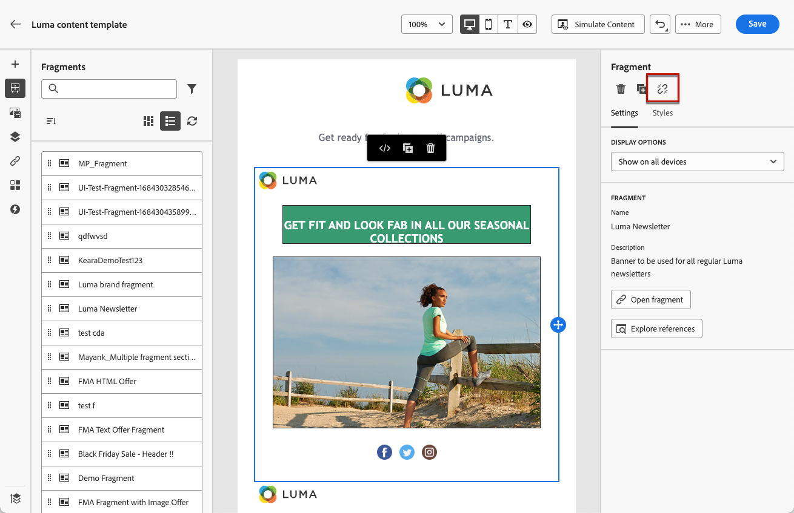

# 将可视片段添加到电子邮件 {#use-visual-fragments}

片段是可重复使用的组件，可以在跨Journey Optimizer营销活动、历程或内容模板的一个或多个电子邮件中引用。 此功能允许预先构建多个自定义内容块，营销用户可以使用这些内容块在改进的设计过程中快速组合电子邮件内容。 [了解如何创建和管理片段](../content-management/fragments.md)。

➡️ [在此视频中了解如何管理、创作和使用片段](../content-management/fragments.md#video-fragments)

## 使用片段 {#use-fragment}

要在电子邮件中使用片段，请执行以下步骤。

>[!NOTE]
>
>您最多可以在给定投放中添加30个片段。 片段最多只能嵌套1级。

1. 使用[电子邮件Designer](get-started-email-design.md)打开任何电子邮件或模板内容。

1. 从左边栏中选择&#x200B;**[!UICONTROL 片段]**&#x200B;图标。

   

1. 此时将显示在当前沙盒中创建的所有可视化片段的列表。 它们按创建日期排序：最近添加的可视片段首先显示在列表中。 您可以：

   * 通过开始键入特定片段的标签来搜索该片段。
   * 按升序或降序对片段排序。
   * 更改片段的显示方式（卡片视图或列表视图）。
   * 刷新列表。

   >[!NOTE]
   >
   >如果在编辑内容时修改或添加了某些片段，则列表将使用最新更改进行更新。

1. 将列表中的任何片段拖放到要插入它的区域。

   

   >[!CAUTION]
   >
   >您可以将任何&#x200B;**草稿**&#x200B;或&#x200B;**实时**&#x200B;片段添加到您的内容中。 但是，如果历程或营销活动中正在使用具有草稿状态的片段，您将无法激活该历程或营销活动。 在历程或营销活动发布中，草稿片段将显示错误，您需要批准它们才能发布。

1. 与任何其他组件一样，您可以在内容中移动片段。

1. 选择片段以在右侧显示相应的窗格。 从该位置，您可以从内容中删除片段或复制片段。 您还可以直接从片段顶部显示的上下文菜单执行这些操作。

   

1. 在&#x200B;**[!UICONTROL 设置]**&#x200B;选项卡中，您可以：

   * 选择您希望片段显示的设备。
   * 需要时，在新选项卡中打开片段以对其进行编辑。 [了解详情](../content-management/fragments.md#edit-fragments)
   * 浏览引用。 [了解详情](../content-management/fragments.md#explore-references)

1. 您可以使用&#x200B;**[!UICONTROL 样式]**&#x200B;选项卡进一步自定义片段。

1. 如果需要，您可以使用原始片段中断继承。 [了解详情](#break-inheritance)

1. 添加所需数量的片段，然后&#x200B;**[!UICONTROL 保存]**&#x200B;您的更改。

## 使用隐式变量 {#implicit-variables-in-fragments}

隐式变量增强了现有片段功能，以提高内容重用和脚本用例的效率。 片段可以使用输入变量并创建可在营销活动和历程内容中使用的输出变量。

了解如何在[本节](../personalization/use-expression-fragments.md#implicit-variables)中使用隐式变量。

## 自定义可编辑字段 {#customize-fields}

如果所选片段的某些部分已变为可编辑，则可以在将片段添加到内容后覆盖其默认值。 [了解如何使您的片段可自定义](../content-management/customizable-fragments.md)

要自定义片段中的可编辑字段，请执行以下步骤：

1. 将片段添加到您的内容。

1. 选择它可打开右侧的属性窗格。

   片段中的所有可编辑字段显示在&#x200B;**片段**&#x200B;部分下的&#x200B;**设置**&#x200B;选项卡中。

1. 在右侧窗格中选择可编辑字段时，会在中央预览窗格中以绿色突出显示该字段，以便轻松识别其在内容中的位置。

   在以下示例中，可以编辑图像&#x200B;**源**&#x200B;和&#x200B;**替换文本**&#x200B;以及“单击此处”按钮&#x200B;**URL**。

   

## 中断继承 {#break-inheritance}

编辑可视片段时，将同步更改。 它们会自动传播到包含该片段的所有草稿或实时历程/营销活动和内容模板。

添加到电子邮件或内容模板时，片段默认进行同步。 但是，您可以中断来自原始片段的继承。 在这种情况下，片段的内容将被复制到当前设计中，并且更改不再同步。

要中断继承，请执行以下步骤：

1. 选择片段。

1. 单击上下文工具栏中的解锁图标。

   

1. 该片段将成为不再链接到原始片段的独立元素。 可将其编辑为内容中的任何其他内容组件。 [了解详情](content-components.md)
