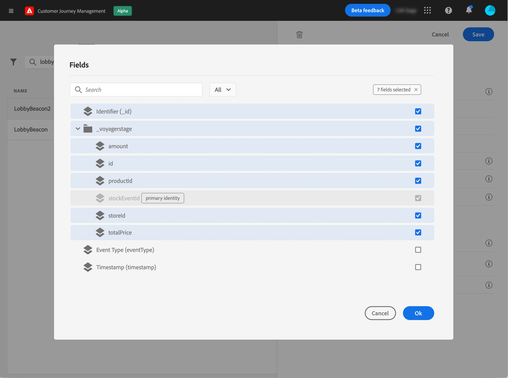

# 配置业务事件{#configure-a-business-event}

与单一事件不同，业务事件与特定用户档案不相关。 事件ID类型始终基于规则。 请阅读[此部分](../event/about-events.md)中有关业务事件的更多信息。

基于读取区段的历程可以由调度程序在事件发生时通过一次性、定期或由业务事件触发。

业务事件可以是“产品重新存货”、“公司股价达到一定价值”等。

## 重要说明

* 事件架构必须包含主标识。
* 只能将业务事件作为历程的第一步进行删除。
* 将业务事件作为历程的第一步删除时，历程的计划程序类型将为“业务事件”。
* 在业务事件后，只能删除读取区段活动。 它将自动添加为下一步。
* 业务事件的触发频率不能超过一小时。
* 触发业务事件后，将区段从15分钟导出到最多1小时，这将会出现延迟。
* 测试业务事件时，必须传递事件参数以及将进入测试旅程的测试用户档案的标识符。 此外，在测试基于业务事件的历程时，您只能触发单个用户档案进入。 请参阅[此小节](../building-journeys/testing-the-journey.md#test-business)。在测试模式下，没有可用的“代码视图”模式。
* 如果新的业务事件到来，当前处于历程中的个人会发生什么情况？ 其行为与当新的重复发生时个人仍处于循环历程中的情况相同。 他们的路结束了。 因此，如果营销人员预计会发生频繁的业务事件，则必须注意避免构建过长的历程。

## 业务事件入门

以下是配置业务事件的首要步骤：

1. 在“管理”部分，浏览至&#x200B;**[!UICONTROL Configurations]**，然后单击&#x200B;**[!UICONTROL Events]**。 将显示事件列表。

   

1. 单击&#x200B;**[!UICONTROL Add]**&#x200B;以创建新事件。事件配置窗格将在屏幕右侧打开。

   

1. 输入事件的名称。 您还可以添加描述。

   

   >[!NOTE]
   >
   >请勿使用空格或特殊字符。请勿使用超过 30 个字符。

1. 在&#x200B;**[!UICONTROL Type]**&#x200B;字段中，选择&#x200B;**Business**。

   

1. 使用此事件的旅程数显示在&#x200B;**[!UICONTROL Used in]**&#x200B;字段中。您可以单击 **[!UICONTROL View journeys]**&#x200B;图标，以显示使用此事件的旅程列表。

1. 定义架构和有效负载字段：在这里，您可以选择历程预期接收的事件信息（通常称为有效负载）。 然后，您便能够在旅程中使用这些信息。请参阅[此小节](../event/about-creating-business.md#define-the-payload-fields)。

   

   只有时间系列架构可用。 体验事件、决策事件和历程步骤事件架构不可用。 事件架构必须包含主标识。

   

1. 在&#x200B;**[!UICONTROL Event ID condition]**字段内单击。 使用简单表达式编辑器，定义系统将使用的条件以识别将触发历程的事件。
   

   在本例中，我们根据产品的ID编写了一个条件。 这意味着，每当系统收到与此条件匹配的事件时，都会将其传递到历程。

1. 单击 **[!UICONTROL Save]**。

   

   事件现已配置完毕，可随时投入旅程。还需要其他配置步骤以接收事件。请参阅[此页](../event/additional-steps-to-send-events-to-journey-orchestration.md)。

## 定义有效负载字段{#define-the-payload-fields}

有效负载定义允许您选择系统希望从历程中的事件接收的信息，以及用于标识与事件关联的人员的键。 负载基于Experience CloudXDM字段定义。 有关XDM的更多信息，请参阅[此页面](https://experienceleague.adobe.com/docs/experience-platform/xdm/home.html?lang=zh-Hans)。

1. 从列表中选择XDM架构，然后单击&#x200B;**[!UICONTROL Payload]**&#x200B;字段或&#x200B;**[!UICONTROL Edit]**&#x200B;图标。

   

   将显示架构中定义的所有字段。 字段列表因架构而异。 您可以搜索特定字段，或使用过滤器显示所有节点和字段，或仅显示选定的字段。 根据架构定义，某些字段可能是必填的，并且是预选的。 您无法取消选择它们。 默认情况下，将选择所有对于历程要正确接收事件而言必须填写的字段。

   

1. 选择要从事件接收的字段。 业务用户将在历程中利用这些字段。

   

1. 选择完所需字段后，单击&#x200B;**[!UICONTROL Save]**&#x200B;或按&#x200B;**[!UICONTROL Enter]**。

   选定字段的数量显示在&#x200B;**[!UICONTROL Payload]**&#x200B;字段中。

   

## 预览有效负载{#preview-the-payload}

有效负载预览允许您验证有效负载定义。

1. 单击&#x200B;**[!UICONTROL View Payload]**&#x200B;图标以预览系统预期的有效负载。

   

   您可以注意到已显示选定的字段。

   

1. 检查预览以验证有效负载定义。

1. 然后，您可以将有效负载预览共享给负责事件发送的人员。 此负载可帮助他设计推送到[!DNL Journey Optimizer]的事件的设置。 请参阅[此页](../event/additional-steps-to-send-events-to-journey-orchestration.md)。
