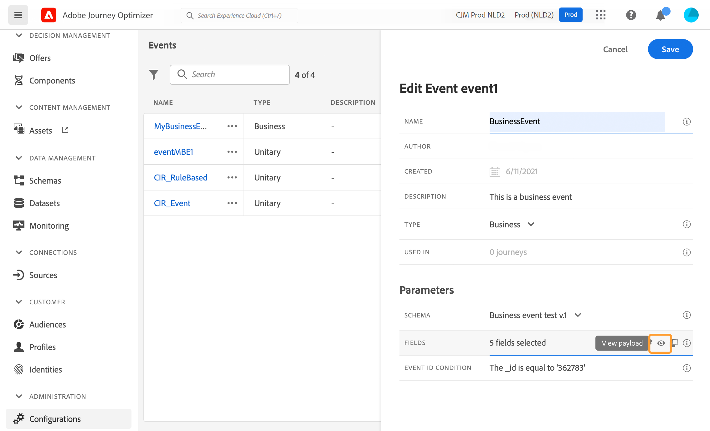

# 配置业务事件 {#configure-a-business-event}

与单一事件不同，业务事件与特定用户档案不相关。 事件ID类型始终基于规则。 请阅读 [此部分](../event/about-events.md).

基于读取区段的历程可以由调度程序在事件发生时通过一次性、定期或由业务事件触发。

业务事件可以是“产品重新存货”、“公司股价达到一定价值”等。

>[!NOTE]
>
>您还可以观看业务事件用例 [教程](https://experienceleague.adobe.com/docs/journey-optimizer-learn/tutorials/create-journeys/use-case-business-event.html).

## 重要说明 {#important-notes}

* Only time series schemas are available. 体验事件、决策事件和历程步骤事件架构不可用。 事件架构必须包含主标识。 The following fields must be set as required: `_id` and `timestamp`
* 只能将业务事件作为历程的第一步进行删除。
* When dropping a business event as the first step of a journey, the scheduler type of the journey will be &quot;business event&quot;.
* 在业务事件后，只能删除读取区段活动。 它将自动添加为下一步。
* 要允许执行多个业务事件，请在 **[!UICONTROL Execution]** 历程属性的部分。
* 触发业务事件后，将区段从15分钟导出到最多1小时会出现延迟。
* 测试业务事件时，必须传递事件参数以及将进入测试旅程的测试用户档案的标识符。 Also, when testing a business event based journey, you can only trigger single profile entrance. 请参阅[此小节](../building-journeys/testing-the-journey.md#test-business)。在测试模式下，没有可用的“代码视图”模式。
* 如果新的业务事件到来，当前处于历程中的个人会发生什么情况？ It behaves the same way as when individuals are still in a recurring journey when a new recurrence happens. 他们的路结束了。 因此，如果营销人员预计会发生频繁的业务事件，则必须注意避免构建过长的历程。

## 多个业务事件 {#multiple-business-events}

Here are a few important notes that apply when multiple business events are received in a row.

**在历程处理期间接收业务事件时的行为是什么？**

商务活动遵循与单一活动相同的重新进入规则。 如果历程允许重新进入，则将处理下一个业务事件。

**要避免过载实体化视图区段，有哪些防护？**

对于即时业务事件，对于给定历程，由第一个事件作业推送的数据将在1小时的时间范围内重复使用。 对于计划历程，没有护栏。 了解有关 [Adobe Experience Platform Segmentation Service文档](https://experienceleague.adobe.com/docs/experience-platform/segmentation/home.html).

## Get started with business events {#gs-business-events}

Here are the first steps to configure a business event:

1. 在“管理”菜单部分，选择 **[!UICONTROL Configurations]**. In the  **[!UICONTROL Events]** section, click **[!UICONTROL Manage]**. 将显示事件列表。

   

1. 单击&#x200B;**[!UICONTROL Create Event]**&#x200B;以创建新事件。事件配置窗格将在屏幕右侧打开。

   

1. Enter the name of your event. You can also add a description.

   

   >[!NOTE]
   >
   >请勿使用空格或特殊字符。请勿使用超过 30 个字符。

1. 在 **[!UICONTROL Type]** 字段，选择 **商业**.

   

1. 使用此事件的旅程数显示在&#x200B;**[!UICONTROL Used in]**&#x200B;字段中。您可以单击 **[!UICONTROL View journeys]**&#x200B;图标，以显示使用此事件的旅程列表。

1. 定义架构和有效负载字段：在这里，您可以选择历程预期接收的事件信息（通常称为有效负载）。 然后，您便能够在旅程中使用这些信息。请参阅[此小节](../event/about-creating-business.md#define-the-payload-fields)。

   

   只有时间系列架构可用。 体验事件、决策事件和历程步骤事件架构不可用。 The event schema must contain a primary identity. 以下字段必须设置为必填字段： `_id` 和 `timestamp`

   

1. 在 **[!UICONTROL Event ID condition]** 字段。 使用简单表达式编辑器，定义系统将使用的条件以识别将触发历程的事件。
   

   In our example, we wrote a condition based on the product&#39;s id. 这意味着，每当系统收到与此条件匹配的事件时，都会将其传递到历程。

   >[!NOTE]
   >
   >在简单的表达式编辑器中，并非所有运算符都可用，它们取决于数据类型。 例如，对于字段的字符串类型，可以使用“包含”或“等于”。

1. 单击 **[!UICONTROL Save]**。

   

   事件现已配置完毕，可随时投入旅程。还需要其他配置步骤以接收事件。请参阅[此页](../event/additional-steps-to-send-events-to-journey-orchestration.md)。

## 定义有效负载字段 {#define-the-payload-fields}

有效负载定义允许您选择系统希望从历程中的事件接收的信息，以及用于标识与事件关联的人员的键。 负载基于Experience CloudXDM字段定义。 For more information on XDM, refer to [Adobe Experience Platform documentation](https://experienceleague.adobe.com/docs/experience-platform/xdm/home.html){target=&quot;_blank&quot;}.

1. 从列表中选择XDM架构，然后单击 **[!UICONTROL Fields]** 字段或 **[!UICONTROL Edit]** 图标。

   

   将显示架构中定义的所有字段。 字段列表因架构而异。 您可以搜索特定字段，或使用过滤器显示所有节点和字段，或仅显示选定的字段。 根据架构定义，某些字段可能是必填的，并且是预选的。 您无法取消选择它们。 默认情况下，将选择所有对于历程要正确接收事件而言必须填写的字段。

   

   >[!NOTE]
   >
   > 确保选择以下字段： `_id` 和 `timestamp`

1. Select the fields you expect to receive from the event. These are the fields which the business user will leverage in the journey.

1. 选择完所需字段后，单击 **[!UICONTROL Save]** 或按 **[!UICONTROL Enter]**.

   选定字段的数量显示在 **[!UICONTROL Fields]** 字段。

   

## 预览有效负载 {#preview-the-payload}

有效负载预览允许您验证有效负载定义。

1. 单击 **[!UICONTROL View Payload]** 图标以预览系统预期的有效负荷。

   

   You can notice that the fields selected are displayed.

   

1. Check the preview to validate the payload definition.

1. 然后，您可以将有效负载预览共享给负责事件发送的人员。 此有效负载可帮助他们设计推送到的事件的设置 [!DNL Journey Optimizer]. 请参阅[此页](../event/additional-steps-to-send-events-to-journey-orchestration.md)。
